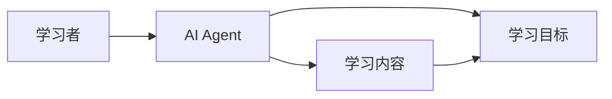
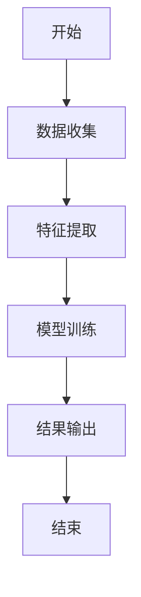
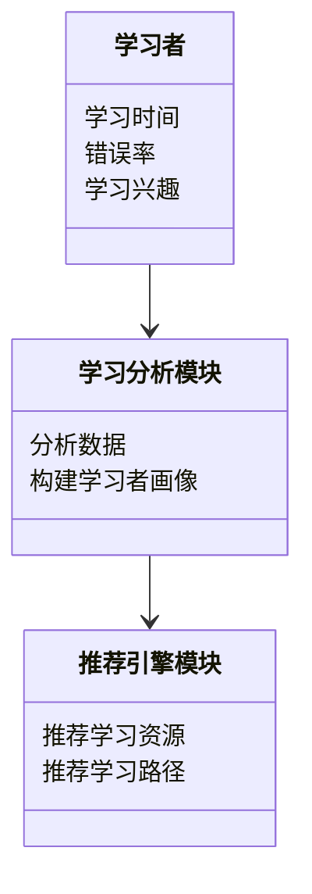
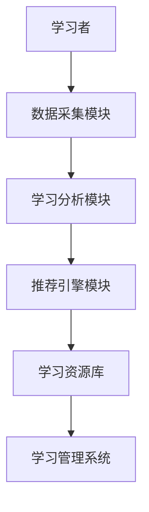
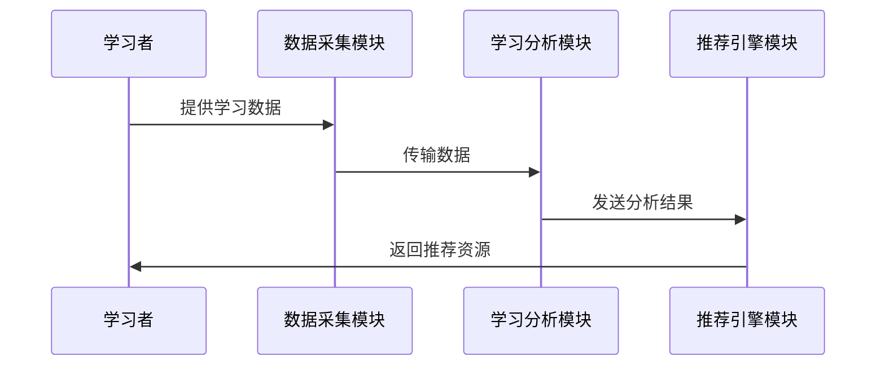

                 


# 教育领域AI Agent的个性化学习方案

> 关键词：AI Agent, 个性化学习, 教育技术, 机器学习, 人工智能

> 摘要：本文探讨了AI Agent在教育领域的应用，重点分析了如何通过AI技术实现个性化学习方案的设计与优化。从理论基础到算法实现，再到系统架构，详细阐述了构建智能化教育系统的全过程。

---

# 第一部分: 教育领域AI Agent的背景与核心概念

## 第1章: 教育领域AI Agent的背景介绍

### 1.1 问题背景与描述

#### 1.1.1 传统教育模式的局限性
传统教育模式以教师为中心，采用标准化的教学内容和进度，难以满足每个学生的个性化需求。学生之间的认知水平、学习兴趣和能力差异较大，导致部分学生无法有效吸收知识，而另一些学生则可能感到 bored。

#### 1.1.2 AI技术在教育领域的潜力
AI技术的快速发展为教育领域带来了革命性的变化。AI Agent（智能体）能够通过数据驱动的方式，实时分析学生的学习行为、情绪和认知状态，从而提供个性化的教学建议和资源推荐。

#### 1.1.3 个性化学习的需求与挑战
个性化学习是教育领域的重要趋势，旨在根据学生的特点（如学习风格、兴趣爱好、认知能力）提供定制化的学习方案。然而，实现个性化的学习方案需要解决数据采集、算法设计和系统集成等多方面的挑战。

### 1.2 问题解决与边界

#### 1.2.1 AI Agent在教育中的应用范围
AI Agent在教育中的应用范围广泛，包括但不限于：
- **学习者画像构建**：通过数据分析，构建学习者的个性化画像，包括认知特点、学习风格、兴趣偏好等。
- **学习内容推荐**：基于学习者的画像，推荐适合的学习资源和路径。
- **学习过程监控**：实时监控学习者的学习状态，及时调整教学策略。

#### 1.2.2 个性化学习方案的核心目标
个性化学习方案的核心目标是：
- 提供适合每个学习者的教学内容和进度。
- 根据学习者的反馈，动态调整学习计划。
- 提供多样化的学习方式和资源，满足不同学习者的需求。

#### 1.2.3 系统的边界与外延
AI Agent系统的边界包括：
- **输入**：学习者的基本信息、学习行为数据、反馈数据。
- **输出**：个性化的学习建议、推荐的学习资源、实时的学习反馈。
- **外部系统**：与学习管理系统（LMS）、内容管理系统（CMS）等外部系统集成。

### 1.3 核心概念与结构

#### 1.3.1 AI Agent的定义与组成
AI Agent是一种智能体，能够感知环境并采取行动以实现特定目标。在教育领域，AI Agent通常由以下部分组成：
- **感知器**：收集学习者的行为数据、情绪数据和认知数据。
- **决策器**：基于感知器收集的数据，分析并生成决策。
- **执行器**：根据决策执行相应的操作，例如推荐学习资源或调整学习计划。

#### 1.3.2 个性化学习方案的构成要素
个性化学习方案的构成要素包括：
- **学习者画像**：基于学习者的背景信息、学习行为和反馈构建的个性化画像。
- **学习目标**：根据学习者的需求和能力设定的具体学习目标。
- **学习路径**：为实现学习目标而设计的个性化学习路径。
- **学习资源**：与学习路径相匹配的学习资源，包括视频、文档、练习题等。

#### 1.3.3 核心概念的结构化分析
通过结构化分析，我们可以将AI Agent与个性化学习方案的关系可视化为以下层次：
1. **AI Agent**：作为系统的核心，负责数据的感知、分析和决策。
2. **个性化学习方案**：AI Agent的输出，包括学习目标、路径和资源推荐。

---

## 第2章: AI Agent与个性化学习的核心概念

### 2.1 核心概念原理

#### 2.1.1 AI Agent的基本原理
AI Agent的基本原理是通过感知、分析和决策来实现智能化的目标。在教育领域，AI Agent通过收集学习者的行为数据、情绪数据和认知数据，分析这些数据并生成个性化的学习建议。

#### 2.1.2 个性化学习的实现机制
个性化学习的实现机制包括以下几个步骤：
1. **数据采集**：收集学习者的基本信息、学习行为和反馈数据。
2. **数据分析**：基于数据分析技术，构建学习者画像。
3. **学习路径设计**：根据学习者的需求和能力，设计个性化的学习路径。
4. **资源推荐**：为学习者推荐适合的学习资源和路径。

#### 2.1.3 两者结合的理论基础
AI Agent与个性化学习的结合基于以下理论基础：
- **认知科学**：研究学习者的认知过程和学习风格。
- **机器学习**：通过数据驱动的方法，实现个性化的学习方案设计。
- **教育学**：基于教育学理论，设计适合不同学习者的学习路径。

### 2.2 核心概念对比

#### 2.2.1 AI Agent与传统教学工具的对比
| 特性                | AI Agent                     | 传统教学工具               |
|---------------------|------------------------------|-----------------------------|
| 数据驱动            | 是                           | 否                           |
| 实时性              | 是                           | 否                           |
| 个性化程度          | 高                           | 低                           |

#### 2.2.2 个性化学习与标准化教育的对比
| 特性                | 个性化学习                  | 标准化教育                  |
|---------------------|-----------------------------|-----------------------------|
| 教学目标            | 因材施教                    | 统一标准                    |
| 教学内容            | 定制化                      | 标准化                      |
| 教学效果            | 更高                        | 较低                        |

#### 2.2.3 核心概念的属性特征对比表格
| 特性                | AI Agent                     | 个性化学习方案             |
|---------------------|------------------------------|-----------------------------|
| 数据依赖性          | 高                           | 中                           |
| 实时性              | 高                           | 中                           |
| 系统复杂性          | 高                           | 中                           |

### 2.3 实体关系图



---

## 第3章: 算法原理与数学模型

### 3.1 算法原理

#### 3.1.1 基于规则的推荐算法
基于规则的推荐算法是一种简单但有效的推荐方法。其核心思想是通过预定义的规则，根据学习者的行为数据推荐学习资源。例如，如果学习者在数学方面表现不佳，系统会推荐相关的数学辅导资源。

#### 3.1.2 基于机器学习的个性化推荐
基于机器学习的个性化推荐是一种更高级的推荐方法。通过机器学习算法，系统能够自动学习学习者的偏好和行为模式，从而推荐适合的学习资源。常用的算法包括协同过滤和深度学习模型。

#### 3.1.3 深度学习在学习路径优化中的应用
深度学习在学习路径优化中的应用主要体现在通过神经网络模型分析学习者的认知特点和学习风格，从而设计出适合的学习路径。

### 3.2 算法流程图



### 3.3 数学模型与公式

#### 3.3.1 协同过滤算法
协同过滤是一种常用的推荐算法，其相似度计算公式如下：

$$相似度计算：sim(i,j) = \frac{\sum_{k} r_{ik} r_{jk}}{\sqrt{\sum_{k} r_{ik}^2} \sqrt{\sum_{k} r_{jk}^2}}$$

其中，$r_{ik}$表示用户$i$对项$k$的评分，$r_{jk}$表示用户$j$对项$k$的评分。

#### 3.3.2 基于神经网络的推荐模型
基于神经网络的推荐模型通常使用多层感知机（MLP）进行预测。其数学模型如下：

$$P(x) = \sum_{i=1}^{n} w_i x_i$$

其中，$x_i$是输入特征，$w_i$是对应的权重。

---

## 第4章: 系统分析与架构设计方案

### 4.1 问题场景介绍

#### 4.1.1 问题场景描述
考虑一个学生在使用AI Agent进行数学学习的情况。学生的学习情况数据包括学习时间、错误率、学习兴趣等。AI Agent需要根据这些数据，实时调整学习计划和推荐学习资源。

#### 4.1.2 系统目标
系统的目标是为每个学习者提供个性化的学习方案，包括：
- 学习目标设定
- 学习路径设计
- 学习资源推荐
- 学习效果评估

### 4.2 系统功能设计

#### 4.2.1 功能模块
系统主要功能模块包括：
- **数据采集模块**：负责采集学习者的行为数据。
- **学习分析模块**：分析学习者的行为数据，构建学习者画像。
- **推荐引擎模块**：根据学习者画像，推荐适合的学习资源和路径。

#### 4.2.2 系统功能流程
系统功能流程如下：
1. 数据采集模块采集学习者的行为数据。
2. 学习分析模块分析数据，构建学习者画像。
3. 推荐引擎模块根据学习者画像，推荐适合的学习资源和路径。

#### 4.2.3 领域模型类图


### 4.3 系统架构设计

#### 4.3.1 系统架构图
系统架构设计如下：


#### 4.3.2 接口设计
系统主要接口包括：
- 获取学习者信息接口
- 推荐学习资源接口
- 学习效果评估接口

#### 4.3.3 交互序列图


---

## 第5章: 项目实战

### 5.1 环境安装

#### 5.1.1 安装Python
```bash
python --version
```

#### 5.1.2 安装依赖库
```bash
pip install numpy
pip install scikit-learn
pip install matplotlib
```

### 5.2 核心代码实现

#### 5.2.1 数据预处理
```python
import numpy as np
from sklearn.preprocessing import StandardScaler

# 示例数据
data = np.array([[1, 2, 3], [4, 5, 6], [7, 8, 9]])

# 标准化处理
scaler = StandardScaler()
scaled_data = scaler.fit_transform(data)
```

#### 5.2.2 模型训练
```python
from sklearn.cluster import KMeans

# 训练聚类模型
model = KMeans(n_clusters=3)
model.fit(scaled_data)
```

#### 5.2.3 推荐系统实现
```python
import numpy as np
from sklearn.metrics.pairwise import cosine_similarity

# 示例数据
user_profiles = np.array([[0.5, 0.6, 0.7], [0.3, 0.4, 0.5], [0.8, 0.9, 0.1]])

# 计算相似度
similarity_matrix = cosine_similarity(user_profiles)
```

### 5.3 实际案例分析

#### 5.3.1 数据分析
假设我们有以下学习者数据：
- 学习者A：数学成绩优秀，但英语较差。
- 学习者B：数学和英语成绩均一般，但对编程感兴趣。

通过数据分析，AI Agent会为学习者A推荐英语辅导资源，为学习者B推荐编程学习资源。

#### 5.3.2 推荐结果展示
通过模型训练和推荐系统实现，系统会输出适合每个学习者的推荐结果。

### 5.4 项目小结
在本项目中，我们实现了AI Agent在教育领域的个性化学习方案设计，包括数据采集、模型训练和推荐系统实现。通过实际案例分析，验证了系统的有效性和可行性。

---

## 第6章: 总结与展望

### 6.1 最佳实践 tips
- **数据隐私保护**：在数据采集和处理过程中，必须严格遵守数据隐私保护法规。
- **系统稳定性**：确保系统的稳定性和可靠性，避免因技术问题影响学习体验。
- **持续优化**：定期收集反馈，持续优化算法和系统架构，提升推荐的准确性和用户体验。

### 6.2 小结
本文详细探讨了AI Agent在教育领域的应用，重点分析了个性化学习方案的设计与优化。从理论基础到算法实现，再到系统架构，为教育领域的智能化转型提供了参考。

### 6.3 注意事项
- 在实际应用中，必须考虑到学习者的个性化需求和数据隐私问题。
- 系统的实时性和响应速度是影响用户体验的关键因素，需要重点关注。

### 6.4 拓展阅读
- 《机器学习实战》
- 《深度学习入门：基于Python》
- 《教育技术研究》

---

# 作者：AI天才研究院/AI Genius Institute & 禅与计算机程序设计艺术 /Zen And The Art of Computer Programming

