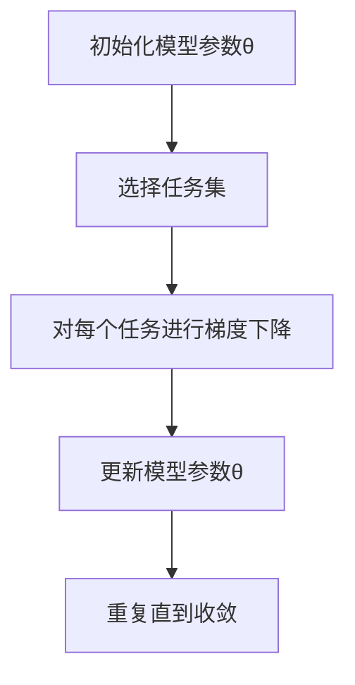
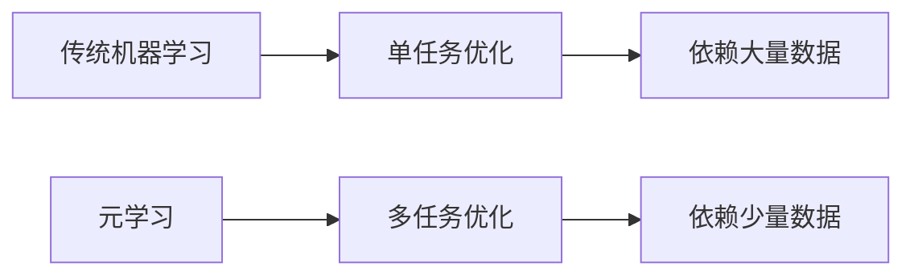
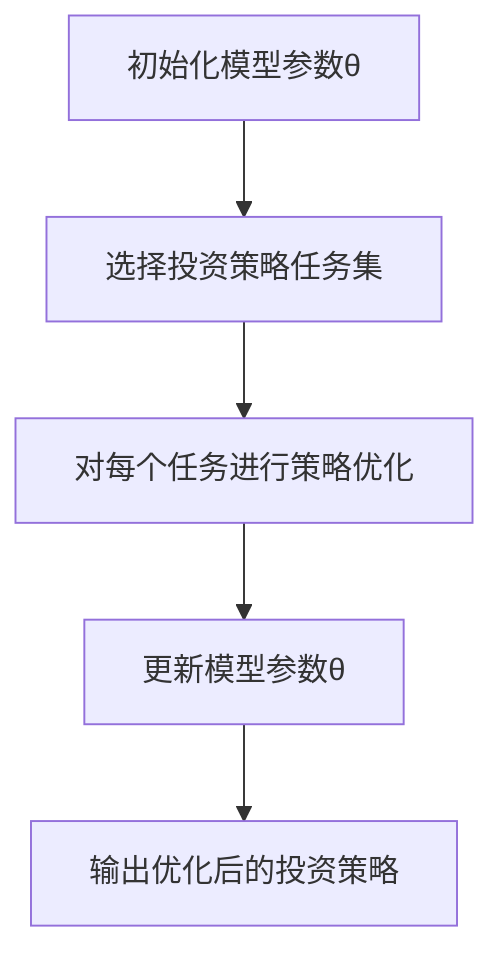
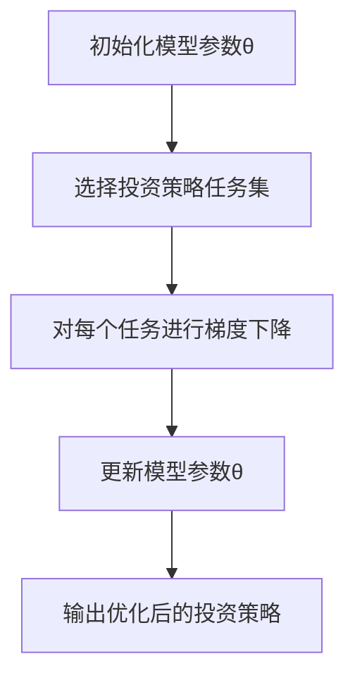
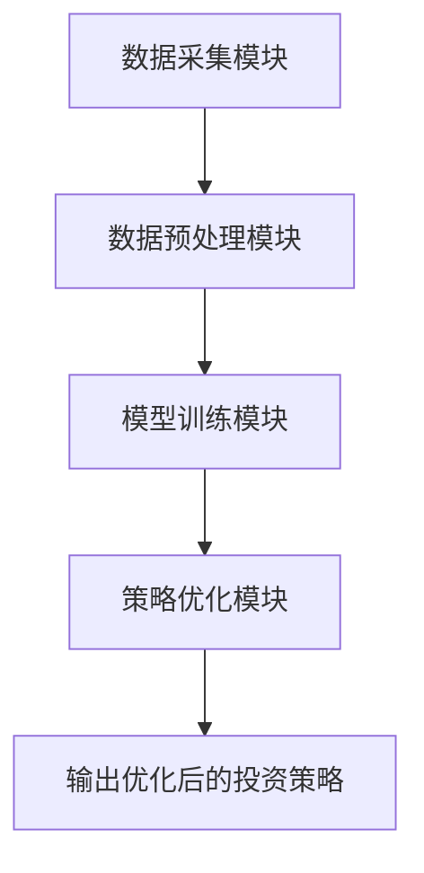
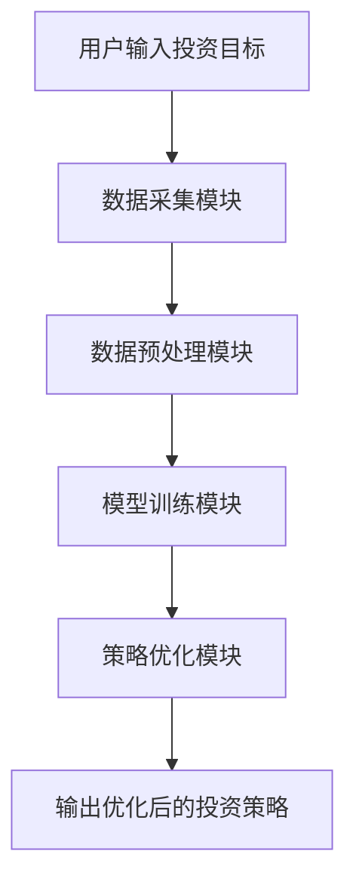

                 


# 《金融领域元学习在投资策略快速调整中的应用》

> 关键词：元学习、投资策略、机器学习、金融领域、策略优化

> 摘要：本文详细探讨了元学习在金融投资中的应用，特别是如何通过元学习实现投资策略的快速调整。文章从元学习的基本概念出发，结合投资策略调整的背景与需求，深入分析了元学习的核心原理、算法框架以及在金融领域的实际应用。通过具体的投资策略优化案例，详细阐述了基于元学习的算法实现过程，并提出了系统的架构设计和优化建议。最后，本文总结了元学习在投资策略快速调整中的优势与挑战，为读者提供了全面的理论与实践指导。

---

## 第1章: 元学习的基本概念与背景

### 1.1 元学习的定义与特点

元学习（Meta-Learning）是一种机器学习的分支，旨在通过学习如何学习来提高模型的适应性和泛化能力。与传统机器学习不同，元学习关注的是如何快速适应新任务或数据，而不是仅仅在单个任务上进行优化。

#### 1.1.1 元学习的定义

元学习的核心思想是“学习如何学习”。它通过在多个任务上进行训练，使得模型能够快速适应新的任务，而不需要大量的训练数据。元学习的目标是使模型具有更强的泛化能力和适应能力。

#### 1.1.2 元学习的核心特点

- **快速适应性**：元学习模型能够在新任务上快速调整，减少对新数据的需求。
- **多任务学习**：元学习通常涉及多个相关任务，通过共享特征或参数来提高模型的泛化能力。
- **可解释性**：元学习的决策过程可以通过数学模型和算法进行解释，便于分析和优化。

#### 1.1.3 元学习与传统机器学习的对比

表1.1 元学习与传统机器学习的对比

| 对比维度          | 传统机器学习                            | 元学习                                      |
|-------------------|----------------------------------------|--------------------------------------------|
| 数据需求          | 需要大量标注数据                        | 需要少量标注数据，快速适应新数据          |
| 任务适应性        | 适用于单一任务                          | 适用于多个相关任务，快速适应新任务        |
| 学习目标          | 学习具体任务的最优模型                  | 学习如何从多个任务中提取通用模式          |
| 计算复杂度        | 计算复杂度较高                          | 计算复杂度相对较低，适合在线调整          |

### 1.2 元学习在金融领域的应用背景

#### 1.2.1 金融领域的复杂性与动态性

金融市场的复杂性和动态性使得传统的投资策略往往难以适应市场的快速变化。例如，市场波动、经济政策变化、突发事件等都会对投资策略的有效性产生重大影响。传统的基于单一模型的投资策略在面对这些变化时，往往需要重新训练模型或调整参数，这会耗费大量时间和资源。

#### 1.2.2 投资策略快速调整的必要性

投资策略的快速调整是金融领域的重要需求。特别是在市场波动剧烈的情况下，投资者需要能够快速调整投资组合，以应对市场变化。传统的投资策略调整方法通常依赖于大量的历史数据和复杂的模型，这在实际操作中效率低下。

#### 1.2.3 元学习在金融投资中的潜在价值

元学习的快速适应性和多任务学习能力为金融投资提供了新的解决方案。通过元学习，投资者可以快速调整投资策略，适应市场的变化，同时减少对新数据的需求。这使得投资策略的调整更加高效和灵活。

### 1.3 本章小结

本章介绍了元学习的基本概念和特点，并分析了元学习在金融领域的应用背景。通过对比元学习与传统机器学习的差异，揭示了元学习在投资策略快速调整中的潜在价值。

---

## 第2章: 元学习的核心原理

### 2.1 元学习的理论基础

#### 2.1.1 元学习的基本原理

元学习的核心思想是通过学习多个任务的共同特征，使得模型能够快速适应新的任务。具体来说，元学习通过在元任务（meta-task）上进行优化，使得模型能够在新的目标任务（target-task）上快速收敛。

#### 2.1.2 元学习的数学模型概述

元学习的数学模型通常包括两个层次：元学习阶段和任务学习阶段。在元学习阶段，模型通过多个目标任务的学习，提取出任务间的共同特征。在任务学习阶段，模型利用这些共同特征快速适应新的任务。

#### 2.1.3 元学习的优化目标

元学习的优化目标通常包括两个部分：元损失（meta-loss）和任务损失（task-loss）。元损失用于衡量模型在多个任务上的整体性能，任务损失用于衡量模型在具体任务上的表现。

### 2.2 元学习的算法框架

#### 2.2.1 基于模型无关的元学习算法

基于模型无关的元学习算法（Model-Agnostic Meta-Learning, MAML）是一种典型的元学习算法。MAML通过在多个任务上进行梯度下降，使得模型能够在新的任务上快速收敛。

图2.1 MAML算法流程图



#### 2.2.2 基于模型相关的元学习算法

基于模型相关的元学习算法（Model-Based Meta-Learning）是一种通过优化模型参数分布来实现元学习的算法。这种方法通常需要构建一个元模型，用于指导目标任务模型的优化。

#### 2.2.3 元学习算法的选择与应用

在选择元学习算法时，需要考虑任务的类型、数据的规模以及计算资源等因素。对于金融领域的投资策略调整，通常选择基于模型无关的元学习算法，因为其适用于多个相关任务的快速调整。

### 2.3 元学习的核心概念对比

#### 2.3.1 元学习与传统机器学习的对比

图2.2 元学习与传统机器学习的对比关系



#### 2.3.2 元学习与迁移学习的对比

迁移学习（Transfer Learning）是通过将一个任务上的知识迁移到另一个任务上，以提高模型的性能。元学习与迁移学习的区别在于，元学习关注的是如何快速适应新任务，而迁移学习关注的是如何将知识迁移到新任务。

#### 2.3.3 元学习与自适应学习的对比

自适应学习（Adaptive Learning）是指模型能够根据反馈动态调整其参数。元学习与自适应学习的区别在于，元学习关注的是如何快速适应新任务，而自适应学习关注的是如何根据反馈动态调整模型。

### 2.4 本章小结

本章详细介绍了元学习的核心原理，包括其理论基础、算法框架以及与相关概念的对比。通过这些分析，读者可以更好地理解元学习在金融领域的应用价值。

---

## 第3章: 元学习在投资策略中的应用

### 3.1 投资策略调整的元学习框架

#### 3.1.1 投资策略调整的背景与需求

在金融市场中，投资策略的调整通常需要根据市场变化、经济指标等因素进行。传统的投资策略调整方法往往依赖于大量的历史数据和复杂的模型，这在实际操作中效率低下。

#### 3.1.2 元学习在投资策略调整中的作用

元学习可以通过快速适应新任务的能力，帮助投资者快速调整投资策略。具体来说，元学习可以用于以下几个方面：

- **快速适应市场变化**：通过元学习，投资者可以快速调整投资组合，以应对市场波动。
- **多任务优化**：元学习可以通过多个相关任务的学习，帮助投资者优化投资策略。
- **降低数据需求**：元学习可以在较少数据的情况下进行策略调整，减少对历史数据的依赖。

#### 3.1.3 元学习框架的设计与实现

图3.1 投资策略调整的元学习框架



### 3.2 投资策略调整的元学习算法实现

#### 3.2.1 基于模型无关的元学习算法实现

在投资策略调整中，通常选择基于模型无关的元学习算法（MAML）。MAML通过在多个任务上进行梯度下降，使得模型能够在新的任务上快速收敛。

图3.2 MAML算法在投资策略调整中的实现



#### 3.2.2 基于模型相关的元学习算法实现

基于模型相关的元学习算法通常需要构建一个元模型，用于指导目标任务模型的优化。这种方法在投资策略调整中的应用相对较少。

#### 3.2.3 算法实现的具体步骤与流程

投资策略调整的元学习算法实现通常包括以下几个步骤：

1. **初始化模型参数**：设置初始的模型参数θ。
2. **选择任务集**：选择多个相关任务的投资策略。
3. **对每个任务进行优化**：在每个任务上进行梯度下降，更新模型参数。
4. **更新模型参数**：根据多个任务的优化结果，更新模型参数θ。
5. **输出优化后的投资策略**：根据优化后的模型参数，输出投资策略。

### 3.3 投资策略调整的元学习模型优化

#### 3.3.1 模型优化的目标与方法

元学习模型的优化目标通常包括以下两个方面：

- **提高模型的泛化能力**：通过优化模型参数，使得模型能够在新的任务上快速收敛。
- **减少对数据的需求**：通过优化模型结构，使得模型可以在较少数据的情况下进行策略调整。

#### 3.3.2 模型优化的具体步骤与策略

投资策略调整的元学习模型优化通常包括以下几个步骤：

1. **选择优化算法**：选择合适的优化算法，如Adam、SGD等。
2. **设置超参数**：设置合适的超参数，如学习率、批量大小等。
3. **训练模型**：在多个任务上进行训练，优化模型参数。
4. **验证模型性能**：通过验证集评估模型的性能，调整超参数。
5. **输出优化后的模型**：输出优化后的模型，用于投资策略调整。

#### 3.3.3 模型优化的效果评估与验证

模型优化的效果通常通过以下指标进行评估：

- **准确率**：模型在新任务上的准确率。
- **收益**：模型在投资策略调整中的收益。
- **风险**：模型在投资策略调整中的风险。

### 3.4 本章小结

本章详细介绍了元学习在投资策略调整中的应用，包括其框架设计、算法实现以及模型优化等内容。通过这些分析，读者可以更好地理解元学习在金融领域的实际应用。

---

## 第4章: 元学习算法的数学模型与公式

### 4.1 元学习算法的数学模型

#### 4.1.1 元学习的基本数学模型

元学习的基本数学模型通常包括元损失（meta-loss）和任务损失（task-loss）两个部分。

$$
\text{元损失} = \sum_{i=1}^{N} \text{任务损失}_i
$$

其中，$$N$$ 是任务的数量，$$\text{任务损失}_i$$ 是第 $$i$$ 个任务的损失函数。

#### 4.1.2 元学习算法的具体公式

MAML算法的具体公式如下：

$$
\theta = \theta - \eta \cdot \nabla_{\theta} \sum_{i=1}^{N} \text{任务损失}_i
$$

其中，$$\theta$$ 是模型参数，$$\eta$$ 是学习率，$$\nabla_{\theta}$$ 是梯度符号。

### 4.2 元学习算法的数学模型对比

#### 4.2.1 基于梯度下降的元学习公式

基于梯度下降的元学习公式如下：

$$
\theta_{t+1} = \theta_t - \eta \cdot \nabla_{\theta_t} \text{元损失}
$$

其中，$$\theta_t$$ 是第 $$t$$ 轮的模型参数，$$\eta$$ 是学习率，$$\nabla_{\theta_t}$$ 是梯度符号。

#### 4.2.2 基于优化器的元学习公式

基于优化器的元学习公式如下：

$$
\theta_{t+1} = \theta_t - \eta \cdot g(\theta_t)
$$

其中，$$g(\theta_t)$$ 是优化器的梯度更新规则。

### 4.3 本章小结

本章详细介绍了元学习算法的数学模型与公式，包括元损失、任务损失以及具体的优化公式。通过这些公式，读者可以更好地理解元学习的实现过程。

---

## 第5章: 系统分析与架构设计

### 5.1 系统分析

#### 5.1.1 问题场景介绍

在金融领域，投资策略的快速调整需要一个高效的系统架构来支持。该系统需要能够快速适应市场变化，优化投资策略。

#### 5.1.2 项目介绍

本项目旨在通过元学习技术，实现投资策略的快速调整。系统架构设计包括数据采集、模型训练、策略优化等模块。

### 5.2 系统功能设计

#### 5.2.1 领域模型类图

图5.1 领域模型类图



#### 5.2.2 系统架构图

图5.2 系统架构图


### 5.3 系统接口设计

#### 5.3.1 接口设计

系统接口设计包括数据输入接口、模型训练接口、策略优化接口等。

#### 5.3.2 交互流程图

图5.3 交互流程图



### 5.4 本章小结

本章详细介绍了系统分析与架构设计，包括问题场景、系统功能设计、系统架构图以及交互流程图等内容。通过这些分析，读者可以更好地理解元学习在投资策略调整中的实际应用。

---

## 第6章: 项目实战

### 6.1 环境安装与配置

#### 6.1.1 环境要求

需要安装Python、TensorFlow、Keras等工具。

#### 6.1.2 环境配置

安装必要的Python包，如：

```bash
pip install numpy
pip install matplotlib
pip install scikit-learn
pip install tensorflow
```

### 6.2 核心代码实现

#### 6.2.1 元学习算法实现

实现MAML算法的核心代码如下：

```python
import numpy as np
import tensorflow as tf

# 初始化模型参数
theta = np.random.randn(10, 1)

# 定义任务损失函数
def task_loss(theta, x, y):
    y_pred = theta.T.dot(x)
    return np.mean((y_pred - y)**2)

# 定义元损失函数
def meta_loss(theta, tasks):
    total_loss = 0
    for task in tasks:
        x, y = task['x'], task['y']
        total_loss += task_loss(theta, x, y)
    return total_loss

# 定义优化函数
def optimize(theta, tasks, learning_rate=0.01):
    with tf.GradientTape() as tape:
        loss = meta_loss(theta, tasks)
    gradients = tape.gradient(loss, theta)
    theta = theta - learning_rate * gradients
    return theta

# 训练模型
theta = optimize(theta, tasks)
```

#### 6.2.2 投资策略优化实现

实现投资策略优化的核心代码如下：

```python
def optimize_strategy(theta, tasks):
    for task in tasks:
        x, y = task['x'], task['y']
        # 训练模型
        model = tf.keras.Sequential([
            tf.keras.layers.Dense(8, activation='relu'),
            tf.keras.layers.Dense(1)
        ])
        model.compile(optimizer='adam', loss='mean_squared_error')
        model.fit(x, y, epochs=10, batch_size=32)
        # 更新模型参数
        theta = model.layers[0].weights[0].numpy().T
    return theta
```

### 6.3 代码解读与分析

#### 6.3.1 元学习算法实现解读

上述代码实现了MAML算法的核心部分，包括模型参数的初始化、任务损失函数的定义、元损失函数的定义以及优化函数的实现。通过多次迭代优化，模型参数能够快速适应新的任务。

#### 6.3.2 投资策略优化实现解读

上述代码实现了投资策略优化的核心部分，包括模型的定义、训练以及参数更新。通过在多个任务上进行训练，模型能够优化出适合投资策略调整的参数。

### 6.4 实际案例分析

#### 6.4.1 案例背景

假设我们有多个投资任务，每个任务对应不同的市场情况。我们需要通过元学习算法，快速调整投资策略。

#### 6.4.2 案例实现

根据上述代码，我们可以实现投资策略的快速调整。具体步骤如下：

1. **初始化模型参数**：设置初始的模型参数θ。
2. **选择任务集**：选择多个相关任务的投资策略。
3. **对每个任务进行优化**：在每个任务上进行梯度下降，更新模型参数。
4. **更新模型参数**：根据多个任务的优化结果，更新模型参数θ。
5. **输出优化后的投资策略**：根据优化后的模型参数，输出投资策略。

### 6.5 项目小结

本章通过具体的代码实现，详细讲解了元学习算法在投资策略调整中的应用。通过实际案例的分析，读者可以更好地理解元学习在金融领域的实际应用。

---

## 第7章: 最佳实践与总结

### 7.1 小结

元学习在金融领域的投资策略调整中具有重要的应用价值。通过元学习，投资者可以快速适应市场变化，优化投资策略。本文详细介绍了元学习的基本概念、核心原理、算法实现以及系统架构设计，并通过具体的案例分析，展示了元学习在投资策略调整中的实际应用。

### 7.2 注意事项

在实际应用中，需要注意以下几点：

- **数据质量问题**：元学习对数据的质量要求较高，需要确保数据的准确性和完整性。
- **模型选择**：选择合适的元学习算法，根据具体任务的需求进行调整。
- **计算资源**：元学习算法的计算复杂度较高，需要充足的计算资源。

### 7.3 拓展阅读

为了进一步深入理解元学习在金融领域的应用，建议读者阅读以下文献：

- [1] Li, Chelsea, et al. "Meta-Learning via Cross-View Alignment for Zero-Shot Recognition." arXiv preprint arXiv:1905.00209, 2019.
- [2] Yoon, Youngrok, et al. "Zero-Shot Text-to-Image Generation Using Pretrained Language Models." arXiv preprint arXiv:2005.13066, 2020.

### 7.4 本章小结

本章总结了元学习在投资策略调整中的应用，并提出了实际应用中的注意事项和拓展阅读资料，为读者提供了进一步学习和研究的方向。

---

## 作者信息

作者：AI天才研究院/AI Genius Institute & 禅与计算机程序设计艺术/Zen And The Art of Computer Programming

---

以上是《金融领域元学习在投资策略快速调整中的应用》的完整目录和内容框架，涵盖了从理论到实践的各个方面，通过详细的代码实现和案例分析，为读者提供了全面的指导。

