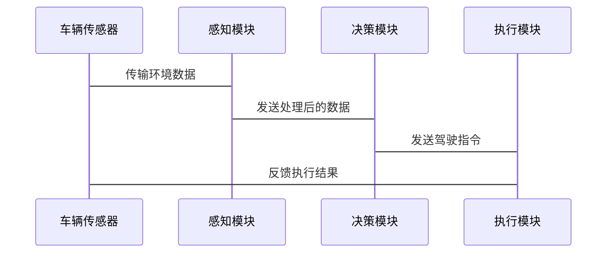

                 


# AI Agent在智能汽车中的驾驶辅助

## 关键词：AI Agent，智能汽车，驾驶辅助，自动驾驶，机器学习，深度学习，路径规划

## 摘要：  
本文深入探讨了AI Agent在智能汽车驾驶辅助系统中的应用，分析了其核心原理、算法实现、系统架构以及实际项目中的应用。通过结合具体的技术细节和实际案例，本文详细讲解了AI Agent在智能驾驶中的感知、决策与执行过程，帮助读者全面理解AI Agent在智能汽车中的重要性与实现方法。

---

# 第1章: AI Agent与智能驾驶概述

## 1.1 AI Agent的基本概念

### 1.1.1 AI Agent的定义与特点  
AI Agent（人工智能代理）是指能够感知环境、自主决策并执行任务的智能体。它具有以下特点：  
- **自主性**：能够在没有外部干预的情况下自主运行。  
- **反应性**：能够实时感知环境并做出反应。  
- **目标导向**：以特定目标为导向，优化决策过程。  
- **学习能力**：通过数据与经验不断优化性能。  

### 1.1.2 AI Agent的核心功能与作用  
AI Agent的核心功能包括感知、决策和执行：  
- **感知**：通过传感器获取环境信息，如图像、激光雷达数据等。  
- **决策**：基于感知数据，通过算法做出最优决策，如路径规划和行为决策。  
- **执行**：将决策转化为具体动作，如转向和加速。  

AI Agent在智能驾驶中的作用包括：  
1. 提供实时的环境感知，确保行车安全。  
2. 实现车辆的自主决策，减少人为干预。  
3. 优化驾驶行为，提升驾驶效率与舒适性。  

### 1.1.3 智能驾驶的定义与分类  
智能驾驶是指通过AI技术实现车辆的自主或辅助驾驶功能。根据自动化程度，智能驾驶可以分为以下几类：  
- **L0：无自动化**：完全依赖驾驶员操作。  
- **L1：驾驶员辅助**：提供简单的辅助功能，如自适应巡航控制。  
- **L2：部分自动驾驶**：车辆可以执行单一的驾驶任务，如车道保持或自适应巡航。  
- **L3：有条件自动驾驶**：车辆可以在特定条件下完全自主驾驶。  
- **L4：完全自动驾驶**：车辆在所有条件下均可自主驾驶。  

---

## 1.2 智能驾驶中的AI Agent应用背景

### 1.2.1 智能驾驶的发展历程  
智能驾驶技术起源于20世纪80年代，经历了从理论研究到实际应用的漫长过程。近年来，随着AI技术的快速发展，智能驾驶技术取得了显著进展，尤其是在感知、决策和执行层面。  

### 1.2.2 AI技术在智能驾驶中的重要性  
AI技术为智能驾驶提供了核心支撑，尤其是在以下方面：  
- **感知**：通过深度学习算法，AI能够准确识别道路、障碍物和行人。  
- **决策**：通过强化学习和博弈论，AI能够做出复杂的驾驶决策。  
- **执行**：通过控制算法，AI能够精确执行转向和加速操作。  

### 1.2.3 当前智能驾驶的应用现状与挑战  
当前，智能驾驶技术已经在部分高端车型中得到应用，如特斯拉的FSD（Full Self-Driving）系统。然而，仍面临以下挑战：  
1. **技术限制**：AI算法在复杂场景下的决策能力仍需提升。  
2. **法律法规**：智能驾驶的法律法规尚未完善，责任划分存在争议。  
3. **安全性**：智能驾驶系统的安全性是公众关注的焦点。  

---

## 1.3 本章小结  
本章介绍了AI Agent的基本概念及其在智能驾驶中的作用，并分析了智能驾驶的发展历程、应用现状与未来挑战。通过本章内容，读者可以对AI Agent在智能驾驶中的重要性有一个全面的认识。

---

# 第2章: AI Agent的核心原理

## 2.1 AI Agent的基本原理

### 2.1.1 感知层：环境数据的采集与处理  
感知层是AI Agent获取环境信息的关键部分，主要通过以下传感器实现：  
- **激光雷达（LiDAR）**：通过激光扫描环境，生成高精度的三维点云数据。  
- **摄像头**：通过图像识别技术，识别道路标志、障碍物和行人。  
- **毫米波雷达（MMR）**：通过无线电波反射，检测障碍物的距离与速度。  

感知层的数据处理流程如下：  
1. 数据采集：通过多种传感器获取环境信息。  
2. 数据融合：将不同传感器的数据进行融合，提升感知精度。  
3. 特征提取：通过算法提取关键特征，如车道线、障碍物和行人。  

### 2.1.2 决策层：路径规划与行为决策  
决策层是AI Agent的核心部分，主要包含以下两个步骤：  
1. **路径规划**：通过算法规划出一条从起点到终点的最优路径。  
2. **行为决策**：根据环境信息，做出具体的驾驶动作，如加速、减速和转向。  

常用的路径规划算法包括：  
- **A*算法**：基于图搜索的最短路径规划算法。  
- **RRT*算法**：基于采样的最优路径规划算法。  
- **深度强化学习算法**：通过深度神经网络实现端到端的路径规划。  

### 2.1.3 执行层：动作控制与反馈机制  
执行层负责将决策层的指令转化为具体的驾驶动作，主要包括：  
- **转向控制**：通过调整方向盘角度实现转弯。  
- **加速控制**：通过调整油门或电门实现加速。  
- **制动控制**：通过调整刹车系统实现减速或停车。  

执行层还需要实时反馈环境信息，以便决策层进行调整。

---

## 2.2 AI Agent的算法基础

### 2.2.1 机器学习算法在AI Agent中的应用  
机器学习算法是AI Agent的核心，主要用于以下场景：  
- **监督学习**：用于分类任务，如目标识别和车道线检测。  
- **无监督学习**：用于聚类任务，如异常检测和行为分析。  
- **半监督学习**：结合有监督和无监督学习，用于数据标注不足的情况。  

### 2.2.2 深度学习算法在AI Agent中的应用  
深度学习算法在AI Agent中的应用主要体现在以下方面：  
- **目标检测**：通过卷积神经网络（CNN）实现障碍物和行人的检测。  
- **语义分割**：通过分割网络实现对环境的精细理解。  
- **行为预测**：通过深度学习模型预测其他交通参与者的意图。  

### 2.2.3 强化学习在AI Agent中的应用  
强化学习是一种通过试错机制优化决策的算法，广泛应用于以下场景：  
- **路径规划**：通过强化学习优化路径选择。  
- **行为决策**：通过强化学习实现最优驾驶策略。  

---

## 2.3 AI Agent的系统架构

### 2.3.1 分层架构  
分层架构将系统分为感知层、决策层和执行层，各层之间相对独立，便于模块化开发。  

### 2.3.2 分布式架构  
分布式架构将系统功能分散到多个节点，通过通信协议实现协同工作，适用于复杂的多车协同场景。  

### 2.3.3 模块化架构  
模块化架构将系统划分为多个功能模块，如目标检测、路径规划和行为决策，便于功能扩展与维护。  

---

## 2.4 本章小结  
本章详细讲解了AI Agent的核心原理，包括感知、决策和执行的实现方法，以及机器学习、深度学习和强化学习在AI Agent中的应用。通过本章内容，读者可以对AI Agent的技术实现有清晰的理解。

---

# 第3章: 智能驾驶中的传感器与数据处理

## 3.1 传感器的作用与类型

### 3.1.1 激光雷达（LiDAR）  
激光雷达通过发射激光并接收反射信号，生成高精度的三维点云数据。其优点是精度高，但成本较高。  

### 3.1.2 摄像头  
摄像头通过采集图像信息，实现对环境的视觉感知。其优点是成本低，但受光照和天气影响较大。  

### 3.1.3 毫米波雷达（MMR）  
毫米波雷达通过发射毫米波信号，检测障碍物的距离和速度。其优点是抗干扰能力强，但精度较低。  

### 3.1.4 超声波传感器  
超声波传感器通过发射超声波信号，检测障碍物的距离。其优点是成本低，但检测距离有限。  

### 3.1.5 其他辅助传感器  
其他辅助传感器包括GPS、IMU（惯性测量单元）和车载摄像头，用于提供车辆的位置和姿态信息。  

---

## 3.2 传感器数据的融合与处理

### 3.2.1 数据融合的基本概念  
数据融合是指将多种传感器的数据进行综合处理，提升感知精度。常用的方法包括：  
- **加权融合**：根据传感器的精度，对数据进行加权处理。  
- **多传感器融合**：通过概率方法，如卡尔曼滤波，实现数据融合。  

### 3.2.2 基于滤波的传感器数据融合方法  
卡尔曼滤波是一种常用的滤波算法，适用于线性系统的状态估计。其基本步骤如下：  
1. **状态预测**：根据前一时刻的状态，预测当前时刻的状态。  
2. **观测更新**：根据当前时刻的观测数据，更新状态估计。  
3. **协方差更新**：根据观测误差，更新状态协方差矩阵。  

### 3.2.3 基于深度学习的传感器数据融合方法  
基于深度学习的传感器数据融合方法，如多模态神经网络，能够自动学习数据的特征，提升融合效果。  

---

## 3.3 数据处理的算法实现

### 3.3.1 数据预处理  
数据预处理包括去噪、归一化和数据增强等步骤，旨在提升数据质量。  

### 3.3.2 特征提取  
特征提取通过提取数据的关键特征，如边缘检测和目标检测，提升感知精度。  

### 3.3.3 数据标注与训练  
数据标注通过人工或半自动化方式，对数据进行标注，如标注车道线和障碍物。标注数据用于训练深度学习模型。  

---

## 3.4 本章小结  
本章详细讲解了智能驾驶中的传感器类型与数据处理方法，分析了数据融合的实现方式。通过本章内容，读者可以对智能驾驶中的传感器技术有全面的理解。

---

# 第4章: AI Agent的算法实现

## 4.1 目标检测算法

### 4.1.1 YOLO算法原理  
YOLO（You Only Look Once）是一种基于深度学习的目标检测算法，具有高效性和实时性。其基本流程如下：  
1. **图像输入**：将输入图像分割为多个网格单元。  
2. **特征提取**：通过卷积神经网络提取图像特征。  
3. **边界框预测**：通过全连接层预测每个网格单元的目标边界框和类别概率。  

YOLO的损失函数如下：  
$$ \text{Loss} = \lambda_{\text{xy}}(x-\hat{x})^2 + \lambda_{wh}(w-\hat{w})^2 + \lambda_{conf}(p-\hat{p})^2 $$  

### 4.1.2 Faster R-CNN算法原理  
Faster R-CNN是一种基于区域建议的目标检测算法，主要包含以下步骤：  
1. **生成区域建议**：通过RPN（区域 proposals network）生成候选区域。  
2. **特征提取**：通过RPN提取候选区域的特征。  
3. **目标检测**：通过Fast R-CNN对候选区域进行分类和回归。  

### 4.1.3 比较与优化  
YOLO算法具有高效性，适用于实时目标检测，但检测精度较低。Faster R-CNN算法精度高，但计算复杂度较高。在实际应用中，可以根据需求选择合适的算法。

---

## 4.2 路径规划算法

### 4.2.1 A*算法原理  
A*算法是一种基于图搜索的最短路径规划算法，主要包含以下步骤：  
1. **生成候选节点**：从起点开始，生成所有可能的候选节点。  
2. **计算优先级**：根据候选节点的 heuristic 函数计算优先级。  
3. **选择最优节点**：选择优先级最高的节点进行扩展。  
4. **生成子节点**：从选择的节点生成所有可能的子节点。  
5. **重复步骤**：重复上述步骤，直到找到终点。  

### 4.2.2 RRT*算法原理  
RRT*算法是一种基于采样的最优路径规划算法，主要包含以下步骤：  
1. **随机采样**：随机采样环境中的点，生成候选节点。  
2. **连接最近节点**：将候选节点与最近的已访问节点连接，生成新的树结构。  
3. **优化路径**：通过局部优化算法，优化生成的路径。  

### 4.2.3 基于深度学习的路径规划方法  
基于深度学习的路径规划方法，如端到端的深度强化学习算法，能够直接从输入的环境信息中生成最优路径。  

---

## 4.3 决策推理算法

### 4.3.1 基于规则的决策系统  
基于规则的决策系统通过预定义的规则，实现简单的驾驶决策。例如，当检测到前方有障碍物时，系统会自动减速。  

### 4.3.2 基于强化学习的决策系统  
强化学习通过试错机制优化决策策略，适用于复杂的驾驶场景。例如，通过深度强化学习算法，系统可以学会在复杂交通环境中做出最优决策。  

### 4.3.3 基于博弈论的决策系统  
基于博弈论的决策系统通过模拟其他交通参与者的意图，优化自身的决策策略。例如，通过博弈论模型，系统可以预测其他车辆的行驶路径，并据此调整自身的行驶策略。  

---

## 4.4 算法实现的数学模型

### 4.4.1 目标检测的损失函数  
目标检测的损失函数通常包括定位损失、置信度损失和分类损失。例如，YOLO算法的损失函数如下：  
$$ \text{Loss} = \lambda_{\text{xy}}(x-\hat{x})^2 + \lambda_{wh}(w-\hat{w})^2 + \lambda_{conf}(p-\hat{p})^2 $$  

### 4.4.2 路径规划的优化目标  
路径规划的优化目标通常包括路径长度最短、行驶时间最短和安全性最优。例如，基于A*算法的路径规划目标函数如下：  
$$ \text{Objective} = \sum_{i=1}^{n} (x_i - x_{i-1})^2 + (y_i - y_{i-1})^2 $$  

### 4.4.3 决策推理的数学表达  
决策推理的数学表达通常基于概率论和博弈论。例如，基于强化学习的决策模型可以通过以下公式表示：  
$$ Q(s, a) = r + \gamma \max_{a'} Q(s', a') $$  
其中，$s$是当前状态，$a$是当前动作，$r$是奖励，$\gamma$是折扣因子。  

---

## 4.5 本章小结  
本章详细讲解了AI Agent的核心算法实现，包括目标检测、路径规划和决策推理的数学模型与算法原理。通过本章内容，读者可以对AI Agent的技术实现有更深入的理解。

---

# 第5章: AI Agent在智能驾驶中的系统架构设计

## 5.1 问题场景介绍  
智能驾驶系统需要在复杂的城市道路环境中实现自主驾驶，需要综合考虑多种因素，如交通规则、道路标志和行人行为。  

## 5.2 系统功能设计

### 5.2.1 领域模型设计  
领域模型设计包括车辆、道路、交通参与者和环境四个主要模块。  

### 5.2.2 功能模块划分  
功能模块划分为感知模块、决策模块和执行模块，各模块之间通过通信协议进行交互。  

## 5.3 系统架构设计

### 5.3.1 分层架构设计  
分层架构将系统分为感知层、决策层和执行层，各层之间通过接口进行交互。  

### 5.3.2 模块化架构设计  
模块化架构将系统划分为多个功能模块，如目标检测模块、路径规划模块和行为决策模块，便于功能扩展与维护。  

## 5.4 系统接口设计  
系统接口设计包括传感器接口、执行器接口和通信接口，确保系统各部分之间的协同工作。  

## 5.5 系统交互设计

### 5.5.1 交互流程设计  
交互流程设计包括数据采集、数据处理、决策推理和动作执行四个步骤。  

### 5.5.2 交互序列图  
以下是系统交互的Mermaid序列图：



---

## 5.6 本章小结  
本章详细讲解了AI Agent在智能驾驶中的系统架构设计，包括功能模块划分、系统架构设计和系统交互设计。通过本章内容，读者可以对AI Agent的系统实现有清晰的理解。

---

# 第6章: AI Agent在智能驾驶中的项目实战

## 6.1 项目背景  
本项目旨在开发一个基于AI Agent的智能驾驶系统，实现城市道路环境下的自主驾驶功能。  

## 6.2 环境配置  
项目需要以下硬件和软件环境：  
- **硬件**：NVIDIA GPU、激光雷达、摄像头和毫米波雷达。  
- **软件**：Ubuntu操作系统、ROS（Robot Operating System）框架、深度学习框架（如TensorFlow或PyTorch）。  

## 6.3 核心实现

### 6.3.1 感知模块实现  
感知模块通过多种传感器获取环境信息，并通过数据融合算法实现目标检测和车道线识别。以下是目标检测的Python代码示例：

```python
import tensorflow as tf
from tensorflow.keras import layers

model = tf.keras.Sequential([
    layers.Conv2D(32, (3,3), activation='relu', input_shape=(224, 224, 3)),
    layers.MaxPooling2D((2,2)),
    layers.Conv2D(64, (3,3), activation='relu'),
    layers.MaxPooling2D((2,2)),
    layers.Flatten(),
    layers.Dense(128, activation='relu'),
    layers.Dense(10, activation='softmax')
])
```

### 6.3.2 决策模块实现  
决策模块基于深度强化学习算法，实现路径规划和行为决策。以下是路径规划的Python代码示例：

```python
import numpy as np

def a_star(start, end, grid):
    open_set = {start}
    closed_set = set()
    came_from = {}
    g_score = {start: 0}
    f_score = {start: heuristic(start, end)}
    
    while open_set:
        current = heuristics(open_set)
        if current == end:
            break
        open_set.remove(current)
        closed_set.add(current)
        for neighbor in neighbors(grid, current):
            if neighbor not in closed_set:
                tentative_g_score = g_score[current] + heuristic(current, neighbor)
                if neighbor not in g_score or tentative_g_score < g_score[neighbor]:
                    came_from[neighbor] = current
                    g_score[neighbor] = tentative_g_score
                    f_score[neighbor] = g_score[neighbor] + heuristic(neighbor, end)
                    if neighbor not in open_set:
                        open_set.add(neighbor)
    return came_from, g_score

def heuristics(open_set):
    node = None
    min_f = float('inf')
    for node in open_set:
        if f_score[node] < min_f:
            min_f = f_score[node]
            node = node
    return node
```

### 6.3.3 执行模块实现  
执行模块通过控制车辆的转向、加速和制动系统，实现驾驶动作。以下是转向控制的Python代码示例：

```python
import carla

def control_vehicle(vehicle, target_angle):
    current_angle = vehicle.get_ctrl().steer
    error = target_angle - current_angle
    steer = current_angle + error * 0.5
    vehicle.apply_control(carla.VehicleControl(steer=steer, throttle=0.5))
```

## 6.4 项目总结  
本项目通过感知、决策和执行三个模块的协同工作，实现了基于AI Agent的智能驾驶系统。通过本项目，读者可以掌握AI Agent在智能驾驶中的实际应用。

---

# 第7章: 总结与展望

## 7.1 总结  
本文详细讲解了AI Agent在智能驾驶中的核心原理、系统架构和项目实现，帮助读者全面理解AI Agent在智能驾驶中的技术细节。  

## 7.2 展望  
随着AI技术的不断发展，AI Agent在智能驾驶中的应用前景广阔。未来，可以通过以下方式进一步优化AI Agent：  
1. **提升感知精度**：通过改进传感器和数据融合算法，提升环境感知的准确性。  
2. **优化决策算法**：通过深度强化学习和博弈论，优化决策算法的性能。  
3. **加强安全性**：通过冗余设计和容错机制，提升系统的安全性。  

---

# 作者：AI天才研究院/AI Genius Institute & 禅与计算机程序设计艺术 /Zen And The Art of Computer Programming

