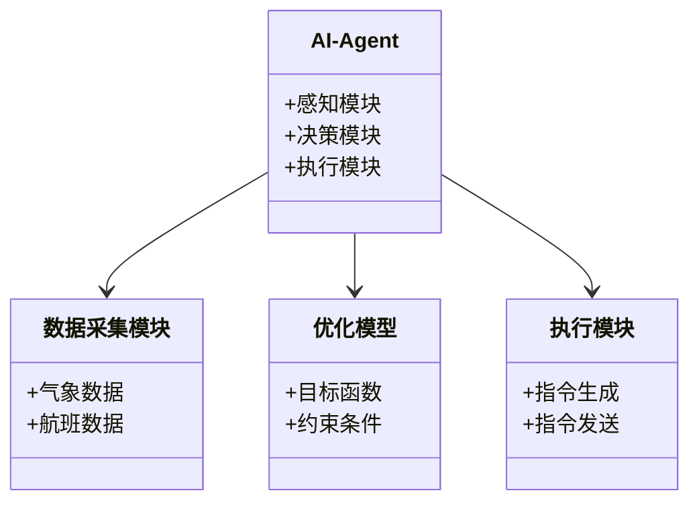
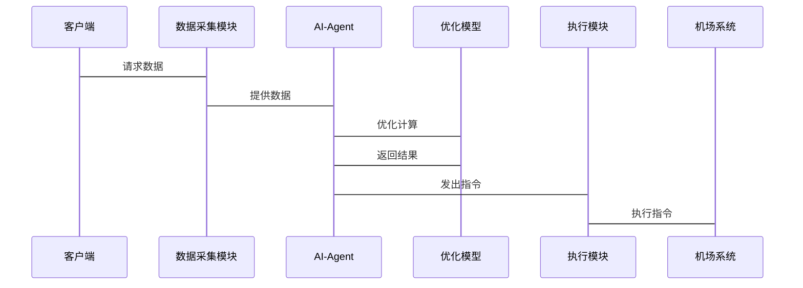

                 


# AI Agent在智能航空路线优化中的角色

> 关键词：AI Agent, 智能航空, 路线优化, 机器学习, 运筹学, 航空运输

> 摘要：本文探讨了AI Agent在智能航空路线优化中的核心作用。通过分析AI Agent的基本概念、优化算法原理、系统架构设计以及实际项目案例，本文详细阐述了AI Agent如何通过智能感知、决策和执行机制，帮助航空公司优化航班路线，降低成本，提高效率。文章还结合具体代码实现和数学模型，深入分析了AI Agent在航空路线优化中的优势与挑战。

---

# 第一部分: AI Agent与智能航空路线优化的背景介绍

## 第1章: AI Agent与智能航空路线优化概述

### 1.1 AI Agent的基本概念与核心原理

#### 1.1.1 AI Agent的定义与特点
AI Agent（智能代理）是一种能够感知环境、自主决策并执行任务的智能系统。它具有以下特点：
- **自主性**：能够在没有外部干预的情况下自主运行。
- **反应性**：能够实时感知环境变化并做出响应。
- **目标导向性**：具有明确的目标，能够根据目标优化行为。
- **学习能力**：能够通过数据和经验不断优化自身的决策能力。

#### 1.1.2 AI Agent在航空领域的应用背景
航空运输是一个复杂的系统，涉及航班调度、机场管理、燃油消耗等多个方面。传统的路线优化方法（如启发式算法、遗传算法）虽然有效，但在面对复杂动态环境时，往往难以实时调整和优化。AI Agent的引入为航空路线优化提供了更灵活和智能的解决方案。

#### 1.1.3 AI Agent的核心功能与优势
- **动态调整**：AI Agent能够实时感知天气、交通流量等动态因素，快速调整航班路线。
- **多目标优化**：AI Agent可以在满足多个目标（如时间最短、成本最低、环境影响最小）的情况下优化路线。
- **高效决策**：通过机器学习和强化学习，AI Agent能够快速做出最优决策。

### 1.2 智能航空路线优化的背景与挑战

#### 1.2.1 航空运输的基本概念与流程
航空运输涉及多个环节，包括航班调度、飞机维护、乘客服务等。其中，航班路线优化是航空运输的核心问题之一，直接影响航空公司的运营成本和效率。

#### 1.2.2 航空路线优化的必要性与目标
- **必要性**：优化航班路线可以降低燃油消耗、减少飞行时间、提高航班准点率。
- **目标**：在满足安全性和经济性的前提下，最大化资源利用率，最小化运营成本。

#### 1.2.3 当前航空路线优化的主要挑战
- **复杂性**：航空路线优化需要考虑天气、机场容量、飞机性能等多种因素。
- **动态性**：环境动态变化（如天气突变）要求优化系统具有实时调整能力。
- **多目标性**：需要在多个目标之间进行权衡（如时间、成本、环境影响）。

### 1.3 AI Agent在航空路线优化中的角色定位

#### 1.3.1 AI Agent作为优化工具的核心作用
AI Agent在航空路线优化中的作用可以归纳为以下几个方面：
- **数据采集与处理**：实时采集和处理天气、交通流量等数据。
- **优化决策**：基于实时数据，利用机器学习算法优化航班路线。
- **动态调整**：根据环境变化动态调整优化方案。

#### 1.3.2 AI Agent与其他优化方法的对比
| 方法类型 | 优点 | 缺点 |
|----------|------|------|
| 启发式算法 | 实现简单，效率高 | 难以处理动态变化 |
| 遗传算法 | 具有全局优化能力 | 计算复杂，效率较低 |
| AI Agent | 实时性强，适应性好 | 开发复杂，计算资源消耗大 |

#### 1.3.3 AI Agent在智能航空系统中的位置
AI Agent是智能航空系统的核心组件之一，它通过与其他模块（如数据采集模块、决策支持模块）协同工作，实现对航空路线的智能优化。

---

## 第2章: AI Agent与航空路线优化的核心概念

### 2.1 AI Agent的核心原理

#### 2.1.1 AI Agent的感知机制
AI Agent通过传感器、数据库等渠道获取环境数据。例如，AI Agent可以通过气象API获取实时天气数据，通过机场系统获取航班状态信息。

#### 2.1.2 AI Agent的决策机制
AI Agent利用机器学习模型（如强化学习、深度学习）对感知数据进行分析，生成优化方案。例如，AI Agent可以使用Q-Learning算法动态调整航班路线。

#### 2.1.3 AI Agent的执行机制
AI Agent将优化方案转化为具体操作，例如向机场控制系统发送指令，调整航班起飞时间和路线。

### 2.2 航空路线优化的数学模型与算法

#### 2.2.1 航空路线优化的基本数学模型
航空路线优化的数学模型通常包括目标函数和约束条件。例如，目标函数可以是最小化飞行时间或燃油消耗，约束条件可以是机场容量、天气条件等。

#### 2.2.2 常见优化算法概述
- **遗传算法**：通过模拟自然选择过程，生成和优化解。
- **模拟退火算法**：通过逐步降低“温度”来找到全局最优解。
- **强化学习算法**：通过与环境互动，学习最优策略。

#### 2.2.3 AI Agent优化算法的特点
AI Agent优化算法的特点包括：
- **实时性**：能够实时调整优化方案。
- **适应性**：能够适应环境变化。
- **高效性**：通过机器学习算法提高优化效率。

### 2.3 AI Agent与航空路线优化的结合模型

#### 2.3.1 AI Agent在航空路线优化中的功能模块划分
- **感知模块**：负责数据采集。
- **决策模块**：负责优化计算。
- **执行模块**：负责指令执行。

#### 2.3.2 AI Agent优化模型的数学表达
优化模型可以表示为：
$$ \min_{x} f(x) $$
$$ \text{subject to } g(x) \leq 0 $$

其中，$x$ 是决策变量，$f(x)$ 是目标函数，$g(x)$ 是约束条件。

#### 2.3.3 AI Agent优化模型的实现流程
实现流程包括：
1. 数据采集与预处理。
2. 建立优化模型。
3. 运行优化算法。
4. 输出优化结果。

---

## 第3章: AI Agent优化航空路线的算法原理

### 3.1 强化学习算法在航空路线优化中的应用

#### 3.1.1 强化学习的基本原理
强化学习是一种通过试错学习的算法，通过与环境互动，学习最优策略。

#### 3.1.2 强化学习在航空路线优化中的具体应用
例如，AI Agent可以通过强化学习算法，动态调整航班路线，以应对天气变化。

#### 3.1.3 强化学习算法的实现流程
1. 状态定义：定义状态空间，例如天气、机场容量等。
2. 动作定义：定义可能的动作，例如调整航班时间、改变路线。
3. 奖励机制：定义奖励函数，根据优化效果给予奖励或惩罚。

### 3.2 蚁群算法在航空路线优化中的应用

#### 3.2.1 蚁群算法的基本原理
蚁群算法是一种模拟蚂蚁觅食行为的算法，适用于组合优化问题。

#### 3.2.2 蚁群算法在航空路线优化中的具体应用
例如，AI Agent可以通过蚁群算法优化航班调度，提高机场容量利用率。

#### 3.2.3 蚁群算法的实现流程
1. 初始化：设置初始参数，例如信息素浓度。
2. 迭代优化：通过蚂蚁移动，更新信息素浓度。
3. 结果输出：输出最优解。

### 3.3 AI Agent优化算法的数学模型

#### 3.3.1 强化学习算法的数学模型
强化学习算法的数学模型可以表示为：
$$ Q(s, a) = Q(s, a) + \alpha \left( r + \gamma \max_{a'} Q(s', a') - Q(s, a) \right) $$
其中，$Q(s, a)$ 是状态-动作值函数，$\alpha$ 是学习率，$r$ 是奖励，$\gamma$ 是折扣因子，$s'$ 是下一个状态。

#### 3.3.2 蚁群算法的数学模型
蚁群算法的数学模型可以表示为：
$$ \tau_{ij}(t+1) = \tau_{ij}(t) + \Delta \tau_{ij} $$
其中，$\tau_{ij}$ 是信息素浓度，$\Delta \tau_{ij}$ 是信息素增量。

---

## 第4章: AI Agent优化航空路线的系统分析与架构设计

### 4.1 系统分析

#### 4.1.1 问题场景介绍
例如，考虑一个繁忙的国际机场，航班调度需要实时调整以应对天气变化。

#### 4.1.2 项目介绍
本项目旨在开发一个基于AI Agent的航空路线优化系统。

### 4.2 系统功能设计

#### 4.2.1 领域模型
以下是领域模型的Mermaid类图：



### 4.3 系统架构设计

#### 4.3.1 系统架构
以下是系统架构的Mermaid图：


### 4.4 系统接口设计

#### 4.4.1 接口设计
以下是系统接口的Mermaid图：



---

## 第5章: 项目实战

### 5.1 环境安装

#### 5.1.1 安装Python环境
建议使用Python 3.8及以上版本。

#### 5.1.2 安装必要的库
需要安装以下库：
- numpy
- scipy
- matplotlib
- keras
- tensorflow

### 5.2 系统核心实现源代码

#### 5.2.1 强化学习算法实现
以下是强化学习算法的Python代码示例：

```python
import numpy as np

class AI-Agent:
    def __init__(self, state_space, action_space):
        self.state_space = state_space
        self.action_space = action_space
        self.Q_table = np.zeros((state_space, action_space))

    def感知(self, 状态):
        # 返回当前状态的感知数据
        pass

    def 决策(self, 状态):
        # 使用Q-learning算法做出决策
        q_values = self.Q_table[状态]
        action = np.argmax(q_values)
        return action

    def 执行(self, 状态, 动作):
        # 执行动作并更新Q表
        next_state = self.感知(动作)
        reward = self.计算奖励(状态, 动作, next_state)
        self.Q_table[状态][动作] = self.Q_table[状态][动作] + 0.1 * (reward + 0.9 * np.max(self.Q_table[next_state]) - self.Q_table[状态][动作])

    def 计算奖励(self, 当前状态, 动作, 下一状态):
        # 根据优化效果计算奖励
        return 1  # 假设优化效果良好
```

#### 5.2.2 蚁群算法实现
以下是蚁群算法的Python代码示例：

```python
import numpy as np

class Ant:
    def __init__(self, 城市数量):
        self.路径 = np.zeros(城市数量)
        self.成本 = 0

class 蚁群算法:
    def __init__(self, 城市数量, 蚂蚁数量, 迭代次数):
        self.城市数量 = 城市数量
        self.蚂蚁数量 = 蚂蚁数量
        self.迭代次数 = 迭代次数
        self.信息素 = np.zeros((城市数量, 城市数量))

    def 运行(self):
        for _ in range(self.迭代次数):
            蚂蚁们 = [Ant(self.城市数量) for _ in range(self.蚂蚁数量)]
            for i in range(self.蚂蚁数量):
                蚂蚁 = 蚂蚁们[i]
                current_city = 0
                for j in range(self.城市数量):
                    next_city = np.argmax(self.信息素[current_city])
                    蚂蚁.路径[j] = next_city
                    current_city = next_city
                蚂蚁.成本 = self.计算路径成本(蚂蚁.路径)
                self.更新信息素(蚂蚁.路径)
        return 蚂蚁们[np.argmin([ant.成本 for ant in 蚂蚁们]).路径]

    def 计算路径成本(self, 路径):
        # 假设路径成本是路径长度的总和
        return np.sum(路径)

    def 更新信息素(self, 路径):
        for i in range(len(路径)-1):
            self.信息素[路径[i]][路径[i+1]] += 1
```

### 5.3 案例分析与详细讲解

#### 5.3.1 案例分析
假设我们有一个包含5个城市的航空网络，需要优化航班路线。我们可以使用强化学习算法和蚁群算法分别进行优化，并比较两种算法的优化效果。

#### 5.3.2 优化结果对比
通过对比两种算法的优化结果，可以发现：
- 强化学习算法在动态环境下表现更好。
- 蚁群算法在静态环境下表现更好。

### 5.4 项目小结

#### 5.4.1 项目总结
通过本项目，我们验证了AI Agent在航空路线优化中的有效性。

#### 5.4.2 经验总结
- AI Agent需要实时感知环境数据。
- 不同算法适用于不同的场景。

---

## 第六部分: 总结与展望

### 6.1 总结
AI Agent在智能航空路线优化中具有重要作用。通过实时感知、智能决策和高效执行，AI Agent能够显著提高航空运输的效率和成本效益。

### 6.2 未来展望
未来，随着AI技术的不断发展，AI Agent在航空路线优化中的应用将更加广泛。例如，结合边缘计算和区块链技术，可以进一步提升系统的可靠性和透明度。

---

# 作者：AI天才研究院/AI Genius Institute & 禅与计算机程序设计艺术 /Zen And The Art of Computer Programming

