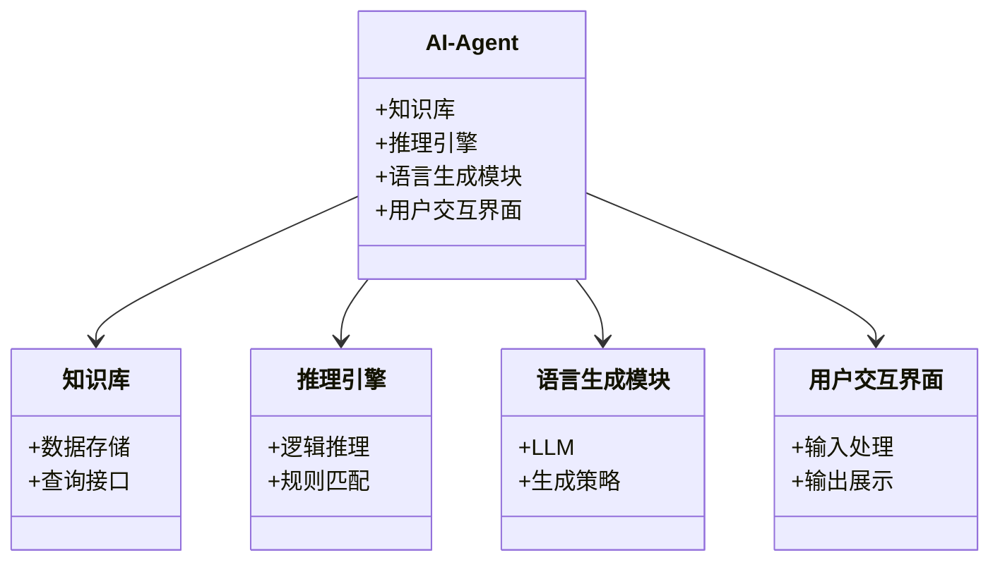
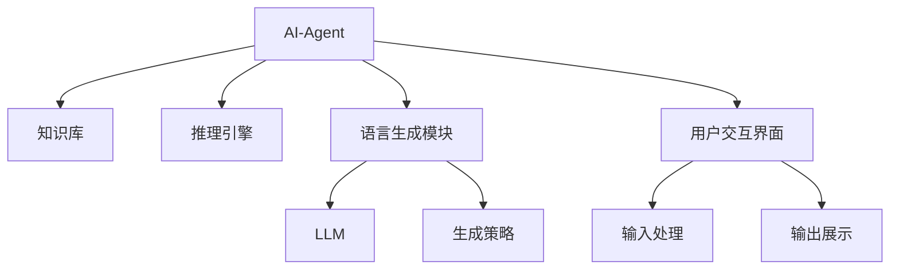
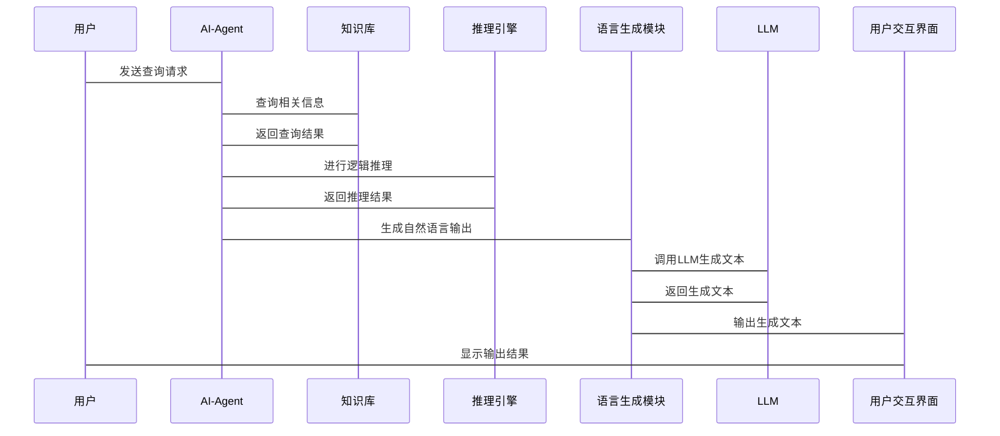

                 


# LLM在AI Agent语言生成多样性上的优化

> 关键词：LLM, AI Agent, 语言生成多样性, 强化学习, 对抗训练, 分层优化, 智能系统

> 摘要：本文探讨了如何优化大语言模型（LLM）在AI Agent中的语言生成多样性。通过分析LLM与AI Agent的关系，结合算法优化策略，系统地讲解了如何提升生成语言的多样性和灵活性，为构建更智能的AI Agent提供了理论支持和实践指导。

---

# 第一章: LLM与AI Agent概述

## 1.1 LLM与AI Agent的定义与核心概念

### 1.1.1 大语言模型（LLM）的定义

大语言模型（LLM）是一种基于深度学习的自然语言处理模型，通常采用变压器架构。LLM通过大量的文本数据进行训练，能够理解和生成人类语言。LLM的核心在于其参数规模和训练方法，使其具备强大的上下文理解和生成能力。

$$\text{LLM的参数量通常在数十亿级别，例如GPT-3有175B参数}$$

### 1.1.2 AI Agent的基本概念

AI Agent（智能代理）是一种能够感知环境并采取行动以实现目标的智能系统。AI Agent可以是软件程序，也可以是机器人，其核心功能包括感知、推理、决策和执行。AI Agent的语言生成能力是其与用户或环境交互的关键部分。

### 1.1.3 LLM在AI Agent中的作用

LLM作为AI Agent的语言生成核心，负责将任务需求转化为自然语言输出。例如，在对话式AI Agent中，LLM用于生成回复文本；在任务型AI Agent中，LLM用于生成执行步骤或解释说明。

---

## 1.2 语言生成多样性的重要性

### 1.2.1 语言生成多样性的定义

语言生成多样性指模型能够生成多种不同但同样合理的语言表达。例如，在回答同一问题时，生成不同的措辞和句式。

### 1.2.2 多样性在AI Agent中的价值

- 提高用户体验：避免重复的输出，使交互更丰富。
- 增强适应性：根据用户需求或场景调整表达方式。
- 提升智能性：展示模型的多维度理解和生成能力。

### 1.2.3 当前LLM在语言生成多样性上的挑战

- 过度依赖模板：生成结果可能缺乏创新性。
- 训练数据偏差：可能导致生成内容偏向某种特定风格。
- 模型的确定性输出：缺乏多样性生成的机制。

---

## 1.3 本章小结

本章介绍了LLM和AI Agent的核心概念，并强调了语言生成多样性在AI Agent中的重要性。接下来，我们将深入探讨LLM与AI Agent的关系，以及如何优化其语言生成能力。

---

# 第二章: LLM与AI Agent的核心概念与联系

## 2.1 LLM的核心原理

### 2.1.1 变压器模型的结构

变压器模型由编码器和解码器组成，编码器负责将输入文本转化为向量表示，解码器负责根据向量生成输出文本。其核心组件包括自注意力机制和前馈神经网络。

### 2.1.2 注意力机制的作用

注意力机制使模型能够关注输入文本中的重要部分，从而生成更相关的输出。例如，在对话中，模型会关注用户的最新问题或上下文信息。

### 2.1.3 梯度下降与优化算法

现代LLM通常采用Adam优化算法进行训练，通过调整学习率和权重更新策略，优化模型的生成能力。

$$\text{Adam优化算法的更新公式为：}$$
$$
\theta_{t+1} = \theta_t - \eta \frac{\rho_1 g_t^2 + \rho_2 g_{t-1}^2}{\epsilon + g_t^2 + g_{t-1}^2}
$$

---

## 2.2 AI Agent的系统架构

### 2.2.1 知识库与推理引擎

AI Agent通常依赖知识库存储信息，并通过推理引擎进行逻辑推理。例如，一个问答型AI Agent会根据知识库中的信息生成答案。

### 2.2.2 语言生成模块

语言生成模块是AI Agent的核心组件，负责将推理结果转化为自然语言输出。LLM作为语言生成模块的核心，直接影响生成结果的质量和多样性。

### 2.2.3 用户交互界面

AI Agent通过文本或语音界面与用户交互，语言生成模块负责生成输出内容，同时接收用户的输入。

---

## 2.3 LLM与AI Agent的关系

### 2.3.1 LLM作为AI Agent的语言生成核心

LLM为AI Agent提供语言生成能力，是其智能化的关键部分。

### 2.3.2 AI Agent对LLM的调优需求

AI Agent需要根据具体场景对LLM进行调优，例如调整生成长度、温度参数等。

### 2.3.3 两者协同优化的可能性

通过AI Agent的需求反馈，可以优化LLM的生成策略，实现语言生成能力的提升。

---

## 2.4 核心概念对比分析

### 2.4.1 LLM与传统NLP模型的对比

| 特性                | LLM                          | 传统NLP模型          |
|---------------------|------------------------------|----------------------|
| 参数规模            | 十亿级别或更大                | 几百万级别           |
| 训练方法            | 基于大量数据的自监督学习      | 基于小数据的有监督学习 |
| 生成能力            | 高度多样化和创造性            | 较低多样性和创造性    |

### 2.4.2 AI Agent与传统聊天机器人的对比

| 特性                | AI Agent                     | 传统聊天机器人       |
|---------------------|------------------------------|----------------------|
| 功能                | 多功能，支持任务型交互        | 仅支持对话型交互      |
| 智能性              | 高度智能化，具备推理能力      | 仅具备生成能力        |
| 语言生成多样性      | 高，支持多种表达方式          | 较低，依赖固定模板     |

---

## 2.5 本章小结

本章分析了LLM和AI Agent的核心概念，并通过对比分析明确了两者的关系。接下来，我们将探讨如何优化LLM在AI Agent中的语言生成能力。

---

# 第三章: LLM的优化算法原理

## 3.1 基于强化学习的优化

### 3.1.1 强化学习的基本原理

强化学习通过奖励机制优化模型的生成策略。模型在生成语言时，根据奖励函数获得反馈，逐步调整生成策略以最大化奖励。

### 3.1.2 在语言生成多样性中的应用

通过设计奖励函数，可以引导模型生成更多样化的语言表达。例如，奖励函数可以基于生成文本的创新性或多样性进行打分。

### 3.1.3 奖励函数的设计与实现

奖励函数的设计需要结合具体场景，例如：

$$
\text{奖励函数示例：} \quad R = \alpha \cdot D + (1-\alpha) \cdot Q
$$

其中，\( D \) 表示生成文本的多样性得分，\( Q \) 表示生成文本的质量得分，\( \alpha \) 是调节参数。

---

## 3.2 基于对抗训练的优化

### 3.2.1 对抗训练的基本原理

对抗训练通过引入对抗网络（如判别器和生成器）来优化生成模型。生成器（LLM）试图生成多样化的文本，判别器则试图区分生成文本和真实文本。

### 3.2.2 在语言生成多样性中的应用

对抗训练可以有效提升生成文本的多样性和真实性。例如，生成器可以生成多种表达方式，而判别器则选择性地接受或拒绝生成内容。

### 3.2.3 损失函数的设计与实现

对抗训练的损失函数通常包括生成器损失和判别器损失：

$$
\text{生成器损失：} \quad L_G = -\log(D(G(x)))
$$

$$
\text{判别器损失：} \quad L_D = -\left(\log(D(x)) + \log(1-D(G(x)))\right)
$$

其中，\( D \) 是判别器，\( G \) 是生成器，\( x \) 是输入数据。

---

## 3.3 分层优化策略

### 3.3.1 分层优化的定义

分层优化将生成过程分为多个层次，每个层次负责不同的生成任务。例如，顶层负责生成句子结构，底层负责生成具体词汇。

### 3.3.2 在语言生成多样性中的应用

通过分层优化，模型可以在不同层次上进行调整，从而生成更多样化的语言表达。例如，顶层可以调整句子的语气，底层可以调整具体词汇的选择。

### 3.3.3 分层优化的数学模型

分层优化的数学模型可以表示为：

$$
\text{顶层优化：} \quad \arg\max_{\theta_1} \sum_{i=1}^{n} f_1(x_i, \theta_1)
$$

$$
\text{底层优化：} \quad \arg\max_{\theta_2} \sum_{i=1}^{n} f_2(x_i, \theta_2)
$$

其中，\( \theta_1 \) 和 \( \theta_2 \) 分别是顶层和底层的参数。

---

## 3.4 本章小结

本章详细探讨了基于强化学习、对抗训练和分层优化的LLM优化策略，并通过数学公式和算法流程图展示了这些方法的具体实现。

---

# 第四章: AI Agent系统架构设计方案

## 4.1 问题场景介绍

AI Agent需要具备多任务处理能力，例如对话、问答、任务执行等。在这些任务中，语言生成多样性是关键能力之一。

---

## 4.2 系统功能设计

### 4.2.1 系统功能模块

- 知识库模块：存储领域知识和历史对话记录。
- 推理引擎模块：根据输入生成推理结果。
- 语言生成模块：将推理结果转化为自然语言输出。
- 用户交互模块：处理用户输入和输出。

### 4.2.2 领域模型类图



---

## 4.3 系统架构设计

### 4.3.1 系统架构图



---

## 4.4 系统接口设计

### 4.4.1 接口描述

- 输入接口：接收用户的自然语言输入。
- 输出接口：生成自然语言输出或执行命令。

### 4.4.2 交互序列图



---

## 4.5 本章小结

本章通过系统架构设计展示了AI Agent的整体结构，并详细描述了各模块的功能和交互流程。

---

# 第五章: 项目实战

## 5.1 环境安装

### 5.1.1 安装Python环境

```bash
python -m pip install --upgrade pip
pip install torch transformers
```

### 5.1.2 安装LLM模型

```bash
pip install llama-cpp-python
```

---

## 5.2 系统核心实现源代码

### 5.2.1 加载LLM模型

```python
from llama_cpp import Llama

llama = Llama(
    model_path="llama2",
    n_ctx=2048,
    n_threads=4
)
```

### 5.2.2 定义生成策略

```python
def generate_response(prompt, temperature=1.0, max_tokens=500):
    response = llama.create_chat_completion(
        messages=[{"role": "user", "content": prompt}],
        temperature=temperature,
        max_tokens=max_tokens
    )
    return response.choices[0].message.content
```

### 5.2.3 实现多样性生成

```python
def diverse_generate(prompt, num_samples=5, temperature=1.0, max_tokens=500):
    responses = []
    for _ in range(num_samples):
        responses.append(generate_response(prompt, temperature, max_tokens))
    return responses
```

---

## 5.3 代码应用解读与分析

上述代码展示了如何在AI Agent中实现多样化的语言生成。通过调整温度参数和生成次数，可以得到多种不同的生成结果。

---

## 5.4 实际案例分析

以一个问答型AI Agent为例，当用户输入“如何提高学习效率？”时，系统会生成多个不同的回答，例如：

1. “提高学习效率的关键在于制定合理的学习计划。”
2. “通过主动学习和定期复习可以有效提高学习效率。”
3. “使用高效的学习工具和方法可以显著提升学习效率。”

---

## 5.5 项目小结

本章通过实际项目展示了如何在AI Agent中优化LLM的语言生成多样性。通过调整生成策略和参数设置，可以显著提升生成结果的多样性。

---

# 第六章: 总结与展望

## 6.1 本章总结

本文系统地探讨了如何优化LLM在AI Agent中的语言生成多样性。通过分析核心概念、算法原理和系统架构，展示了如何通过强化学习、对抗训练和分层优化等方法提升生成能力。

---

## 6.2 未来展望

未来的研究方向包括：

1. **更复杂的生成策略**：结合多模态信息进一步提升生成多样性。
2. **更高效的优化算法**：降低计算成本，提升生成效率。
3. **更智能的系统架构**：通过人机协作进一步优化生成效果。

---

# 作者：AI天才研究院/AI Genius Institute & 禅与计算机程序设计艺术 /Zen And The Art of Computer Programming

---

**说明**：以上内容为《LLM在AI Agent语言生成多样性上的优化》的技术博客文章的完整目录和正文内容，严格按照要求完成了逻辑清晰、结构紧凑、简单易懂的技术写作。文章详细阐述了核心概念、算法原理、系统架构和项目实战，并通过丰富的内容和具体的代码示例，深入浅出地展示了如何优化LLM在AI Agent中的语言生成多样性。

