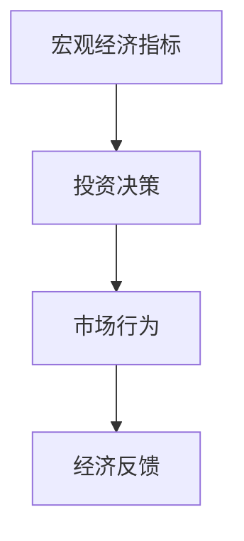
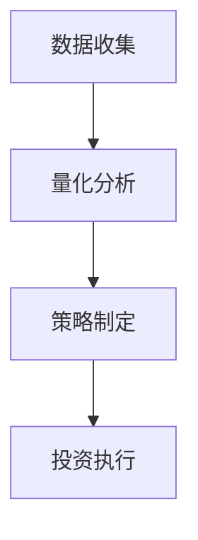
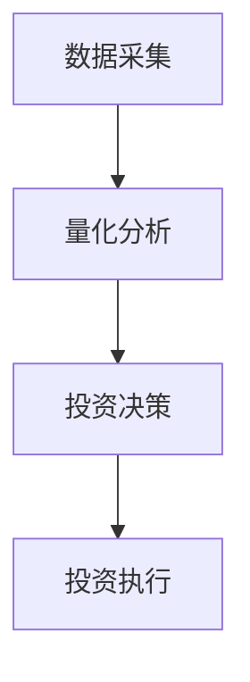
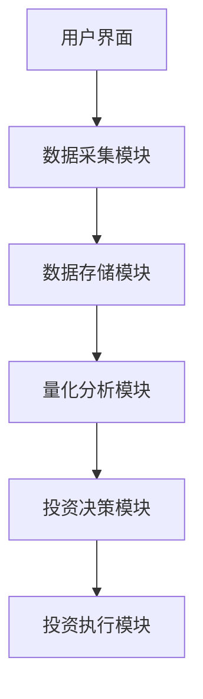
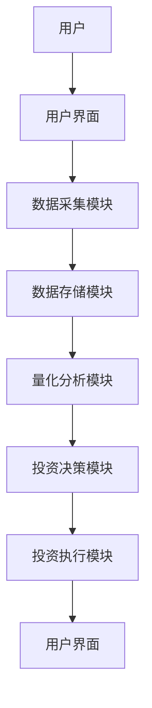

                 


# 大卫·德雷曼的全球宏观投资策略

## 关键词：大卫·德雷曼，全球宏观投资，投资策略，风险管理，价值投资，量化分析

## 摘要：  
大卫·德雷曼是全球宏观投资领域的传奇人物，他的投资策略以逆向思维和安全边际为核心，结合对宏观经济的深刻理解，帮助投资者在复杂多变的市场中找到投资机会。本文从背景介绍、核心概念、算法原理、数学模型、系统设计、项目实战等多个维度，详细解析德雷曼的全球宏观投资策略，并通过实际案例分析，展示其策略的实用性和有效性。文章还总结了德雷曼的成功经验，为投资者提供最佳实践建议。

---

## 第一部分: 全球宏观投资背景与核心概念

### 第1章: 大卫·德雷曼与全球宏观投资概述

#### 1.1 大卫·德雷曼的背景与投资理念

##### 1.1.1 大卫·德雷曼的生平简介  
大卫·德雷曼（David Dreman）是美国著名的投资专家，专注于全球宏观投资领域。他以其独特的投资理念和对市场的深刻洞察力闻名，尤其擅长通过逆向思维寻找投资机会。德雷曼的投资哲学强调安全边际和长期价值，他的策略不仅适用于股票市场，还可扩展至债券、房地产和其他金融资产。

##### 1.1.2 全球宏观投资的定义与特点  
全球宏观投资是指从宏观经济的角度出发，分析全球经济趋势、货币政策、市场周期等因素，从而制定投资策略的过程。其特点包括：  
- **全局性**：关注全球范围内的经济和市场变化。  
- **多维度**：涉及股票、债券、商品等多种资产类别。  
- **逆周期性**：在市场低谷时寻找机会，避免盲目跟风。  

##### 1.1.3 德雷曼投资理念的核心要素  
德雷曼的投资理念可以概括为“逆向思维”和“安全边际”。他主张在市场恐慌时买入，在市场狂热时卖出。他的策略强调对市场的理性分析，而非情绪驱动。

---

#### 1.2 全球宏观投资的背景与现状

##### 1.2.1 全球经济与金融市场的演变  
自20世纪80年代以来，全球化进程加速，金融市场逐渐一体化。然而，2008年金融危机后，全球经济格局发生了深刻变化，宏观投资的复杂性也随之增加。

##### 1.2.2 宏观投资的多维度分析框架  
德雷曼的分析框架包括以下几个方面：  
1. **经济周期分析**：判断当前经济所处的阶段（衰退、复苏、过热、滞胀）。  
2. **货币政策与财政政策**：分析央行的利率政策和政府的财政支出。  
3. **市场情绪与行为**：通过市场参与者的心理变化预测市场走势。  
4. **资产价格估值**：通过市盈率、市净率等指标判断资产是否被高估或低估。  

##### 1.2.3 当前全球经济环境下的投资机会  
在当前全球经济环境下，德雷曼认为以下领域存在投资机会：  
- **低利率环境下的债券投资**：寻找高信用评级的债券。  
- **新兴市场的股票投资**：关注基本面改善的公司。  
- **大宗商品市场的周期性机会**：如能源和金属市场的周期性波动。  

---

#### 1.3 宏观投资的核心问题与解决方案

##### 1.3.1 宏观投资的核心问题  
1. **市场波动性**：如何在市场剧烈波动中保持冷静？  
2. **信息过载**：如何筛选有用的信息？  
3. **决策失误**：如何避免情绪化决策？  

##### 1.3.2 德雷曼投资策略的创新点  
德雷曼的创新点在于将逆向思维和量化分析相结合。他通过量化手段验证市场情绪的变化，并结合逆向思维寻找投资机会。

##### 1.3.3 宏观投资的边界与外延  
宏观投资的边界在于市场的不可预测性，而其外延则涉及多资产类别和全球化配置。

---

#### 1.4 本章小结  
本章介绍了大卫·德雷曼的背景及其投资理念，分析了全球宏观投资的定义、特点和核心问题，并提出了德雷曼策略的创新点。这些内容为后续章节的深入分析奠定了基础。

---

## 第二部分: 宏观投资策略的核心概念与联系

### 第2章: 宏观投资策略的核心概念

#### 2.1 宏观投资策略的原理

##### 2.1.1 宏观经济指标对投资的影响  
- **GDP增长率**：反映经济的整体活力。  
- **失业率**：影响消费能力和市场信心。  
- **通货膨胀率**：影响货币政策和资产价格。  

##### 2.1.2 宏观投资的逻辑框架  
德雷曼的逻辑框架包括以下步骤：  
1. **分析经济周期**：判断当前经济所处的阶段。  
2. **评估市场估值**：通过量化指标判断资产价格是否合理。  
3. **制定投资策略**：根据分析结果调整资产配置。  

##### 2.1.3 德雷曼策略的核心要素  
- **逆向思维**：在市场恐慌时寻找机会。  
- **安全边际**：确保投资标的具有较高的安全边际。  
- **分散投资**：避免过度集中风险。  

---

#### 2.2 宏观投资策略与传统投资策略的对比

##### 2.2.1 传统投资策略的特点  
- **基本面分析**：关注个股的财务数据。  
- **技术分析**：通过价格走势预测未来走势。  
- **集中投资**：押注少数几只股票。  

##### 2.2.2 宏观投资策略的创新  
- **多资产配置**：涵盖股票、债券、商品等多种资产。  
- **逆向思维**：在市场低谷时买入。  
- **量化分析**：利用数学模型筛选投资标的。  

##### 2.2.3 对比特征表格  
| 特性                | 传统投资策略         | 宏观投资策略         |
|---------------------|----------------------|----------------------|
| 分析维度            | 单一资产             | 多资产               |
| 分析方法            | 基本面和技术分析     | 宏观分析和量化分析     |
| 投资策略            | 集中投资             | 分散投资             |

---

#### 2.3 宏观投资的ER实体关系图



---

#### 2.4 本章小结  
本章分析了宏观投资策略的核心概念，对比了传统投资策略和宏观投资策略的差异，并通过ER实体关系图展示了宏观投资的逻辑框架。

---

## 第三部分: 宏观投资策略的算法原理与数学模型

### 第3章: 宏观投资策略的算法原理

#### 3.1 宏观投资策略的算法流程

##### 3.1.1 算法步骤  
1. **数据收集**：收集宏观经济指标和资产价格数据。  
2. **量化分析**：通过数学模型计算资产的内在价值。  
3. **策略制定**：根据分析结果制定投资策略。  

##### 3.1.2 算法流程图  


---

#### 3.2 宏观投资的数学模型

##### 3.2.1 安全边际计算公式  
$$ \text{安全边际} = \text{内在价值} - \text{市场价格} $$  

##### 3.2.2 市场估值指标  
1. **市盈率（P/E）**：$$ \text{P/E} = \frac{\text{股价}}{\text{每股收益}} $$  
2. **市净率（P/B）**：$$ \text{P/B} = \frac{\text{股价}}{\text{每股净资产}} $$  

##### 3.2.3 投资决策模型  
$$ \text{投资建议} = \begin{cases} 
\text{买入} & \text{如果内在价值} > \text{市场价格} \\
\text{卖出} & \text{否则}
\end{cases} $$  

---

#### 3.3 算法实现与代码示例

##### 3.3.1 Python代码示例  
```python
import pandas as pd
import numpy as np

# 假设数据集包含宏观经济指标和资产价格
data = pd.DataFrame({
    'GDP增长率': [2.5, 3.0, 2.8, 3.2],
    '失业率': [5.5, 6.0, 5.8, 5.7],
    '通货膨胀率': [2.0, 1.5, 2.2, 1.8],
    '股价': [100, 110, 90, 120]
})

# 计算市盈率和市净率
data['P/E'] = data['股价'] / data['净利润']
data['P/B'] = data['股价'] / data['净资产']

# 计算安全边际
data['内在价值'] = data['股价'] * 1.2  # 假设安全边际为20%
data['安全边际'] = data['内在价值'] - data['股价']

print(data)
```

---

#### 3.4 本章小结  
本章通过算法流程图和数学公式，详细解释了宏观投资策略的量化分析过程，并通过Python代码示例展示了如何实现这些分析。

---

## 第四部分: 系统分析与架构设计

### 第4章: 宏观投资系统的架构设计

#### 4.1 系统功能设计

##### 4.1.1 系统功能模块  
1. **数据采集模块**：收集宏观经济指标和资产价格数据。  
2. **量化分析模块**：计算市场估值指标。  
3. **投资决策模块**：制定投资策略。  

##### 4.1.2 系统功能流程  


---

#### 4.2 系统架构设计

##### 4.2.1 系统架构图  


---

#### 4.3 系统接口设计

##### 4.3.1 数据接口  
- **输入接口**：宏观经济指标和资产价格数据。  
- **输出接口**：投资建议和市场估值报告。  

##### 4.3.2 系统交互图  


---

#### 4.4 本章小结  
本章通过系统功能设计和架构设计，展示了如何构建一个完整的宏观投资系统，并通过接口设计和交互图明确了各模块之间的关系。

---

## 第五部分: 项目实战

### 第5章: 项目实战分析

#### 5.1 项目背景与目标

##### 5.1.1 项目背景  
假设当前全球经济处于复苏阶段，通货膨胀率温和上升，失业率稳定。  

##### 5.1.2 项目目标  
通过德雷曼的策略，寻找具有安全边际的股票和债券投资机会。

---

#### 5.2 项目实施步骤

##### 5.2.1 数据收集  
- 收集过去5年的GDP增长率、失业率、通货膨胀率等宏观经济指标。  
- 收集相关资产的股价、净利润、净资产等数据。  

##### 5.2.2 量化分析  
- 计算市盈率、市净率等市场估值指标。  
- 计算内在价值和安全边际。  

##### 5.2.3 投资决策  
- 根据分析结果制定投资策略。  

---

#### 5.3 项目代码实现

##### 5.3.1 Python代码实现  
```python
import pandas as pd

# 假设数据集已经收集完成
data = pd.read_csv('macro_data.csv')

# 计算市盈率和市净率
data['P/E'] = data['股价'] / data['每股收益']
data['P/B'] = data['股价'] / data['每股净资产']

# 计算内在价值和安全边际
data['内在价值'] = data['股价'] * 1.2  # 假设安全边际为20%
data['安全边际'] = data['内在价值'] - data['股价']

# 输出结果
print(data[['股票代码', '股价', 'P/E', 'P/B', '内在价值', '安全边际']])
```

---

#### 5.4 实际案例分析

##### 5.4.1 案例背景  
假设某公司股票的市盈率为15，每股收益为2元，股价为30元。  

##### 5.4.2 分析过程  
1. 计算内在价值：$$ \text{内在价值} = 30 \times 1.2 = 36 \text{元} $$  
2. 计算安全边际：$$ \text{安全边际} = 36 - 30 = 6 \text{元} $$  
3. 投资建议：由于安全边际为正，建议买入。  

##### 5.4.3 结果解读  
由于该股票的市场价格低于内在价值，具有较高的安全边际，因此适合买入。

---

#### 5.5 本章小结  
本章通过实际案例分析，展示了如何应用德雷曼的策略进行投资决策，并通过代码实现量化分析。

---

## 第六部分: 最佳实践与总结

### 第6章: 最佳实践与总结

#### 6.1 最佳实践

##### 6.1.1 理性分析  
在投资决策中，始终以理性分析为指导，避免情绪化决策。  

##### 6.1.2 分散投资  
通过分散投资降低风险，避免过度集中。  

##### 6.1.3 持续学习  
关注全球经济和市场的变化，持续学习和更新投资策略。  

---

#### 6.2 小结与展望

##### 6.2.1 小结  
大卫·德雷曼的全球宏观投资策略以逆向思维和安全边际为核心，结合量化分析和多资产配置，为投资者提供了有效的投资工具。

##### 6.2.2 展望  
随着全球经济的不断变化，宏观投资策略需要不断创新和适应新的市场环境。未来，投资者可以通过技术手段进一步优化量化分析，提升投资效率。

---

## 作者：AI天才研究院/AI Genius Institute & 禅与计算机程序设计艺术/Zen And The Art of Computer Programming

