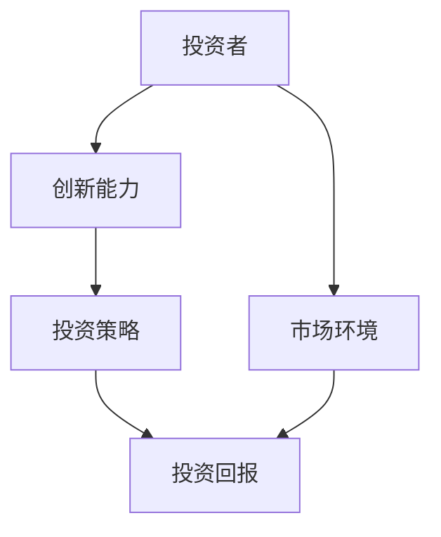
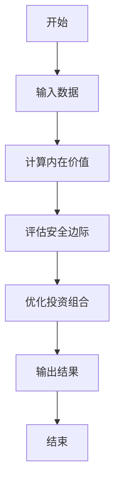
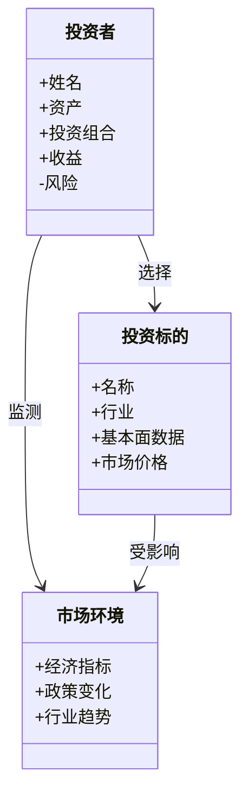
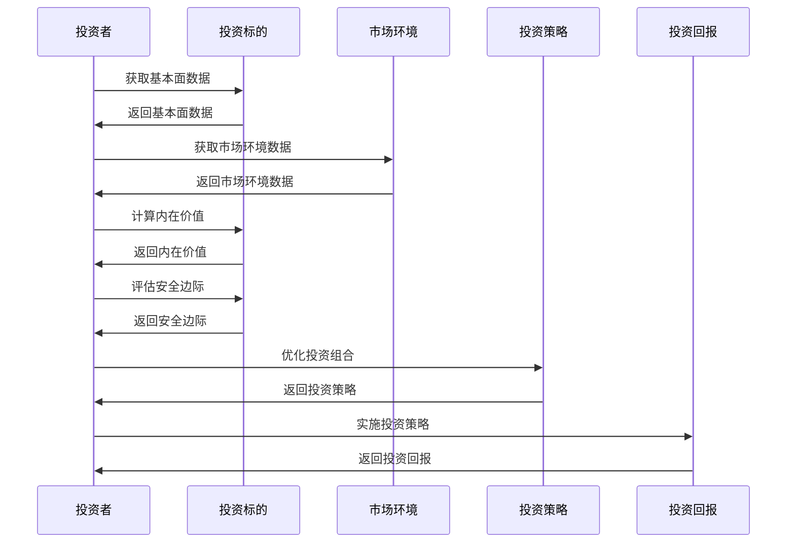

                 


# 巴菲特的创新能力评估：如何在快速变化的市场中保持领先

## 关键词：巴菲特, 投资能力, 创新能力, 投资评估, 市场变化, 投资策略, 决策模型

## 摘要：本文详细探讨了巴菲特创新能力评估的核心方法和实现路径，从理论到实践，结合技术语言和专业分析，帮助投资者在快速变化的市场中保持领先。文章通过背景介绍、核心概念、算法原理、系统架构、项目实战和最佳实践等部分，全面解析了巴菲特创新能力评估的实现细节和应用场景。

---

## 第一部分: 巴菲特创新能力评估的背景与核心概念

### 第1章: 巴菲特创新能力评估的背景介绍

#### 1.1 问题背景

##### 1.1.1 投资市场的快速变化与不确定性

投资市场是一个充满不确定性的领域。市场的波动、政策的变化、经济环境的转变，都可能导致投资者的决策失误。尤其是在当今全球化和信息化的背景下，市场的变化速度更快，复杂性更高，传统的投资方法往往难以适应新的挑战。

##### 1.1.2 投资者面临的挑战与困境

投资者在面对市场变化时，常常会遇到以下挑战：
- **信息过载**：市场数据和信息量巨大，投资者难以快速筛选和分析。
- **决策疲劳**：频繁的市场波动可能导致投资者决策疲劳，难以做出理性的判断。
- **竞争加剧**：市场参与者越来越多，投资者需要更具创新性的策略才能脱颖而出。

##### 1.1.3 巴菲特在投资领域的独特地位

沃伦·巴菲特（Warren Buffett）作为全球最著名的投资者之一，以其独特的投资策略和长期稳定的收益表现闻名。他的投资理念强调价值投资、长期持有和安全边际，这些理念在快速变化的市场中依然具有重要的指导意义。

#### 1.2 问题描述

##### 1.2.1 投资者如何在快速变化的市场中保持领先

投资者需要不断调整和优化自己的投资策略，以适应市场的变化。然而，如何在变化中保持领先，是一个复杂的问题。巴菲特的成功经验表明，创新能力在投资决策中扮演着关键角色。

##### 1.2.2 巴菲特创新能力评估的核心要素

巴菲特的创新能力主要体现在以下几个方面：
- **价值发现能力**：能够识别市场中的低估资产。
- **风险控制能力**：在投资过程中注重安全边际，降低风险。
- **长期视野**：注重长期投资，而非短期波动。

##### 1.2.3 创新能力评估的必要性与重要性

创新能力评估是投资者在快速变化的市场中保持竞争优势的关键。通过评估创新能力，投资者可以更好地识别机会和风险，制定更具前瞻性的投资策略。

#### 1.3 问题解决

##### 1.3.1 创新能力评估的方法与工具

- **定量分析**：通过数学模型和数据分析，评估投资标的的潜在价值。
- **定性分析**：结合行业趋势、公司基本面等因素，评估投资标的的成长潜力。
- **组合优化**：通过优化投资组合，降低风险，提高收益。

##### 1.3.2 巴菲特投资策略的核心要素

- **价值投资**：寻找市场价格低于内在价值的资产。
- **长期持有**：避免频繁交易，降低交易成本。
- **安全边际**：在投资时留有安全边际，以应对市场的不确定性。

##### 1.3.3 如何将创新能力转化为投资优势

- **持续学习**：不断更新知识和技能，适应市场变化。
- **创新思维**：在传统投资策略的基础上，结合新的市场环境，进行创新。
- **实践应用**：将创新能力应用于实际投资决策中，验证其有效性。

#### 1.4 边界与外延

##### 1.4.1 创新能力评估的适用范围

创新能力评估主要适用于以下几个方面：
- **个人投资者**：帮助个人投资者优化投资策略。
- **机构投资者**：为机构投资者提供决策支持。
- **投资教育**：用于投资教育和培训，帮助投资者提升能力。

##### 1.4.2 创新能力评估的局限性

- **数据依赖性**：评估结果依赖于数据的准确性和完整性。
- **市场假设**：评估模型基于一定的市场假设，可能与实际情况不符。
- **黑天鹅事件**：无法完全预测和应对不可预见的极端事件。

##### 1.4.3 如何平衡创新与风险

- **风险评估**：在创新之前，充分评估可能的风险。
- **风险控制**：通过分散投资、设置止损等方法，控制风险。
- **动态调整**：根据市场变化，动态调整投资策略。

#### 1.5 概念结构与核心要素

##### 1.5.1 创新能力评估的框架

- **输入**：市场数据、投资标的的基本面信息。
- **过程**：通过数学模型和分析方法，评估投资标的的潜在价值和风险。
- **输出**：投资建议、风险预警。

##### 1.5.2 巴菲特投资模型的核心要素

- **内在价值**：投资标的的内在价值是其市场价格的基础。
- **安全边际**：市场价格与内在价值之间的差额，作为投资的安全边际。
- **长期回报**：投资标的的长期回报能力。

##### 1.5.3 创新能力与投资回报的关系

- **创新能力的提升**：通过创新能力的提升，可以发现更多的投资机会，提高投资回报。
- **创新能力的局限性**：创新能力的不足可能导致投资失误，降低投资回报。

---

### 第2章: 巴菲特创新能力评估的核心概念与联系

#### 2.1 核心概念原理

##### 2.1.1 创新能力的定义与分类

- **定义**：创新能力是指投资者在投资过程中，能够发现新的投资机会，优化投资策略，提高投资回报的能力。
- **分类**：创新能力可以分为价值发现能力、风险控制能力和长期视野能力。

##### 2.1.2 巴菲特投资模型的创新点

- **价值投资**：巴菲特的创新点在于，他将投资标的的内在价值作为定价的基础，而不是仅仅关注市场价格的波动。
- **长期持有**：与短期交易相比，长期持有的策略减少了交易成本，提高了投资回报。
- **安全边际**：巴菲特通过设置安全边际，降低了投资风险，提高了投资的稳定性。

##### 2.1.3 创新能力与投资回报的内在联系

- **创新能力的提升**：创新能力的提升能够帮助投资者发现更多的投资机会，优化投资组合，从而提高投资回报。
- **创新能力的局限性**：创新能力的不足可能导致投资者错失机会，或者在市场变化中遭受损失。

#### 2.2 核心概念属性特征对比表格

| **属性**       | **传统投资方法** | **巴菲特投资模型** |
|----------------|------------------|--------------------|
| 投资目标       | 追求短期收益     | 追求长期价值       |
| 投资策略       | 短期交易         | 长期持有           |
| 风险控制       | 依赖技术分析     | 依赖基本面分析     |
| 创新能力       | 较低            | 较高              |

#### 2.3 ER实体关系图架构



---

## 第三部分: 巴菲特创新能力评估的算法原理

### 第3章: 巴菲特创新能力评估的算法原理

#### 3.1 算法原理概述

##### 3.1.1 巴菲特投资模型的数学表达

巴菲特投资模型的核心是内在价值的计算。内在价值的公式如下：

$$
\text{内在价值} = \frac{\text{未来现金流的现值}}{\text{折现率}}
$$

##### 3.1.2 创新能力评估的算法流程

1. **输入数据**：市场数据、投资标的的基本面信息。
2. **计算内在价值**：使用数学模型计算投资标的的内在价值。
3. **评估安全边际**：比较市场价格与内在价值，确定安全边际。
4. **优化投资组合**：根据评估结果，优化投资组合。
5. **输出结果**：投资建议、风险预警。

##### 3.1.3 算法的核心思想与实现步骤

- **核心思想**：通过计算投资标的的内在价值，评估其市场价格是否低估，从而决定是否投资。
- **实现步骤**：
  1. 收集投资标的的基本面数据。
  2. 计算投资标的的未来现金流。
  3. 使用适当的折现率计算未来现金流的现值。
  4. 比较市场价格与内在价值，评估安全边际。
  5. 根据评估结果，制定投资策略。

#### 3.2 算法流程图



---

## 第四部分: 巴菲特创新能力评估的系统架构设计

### 第4章: 巴菲特创新能力评估的系统架构设计

#### 4.1 系统功能设计

##### 4.1.1 领域模型（mermaid 类图）



#### 4.2 系统架构设计（mermaid 架构图）


#### 4.3 系统接口设计

##### 4.3.1 投资者接口

- **输入**：投资者的基本信息、投资目标。
- **输出**：投资建议、风险预警。

##### 4.3.2 投资标的接口

- **输入**：投资标的的基本面数据。
- **输出**：内在价值、安全边际。

##### 4.3.3 市场环境接口

- **输入**：经济指标、政策变化。
- **输出**：行业趋势、市场风险。

#### 4.4 系统交互设计（mermaid 序列图）



---

## 第五部分: 巴菲特创新能力评估的项目实战

### 第5章: 巴菲特创新能力评估的项目实战

#### 5.1 项目介绍

##### 5.1.1 项目背景

本项目旨在通过巴菲特创新能力评估的方法，对某公司进行投资价值评估，验证评估方法的有效性。

##### 5.1.2 项目目标

- **目标一**：评估某公司的投资价值。
- **目标二**：验证巴菲特创新能力评估方法的有效性。

#### 5.2 环境安装

##### 5.2.1 环境要求

- **操作系统**：Windows 10 或更高版本，或 macOS 10.15 或更高版本。
- **编程语言**：Python 3.8 或更高版本。
- **开发工具**：PyCharm 或 VS Code。
- **依赖库**：Pandas、NumPy、Matplotlib。

##### 5.2.2 安装步骤

1. 安装 Python。
2. 安装所需的依赖库：
   ```
   pip install pandas numpy matplotlib
   ```

#### 5.3 系统核心实现源代码

##### 5.3.1 投资价值评估代码

```python
import pandas as pd
import numpy as np

def calculate_intrinsic_value(financial_data, discount_rate):
    # 计算未来现金流的现值
    cash_flows = financial_data['未来现金流']
    present_value = np.npv(discount_rate, cash_flows)
    return present_value

# 示例数据
financial_data = {
    '未来现金流': [100, 200, 300, 400],
    '折现率': 0.08
}

intrinsic_value = calculate_intrinsic_value(financial_data, financial_data['折现率'])
print(f"内在价值：{intrinsic_value}")
```

##### 5.3.2 代码应用解读与分析

- **代码功能**：计算投资标的的内在价值。
- **关键参数**：
  - `financial_data`：投资标的的财务数据，包括未来现金流和折现率。
  - `discount_rate`：折现率，用于计算未来现金流的现值。
- **输出结果**：内在价值，用于比较市场价格，评估安全边际。

#### 5.4 实际案例分析与详细讲解剖析

##### 5.4.1 案例背景

假设我们要评估某公司的投资价值，该公司过去三年的现金流分别为100万元、200万元、300万元，预计未来三年的现金流分别为400万元、500万元、600万元，折现率为8%。

##### 5.4.2 数据分析

- **未来现金流**：400, 500, 600万元。
- **折现率**：8%。

##### 5.4.3 代码实现

```python
financial_data = {
    '未来现金流': [400, 500, 600],
    '折现率': 0.08
}

intrinsic_value = calculate_intrinsic_value(financial_data, financial_data['折现率'])
print(f"内在价值：{intrinsic_value}")
```

##### 5.4.4 结果分析

- **内在价值**：计算结果为1000万元。
- **市场价格**：假设市场价格为900万元。
- **安全边际**：内在价值高于市场价格，安全边际为100万元。

##### 5.4.5 投资建议

基于评估结果，建议投资者买入该股票，因为市场价格低于内在价值，存在安全边际。

#### 5.5 项目小结

通过本项目，我们验证了巴菲特创新能力评估方法的有效性。通过对某公司的投资价值评估，我们发现该公司的市场价格低于内在价值，具有投资价值。

---

## 第六部分: 巴菲特创新能力评估的最佳实践

### 第6章: 巴菲特创新能力评估的最佳实践

#### 6.1 小结

- **核心思想**：巴菲特创新能力评估的核心在于通过计算投资标的的内在价值，评估其市场价格是否低估，从而决定是否投资。
- **实现步骤**：通过数学模型和数据分析，计算内在价值，评估安全边际，优化投资组合。
- **实际应用**：通过实际案例分析，验证评估方法的有效性。

#### 6.2 注意事项

- **数据准确性**：评估结果依赖于数据的准确性和完整性。
- **模型假设**：评估模型基于一定的假设，可能与实际情况不符。
- **市场变化**：市场环境的变化可能会影响评估结果。

#### 6.3 拓展阅读

- **书籍推荐**：
  - 《巴菲特传》：了解巴菲特的投资理念和成功经验。
  - 《价值投资入门》：学习价值投资的基本方法。
- **技术文档**：学习更多关于投资评估的技术方法和工具。

---

## 作者

作者：AI天才研究院/AI Genius Institute & 禅与计算机程序设计艺术/Zen And The Art of Computer Programming

