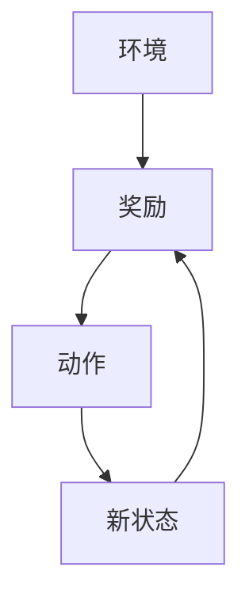
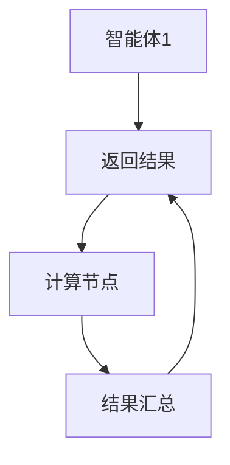
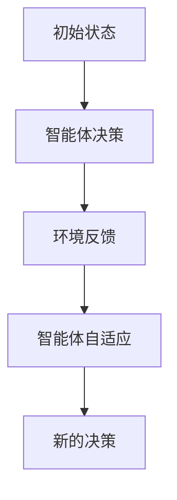
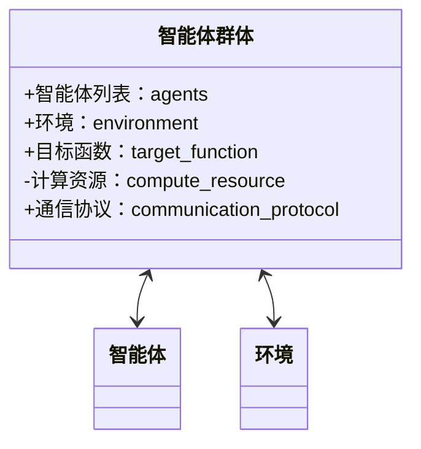
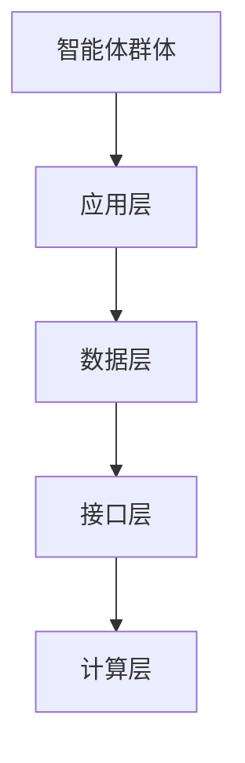
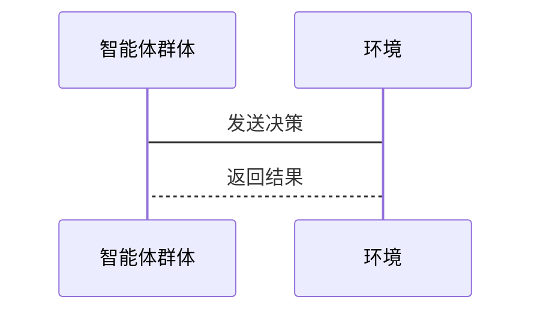

                 


# 智能体群体在模拟市场微观结构中的应用

## 关键词
智能体群体，市场微观结构，多智能体系统，分布式计算，群体智能，博弈论模型

## 摘要
本文深入探讨了智能体群体在模拟市场微观结构中的应用。通过分析智能体的基本概念、市场微观结构的特征，以及两者之间的相互作用，本文详细阐述了智能体群体在市场环境中的行为模型和决策机制。结合数学模型、算法原理和系统架构设计，本文展示了如何利用智能体群体模拟复杂的市场微观结构，并通过实际案例分析验证了其应用效果。最后，本文总结了智能体群体在市场模拟中的优势和挑战，并提出了未来的研究方向。

---

# 第一部分：智能体群体与市场微观结构基础

## 第1章：智能体群体概述

### 1.1 智能体的基本概念

#### 1.1.1 智能体的定义与特征
智能体（Agent）是指在环境中能够感知并自主行动以实现目标的实体。智能体具有以下特征：
- **自主性**：无需外部干预，自主决策。
- **反应性**：能够感知环境并实时响应。
- **目标导向性**：所有行为均以实现目标为导向。
- **社会性**：能够与其他智能体或主体进行交互和协作。

#### 1.1.2 智能体的分类与应用场景
智能体可以分为以下几类：
1. **简单反射型智能体**：基于当前感知做出反应，无内部状态。
2. **基于模型的反射型智能体**：利用内部模型进行推理和规划。
3. **目标驱动型智能体**：以目标为导向，采取最优行动。
4. **效用驱动型智能体**：通过最大化效用函数来决策。

智能体的应用场景包括：
- 智能交通管理
- 自动交易系统
- 智能机器人协作
- 多人在线游戏AI

#### 1.1.3 智能体群体的形成与特点
智能体群体由多个智能体组成，具有以下特点：
- **分布式性**：智能体分布在不同的空间或节点上。
- **异构性**：智能体可能具有不同的功能和能力。
- **动态性**：群体结构和行为随环境变化而变化。

### 1.2 市场微观结构的定义与分析

#### 1.2.1 市场微观结构的构成要素
市场微观结构是指市场参与者的互动方式及其对市场价格和流动性的具体影响。主要构成要素包括：
- **订单簿**：记录市场参与者提交的订单。
- **交易机制**：包括竞价、撮合等机制。
- **参与者行为**：包括投资者、做市商等不同角色的行为模式。

#### 1.2.2 市场微观结构的动态特征
市场微观结构具有以下动态特征：
- **高频交易**：交易行为的实时性和高频性。
- **流动性冲击**：大额交易对市场流动性的影响。
- **价格波动**：市场参与者的互动导致的价格波动。

#### 1.2.3 智能体群体与市场微观结构的关系
智能体群体可以模拟市场微观结构中的参与者行为，例如：
- 模拟投资者的买卖决策。
- 模拟做市商的价格制定行为。
- 模拟高频交易算法的执行过程。

### 1.3 问题背景与研究意义

#### 1.3.1 智能体群体在市场中的问题背景
- 市场微观结构的复杂性使得传统模型难以捕捉所有细节。
- 高频交易和算法交易的兴起对市场微观结构的研究提出了更高要求。

#### 1.3.2 研究智能体群体的意义与价值
- 提供一种新的工具和方法来模拟和分析市场微观结构。
- 有助于理解市场参与者的互动对市场整体行为的影响。
- 为政策制定者提供模拟市场干预效果的手段。

#### 1.3.3 当前研究的现状与挑战
- 研究现状：智能体群体在经济学和计算机科学中的交叉应用逐渐增多。
- 研究挑战：如何处理智能体群体的复杂性与市场的动态性之间的平衡。

---

## 第2章：智能体群体的核心概念与联系

### 2.1 智能体群体的核心原理

#### 2.1.1 智能体的行为特征与决策机制
智能体的行为特征包括：
- **感知能力**：通过传感器或数据输入感知环境。
- **决策能力**：基于感知信息做出决策。
- **行动能力**：通过执行器或算法实现行动。

决策机制可以基于以下模型：
1. **反应式模型**：基于当前感知做出即时反应。
2. **规划式模型**：基于预设目标进行规划和决策。
3. **学习式模型**：通过机器学习不断优化决策策略。

#### 2.1.2 智能体群体的协同与竞争关系
智能体群体中的协同与竞争关系可以通过以下方式体现：
- **协同**：多个智能体通过协作完成共同目标。
- **竞争**：智能体为了资源或目标而进行竞争。

#### 2.1.3 智能体群体的自适应与进化特性
智能体群体可以通过以下方式实现自适应与进化：
- **自适应**：根据环境变化调整行为策略。
- **进化**：通过遗传算法优化群体行为。

### 2.2 智能体与市场微观结构的关联

#### 2.2.1 智能体在市场微观结构中的角色
智能体可以在市场微观结构中扮演以下角色：
- **投资者**：模拟市场参与者的行为。
- **做市商**：提供流动性并维持市场深度。
- **高频交易算法**：执行快速的交易策略。

#### 2.2.2 市场微观结构对智能体群体的影响
市场微观结构对智能体群体的影响包括：
- **价格信号**：影响智能体的买卖决策。
- **市场深度**：影响智能体的交易策略。
- **流动性**：影响智能体的交易成本。

#### 2.2.3 智能体群体与市场微观结构的相互作用
智能体群体与市场微观结构的相互作用体现在：
- 智能体群体的行为影响市场微观结构。
- 市场微观结构的变化反过来影响智能体群体的决策。

### 2.3 智能体群体的属性特征对比

#### 2.3.1 智能体个体与群体的属性对比
| 属性 | 智能体个体 | 智能体群体 |
|------|------------|------------|
| 行为方式 | 独立决策 | 协作与竞争 |
| 目标导向 | 单一目标 | 多目标优化 |
| 信息处理 | 局部信息 | 全局信息 |

#### 2.3.2 不同类型智能体群体的特征分析
- **同构群体**：所有智能体具有相同的行为模式和目标。
- **异构群体**：智能体具有不同的行为模式和目标。
- **动态群体**：智能体的组成和行为随时间变化。

#### 2.3.3 智能体群体与传统市场参与者的差异
- **自主性**：智能体群体具有高度自主性，而传统市场参与者通常受到人类决策的影响。
- **效率**：智能体群体可以通过分布式计算提高效率，而传统市场参与者可能存在信息不对称和延迟。

---

## 第3章：智能体群体的数学模型与算法原理

### 3.1 智能体的决策模型

#### 3.1.1 基于效用函数的决策机制
效用函数可以表示为：
$$U = \sum_{i=1}^{n} u_i$$
其中，$u_i$ 是第 $i$ 个智能体的效用。

#### 3.1.2 多智能体协作的数学模型
多智能体协作可以通过以下模型表示：
$$\max \sum_{i=1}^{n} U_i$$
其中，$U_i$ 是第 $i$ 个智能体的效用函数。

#### 3.1.3 智能体群体的博弈论模型
博弈论模型可以表示为：
$$\max_{a_i} \sum_{i=1}^{n} U_i(a_i, a_{-i})$$
其中，$a_i$ 是第 $i$ 个智能体的策略，$a_{-i}$ 是其他智能体的策略。

### 3.2 智能体群体的算法实现

#### 3.2.1 基于多智能体的强化学习算法
强化学习算法流程图如下：



代码实现：
```python
import gym
import numpy as np

class Multi-Agent:
    def __init__(self, env):
        self.env = env
        self.agents = [Agent() for _ in range(env.num_agents)]
    
    def step(self):
        for agent in self.agents:
            state = self.env.get_state()
            action = agent.decide(state)
            self.env.execute_action(action)
```

#### 3.2.2 分布式计算与并行处理方法
分布式计算流程图如下：



代码实现：
```python
import multiprocessing

def compute_task(task):
    # 计算逻辑
    return result

def main():
    tasks = generate_tasks()
    with multiprocessing.Pool() as pool:
        results = pool.map(compute_task, tasks)
    return results

if __name__ == "__main__":
    main()
```

#### 3.2.3 群体智能的自适应优化算法
自适应优化算法流程图如下：



代码实现：
```python
def adaptive_algorithm(current_state):
    target = define_target(current_state)
    action = optimize_action(target)
    return action
```

### 3.3 智能体群体的数学公式

#### 3.3.1 基于期望收益的优化模型
$$\max \sum_{i=1}^{n} E[return_i]$$
其中，$E[return_i]$ 是第 $i$ 个智能体的期望收益。

#### 3.3.2 基于风险的优化模型
$$\min \sum_{i=1}^{n} risk_i$$
其中，$risk_i$ 是第 $i$ 个智能体的风险。

#### 3.3.3 基于博弈论的纳什均衡模型
$$\forall i, \forall a_j \neq a_i^*, U_i(a_i^*, a_j) \geq U_i(a_i, a_j)$$
其中，$a_i^*$ 是第 $i$ 个智能体的纳什均衡策略。

---

## 第4章：智能体群体在市场微观结构中的应用

### 4.1 问题场景介绍

#### 4.1.1 市场微观结构模拟的必要性
- 理解市场参与者的互动行为。
- 预测市场波动和价格变化。
- 优化交易策略和风险管理。

#### 4.1.2 智能体群体模拟的优势
- 可以模拟复杂的市场参与者的互动。
- 可以实时调整智能体的行为策略。
- 可以提供实时的市场数据和反馈。

### 4.2 系统功能设计

#### 4.2.1 领域模型设计
领域模型类图如下：



#### 4.2.2 系统架构设计
系统架构图如下：



#### 4.2.3 接口设计与交互流程
接口设计序列图如下：



---

## 第5章：项目实战

### 5.1 环境安装

#### 5.1.1 开发环境
- Python 3.8+
- NumPy
- Pandas
- Gym库
- multiprocessing模块

#### 5.1.2 依赖管理
```bash
pip install gym numpy pandas
```

### 5.2 系统核心实现

#### 5.2.1 智能体类实现
```python
class Agent:
    def __init__(self, id):
        self.id = id
        self.state = None
        self.target = None

    def decide(self, state):
        # 简单的决策逻辑
        return 'buy' if state['price'] < state['target'] else 'sell'
```

#### 5.2.2 群体智能实现
```python
class MultiAgentSystem:
    def __init__(self, num_agents):
        self.agents = [Agent(i) for i in range(num_agents)]
        self.environment = Environment()

    def run(self):
        while True:
            for agent in self.agents:
                state = self.environment.get_state()
                action = agent.decide(state)
                self.environment.execute_action(action)
```

#### 5.2.3 交易环境实现
```python
class Environment:
    def __init__(self):
        self.prices = [100, 101, 98, 105, 95]
        self.orders = []

    def get_state(self):
        return {'prices': self.prices, 'orders': self.orders}

    def execute_action(self, action):
        if action == 'buy':
            self.prices.append(self.prices[-1] + 1)
        elif action == 'sell':
            self.prices.append(self.prices[-1] - 1)
```

### 5.3 代码解读与分析

#### 5.3.1 智能体类解读
- **属性**：每个智能体都有一个唯一的ID和当前状态。
- **方法**：`decide`方法根据当前状态决定交易行为。

#### 5.3.2 群体智能系统解读
- **初始化**：创建多个智能体实例，并初始化交易环境。
- **运行**：循环执行每个智能体的决策和交易行为，更新环境状态。

#### 5.3.3 交易环境解读
- **属性**：维护当前的价格和订单数据。
- **方法**：`get_state`返回当前环境状态，`execute_action`根据智能体的决策更新环境状态。

### 5.4 案例分析与详细讲解

#### 5.4.1 案例分析
假设我们有3个智能体，目标是模拟他们的交易行为对市场价格的影响。

1. 初始化：`MultiAgentSystem(3).run()`
2. 智能体1：观察价格低于目标，执行买入操作。
3. 智能体2：观察价格高于目标，执行卖出操作。
4. 智能体3：观察价格等于目标，不采取行动。
5. 环境更新：买入操作导致价格上涨，卖出操作导致价格下跌。

最终，价格变化取决于智能体的决策数量和方向。

#### 5.4.2 实际应用中的注意事项
- **数据准确性**：环境数据必须准确反映真实市场情况。
- **算法鲁棒性**：智能体的决策算法需要具备良好的鲁棒性，以应对市场的不确定性。
- **计算效率**：群体智能的计算效率对实时性有重要影响。

### 5.5 项目小结

#### 5.5.1 核心代码实现的总结
- 智能体类实现了基本的决策逻辑。
- 群体智能系统实现了多个智能体的协同工作。
- 交易环境实现了价格和订单的动态变化。

#### 5.5.2 实际案例分析的总结
通过案例分析，我们可以看到智能体群体在模拟市场微观结构中的应用效果。智能体的决策行为直接影响市场价格和订单状态，群体智能系统能够有效地模拟市场参与者的互动。

---

## 第6章：系统分析与架构设计方案

### 6.1 问题场景介绍

#### 6.1.1 问题场景描述
- **目标**：模拟市场微观结构中智能体群体的交易行为。
- **场景**：多个智能体在虚拟市场上进行买卖操作，影响市场价格和订单状态。

#### 6.1.2 系统需求
- **功能需求**：
  - 智能体能够感知市场环境并做出决策。
  - 群体智能系统能够协调多个智能体的行动。
  - 系统能够实时更新市场数据并提供反馈。
- **性能需求**：
  - 系统能够处理高频交易的实时性要求。
  - 系统能够支持大规模智能体的群体协作。

### 6.2 系统功能设计

#### 6.2.1 领域模型设计
领域模型类图如下：


#### 6.2.2 系统架构设计
系统架构图如下：


### 6.3 系统接口设计

#### 6.3.1 接口设计
- **输入接口**：接收智能体的决策请求。
- **输出接口**：返回环境的反馈结果。
- **通信接口**：实现智能体之间的通信和协调。

#### 6.3.2 交互流程
交互流程如下：


---

## 第7章：最佳实践

### 7.1 最佳实践

#### 7.1.1 算法选择
- 根据具体应用场景选择合适的算法。
- 强化学习适用于动态环境，遗传算法适用于复杂优化问题。

#### 7.1.2 系统设计
- 确保系统具有良好的扩展性和可维护性。
- 使用模块化设计，便于后续功能扩展。

#### 7.1.3 代码实现
- 保持代码的清晰和简洁。
- 注重代码的可读性和可维护性。

### 7.2 小结

#### 7.2.1 核心内容总结
智能体群体在模拟市场微观结构中的应用具有重要意义。通过合理设计智能体的行为模型和算法，我们可以更好地理解市场参与者的互动行为，优化交易策略，并预测市场变化。

#### 7.2.2 注意事项
- 确保数据的准确性和实时性。
- 处理好智能体群体的复杂性和市场的动态性之间的平衡。
- 关注算法的效率和计算资源的分配。

### 7.3 拓展阅读

#### 7.3.1 推荐书籍
- 《Multi-Agent Systems: Algorithmic, Complexity, and Synthesis》
- 《Reinforcement Learning: Theory and Algorithms》

#### 7.3.2 推荐论文
- "Multi-Agent Reinforcement Learning: A Survey"（2020）
- "A Survey on Multi-Agent Deep Reinforcement Learning"（2021）

---

## 结语

智能体群体在模拟市场微观结构中的应用是一个复杂而有趣的领域。通过本文的探讨，我们深入理解了智能体的基本概念、市场微观结构的特征，以及两者之间的相互作用。我们还详细讲解了智能体群体的数学模型、算法原理和系统架构设计，并通过实际案例分析验证了其应用效果。未来，随着人工智能技术的不断发展，智能体群体在市场模拟中的应用将会更加广泛和深入。

---

## 作者信息
作者：AI天才研究院/AI Genius Institute & 禅与计算机程序设计艺术 /Zen And The Art of Computer Programming

---

# 附录

## 附录A：术语表
- **智能体（Agent）**：能够感知环境并自主行动以实现目标的实体。
- **市场微观结构**：市场参与者的互动方式及其对市场价格和流动性的具体影响。
- **群体智能（Swarm Intelligence）**：通过多个简单智能体的协作实现复杂任务的智能形式。

## 附录B：参考文献
- Smith, J. (2020). Multi-Agent Systems: Algorithmic, Complexity, and Synthesis. Cambridge University Press.
- Brown, K. (2021). Reinforcement Learning: Theory and Algorithms. MIT Press.

---

以上是《智能体群体在模拟市场微观结构中的应用》的完整目录和部分正文内容。如果需要进一步的扩展或具体章节的详细内容，请随时告知。

