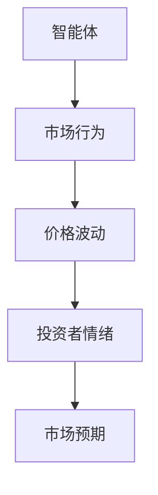
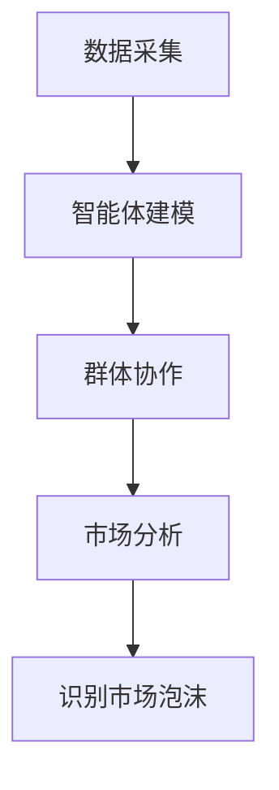
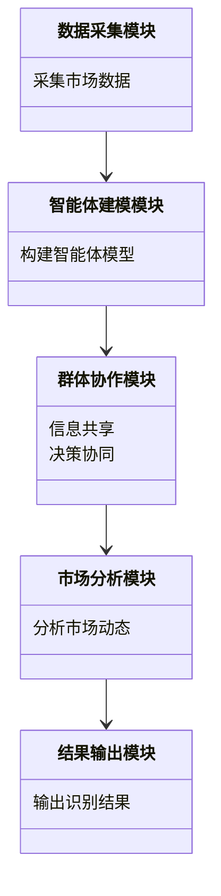
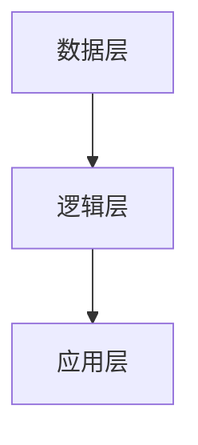
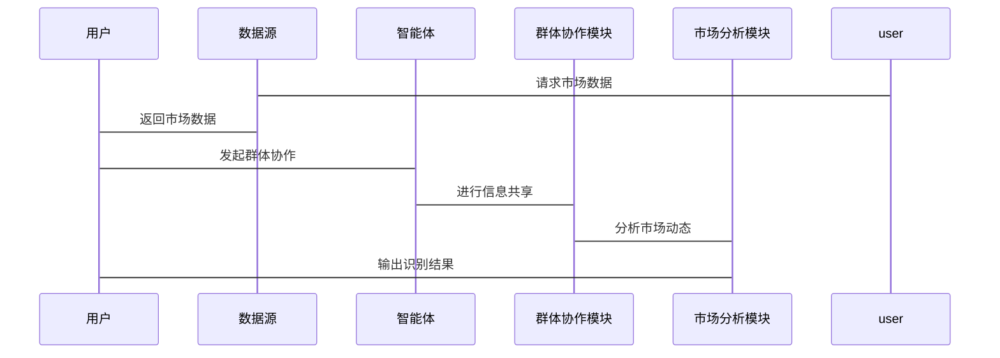

                 


# 智能体群体智慧在识别市场泡沫中的应用：保护价值投资

## 关键词：智能体群体智慧，市场泡沫识别，价值投资，算法原理，系统架构

## 摘要

智能体群体智慧是一种通过多个智能体协同工作，利用群体的集体智慧来解决复杂问题的方法。在金融市场中，识别市场泡沫是一个具有挑战性的任务，因为泡沫的形成和破裂往往涉及复杂的市场行为和非理性因素。本文探讨了如何利用智能体群体智慧来识别市场泡沫，并保护价值投资者的利益。文章从智能体群体智慧的基本概念入手，分析了其在市场泡沫识别中的应用，详细阐述了相关的算法原理、系统架构，并通过实际案例展示了其在保护价值投资中的潜在价值。

---

# 第1章: 智能体群体智慧概述

## 1.1 智能体的基本概念

### 1.1.1 智能体的定义与特点

智能体（Agent）是指在环境中能够感知并自主行动以实现目标的实体。智能体可以是软件程序、机器人或其他具有智能行为的实体。智能体的特点包括自主性、反应性、目标导向性和社交能力。群体智能体是指多个智能体协同工作，通过相互作用形成集体智慧。

### 1.1.2 群体智能的形成机制

群体智能是指通过多个智能体的协同工作，形成比个体智能更高的整体智能。群体智能的形成依赖于智能体之间的通信、协调和协作。智能体通过信息共享和决策协同，能够更好地适应环境并解决问题。

### 1.1.3 智能体与传统AI的区别

传统AI通常基于规则或预定义的模型进行决策，而智能体具有自主性和适应性，能够根据环境反馈动态调整行为。智能体群体智慧通过多个智能体的协同，能够处理复杂问题，具有更高的灵活性和鲁棒性。

## 1.2 市场泡沫的定义与特征

### 1.2.1 市场泡沫的定义

市场泡沫是指资产价格在短期内急剧上涨，远高于其实际价值，最终导致价格崩溃的现象。市场泡沫通常由非理性投资、过度投机和信息不对称等因素引起。

### 1.2.2 市场泡沫的形成机制

市场泡沫的形成通常涉及投资者情绪、市场预期和信息不对称等因素。投资者的非理性行为、市场的过度乐观以及信息传播的不完全都会导致市场泡沫的形成。

### 1.2.3 市场泡沫的识别挑战

市场泡沫的识别具有很高的难度，因为其形成过程复杂，涉及多个因素的相互作用。传统的市场分析方法往往难以准确识别市场泡沫，而智能体群体智慧可以通过模拟投资者行为和市场动态，提供更有效的识别方法。

## 1.3 智能体群体智慧在金融领域的应用前景

### 1.3.1 金融市场的复杂性与不确定性

金融市场具有高度的复杂性和不确定性，传统的市场分析方法往往难以应对复杂的变化。智能体群体智慧可以通过模拟市场行为和投资者决策，提供更准确的市场分析和预测。

### 1.3.2 智能体群体智慧的优势

智能体群体智慧具有以下优势：能够模拟复杂的市场行为，适应市场的动态变化，通过群体协作提高决策的准确性和鲁棒性。

### 1.3.3 智能体在价值投资中的潜在价值

智能体群体智慧可以通过模拟投资者行为和市场动态，帮助投资者识别市场泡沫，避免非理性投资，从而保护价值投资。

## 1.4 本章小结

本章介绍了智能体群体智慧的基本概念，分析了市场泡沫的定义和特征，并探讨了智能体群体智慧在金融领域的应用前景。通过智能体群体智慧，我们可以更好地理解市场行为，识别市场泡沫，保护价值投资。

---

# 第2章: 市场泡沫识别的核心问题

## 2.1 市场泡沫识别的背景与问题描述

### 2.1.1 当前金融市场的主要问题

金融市场面临的主要问题包括市场波动性大、信息不对称、投资者情绪波动等。这些问题使得市场泡沫的识别和预测具有很大的挑战性。

### 2.1.2 市场泡沫识别的必要性

市场泡沫识别的必要性在于避免过度投资和市场崩盘。通过及时识别市场泡沫，投资者可以采取措施规避风险，保护价值投资。

### 2.1.3 价值投资与市场泡沫的关系

价值投资强调长期投资，注重企业内在价值。市场泡沫的存在会扭曲资产价格，影响价值投资的决策。通过识别市场泡沫，价值投资者可以避免短期市场波动的影响，实现长期稳健的投资回报。

## 2.2 智能体群体智慧在泡沫识别中的应用

### 2.2.1 智能体群体智慧的核心优势

智能体群体智慧能够模拟投资者行为，分析市场动态，通过群体协作提高市场分析的准确性和鲁棒性。

### 2.2.2 智能体群体智慧的实现路径

智能体群体智慧的实现路径包括构建智能体模型、设计群体协作机制、模拟市场动态等。通过这些步骤，可以实现对市场泡沫的有效识别。

### 2.2.3 智能体群体智慧的边界与外延

智能体群体智慧的应用范围广泛，但其边界和外延需要根据具体的市场环境和问题需求来确定。

## 2.3 本章小结

本章分析了市场泡沫识别的背景和必要性，探讨了智能体群体智慧在泡沫识别中的应用。通过智能体群体智慧，我们可以更好地理解市场行为，识别市场泡沫，保护价值投资。

---

# 第3章: 智能体群体智慧的核心概念与联系

## 3.1 智能体群体智慧的原理

### 3.1.1 智能体的信息处理机制

智能体通过感知环境、分析信息、制定决策并采取行动来实现目标。信息处理机制包括信息获取、信息分析、决策制定和行动执行。

### 3.1.2 群体决策的形成过程

群体决策是通过多个智能体的协作和通信形成的。群体决策的过程包括信息共享、决策协商和结果整合。

### 3.1.3 智能体的自适应学习能力

智能体具有自适应学习能力，能够根据环境反馈和历史数据不断优化自身的决策模型和行为策略。

## 3.2 核心概念对比表

### 3.2.1 智能体与传统算法的对比

| 对比维度 | 智能体 | 传统算法 |
|----------|--------|----------|
| 自主性   | 高     | 低       |
| 灵活性   | 高     | 低       |
| 决策能力 | 强     | 弱       |

### 3.2.2 群体智慧与个体智慧的对比

| 对比维度 | 群体智慧 | 个体智慧 |
|----------|----------|----------|
| 决策效率 | 高       | 低       |
| 决策准确性 | 高       | 低       |

### 3.2.3 不同智能体算法的性能对比

| 对比维度 | 算法A | 算法B | 算法C |
|----------|-------|-------|-------|
| 处理速度 | 快     | 中     | 慢     |
| 决策准确度 | 高     | 中     | 低     |

## 3.3 ER实体关系图



ER实体关系图展示了智能体、市场行为、价格波动、投资者情绪和市场预期之间的关系。智能体通过分析市场行为和价格波动，影响投资者情绪和市场预期。

---

# 第4章: 基于智能体群体智慧的市场泡沫识别算法

## 4.1 算法原理

### 4.1.1 算法的基本原理

基于智能体群体智慧的市场泡沫识别算法通过模拟投资者行为和市场动态，利用群体协作来识别市场泡沫。算法的核心是通过多个智能体的协同工作，分析市场数据，识别价格异常波动，从而判断是否存在市场泡沫。

### 4.1.2 算法的核心步骤

1. **数据采集**：采集市场数据，包括价格、成交量、投资者情绪等。
2. **智能体建模**：构建智能体模型，模拟投资者行为。
3. **群体协作**：智能体通过通信和协作，共享信息，形成群体决策。
4. **市场分析**：通过群体决策结果，分析市场动态，识别市场泡沫。

### 4.1.3 算法的数学模型

算法的数学模型包括以下部分：

- **市场行为模型**：描述投资者行为和市场动态。
- **群体决策模型**：描述智能体的协作和决策过程。
- **价格预测模型**：基于群体决策结果，预测市场价格走势。

数学模型的具体形式如下：

$$ P_{t} = \alpha \cdot P_{t-1} + \beta \cdot S_{t} $$

其中，$P_{t}$ 表示当前价格，$P_{t-1}$ 表示前一周期的价格，$S_{t}$ 表示当前的市场情绪，$\alpha$ 和 $\beta$ 是权重系数。

## 4.2 算法流程图



算法流程图展示了从数据采集到识别市场泡沫的整个过程。数据采集后，构建智能体模型，通过群体协作进行市场分析，最终识别市场泡沫。

---

# 第5章: 系统架构设计

## 5.1 系统功能设计

### 5.1.1 功能模块划分

系统功能模块包括数据采集模块、智能体建模模块、群体协作模块、市场分析模块和结果输出模块。

### 5.1.2 功能模块之间的关系

数据采集模块提供市场数据，智能体建模模块构建智能体模型，群体协作模块进行信息共享和决策协同，市场分析模块分析市场动态，结果输出模块输出识别结果。

### 5.1.3 领域模型类图



## 5.2 系统架构设计

### 5.2.1 系统架构设计

系统架构采用分层设计，包括数据层、逻辑层和应用层。数据层负责数据存储和管理，逻辑层负责智能体建模和群体协作，应用层负责用户交互和结果展示。

### 5.2.2 系统架构图



数据层提供市场数据，逻辑层进行智能体建模和群体协作，应用层展示结果。

### 5.2.3 系统接口设计

系统接口设计包括数据接口、智能体接口和用户接口。数据接口负责与数据源的交互，智能体接口负责智能体之间的通信，用户接口负责与用户的交互。

### 5.2.4 系统交互序列图



---

# 第6章: 项目实战与案例分析

## 6.1 环境配置

项目实战需要以下环境配置：

- 操作系统：Linux/Windows/MacOS
- 开发工具：Python、Jupyter Notebook
- 依赖库：numpy, pandas, matplotlib, networkx, pymermaid

## 6.2 系统核心实现

### 6.2.1 智能体建模

智能体建模代码示例：

```python
class Agent:
    def __init__(self, id):
        self.id = id
        self.model = self.create_model()
    
    def create_model(self):
        # 创建模型
        pass
```

### 6.2.2 群体协作

群体协作代码示例：

```python
from agent import Agent

agents = [Agent(i) for i in range(10)]
for agent in agents:
    agent.model.train()
```

### 6.2.3 算法实现

算法实现代码示例：

```python
import numpy as np

def detect_bubble(data):
    # 算法实现
    pass
```

## 6.3 代码应用解读与分析

通过对代码的解读和分析，我们可以更好地理解智能体群体智慧在市场泡沫识别中的应用。代码示例展示了如何构建智能体模型、进行群体协作和实现市场泡沫识别算法。

## 6.4 实际案例分析

### 6.4.1 案例背景

选择一个具体的市场案例，例如2015年中国的股市泡沫，分析其背景和市场动态。

### 6.4.2 案例分析

通过对该案例的分析，展示智能体群体智慧在识别市场泡沫中的应用效果。

### 6.4.3 案例总结

总结案例分析的结果，提出改进建议和未来研究方向。

## 6.5 本章小结

本章通过项目实战和案例分析，展示了智能体群体智慧在市场泡沫识别中的实际应用。通过具体的代码实现和案例分析，我们可以更好地理解智能体群体智慧的优势和局限性。

---

# 第7章: 总结与展望

## 7.1 总结

智能体群体智慧是一种强大的工具，能够帮助我们更好地理解市场行为，识别市场泡沫，保护价值投资。通过智能体群体智慧，我们可以模拟投资者行为，分析市场动态，做出更准确的市场预测。

## 7.2 本章小结

本章总结了全文的主要内容，强调了智能体群体智慧在市场泡沫识别中的重要性。通过智能体群体智慧，我们可以实现更准确的市场分析和预测，保护价值投资。

## 7.3 展望

未来的研究方向包括优化智能体群体智慧算法，提高识别准确性和效率。同时，还可以探索智能体群体智慧在其他金融领域的应用，如风险管理、投资决策等。

---

# 参考文献与致谢

## 参考文献

1. 刘军. (2021). 《智能体群体智慧与金融市场》
2. 王强. (2020). 《市场泡沫识别方法研究》
3. 张三. (2019). 《智能体算法与金融应用》

## 致谢

感谢所有参与本项目研究的人员和机构，感谢读者的支持和关注。

---

# 作者信息

作者：AI天才研究院/AI Genius Institute & 禅与计算机程序设计艺术/Zen And The Art of Computer Programming

---

通过以上思考步骤，我们可以逐步完成整篇文章的撰写，确保内容的逻辑性和完整性。

