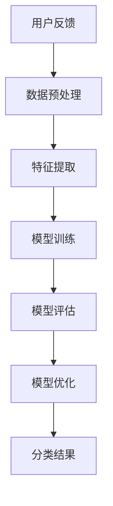
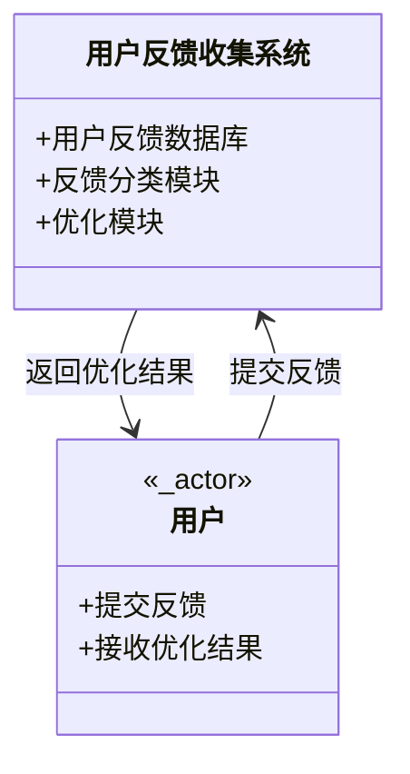
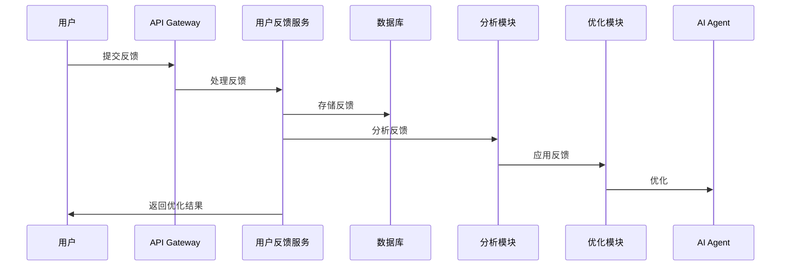

                 


# 用户反馈收集：迭代改进AI Agent

> 关键词：用户反馈，AI Agent，迭代改进，机器学习，数据处理

> 摘要：本文详细探讨了用户反馈在AI Agent迭代改进中的关键作用，从反馈收集的背景、核心概念到具体的算法原理和系统设计，再到项目实战和最佳实践，全面解析如何通过用户反馈优化AI Agent的性能和用户体验。

---

## 第一部分: 用户反馈收集与AI Agent迭代改进基础

### 第1章: 用户反馈收集的背景与重要性

#### 1.1 用户反馈的定义与分类
用户反馈是用户在与AI Agent交互过程中提供的意见、建议或评价。这些反馈可以是显式的（如评分、文本评论）或隐式的（如使用行为数据）。根据内容和形式，用户反馈主要分为以下几类：

- **正面反馈**：用户对AI Agent的表现感到满意。
- **负面反馈**：用户对AI Agent的表现感到不满。
- **中性反馈**：用户对AI Agent的表现没有明显的情绪倾向。

**用户反馈的重要性**：
1. **改进AI Agent性能**：通过分析反馈，可以发现AI Agent的不足之处并进行优化。
2. **提升用户体验**：用户反馈是了解用户需求和期望的重要来源。
3. **增强用户信任**：及时处理用户反馈可以提升用户对AI Agent的信任感。

#### 1.2 AI Agent的基本概念
AI Agent（人工智能代理）是一种能够感知环境并采取行动以实现目标的智能实体。AI Agent的核心功能包括：

- **感知环境**：通过传感器或API获取环境信息。
- **决策与推理**：基于获取的信息进行推理和决策。
- **执行动作**：根据决策结果执行相应的动作。

AI Agent与传统软件的区别主要体现在其自主性和适应性。AI Agent能够自主学习和优化，而传统软件通常依赖于预定义的规则。

---

### 第2章: 用户反馈在AI Agent改进中的作用

#### 2.1 用户反馈与AI Agent的关系
用户反馈是AI Agent改进的驱动力。通过分析用户反馈，可以发现AI Agent在功能、性能或用户体验上的不足之处，并针对性地进行优化。

- **驱动优化**：用户反馈为AI Agent的改进提供了方向。
- **闭环流程**：用户反馈的收集、分析和应用形成了一个完整的优化闭环。
- **提升性能**：用户反馈可以帮助AI Agent更好地适应用户需求，从而提升性能。

#### 2.2 用户反馈收集的常见挑战
在实际应用中，用户反馈的收集面临以下挑战：

- **数据质量**：用户反馈可能存在噪声或不完整，影响分析结果。
- **数据隐私**：用户反馈可能包含敏感信息，需要确保数据的安全性。
- **用户参与度**：用户可能不愿意提供反馈，导致反馈量不足。

---

## 第二部分: 用户反馈收集的核心概念与关联

### 第3章: 用户反馈的分类与处理流程

#### 3.1 用户反馈的分类
用户反馈可以根据不同的维度进行分类，常见的分类方式包括：

- **按内容**：分为功能反馈、性能反馈和用户体验反馈。
- **按形式**：分为文本反馈、评分反馈和行为反馈。
- **按时间**：分为实时反馈和延时反馈。

**用户反馈的处理流程**：
1. **收集阶段**：通过各种渠道（如API、网页表单、移动应用）收集用户反馈。
2. **分析阶段**：对收集到的反馈进行清洗、分类和分析，提取有价值的信息。
3. **应用阶段**：根据分析结果优化AI Agent的相关模块。

### 第4章: 用户反馈与AI Agent的关联

#### 4.1 用户反馈在AI Agent训练中的作用
用户反馈在AI Agent的训练过程中起到关键作用。通过分析用户反馈，可以优化AI Agent的模型参数，提升其预测能力。

- **数据增强**：通过用户反馈增加训练数据的多样性和代表性。
- **模型调优**：基于用户反馈调整模型参数，提升模型性能。
- **知识库更新**：用户反馈可以用于更新AI Agent的知识库，使其更加准确和全面。

#### 4.2 用户反馈在AI Agent推理中的应用
在推理阶段，用户反馈可以实时指导AI Agent的行为，帮助其更好地适应动态变化的环境。

- **实时反馈优化**：AI Agent根据用户反馈实时调整其推理策略。
- **动态调整**：用户反馈可以触发AI Agent对当前状态的调整，以更好地满足用户需求。

---

## 第三部分: 用户反馈收集的算法原理

### 第5章: 用户反馈分类算法

#### 5.1 分类算法原理
用户反馈分类的目标是将用户反馈分为不同的类别（如正面、负面、中性）。常用的分类算法包括：

- **机器学习算法**：如支持向量机（SVM）、随机森林（Random Forest）。
- **深度学习算法**：如卷积神经网络（CNN）、循环神经网络（RNN）。

**算法流程**：
1. **数据预处理**：清洗数据，提取特征。
2. **模型训练**：使用训练数据训练分类模型。
3. **模型评估**：通过验证数据评估模型性能。
4. **模型优化**：调整模型参数，提升性能。

**Mermaid流程图**：


#### 5.2 分类算法实现
以下是使用Python实现的文本分类代码示例：

```python
from sklearn.feature_extraction.text import TfidfVectorizer
from sklearn.svm import SVC
from sklearn.metrics import accuracy_score

# 数据预处理
X = [...]  # 用户反馈文本
y = [...]  # 标签（正面、负面、中性）

# 特征提取
vectorizer = TfidfVectorizer()
X_features = vectorizer.fit_transform(X)

# 模型训练
model = SVC()
model.fit(X_features, y)

# 模型评估
y_pred = model.predict(X_features)
print("Accuracy:", accuracy_score(y, y_pred))
```

---

### 第6章: 用户反馈优化算法

#### 6.1 优化算法原理
基于用户反馈的优化算法主要用于改进AI Agent的性能。常见的优化算法包括：

- **强化学习**：通过奖励机制优化AI Agent的行为。
- **梯度下降**：通过优化模型参数提升性能。

**算法流程**：
1. **反馈收集**：收集用户对AI Agent行为的反馈。
2. **奖励计算**：根据反馈计算奖励值。
3. **模型优化**：通过优化算法调整模型参数。
4. **性能提升**：持续优化模型，提升AI Agent的性能。

**数学模型**：
优化目标函数可以表示为：
$$
\theta_{t+1} = \theta_t + \alpha \cdot \nabla J(\theta_t)
$$
其中，$\theta$ 表示模型参数，$\alpha$ 表示学习率，$J$ 表示目标函数。

#### 6.2 优化算法实现
以下是使用Python实现的强化学习优化代码示例：

```python
import numpy as np

# 初始化参数
theta = np.random.randn(2, 1)
alpha = 0.1

# 反馈收集
feedback = [...]  # 用户反馈

# 奖励计算
reward = 1 if feedback == 'positive' else -1

# 模型优化
theta = theta + alpha * reward * theta
```

---

## 第四部分: 用户反馈收集的系统设计

### 第7章: 系统分析与架构设计

#### 7.1 系统功能设计
用户反馈收集与处理系统的核心功能包括：

- **反馈收集**：通过多种渠道收集用户反馈。
- **反馈分析**：对反馈进行分类和分析，提取有价值的信息。
- **反馈应用**：根据分析结果优化AI Agent的相关模块。

**领域模型**：


#### 7.2 系统架构设计
用户反馈收集与处理系统的架构设计包括：

- **数据层**：存储用户反馈数据。
- **业务逻辑层**：处理用户反馈，进行分类和分析。
- **接口层**：提供API供其他系统调用。

**架构图**：
```mermaid
client --> API Gateway: 发送反馈
API Gateway --> 用户反馈服务: 处理反馈
用户反馈服务 --> 数据库: 存储反馈
用户反馈服务 --> 分析模块: 分析反馈
分析模块 --> 优化模块: 应用反馈
优化模块 --> AI Agent: 优化
```

---

### 第8章: 系统接口设计与交互流程

#### 8.1 系统接口设计
用户反馈收集系统的接口设计包括：

- **提交反馈接口**：用户通过API提交反馈。
- **获取反馈结果接口**：获取反馈分析结果。

**接口描述**：
- **提交反馈接口**：
  ```
  POST /api/feedback
  Content-Type: application/json
  {
    "user_id": "123",
    "feedback": "服务响应速度过慢"
  }
  ```

- **获取反馈结果接口**：
  ```
  GET /api/feedback-result
  ```

#### 8.2 系统交互流程
用户反馈收集与处理系统的交互流程如下：

1. 用户提交反馈。
2. 系统接收反馈并存储。
3. 系统分析反馈并分类。
4. 系统根据反馈优化AI Agent。
5. 系统返回优化结果。

**交互流程图**：


---

## 第五部分: 项目实战与最佳实践

### 第9章: 项目实战

#### 9.1 环境安装
项目实战需要以下环境：

- **Python**：3.6+
- **机器学习库**：Scikit-learn、XGBoost
- **自然语言处理库**：NLTK、spaCy
- **可视化工具**：Matplotlib、Seaborn

#### 9.2 核心代码实现
以下是用户反馈分类和优化的代码示例：

```python
# 用户反馈分类
from sklearn.datasets import make_classification
from sklearn.ensemble import RandomForestClassifier

X, y = make_classification(n_samples=1000, n_features=20, n_classes=3)
model = RandomForestClassifier()
model.fit(X, y)
print("模型训练完成")

# 用户反馈优化
from tensorflow.keras.models import Sequential
from tensorflow.keras.layers import Dense

model = Sequential()
model.add(Dense(64, activation='relu', input_dim=20))
model.add(Dense(1, activation='sigmoid'))
model.compile(optimizer='adam', loss='binary_crossentropy', metrics=['accuracy'])
model.fit(X, y, epochs=10, batch_size=32)
print("模型优化完成")
```

#### 9.3 案例分析
以一个客服AI Agent为例，用户反馈显示用户对响应速度不满意。通过分析反馈，发现AI Agent的响应时间较长。优化措施包括：

- 优化模型推理速度。
- 增加服务器资源。
- 改进用户交互流程。

---

### 第10章: 最佳实践与注意事项

#### 10.1 最佳实践
1. **实时反馈机制**：及时收集用户反馈，避免信息滞后。
2. **数据隐私保护**：确保用户反馈数据的安全性和隐私性。
3. **用户激励机制**：通过奖励等方式提高用户参与度。

#### 10.2 注意事项
1. **数据质量控制**：确保反馈数据的准确性和完整性。
2. **模型持续优化**：定期更新模型，适应用户需求的变化。
3. **用户隐私保护**：严格遵守数据隐私相关法律法规。

---

## 结语

用户反馈是迭代改进AI Agent的重要手段。通过合理收集和分析用户反馈，可以显著提升AI Agent的性能和用户体验。本文从背景、核心概念、算法原理到系统设计和项目实战，全面解析了用户反馈在AI Agent改进中的关键作用。希望本文能为相关领域的从业者提供有价值的参考和指导。

---

作者：AI天才研究院/AI Genius Institute & 禅与计算机程序设计艺术 /Zen And The Art of Computer Programming

