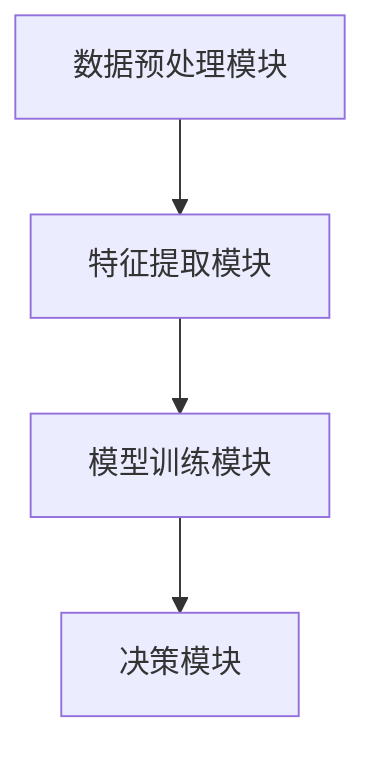
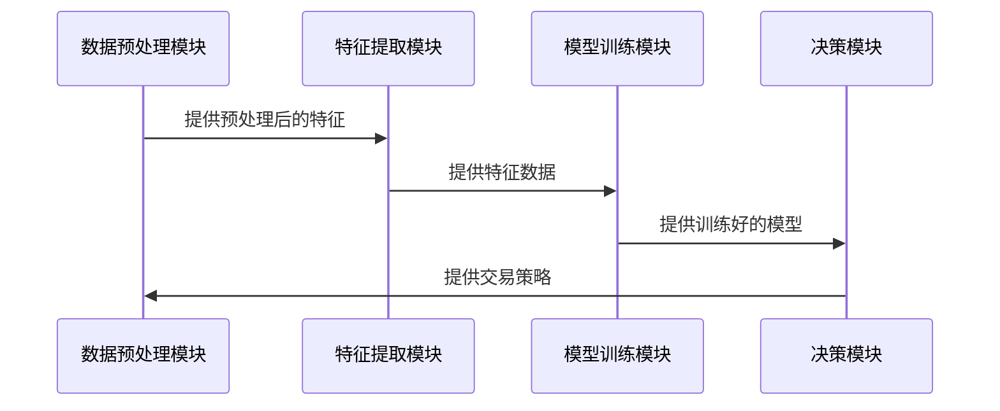

                 


# 《金融时序数据的深度强化学习应用》

---

## 关键词：
- 金融时序数据
- 深度强化学习
- LSTM
- Transformer
- 强化学习策略
- 系统架构设计
- 金融风险管理

---

## 摘要：
本文系统地探讨了金融时序数据的深度强化学习应用，从理论基础到实践应用，详细阐述了深度强化学习在金融时序数据分析中的优势、核心算法、系统架构设计以及实际案例。通过对比分析传统金融模型与深度强化学习模型的差异，本文揭示了深度强化学习在处理金融时序数据中的复杂性和非线性问题的独特优势。同时，本文还结合实际应用场景，详细讲解了LSTM、Transformer等深度学习模型和Q-learning、策略梯度等强化学习算法的实现原理，并通过具体的金融交易案例，展示了深度强化学习在金融投资决策中的实际应用效果。最后，本文总结了深度强化学习在金融时序数据应用中的关键挑战和未来发展方向。

---

# 第一章: 金融时序数据与深度强化学习概述

## 1.1 金融时序数据的定义与特点
### 1.1.1 金融时序数据的定义
金融时序数据是指在金融市场上按时间顺序记录的各类金融资产的价格、交易量等数据。这些数据通常具有高度的复杂性和非线性特征，反映了金融市场中价格波动、交易行为等动态变化。

### 1.1.2 金融时序数据的主要特点
1. **时间依赖性**：价格走势往往受到历史价格和交易量的影响。
2. **非线性特征**：市场价格波动通常遵循非线性规律，难以用简单的线性模型描述。
3. **噪声干扰**：金融市场数据中存在大量噪声，如随机波动和市场参与者的非理性行为。
4. **异质性**：不同金融资产的价格波动模式可能存在显著差异。

### 1.1.3 金融时序数据的应用场景
- 股票价格预测
- 外汇汇率预测
- 债券价格预测
- 金融风险管理
- 自动化交易策略开发

## 1.2 深度学习与强化学习的背景
### 1.2.1 深度学习的定义与特点
深度学习是一种基于人工神经网络的机器学习方法，通过多层非线性变换，能够自动提取数据中的高层次特征。其核心特点包括：
1. **非线性特征提取**：能够处理复杂的非线性关系。
2. **自动特征工程**：通过网络结构自动学习特征，减少了人工特征工程的复杂性。
3. **强大的表示能力**：在金融时序数据中，深度学习能够捕捉到传统统计方法难以发现的模式。

### 1.2.2 强化学习的定义与特点
强化学习是一种基于试错机制的机器学习方法，通过智能体与环境的交互，逐步优化决策策略。其核心特点包括：
1. **环境交互**：智能体通过与环境交互获得奖励或惩罚。
2. **策略优化**：通过最大化累积奖励，优化决策策略。
3. **长期规划**：强化学习注重长期收益，而非短期利益。

### 1.2.3 深度学习与强化学习的结合
深度强化学习结合了深度学习强大的特征提取能力和强化学习的决策优化能力，能够在复杂金融环境中实现端到端的决策优化。例如，在金融交易中，深度强化学习可以通过历史价格数据，学习到最优的买卖时机。

## 1.3 金融时序数据与深度强化学习的结合
### 1.3.1 金融时序数据分析的挑战
- 数据的非线性特征难以捕捉。
- 市场噪声干扰导致数据质量不稳定。
- 高维数据带来的计算复杂性。

### 1.3.2 深度强化学习在金融时序数据中的优势
- 能够自动提取复杂特征。
- 适用于实时决策和动态调整。
- 能够处理高维数据和非线性关系。

### 1.3.3 金融时序数据深度强化学习的应用前景
- 提高金融交易的自动化水平。
- 实现个性化的投资策略。
- 优化金融风险管理。

## 1.4 本章小结
本章介绍了金融时序数据的定义、特点及其应用场景，并对比了深度学习与强化学习的核心概念。通过分析深度强化学习在金融时序数据中的优势，为后续章节奠定了理论基础。

---

# 第二章: 金融时序数据的核心特征分析

## 2.1 时间序列数据的特征分解
### 2.1.1 时间序列数据的周期性特征
时间序列数据通常具有周期性，例如股票价格的季节性波动。周期性特征可以通过傅里叶分析或自回归模型提取。

### 2.1.2 时间序列数据的趋势特征
趋势特征是时间序列数据中长期上升或下降的趋势，可以通过移动平均模型（ARIMA）或长短期记忆网络（LSTM）捕捉。

### 2.1.3 时间序列数据的波动性特征
波动性特征反映了数据的波动程度，常用标准差或方差衡量。在金融时序数据中，波动性特征与市场风险密切相关。

## 2.2 金融时序数据的复杂性
### 2.2.1 金融市场的非线性特征
金融市场中的价格波动往往遵循非线性规律，例如“肥尾”分布和幂律特性。

### 2.2.2 金融市场中的噪声与噪声处理
噪声是指与实际价格波动无关的随机干扰。深度学习模型可以通过去噪自编码器（Denoising Autoencoder）等方法去除噪声。

### 2.2.3 金融市场中的异质性特征
不同金融资产的价格波动模式可能存在显著差异，这使得金融时序数据具有异质性特征。

## 2.3 深度强化学习的核心概念
### 2.3.1 深度神经网络在时间序列中的应用
深度神经网络（DNN）通过多层非线性变换，能够捕捉时间序列数据中的复杂特征。

### 2.3.2 强化学习在金融决策中的应用
强化学习通过与环境交互，优化金融决策策略，例如股票买卖时机的选择。

### 2.3.3 深度强化学习的联合优势
深度强化学习结合了深度学习的特征提取能力和强化学习的决策优化能力，能够实现端到端的金融决策。

## 2.4 核心概念对比分析
### 2.4.1 传统金融模型与深度强化学习模型的对比
| 对比维度       | 传统金融模型         | 深度强化学习模型     |
|----------------|----------------------|--------------------|
| 模型复杂性     | 较低                 | 较高               |
| 特征工程       | 需要手动设计         | 自动提取           |
| 决策能力       | 基于简单规则         | 基于复杂模式       |

### 2.4.2 不同深度学习模型的对比分析
| 模型类型       | LSTM                 | Transformer         |
|----------------|----------------------|--------------------|
| 优势           | 处理序列数据能力强   | 并行计算能力强     |
| 适用场景       | 时间序列预测         | 文本生成与翻译     |

### 2.4.3 不同强化学习策略的对比分析
| 策略类型       | Q-learning           | 策略梯度方法       |
|----------------|----------------------|--------------------|
| 状态空间       | 离散或连续           | 连续               |
| 动作空间       | 离散或连续           | 连续               |
| 优化目标       | 最大化累积奖励        | 最大化策略的期望值  |

## 2.5 本章小结
本章分析了金融时序数据的核心特征，包括周期性、趋势性和波动性，并对比了传统金融模型与深度强化学习模型的差异，为后续章节的算法设计奠定了基础。

---

# 第三章: 基于LSTM的金融时序数据分析

## 3.1 LSTM模型的基本原理
### 3.1.1 LSTM的基本结构
LSTM（长短期记忆网络）是一种特殊的RNN（循环神经网络），通过引入记忆单元（Cell）和门控机制，能够有效捕捉长序列数据中的时间依赖性。

### 3.1.2 LSTM的遗忘门、输入门和输出门
- **遗忘门（Forget Gate）**：控制当前状态中哪些信息需要保留。
- **输入门（Input Gate）**：决定当前输入的信息如何融入当前状态。
- **输出门（Output Gate）**：控制当前状态的信息如何输出到输出层。

### 3.1.3 LSTM的训练与优化
LSTM的训练采用反向传播算法（Backpropagation through time，BPTT），并通过梯度下降优化模型参数。

## 3.2 LSTM在金融时序数据中的应用
### 3.2.1 金融时序数据的LSTM网络构建
- **输入层**：接收历史价格数据。
- **隐藏层**：通过LSTM单元提取时间依赖特征。
- **输出层**：预测未来价格走势。

### 3.2.2 LSTM在股票价格预测中的应用
通过训练LSTM模型，可以实现股票价格的短期预测。例如，使用过去30天的价格数据预测未来5天的价格走势。

### 3.2.3 LSTM的优缺点
- **优点**：能够捕捉长序列数据中的时间依赖性。
- **缺点**：计算复杂度较高，训练时间较长。

## 3.3 基于LSTM的金融时序数据预测案例
### 3.3.1 数据准备
- 数据来源：某股票的历史收盘价数据。
- 数据预处理：归一化处理，将数据范围控制在0到1之间。

### 3.3.2 模型训练
- 模型参数： LSTM单元个数、学习率、训练轮数等。
- 训练数据：使用过去30天的数据训练模型。
- 验证数据：用于模型验证和调优。

### 3.3.3 模型预测与结果分析
- 预测结果：模型预测未来5天的股票价格走势。
- 结果分析：与实际价格走势进行对比，评估模型的预测精度。

## 3.4 本章小结
本章详细讲解了LSTM模型的基本原理及其在金融时序数据中的应用，通过案例分析展示了LSTM模型在股票价格预测中的实际效果。

---

# 第四章: 基于Transformer的金融时序数据深度分析

## 4.1 Transformer模型的基本原理
### 4.1.1 Transformer的结构
- **编码器（Encoder）**：通过自注意力机制（Self-attention）捕捉数据中的全局依赖关系。
- **解码器（Decoder）**：通过自注意力机制和交叉注意力机制（Cross-attention）生成输出序列。

### 4.1.2 自注意力机制
自注意力机制通过计算输入序列中每个位置的注意力权重，确定其对其他位置的重要性。公式如下：

$$
\text{Attention}(Q, K, V) = \text{softmax}\left(\frac{QK^T}{\sqrt{d_k}}\right)V
$$

其中，\(Q\)、\(K\)、\(V\)分别为查询、键和值向量，\(d_k\)为键的维度。

### 4.1.3 Transformer的训练与优化
Transformer的训练采用多头注意力机制（Multi-Head Attention）和残差连接（Residual Connection），并通过梯度下降优化模型参数。

## 4.2 Transformer在金融时序数据中的应用
### 4.2.1 金融时序数据的Transformer网络构建
- **输入层**：接收历史价格数据。
- **编码器**：通过自注意力机制捕捉时间依赖特征。
- **解码器**：通过自注意力机制生成未来价格走势。

### 4.2.2 Transformer在金融时序数据中的优势
- **全局依赖捕捉**：能够捕捉整个序列中的全局依赖关系。
- **并行计算**：与LSTM相比，Transformer具有更好的并行计算能力。

### 4.2.3 Transformer的优缺点
- **优点**：计算效率高，能够捕捉全局依赖关系。
- **缺点**：需要大量的计算资源，模型复杂度较高。

## 4.3 基于Transformer的金融时序数据预测案例
### 4.3.1 数据准备
- 数据来源：某外汇汇率的历史收盘价数据。
- 数据预处理：归一化处理，将数据范围控制在0到1之间。

### 4.3.2 模型训练
- 模型参数： Transformer层数、注意力头数、学习率等。
- 训练数据：使用过去30天的数据训练模型。
- 验证数据：用于模型验证和调优。

### 4.3.3 模型预测与结果分析
- 预测结果：模型预测未来5天的外汇汇率走势。
- 结果分析：与实际汇率走势进行对比，评估模型的预测精度。

## 4.4 本章小结
本章详细讲解了Transformer模型的基本原理及其在金融时序数据中的应用，通过案例分析展示了Transformer模型在金融时序数据分析中的优势。

---

# 第五章: 基于强化学习的金融时序数据决策优化

## 5.1 强化学习在金融决策中的应用
### 5.1.1 强化学习的核心概念
- **状态空间**：金融时序数据中的当前市场状态。
- **动作空间**：投资者可以采取的交易动作，如买入、卖出或持有。

### 5.1.2 强化学习的奖励机制
- **奖励函数**：根据交易收益和风险，定义奖励函数。
- **累积奖励**：通过最大化累积奖励，优化交易策略。

## 5.2 基于强化学习的金融交易策略
### 5.2.1 Q-learning算法
Q-learning是一种经典的强化学习算法，通过维护Q值表，记录每个状态下动作的最优值。公式如下：

$$
Q(s, a) = Q(s, a) + \alpha \left[r + \max Q(s', a') - Q(s, a)\right]
$$

其中，\(s\)为当前状态，\(a\)为动作，\(r\)为奖励，\(\alpha\)为学习率，\(s'\)为下一个状态。

### 5.2.2 策略梯度方法
策略梯度方法通过直接优化策略参数，最大化累积奖励。常用的策略梯度算法包括REINFORCE和Actor-Critic方法。

## 5.3 基于强化学习的金融时序数据决策案例
### 5.3.1 数据准备
- 数据来源：某股票的历史收盘价和交易量数据。
- 数据预处理：归一化处理，将数据范围控制在0到1之间。

### 5.3.2 模型训练
- 模型参数：状态空间维度、动作空间维度、学习率等。
- 训练数据：使用历史价格数据训练强化学习模型。
- 验证数据：用于模型验证和调优。

### 5.3.3 模型决策与结果分析
- 决策结果：模型根据当前市场状态，选择最优交易动作。
- 结果分析：与实际交易结果进行对比，评估模型的决策效果。

## 5.4 本章小结
本章详细讲解了强化学习在金融决策中的应用，通过Q-learning和策略梯度方法，展示了强化学习在金融时序数据分析中的优势。

---

# 第六章: 金融时序数据深度强化学习的系统架构设计

## 6.1 金融时序数据深度强化学习系统介绍
### 6.1.1 系统功能模块
- **数据预处理模块**：负责数据的清洗、归一化等预处理工作。
- **特征提取模块**：负责提取金融时序数据中的特征。
- **模型训练模块**：负责训练深度强化学习模型。
- **决策模块**：负责根据模型输出，生成交易策略。

### 6.1.2 系统功能流程
1. 数据预处理模块接收原始数据，进行清洗和归一化处理。
2. 特征提取模块提取数据中的特征，输入模型训练模块。
3. 模型训练模块训练深度强化学习模型，生成交易策略。
4. 决策模块根据交易策略，生成交易指令。

## 6.2 系统架构设计
### 6.2.1 系统架构图


### 6.2.2 系统接口设计
- **数据预处理模块接口**：数据输入接口、数据输出接口。
- **特征提取模块接口**：特征输入接口、特征输出接口。
- **模型训练模块接口**：模型输入接口、模型输出接口。
- **决策模块接口**：策略输入接口、策略输出接口。

### 6.2.3 系统交互流程图


## 6.3 本章小结
本章详细讲解了金融时序数据深度强化学习系统的架构设计，通过系统架构图和交互流程图，展示了系统的整体结构和各模块之间的交互关系。

---

# 第七章: 金融时序数据深度强化学习的项目实战

## 7.1 环境搭建
### 7.1.1 环境要求
- **操作系统**：Windows/Mac/Linux
- **编程语言**：Python 3.8+
- **深度学习框架**：TensorFlow/PyTorch
- **强化学习库**：OpenAI Gym

### 7.1.2 安装依赖
```bash
pip install numpy
pip install tensorflow
pip install gym
```

## 7.2 系统核心实现
### 7.2.1 数据预处理代码
```python
import numpy as np

def preprocess_data(data, normalize=True):
    if normalize:
        data_mean = np.mean(data)
        data_std = np.std(data)
        normalized_data = (data - data_mean) / data_std
        return normalized_data
    else:
        return data
```

### 7.2.2 模型训练代码
```python
import tensorflow as tf
from tensorflow.keras.layers import LSTM, Dense

model = tf.keras.Sequential([
    LSTM(64, input_shape=(None, 1)),
    Dense(1)
])
model.compile(loss='mean_squared_error', optimizer='adam')
model.fit(x_train, y_train, epochs=10, batch_size=32)
```

### 7.2.3 强化学习策略代码
```python
import gym
from gym import spaces

class TradingEnv(gym.Env):
    def __init__(self):
        self.observation_space = spaces.Box(low=0, high=1, shape=(1,))
        self.action_space = spaces.Discrete(3)  # 0: hold, 1: buy, 2: sell
        self.current_price = 100  # 初始化价格

    def step(self, action):
        # 根据动作更新价格
        if action == 1:  # 买入
            self.current_price += 1
        elif action == 2:  # 卖出
            self.current_price -= 1
        reward = self.current_price  # 假设收益等于价格变化
        done = False
        return self.current_price, reward, done, {}

    def reset(self):
        self.current_price = 100
        return self.current_price
```

## 7.3 代码应用解读与分析
### 7.3.1 数据预处理代码解读
- **preprocess_data函数**：实现数据的归一化处理，通过均值和标准差对数据进行标准化。

### 7.3.2 模型训练代码解读
- **LSTM模型**：输入层为None个时间步，每步输入1个特征，输出层为1个神经元，用于预测未来价格。

### 7.3.3 强化学习策略代码解读
- **TradingEnv类**：定义一个强化学习环境，包括观测空间、动作空间和状态更新规则。
- **step函数**：根据动作更新当前价格，并计算奖励。
- **reset函数**：重置环境，初始化当前价格。

## 7.4 实际案例分析
### 7.4.1 股票价格预测案例
- **输入数据**：某股票的历史收盘价数据。
- **模型训练**：使用LSTM模型训练股票价格预测模型。
- **预测结果**：模型预测未来5天的股票价格走势。

### 7.4.2 自动化交易策略案例
- **输入数据**：某外汇汇率的历史收盘价数据。
- **模型训练**：使用强化学习模型训练外汇交易策略。
- **交易结果**：模型生成交易指令，实现自动化交易。

## 7.5 本章小结
本章通过具体的代码实现，展示了金融时序数据深度强化学习系统的实际应用，通过案例分析，验证了模型的预测精度和交易策略的有效性。

---

# 第八章: 总结与展望

## 8.1 总结
本文系统地探讨了金融时序数据的深度强化学习应用，从理论基础到实践应用，详细阐述了深度强化学习在金融时序数据分析中的优势、核心算法、系统架构设计以及实际案例。通过对比分析传统金融模型与深度强化学习模型的差异，本文揭示了深度强化学习在处理金融时序数据中的复杂性和非线性问题的独特优势。

## 8.2 未来展望
随着深度学习和强化学习技术的不断发展，金融时序数据的深度强化学习应用将更加广泛。未来的研究方向包括：
- **多模态数据融合**：结合文本、图像等多种数据源，实现更加精准的金融预测。
- **实时交易决策**：通过实时数据流处理，实现毫秒级的交易决策。
- **风险管理优化**：利用深度强化学习技术，优化金融投资的风险管理。

## 8.3 最佳实践 tips
1. **数据预处理**：确保数据的高质量，通过归一化等方法，减少数据噪声的影响。
2. **模型调优**：通过交叉验证和超参数优化，提高模型的预测精度。
3. **风险管理**：在实际交易中，结合风险管理策略，控制交易风险。

## 8.4 本章小结
本文总结了金融时序数据深度强化学习应用的核心内容，并展望了未来的研究方向，为读者提供了进一步学习和研究的参考。

---

# 作者：AI天才研究院/AI Genius Institute & 禅与计算机程序设计艺术 /Zen And The Art of Computer Programming

---

