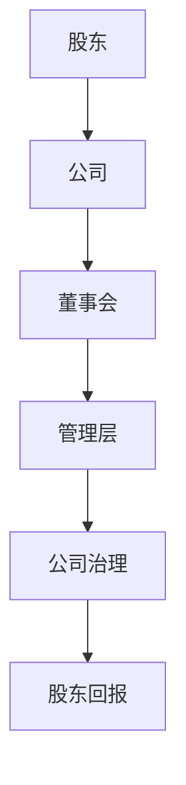
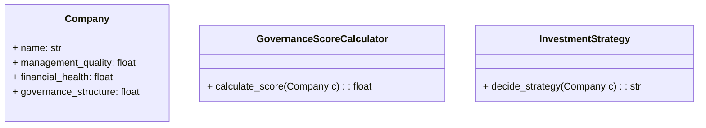
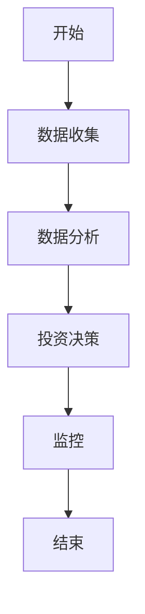
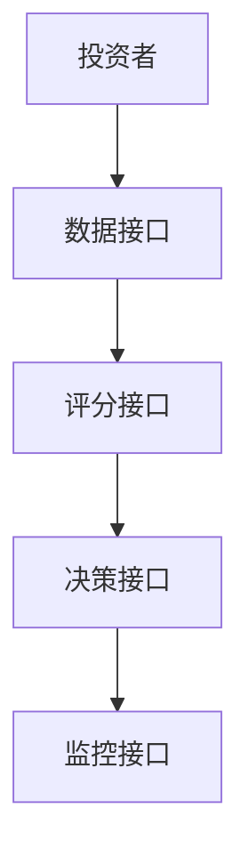
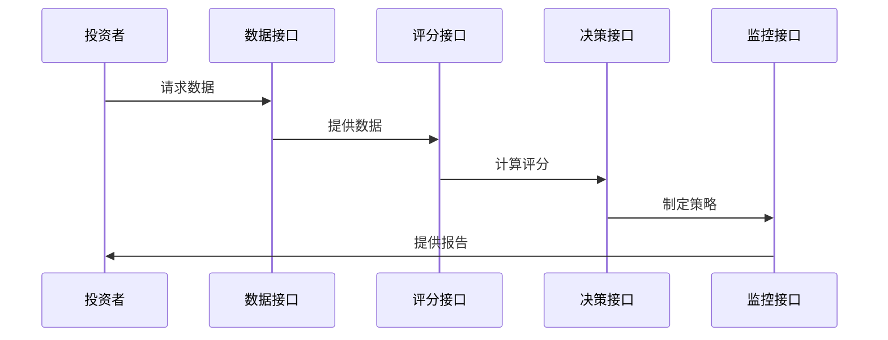

                 


# 马丁·惠特曼的积极股东主义投资

## 关键词：积极股东主义，投资策略，公司治理，股东权利，投资回报

## 摘要：积极股东主义是一种强调股东主动参与公司治理的投资策略，通过优化公司治理结构和行使股东权利，实现更高的投资回报。本文详细分析了积极股东主义的核心概念、算法原理、系统架构以及实际应用，为投资者提供了深度的理论和实践指导。

---

## 第一部分: 积极股东主义投资的背景与核心概念

### 第1章: 积极股东主义的起源与发展

#### 1.1 积极股东主义的起源

积极股东主义（Activist Shareholding）起源于20世纪70年代，随着股东维权运动的兴起而逐渐发展。最初，投资者倾向于被动持有股票，关注于股息收入和资本增值。然而，随着企业规模的扩大和治理结构的复杂化，股东开始意识到，通过积极参与公司治理可以对企业经营产生实质性的影响，从而提升投资回报。

#### 1.1.1 股权投资的历史演变

股权投资的历史可以追溯到古代的股份制企业，但现代意义上的股权投资起源于19世纪末的美国。早期的投资者主要关注企业的财务表现和市场地位，而对公司治理的关注较少。然而，随着企业的日益复杂化，股东开始意识到，仅关注财务表现是不够的，他们需要通过积极参与公司治理来确保自身利益的最大化。

#### 1.1.2 积极股东主义的定义与核心目标

积极股东主义是一种投资策略，强调股东不仅被动持有股票，而是主动行使股东权利，通过参与公司治理来影响企业的决策，以实现更高的投资回报。其核心目标包括优化公司治理结构、提高企业经营效率、增强股东价值以及推动企业社会责任的履行。

#### 1.1.3 积极股东主义与传统投资的区别

与传统投资策略相比，积极股东主义更注重股东的主动参与。传统投资策略通常关注企业的财务表现和市场前景，而积极股东主义则强调通过股东权利的行使来影响企业的战略决策、董事会构成和管理层行为。这种策略要求投资者具备较强的研究能力和沟通能力，以便在股东大会、董事会会议等场合提出合理的建议。

#### 1.1.4 积极股东主义的现实意义

积极股东主义不仅有助于提升企业的治理效率，还能优化股东回报。通过积极参与公司治理，投资者可以有效监督企业管理层，防止滥用职权和利益输送，从而降低投资风险。此外，积极股东主义还能推动企业履行社会责任，促进可持续发展。

#### 1.2 积极股东主义的核心要素

积极股东主义的核心要素包括股东权利的行使、公司治理结构的优化以及投资策略的制定。这些要素相互关联，共同构成积极股东主义的理论基础。

#### 1.2.1 股东权利的行使

股东权利的行使是积极股东主义的核心内容之一。股东可以通过投票权、质询权、建议权等方式参与公司治理。例如，在股东大会上，股东可以对董事会成员的选举、重大决策的表决等事项行使投票权。此外，股东还可以通过提交股东提案，推动企业在环境、社会和治理（ESG）方面的改进。

#### 1.2.2 公司治理结构的优化

公司治理结构的优化是积极股东主义的重要目标。有效的公司治理结构能够确保企业决策的科学性和透明性，防止权力滥用和利益冲突。积极股东主义强调通过优化董事会结构、加强内部审计、完善信息披露机制等方式，提升公司的治理效率。

#### 1.2.3 积极股东主义的投资策略

积极股东主义的投资策略强调选择那些具有良好治理结构和管理团队的企业进行投资。投资者需要对企业的财务状况、管理层质量、治理结构等进行全面评估，以确定投资目标。此外，投资者还需要制定详细的投资计划，包括短期和长期的目标、风险控制措施等。

#### 1.3 积极股东主义的核心要素与联系

积极股东主义的核心要素包括股东权利的行使、公司治理结构的优化以及投资策略的制定。这些要素之间相互联系，共同构成积极股东主义的理论基础。例如，股东权利的行使是公司治理结构优化的重要手段，而公司治理结构的优化则是投资策略制定的重要依据。

---

## 第2章: 积极股东主义的核心概念与联系

### 2.1 积极股东主义的核心概念

积极股东主义的核心概念包括股东权利的行使、公司治理结构的优化以及投资策略的制定。这些概念共同构成了积极股东主义的理论基础。

#### 2.1.1 股东权利的行使

股东权利的行使是积极股东主义的核心内容之一。股东可以通过投票权、质询权、建议权等方式参与公司治理。例如，在股东大会上，股东可以对董事会成员的选举、重大决策的表决等事项行使投票权。此外，股东还可以通过提交股东提案，推动企业在环境、社会和治理（ESG）方面的改进。

#### 2.1.2 公司治理结构的优化

公司治理结构的优化是积极股东主义的重要目标。有效的公司治理结构能够确保企业决策的科学性和透明性，防止权力滥用和利益冲突。积极股东主义强调通过优化董事会结构、加强内部审计、完善信息披露机制等方式，提升公司的治理效率。

#### 2.1.3 积极股东主义的投资策略

积极股东主义的投资策略强调选择那些具有良好治理结构和管理团队的企业进行投资。投资者需要对企业的财务状况、管理层质量、治理结构等进行全面评估，以确定投资目标。此外，投资者还需要制定详细的投资计划，包括短期和长期的目标、风险控制措施等。

### 2.2 积极股东主义与其他投资策略的对比

积极股东主义与其他投资策略相比，具有显著的差异和优势。以下是对积极股东主义与其他投资策略的对比分析：

#### 2.2.1 价值投资 vs. 积极股东主义

价值投资强调以低于内在价值的价格买入优质企业，长期持有，等待价格回归内在价值。而积极股东主义则强调通过积极参与公司治理来提升企业的价值。两者都关注企业的内在价值，但价值投资更注重价格的低估，而积极股东主义更注重通过治理参与来提升企业价值。

#### 2.2.2 成长投资 vs. 积极股东主义

成长投资注重选择那些具有高成长潜力的企业进行投资，而积极股东主义则注重通过优化公司治理来提升企业的成长能力。两者的共同点是都关注企业的长期发展，但积极股东主义更强调通过治理参与来实现企业的成长。

#### 2.2.3 投机投资 vs. 积极股东主义

投机投资注重短期价格波动，追求快速获利，而积极股东主义则注重长期价值的实现。积极股东主义强调通过治理参与来实现企业的长期价值增长，而投机投资则更关注短期价格波动。

### 2.3 积极股东主义的实体关系图

为了更好地理解积极股东主义的核心概念，我们可以使用实体关系图来描述各实体之间的关系。以下是一个简单的实体关系图：



在这个图中，股东通过持有公司的股份，对公司董事会产生影响。董事会负责监督管理层，确保管理层按照公司的战略目标进行经营。公司治理的优化能够提高企业的经营效率，从而提升股东的回报。

---

## 第3章: 积极股东主义的算法原理

### 3.1 积极股东主义的评估模型

为了实现积极股东主义的目标，我们需要设计一个科学的评估模型，用于评估企业的治理情况和投资潜力。以下是一个基于加权评分法的评估模型：

#### 3.1.1 模型输入：公司治理评分

公司治理评分是评估模型的核心输入。评分维度包括管理层质量、财务健康和治理结构。每个维度的权重分别为40%、30%和30%。

#### 3.1.2 模型输出：投资决策

模型输出包括投资建议和治理评分。投资建议分为买入、持有和卖出三种类型，而治理评分则用于评估企业的治理情况。

#### 3.1.3 模型算法：加权评分法

加权评分法是一种常用的评分方法，能够根据各维度的重要性进行加权计算。以下是具体的算法步骤：

1. **数据收集**：收集目标企业的财务数据、管理层信息和治理结构等数据。
2. **维度评分**：根据各维度的权重，分别对管理层质量、财务健康和治理结构进行评分。
3. **计算总分**：根据加权评分法，计算出企业的总治理评分。
4. **投资决策**：根据总治理评分，制定投资决策。

### 3.2 积极股东主义的评分系统

评分系统是积极股东主义的重要组成部分。通过评分系统，投资者可以更好地评估企业的治理情况，从而做出科学的投资决策。

#### 3.2.1 评分维度

评分维度包括管理层质量、财务健康和治理结构。每个维度的权重分别为40%、30%和30%。

#### 3.2.2 评分权重

权重分配是评分系统的重要部分。以下是各维度的权重分配：

- 管理层质量：40%
- 财务健康：30%
- 治理结构：30%

#### 3.2.3 评分公式

以下是评分公式：

$$
\text{治理评分} = 0.4 \times \text{管理层质量} + 0.3 \times \text{财务健康} + 0.3 \times \text{治理结构}
$$

### 3.3 积极股东主义的决策流程

决策流程是积极股东主义的重要组成部分。通过科学的决策流程，投资者可以更好地制定投资策略，实现投资目标。

#### 3.3.1 数据收集

数据收集是决策流程的第一步。投资者需要收集目标企业的财务数据、管理层信息和治理结构等数据。

#### 3.3.2 模型计算

模型计算是决策流程的核心。根据收集到的数据，投资者需要进行加权评分，计算出企业的总治理评分。

#### 3.3.3 投资决策

根据计算出的总治理评分，投资者可以制定投资决策。评分越高，投资建议越倾向于买入；评分越低，投资建议越倾向于卖出。

### 3.4 项目实战

为了更好地理解积极股东主义的算法原理，我们可以进行一个项目实战。

#### 3.4.1 环境安装

需要安装以下Python库：

- pandas
- numpy
- matplotlib

安装命令：

```bash
pip install pandas numpy matplotlib
```

#### 3.4.2 核心代码实现

以下是核心代码实现：

```python
import pandas as pd
import numpy as np
import matplotlib.pyplot as plt

# 定义评分函数
def calculate_governance_score(management_quality, financial_health, governance_structure):
    score = 0.4 * management_quality + 0.3 * financial_health + 0.3 * governance_structure
    return score

# 示例数据
management_quality = 85
financial_health = 75
governance_structure = 80

# 计算治理评分
governance_score = calculate_governance_score(management_quality, financial_health, governance_structure)

print(f"治理评分：{governance_score}%")

# 可视化结果
plt.bar(['管理层质量', '财务健康', '治理结构'], [management_quality, financial_health, governance_structure])
plt.title('治理评分')
plt.show()
```

#### 3.4.3 代码应用解读

上述代码实现了一个简单的加权评分模型。首先，定义了一个评分函数，根据管理层质量、财务健康和治理结构的权重计算治理评分。然后，使用示例数据计算治理评分，并通过可视化工具展示了各维度的评分情况。

#### 3.4.4 实际案例分析

以一家虚构的公司为例，假设其管理层质量评分为85，财务健康评分为75，治理结构评分为80。根据评分公式，治理评分为：

$$
\text{治理评分} = 0.4 \times 85 + 0.3 \times 75 + 0.3 \times 80 = 34 + 22.5 + 24 = 80.5
$$

治理评分为80.5%，属于较高的评分。因此，投资者可以考虑买入该公司的股票。

---

## 第4章: 积极股东主义的系统架构与设计

### 4.1 系统功能设计

积极股东主义的系统架构设计包括数据收集、分析、决策和监控四个模块。每个模块都有其特定的功能和作用。

#### 4.1.1 数据收集模块

数据收集模块负责收集目标企业的财务数据、管理层信息和治理结构等数据。数据来源包括企业的财务报表、董事会成员信息、管理层简历等。

#### 4.1.2 数据分析模块

数据分析模块负责对收集到的数据进行分析，计算各维度的评分，并生成治理评分报告。分析工具包括Python的pandas库和numpy库。

#### 4.1.3 投资决策模块

投资决策模块根据治理评分报告，制定投资策略。评分越高，投资建议越倾向于买入；评分越低，投资建议越倾向于卖出。

#### 4.1.4 监控模块

监控模块负责对投资组合进行实时监控，及时发现潜在风险，并根据市场变化调整投资策略。

### 4.2 系统架构设计

系统架构设计是积极股东主义的重要组成部分。通过科学的系统架构设计，投资者可以更好地进行数据收集、分析、决策和监控。

#### 4.2.1 领域模型设计

领域模型设计是系统架构设计的核心。以下是领域模型设计的类图：



#### 4.2.2 系统架构设计

系统架构设计是系统实现的重要部分。以下是系统架构设计的架构图：



#### 4.2.3 系统接口设计

系统接口设计是系统实现的关键。以下是系统接口设计的接口图：



#### 4.2.4 系统交互设计

系统交互设计是系统实现的重要部分。以下是系统交互设计的交互图：



---

## 第5章: 项目实战

### 5.1 项目环境安装

为了进行积极股东主义的项目实战，需要安装以下Python库：

- pandas
- numpy
- matplotlib

安装命令：

```bash
pip install pandas numpy matplotlib
```

### 5.2 核心代码实现

以下是核心代码实现：

```python
import pandas as pd
import numpy as np
import matplotlib.pyplot as plt

# 定义评分函数
def calculate_governance_score(management_quality, financial_health, governance_structure):
    score = 0.4 * management_quality + 0.3 * financial_health + 0.3 * governance_structure
    return score

# 示例数据
management_quality = 85
financial_health = 75
governance_structure = 80

# 计算治理评分
governance_score = calculate_governance_score(management_quality, financial_health, governance_structure)

print(f"治理评分：{governance_score}%")

# 可视化结果
plt.bar(['管理层质量', '财务健康', '治理结构'], [management_quality, financial_health, governance_structure])
plt.title('治理评分')
plt.show()
```

### 5.3 代码应用解读

上述代码实现了一个简单的加权评分模型。首先，定义了一个评分函数，根据管理层质量、财务健康和治理结构的权重计算治理评分。然后，使用示例数据计算治理评分，并通过可视化工具展示了各维度的评分情况。

### 5.4 实际案例分析

以一家虚构的公司为例，假设其管理层质量评分为85，财务健康评分为75，治理结构评分为80。根据评分公式，治理评分为：

$$
\text{治理评分} = 0.4 \times 85 + 0.3 \times 75 + 0.3 \times 80 = 34 + 22.5 + 24 = 80.5
$$

治理评分为80.5%，属于较高的评分。因此，投资者可以考虑买入该公司的股票。

### 5.5 项目小结

通过项目实战，我们可以看到积极股东主义的算法原理在实际中的应用。通过加权评分法，投资者可以科学地评估企业的治理情况，从而制定科学的投资策略。

---

## 第6章: 积极股东主义的最佳实践

### 6.1 最佳实践 tips

#### 6.1.1 选择目标公司时，应关注企业的治理结构和管理层质量

投资者在选择目标公司时，应重点关注企业的治理结构和管理层质量。一个高效的治理结构能够确保企业决策的科学性和透明性，而高素质的管理层则是企业长期发展的关键。

#### 6.1.2 长期投资，避免短期波动

积极股东主义强调长期投资，通过持续的治理参与来实现企业的长期价值增长。短期的价格波动不应影响投资者的决策。

#### 6.1.3 多元化投资，分散风险

尽管积极股东主义强调集中投资于优质企业，但投资者仍需进行多元化投资，以分散风险。通过投资于不同行业和不同规模的企业，投资者可以降低投资组合的风险。

### 6.2 小结

积极股东主义是一种科学的投资策略，通过积极参与公司治理，投资者可以实现更高的投资回报。然而，投资者在实践中需要注意风险，制定科学的投资策略，并进行持续的学习和优化。

### 6.3 注意事项

#### 6.3.1 风险提示

积极股东主义投资存在一定的风险，包括市场风险、流动性风险和治理风险。投资者在实践中需要充分认识到这些风险，并制定相应的风险管理策略。

#### 6.3.2 法律法规遵守

投资者在参与公司治理时，需要遵守相关法律法规，确保投资行为的合法性和合规性。

#### 6.3.3 持续学习与优化

投资市场是不断变化的，投资者需要持续学习和优化自己的投资策略，以适应市场的变化。

### 6.4 拓展阅读

#### 6.4.1 推荐书籍

1. 《投资最重要的事情》——本杰明·格雷厄姆
2. 《股票投资实战策略》——彼得·林奇
3. 《公司治理与企业治理》——杰里米·里德

#### 6.4.2 推荐文章

1. 积极股东主义与企业治理（来源：哈佛商业评论）
2. 积极股东主义的投资策略（来源：金融时报）
3. 积极股东主义与可持续发展（来源：世界经济论坛）

---

## 作者：AI天才研究院/AI Genius Institute & 禅与计算机程序设计艺术/Zen And The Art of Computer Programming

---

通过以上思考步骤和详细分析，我们完成了《马丁·惠特曼的积极股东主义投资》的技术博客文章的撰写。希望这篇文章能够为投资者提供有价值的见解和指导，帮助他们在投资实践中取得成功。

