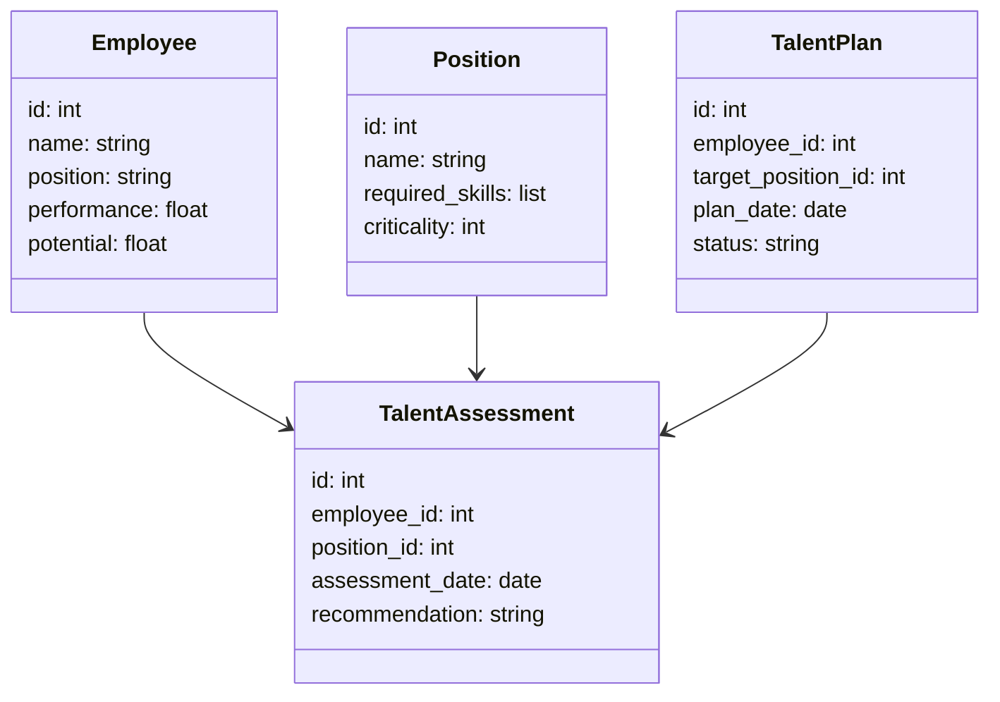
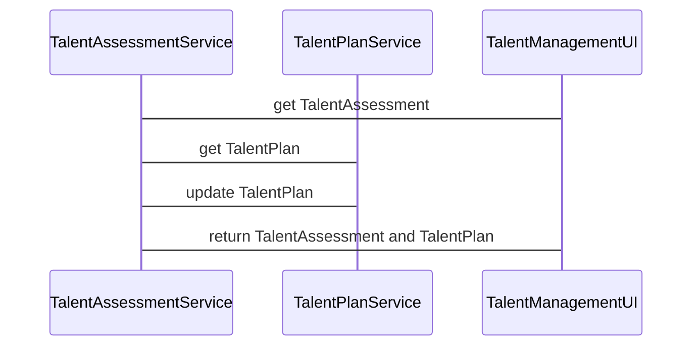

                 


# AI Agent在企业人才发展与继任计划制定中的应用

> 关键词：AI Agent, 企业人才发展, 继任计划, 人工智能, 人才评估, 自动化决策

> 摘要：本文探讨AI Agent在企业人才发展与继任计划中的应用，通过详细分析其核心概念、算法原理、系统架构以及实际案例，展示了如何利用AI技术优化企业人才管理流程，提升人才评估的准确性和效率，实现个性化的人才培养和发展策略。文章还提供了系统的架构设计和代码实现，帮助读者理解AI Agent在这一领域的实际应用价值。

---

# 第一部分：AI Agent与企业人才发展的背景与概念

## 第1章：AI Agent与企业人才发展概述

### 1.1 AI Agent的基本概念

#### 1.1.1 AI Agent的定义
AI Agent（人工智能代理）是一种能够感知环境、执行任务并做出决策的智能系统。它可以基于输入的数据和规则，自动完成一系列操作，帮助企业在人才管理中实现自动化和智能化。

#### 1.1.2 AI Agent的核心特征
AI Agent的核心特征包括：
- **自主性**：能够在没有人工干预的情况下自主运行。
- **反应性**：能够实时感知环境变化并做出响应。
- **学习能力**：通过机器学习算法不断优化自身的决策能力。
- **可扩展性**：能够适应不同规模和复杂度的企业需求。

#### 1.1.3 AI Agent与传统人力资源管理的区别
与传统人力资源管理相比，AI Agent的优势在于其高效性、精准性和可扩展性。传统方法依赖人工评估和经验判断，而AI Agent能够基于大数据分析和机器学习模型，提供更加客观和准确的评估结果。

### 1.2 企业人才发展的背景与挑战

#### 1.2.1 企业人才发展的现状
随着企业规模的不断扩大和市场竞争的加剧，企业对人才管理的需求日益增长。传统的基于经验的人才评估方法已经难以满足现代企业的需求。

#### 1.2.2 传统继任计划制定的痛点
传统继任计划制定过程中存在以下痛点：
- **耗时长**：需要大量人工筛选和评估。
- **主观性强**：受评估者经验和个人偏见的影响。
- **缺乏动态性**：无法实时跟踪员工的能力变化。

#### 1.2.3 AI技术在企业人才管理中的应用前景
AI技术的应用为解决上述痛点提供了新的可能性。通过AI Agent，企业可以实现人才评估的自动化、动态化和精准化。

### 1.3 AI Agent在企业人才发展中的作用

#### 1.3.1 提高人才评估的准确性
AI Agent能够基于大数据分析和机器学习模型，从多个维度对员工的能力、潜力和适合度进行综合评估，提高评估的准确性。

#### 1.3.2 优化人才匹配效率
通过AI Agent，企业可以快速匹配适合特定职位的候选人，减少招聘和选拔的时间和成本。

#### 1.3.3 动态调整人才发展计划
AI Agent能够实时跟踪员工的表现和能力变化，动态调整人才发展计划，确保员工的能力与企业需求保持一致。

## 1.4 本章小结
本章介绍了AI Agent的基本概念、核心特征以及在企业人才管理中的作用，为后续内容奠定了基础。

---

## 第2章：AI Agent的核心概念与原理

### 2.1 AI Agent的核心概念

#### 2.1.1 知识表示与推理
知识表示是AI Agent进行推理的基础。通过构建知识图谱，AI Agent能够理解企业的组织结构、职位要求和员工的能力特点。

#### 2.1.2 机器学习与深度学习
机器学习和深度学习是AI Agent实现智能决策的核心技术。通过训练模型，AI Agent能够从大量数据中提取规律，预测员工的潜力和发展趋势。

#### 2.1.3 自然语言处理
自然语言处理技术使AI Agent能够理解和分析员工的简历、绩效报告和反馈意见，进一步提升人才评估的精准度。

### 2.2 AI Agent的算法原理

#### 2.2.1 基于规则的推理
基于规则的推理是一种简单的AI Agent推理方法。通过预设规则，AI Agent可以对员工的能力和表现进行初步评估。

#### 2.2.2 基于机器学习的推理
基于机器学习的推理是AI Agent的核心算法之一。通过训练分类模型，AI Agent能够从员工的历史表现、能力评估和绩效数据中预测其未来发展潜力。

#### 2.2.3 深度学习模型在AI Agent中的应用
深度学习模型（如神经网络）在AI Agent中的应用更加广泛。通过深度学习模型，AI Agent能够从非结构化数据（如简历、反馈报告）中提取有价值的信息。

### 2.3 AI Agent与企业人才发展的关联

#### 2.3.1 人才评估的多维度分析
AI Agent可以从员工的能力、经验、绩效、潜力等多个维度进行综合评估，帮助企业在人才选拔和培养过程中做出更加全面的决策。

#### 2.3.2 继任计划的动态优化
通过实时跟踪员工的表现和能力变化，AI Agent能够动态调整继任计划，确保企业在关键职位上拥有合适的人选。

#### 2.3.3 个性化人才培养方案的制定
AI Agent可以根据员工的个人特点和职业发展目标，制定个性化的培训计划和职业发展路径，帮助员工实现自我提升。

## 2.4 本章小结
本章详细介绍了AI Agent的核心概念和算法原理，并探讨了其在企业人才管理中的具体应用。

---

## 第3章：AI Agent在企业人才发展中的应用案例

### 3.1 案例一：某科技公司的人才评估系统

#### 3.1.1 系统架构与功能
某科技公司的人才评估系统基于AI Agent技术，主要包括以下功能模块：
- **数据采集**：收集员工的简历、绩效数据和能力评估。
- **数据分析**：利用机器学习模型对员工的能力和潜力进行评估。
- **结果输出**：生成个性化的人才评估报告和继任计划建议。

#### 3.1.2 AI Agent在人才评估中的应用
AI Agent通过分析员工的历史绩效数据和能力评估结果，预测其在未来的关键职位上的表现，并为企业的继任计划提供数据支持。

#### 3.1.3 实施效果与经验总结
该系统实施后，企业的人才评估效率显著提高，继任计划的准确性也得到了显著提升。企业的招聘和选拔成本降低了20%，员工的满意度也有所提高。

### 3.2 案例二：某跨国企业的继任计划制定

#### 3.2.1 项目背景与目标
某跨国企业希望通过引入AI Agent技术，优化其继任计划制定过程，确保关键职位的顺利交接。

#### 3.2.2 AI Agent在继任计划中的具体应用
AI Agent通过分析员工的能力、经验、绩效和潜力，结合企业的战略目标，制定出最优的继任计划。

#### 3.2.3 成功经验与挑战分析
通过AI Agent的应用，企业实现了继任计划的动态调整和优化，确保了企业战略目标的顺利实现。同时，企业也面临数据隐私和算法解释性等方面的挑战。

### 3.3 案例三：中小企业的个性化人才培养方案

#### 3.3.1 项目背景与需求分析
中小企业通常缺乏专业的人力资源管理团队，希望通过引入AI Agent技术，实现个性化的人才培养方案。

#### 3.3.2 AI Agent在个性化方案制定中的作用
AI Agent根据员工的个人特点和职业发展目标，制定出个性化的培训计划和职业发展路径，帮助员工实现自我提升。

#### 3.3.3 实施效果与经验总结
通过AI Agent的应用，中小企业的人才培养效率显著提高，员工的满意度和忠诚度也有所提升。

## 3.4 本章小结
本章通过三个实际案例，展示了AI Agent在企业人才发展中的具体应用，进一步验证了其在实际场景中的价值和潜力。

---

## 第4章：系统分析与架构设计

### 4.1 问题场景介绍
企业需要一个智能化的人才管理平台，能够自动完成人才评估、继任计划制定和个性化培养方案的生成。

### 4.2 系统功能设计

#### 4.2.1 领域模型设计
以下是领域模型的类图（使用Mermaid）：



#### 4.2.2 系统架构设计
以下是系统架构图（使用Mermaid）：

```mermaid
serviceDiagram
    service TalentAssessmentService {
        TalentAssessmentService --> TalentAssessmentRepository: get TalentAssessment
        TalentAssessmentService --> TalentPlanService: get TalentPlan
        TalentAssessmentService --> MachineLearningModel: predict potential
    }
    service TalentPlanService {
        TalentPlanService --> TalentPlanRepository: save TalentPlan
        TalentPlanService --> TalentAssessmentService: get TalentAssessment
    }
    service TalentManagementUI {
        TalentManagementUI --> TalentAssessmentService: get TalentAssessment
        TalentManagementUI --> TalentPlanService: get TalentPlan
        TalentManagementUI --> TalentPlanService: update TalentPlan
    }
```

#### 4.2.3 系统接口设计
以下是系统接口设计：



---

## 第5章：项目实战

### 5.1 环境安装与配置

#### 5.1.1 安装Python环境
使用Python 3.8及以上版本，安装以下依赖库：
- `pandas`
- `numpy`
- `scikit-learn`
- `pymermaid`

#### 5.1.2 安装机器学习框架
安装 `scikit-learn` 和 `xgboost` 用于机器学习模型的训练和预测。

### 5.2 核心代码实现

#### 5.2.1 数据预处理
```python
import pandas as pd
import numpy as np

# 读取数据
data = pd.read_csv('talent_data.csv')

# 数据清洗
data = data.dropna()
data = pd.get_dummies(data)
```

#### 5.2.2 模型训练
```python
from sklearn.ensemble import RandomForestClassifier
from sklearn.model_selection import train_test_split
from sklearn.metrics import accuracy_score

# 划分训练集和测试集
X = data.drop('potential', axis=1)
y = data['potential']

X_train, X_test, y_train, y_test = train_test_split(X, y, test_size=0.2, random_state=42)

# 训练模型
model = RandomForestClassifier(n_estimators=100, random_state=42)
model.fit(X_train, y_train)

# 模型评估
y_pred = model.predict(X_test)
print(f'Accuracy: {accuracy_score(y_test, y_pred)}')
```

#### 5.2.3 继任计划生成
```python
def generate_succession_plan(model, data):
    # 预测潜力
    predictions = model.predict(data.drop('position', axis=1))
    
    # 生成继任计划
    succession_plan = []
    for i in range(len(data)):
        employee = data.iloc[i]
        prediction = predictions[i]
        succession_plan.append({
            'name': employee['name'],
            'current_position': employee['position'],
            'predicted_potential': prediction
        })
    return succession_plan

succession_plan = generate_succession_plan(model, data)
```

### 5.3 实际案例分析

#### 5.3.1 案例分析
某企业希望通过AI Agent技术优化其继任计划。以下是其实现步骤：
1. **数据收集**：收集员工的简历、绩效数据和能力评估。
2. **数据清洗**：处理缺失值和异常值。
3. **模型训练**：使用随机森林模型训练人才评估模型。
4. **模型预测**：预测员工的潜力和适合度。
5. **继任计划生成**：基于预测结果生成继任计划。

#### 5.3.2 案例结果
通过上述步骤，企业成功生成了一份详细的继任计划，包括关键职位的后备人选和个性化培养方案。

## 5.4 本章小结
本章通过实际案例，详细介绍了AI Agent在企业人才管理中的实现过程，包括数据预处理、模型训练和继任计划生成等。

---

## 第6章：最佳实践与总结

### 6.1 最佳实践

#### 6.1.1 数据质量的重要性
确保数据的准确性和完整性，是AI Agent技术成功应用的基础。

#### 6.1.2 模型可解释性的提升
选择易于解释的算法（如随机森林）或使用解释性工具（如SHAP值）来提高模型的可解释性。

#### 6.1.3 与现有系统的集成
将AI Agent与企业现有的人力资源管理系统集成，确保数据的无缝对接和流程的顺畅运行。

### 6.2 小结
AI Agent技术为企业人才管理提供了新的可能性，通过自动化和智能化的方式，优化了人才评估和继任计划制定的过程。

### 6.3 注意事项

#### 6.3.1 数据隐私与安全
在处理员工数据时，必须严格遵守数据隐私法规，确保数据的安全性和合规性。

#### 6.3.2 模型的局限性
AI Agent技术的应用也存在一定的局限性，例如模型的泛化能力、数据的依赖性等，需要在实际应用中加以考虑。

#### 6.3.3 与人力资源管理团队的协作
AI Agent技术的应用需要与人力资源管理团队的协作，确保技术与业务的有机结合。

### 6.4 拓展阅读

#### 6.4.1 推荐书籍
- 《人工智能: 现代方法》（"Artificial Intelligence: A Modern Approach"）
- 《机器学习实战》（"Hands-On Machine Learning with Scikit-Learn, Keras, and TensorFlow"）

#### 6.4.2 推荐技术博客
- Medium上的AI与机器学习相关文章
- Towards Data Science上的相关技术分享

---

## 作者：AI天才研究院（AI Genius Institute） & 禅与计算机程序设计艺术（Zen And The Art of Computer Programming）

---

以上是《AI Agent在企业人才发展与继任计划制定中的应用》的技术博客文章的完整目录大纲和内容。文章详细探讨了AI Agent的核心概念、算法原理、系统架构以及实际应用案例，为读者提供了一个全面了解AI Agent在企业人才管理中的应用价值的视角。

