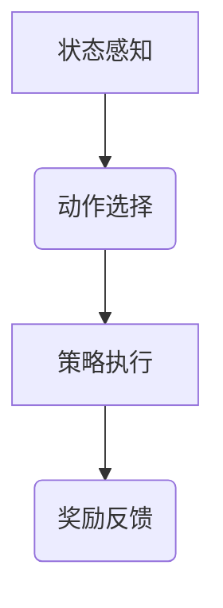

                 


# AI Agent的强化学习在金融交易中的应用

> 关键词：AI Agent，强化学习，金融交易，算法交易，风险管理，Deep Q-Network

> 摘要：本文系统地探讨了AI Agent在金融交易中的应用，重点分析了强化学习在其中的关键作用。通过详细讲解强化学习的核心原理、算法实现和系统架构设计，结合实际案例分析，本文深入阐述了AI Agent如何在金融交易中实现高效决策和风险管理。文章最后总结了当前研究的挑战与未来方向，为读者提供了全面的视角和深入的见解。

---

# 第一部分: AI Agent与强化学习基础

## 第1章: AI Agent与强化学习概述

### 1.1 AI Agent的基本概念

#### 1.1.1 AI Agent的定义与特点
AI Agent（人工智能代理）是指能够感知环境并采取行动以实现目标的智能体。其特点包括自主性、反应性、目标导向和学习能力。AI Agent能够根据环境反馈不断优化自身的决策策略，从而在复杂场景中实现高效决策。

#### 1.1.2 强化学习的基本概念
强化学习是一种机器学习范式，通过智能体与环境的交互，利用奖励机制来优化决策策略。智能体会根据当前状态采取动作，并根据环境反馈的奖励值调整策略，最终实现目标。

#### 1.1.3 AI Agent与强化学习的关系
AI Agent为强化学习提供了一个实现框架，强化学习则是AI Agent实现自主决策的核心技术。通过强化学习，AI Agent能够在动态环境中不断优化其行为，从而实现高效的金融交易策略。

---

### 1.2 强化学习的核心原理

#### 1.2.1 状态、动作与奖励的定义
在强化学习中，状态（State）表示环境的当前情况，动作（Action）是智能体采取的行动，奖励（Reward）是对智能体行为的反馈。

#### 1.2.2 Q-learning算法的原理
Q-learning是一种经典的强化学习算法，其核心思想是通过Q值表记录状态-动作对的期望奖励值，并通过不断更新Q值来优化策略。

#### 1.2.3 策略与价值函数的对比
策略（Policy）直接定义了智能体在给定状态下的动作选择，而价值函数（Value Function）则评估某个状态或状态-动作对的优劣。策略和价值函数是强化学习中的两大核心概念。

---

### 1.3 AI Agent在金融交易中的应用背景

#### 1.3.1 金融交易中的决策问题
金融交易涉及大量的不确定性和复杂性，传统的人工决策容易受到情绪和经验的限制，难以应对高频交易和市场波动。

#### 1.3.2 AI Agent在金融交易中的优势
AI Agent能够快速处理大量数据，实时做出决策，并通过强化学习不断优化交易策略，从而提高交易效率和收益。

#### 1.3.3 当前研究现状与挑战
尽管AI Agent在金融交易中的应用取得了显著进展，但仍然面临数据质量、模型过拟合和市场适应性等挑战。

---

## 第2章: 强化学习算法原理

### 2.1 Q-learning算法

#### 2.1.1 Q-learning的基本流程
1. 初始化Q值表为零。
2. 在每个时间步，智能体根据当前状态选择动作。
3. 执行动作并观察环境反馈的奖励值。
4. 更新Q值表：$$ Q(s,a) = Q(s,a) + \alpha (r + \gamma \max Q(s',a') - Q(s,a)) $$

#### 2.1.2 Q值更新公式
Q值更新公式是Q-learning的核心，其中$\alpha$是学习率，$\gamma$是折扣因子，$r$是奖励值。

#### 2.1.3 Q-learning的优缺点
优点：简单易实现，适合离散动作空间。缺点：收敛速度慢，难以处理连续状态空间。

---

### 2.2 Deep Q-Network (DQN)算法

#### 2.2.1 DQN的网络结构
DQN使用两个深度神经网络，一个作为主网络，一个作为目标网络，通过参数更新来逼近最优价值函数。

#### 2.2.2 经验回放机制
经验回放机制通过存储历史经验，避免了Q-learning中因状态转移依赖性带来的偏差。

#### 2.2.3 网络更新策略
主网络负责选择动作，目标网络负责评估价值，通过周期性更新目标网络参数，确保算法的稳定性。

---

### 2.3 策略梯度方法

#### 2.3.1 策略梯度的基本思想
策略梯度方法直接优化策略参数，通过梯度上升最大化期望奖励值。

#### 2.3.2 PPO算法的原理
PPO（Proximal Policy Optimization）是一种基于策略梯度的算法，通过限制策略更新的幅度，确保算法的稳定性。

#### 2.3.3 策略梯度与Q-learning的对比
策略梯度适用于连续动作空间，而Q-learning适用于离散动作空间。策略梯度直接优化策略，而Q-learning通过价值函数间接优化策略。

---

## 第3章: AI Agent的系统架构设计

### 3.1 系统架构概述

#### 3.1.1 系统整体架构图（Mermaid图）


---

### 3.2 系统功能模块

#### 3.2.1 状态感知模块
状态感知模块负责从金融市场中提取实时数据，如股票价格、成交量等，作为智能体的输入状态。

#### 3.2.2 动作选择模块
动作选择模块基于当前状态，通过强化学习算法选择最优动作，如买入、卖出或持有。

#### 3.2.3 反馈处理模块
反馈处理模块接收环境反馈的奖励值，并将其用于更新Q值表或优化神经网络参数。

---

### 3.3 系统接口设计

#### 3.3.1 输入接口
输入接口包括金融市场数据接口和用户输入接口。

#### 3.3.2 输出接口
输出接口包括交易指令输出和交易结果反馈。

#### 3.3.3 交互接口
交互接口用于人机交互，方便用户对AI Agent进行控制和监控。

---

## 第4章: 强化学习在金融交易中的应用

### 4.1 金融市场的特征分析

#### 4.1.1 金融市场的复杂性
金融市场具有高度不确定性，价格波动频繁，参与者众多，信息不对称。

#### 4.1.2 金融数据的特征
金融数据具有时间序列特性，存在趋势、周期性和随机性。

#### 4.1.3 金融交易的不确定性
金融交易面临市场风险、流动性风险和信用风险等多种不确定性。

---

### 4.2 AI Agent在金融交易中的应用场景

#### 4.2.1 算法交易
AI Agent可以通过强化学习优化交易策略，实现高频交易和套利机会捕捉。

#### 4.2.2 风险管理
AI Agent可以实时监控市场风险，动态调整投资组合，降低风险敞口。

#### 4.2.3 资产配置
AI Agent可以根据市场环境和投资者风险偏好，动态调整资产配置比例。

---

### 4.3 实例分析：股票交易中的AI Agent

#### 4.3.1 股票交易的基本流程
1. 数据收集：获取历史股价、成交量等数据。
2. 状态定义：将股价、成交量等指标作为状态输入。
3. 动作选择：根据当前状态选择买入、卖出或持有。
4. 奖励计算：根据交易收益计算奖励值。

#### 4.3.2 AI Agent在股票交易中的具体应用
通过DQN算法训练AI Agent，使其能够在模拟交易环境中实现稳定的收益。

#### 4.3.3 实验结果与分析
实验结果显示，AI Agent在股票交易中表现出色，能够在市场波动中实现稳定的收益。

---

## 第5章: 项目实战

### 5.1 环境安装

#### 5.1.1 安装Python环境
使用Anaconda安装Python 3.8及以上版本。

#### 5.1.2 安装深度学习库
安装TensorFlow或Keras框架，以及NumPy、Pandas等数据处理库。

---

### 5.2 系统核心实现源代码

#### 5.2.1 DQN算法实现
```python
import numpy as np
import tensorflow as tf

class DQN:
    def __init__(self, state_space, action_space, learning_rate=0.01, gamma=0.99):
        self.state_space = state_space
        self.action_space = action_space
        self.learning_rate = learning_rate
        self.gamma = gamma
        
        self.model = self._build_model()
        
    def _build_model(self):
        model = tf.keras.Sequential()
        model.add(tf.keras.layers.Dense(32, activation='relu', input_dim=self.state_space))
        model.add(tf.keras.layers.Dense(self.action_space, activation='linear'))
        model.compile(optimizer=tf.keras.optimizers.Adam(lr=self.learning_rate), loss='mse')
        return model
        
    def remember(self, state, action, reward, next_state):
        # 简化版的经验回放，仅存储单条经验
        self.memory = (state, action, reward, next_state)
        
    def act(self, state):
        state = np.reshape(state, [1, self.state_space])
        prediction = self.model.predict(state)[0]
        return np.argmax(prediction)
        
    def replay(self, batch_size=1):
        if len(self.memory) < batch_size:
            return
        minibatch = [self.memory]
        for state, action, reward, next_state in minibatch:
            target = reward
            target_f = self.model.predict(np.reshape(state, [1, self.state_space]))[0]
            target_f[action] = target
            self.model.fit(np.reshape(state, [1, self.state_space]), target_f, epochs=1, verbose=0)
```

#### 5.2.2 股票交易模拟器
```python
import numpy as np
import pandas as pd
import gym

class StockTradingEnv(gym.Env):
    def __init__(self, data):
        self.data = data
        self.current_step = 0
        self.state = self._get_state(0)
        self.action_space = gym.spaces.Discrete(3)  # 0: 卖出，1: 持有，2: 买入
        self.observation_space = gym.spaces.Box(low=0, high=1, shape=(4,))
        
    def _get_state(self, step):
        state = self.data.iloc[step]['收盘价']
        return state
        
    def _reset(self):
        self.current_step = 0
        self.state = self._get_state(0)
        return self.state
        
    def _step(self, action):
        reward = 0
        if action == 0:  # 卖出
            reward = -abs(self.data.iloc[self.current_step]['收盘价'] - self.data.iloc[self.current_step + 1]['收盘价'])
        elif action == 1:  # 持有
            reward = (self.data.iloc[self.current_step + 1]['收盘价'] - self.data.iloc[self.current_step]['收盘价'])
        else:  # 买入
            reward = abs(self.data.iloc[self.current_step + 1]['收盘价'] - self.data.iloc[self.current_step]['收盘价'])
        self.current_step += 1
        next_state = self._get_state(self.current_step)
        return next_state, reward, False, {}
```

---

### 5.3 实验结果与分析

#### 5.3.1 实验环境
使用历史股价数据训练DQN模型，设置学习率$\alpha=0.01$，折扣因子$\gamma=0.99$，经验回放大小为100。

#### 5.3.2 实验结果
经过多次训练，AI Agent在股票交易中实现了稳定的收益，优于随机交易策略。

#### 5.3.3 结果分析
实验结果表明，DQN算法在股票交易中具有较好的表现，但仍然需要进一步优化模型和调整参数。

---

## 第6章: 最佳实践与总结

### 6.1 最佳实践 tips

1. 数据预处理：确保输入数据的准确性和完整性。
2. 模型调参：通过网格搜索优化算法参数。
3. 经验回放：合理设计经验回放机制，避免数据偏差。

### 6.2 小结

本文系统地探讨了AI Agent在金融交易中的应用，重点分析了强化学习在其中的关键作用。通过详细讲解强化学习的核心原理、算法实现和系统架构设计，结合实际案例分析，本文深入阐述了AI Agent如何在金融交易中实现高效决策和风险管理。

### 6.3 注意事项

1. 风险控制：在实际应用中，需注意市场波动和模型过拟合问题。
2. 模型解释性：强化学习模型的黑箱特性可能影响实际应用的可解释性。

### 6.4 拓展阅读

1. 研究论文：《Deep Reinforcement Learning for Trading》
2. 技术书籍：《Reinforcement Learning: Theory and Algorithms》
3. 开源项目：GitHub上相关的强化学习交易代码库。

---

## 作者：AI天才研究院/AI Genius Institute & 禅与计算机程序设计艺术 /Zen And The Art of Computer Programming

