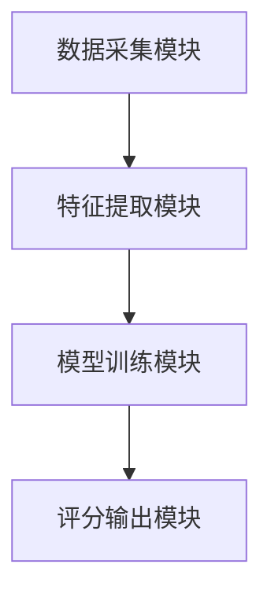
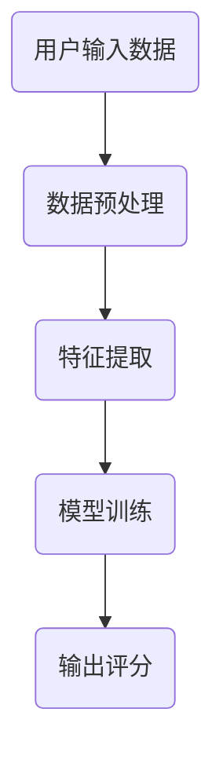

                 


# AI辅助的公司治理评分系统

> 关键词：AI辅助、公司治理、评分系统、数据驱动、机器学习、评分模型

> 摘要：本文将详细探讨如何利用AI技术构建一个高效的公司治理评分系统。通过分析公司治理的核心要素、AI技术的应用原理以及评分系统的数学模型，本文旨在为读者提供一个从理论到实践的全面指导。文章内容涵盖数据预处理、特征提取、模型训练、评分算法实现等关键环节，并通过具体案例分析和代码示例，帮助读者理解和应用这一系统。

---

# 第一部分：引言

## 第1章：AI辅助的公司治理评分系统概述

### 1.1 背景与意义

#### 1.1.1 公司治理的定义与重要性
公司治理是确保企业有效运作和合规经营的核心机制。它涵盖了董事会结构、高管责任、股东权益、风险管理等多个方面。良好的公司治理能够提升企业透明度，增强投资者信心，同时降低经营风险。

#### 1.1.2 AI技术在公司治理中的应用潜力
随着AI技术的快速发展，其在公司治理中的应用潜力逐渐显现。通过自然语言处理（NLP）、机器学习（ML）等技术，AI能够从海量数据中提取有价值的信息，帮助评估企业的治理水平。

#### 1.1.3 评分系统在公司治理中的作用
评分系统能够量化企业的治理表现，为企业提供改进方向。通过AI辅助的评分系统，企业可以快速、准确地获得治理评分，从而优化治理结构。

### 1.2 本书的核心目标

#### 1.2.1 设计AI辅助的公司治理评分系统的目的
本书旨在通过AI技术构建一个智能化的公司治理评分系统，为企业提供高效、准确的治理评估工具。

#### 1.2.2 本书的结构与内容安排
文章将从公司治理的基本概念、AI技术的应用原理、评分系统的数学模型等方面展开，逐步引导读者理解并实现AI辅助的评分系统。

#### 1.2.3 面向读者群体及预期收获
本书适合企业高管、IT技术人员、数据科学家等读者阅读。通过阅读本书，读者可以掌握AI技术在公司治理中的应用方法，并能够实际操作评分系统的构建。

---

## 第2章：公司治理评分系统的背景与问题分析

### 2.1 公司治理的基本概念

#### 2.1.1 公司治理的定义与范围
公司治理是指通过董事会和管理层对企业进行有效管理的过程，确保企业目标的实现和利益相关者的权益保护。

#### 2.1.2 公司治理的核心要素与框架
公司治理的核心要素包括董事会结构、高管责任、股东权益、风险管理等。其框架通常包括公司章程、治理准则和监管机制。

#### 2.1.3 公司治理的现状与挑战
尽管公司治理的重要性日益凸显，但在实际操作中仍面临诸多挑战，如信息不对称、治理标准不统一、数据采集困难等。

### 2.2 AI技术在公司治理中的应用现状

#### 2.2.1 AI在公司治理中的典型应用场景
AI技术可以应用于风险预警、治理评分、合规监控等领域。例如，通过自然语言处理技术分析企业年报，提取治理相关信息。

#### 2.2.2 当前存在的主要问题与痛点
现有公司治理评分系统往往依赖人工评估，效率低下且主观性较强。AI技术的应用能够提高评分的客观性和准确性。

#### 2.2.3 AI辅助评分系统的潜在价值
通过AI技术构建评分系统，能够快速、准确地评估企业的治理表现，为企业提供数据支持和决策依据。

### 2.3 本书的研究问题与目标

#### 2.3.1 研究的核心问题
如何利用AI技术构建一个高效、准确的公司治理评分系统？

#### 2.3.2 研究目标与预期成果
本文旨在设计一个基于AI的评分系统，实现对公司治理的量化评估，并为企业提供改进建议。

#### 2.3.3 研究方法与技术路线
采用机器学习算法，结合公司治理数据，构建评分模型，并通过实证分析验证模型的有效性。

---

# 第二部分：AI辅助的公司治理评分系统的核心概念与原理

## 第3章：公司治理评分系统的概念与框架

### 3.1 公司治理评分系统的定义

#### 3.1.1 评分系统的定义与分类
评分系统是一种通过量化指标对企业治理表现进行评估的工具。根据评分依据的不同，可分为基于数据的评分系统和基于规则的评分系统。

#### 3.1.2 AI辅助评分系统的独特性
AI辅助的评分系统能够通过机器学习算法，自动提取和分析数据，实现智能化评估。

#### 3.1.3 系统的核心功能与目标
评分系统的核心功能包括数据采集、特征提取、模型训练和评分输出。其目标是为用户提供准确的治理评分和改进建议。

### 3.2 公司治理评分系统的框架

#### 3.2.1 系统的总体架构
公司治理评分系统通常包括数据采集模块、特征提取模块、模型训练模块和评分输出模块。

#### 3.2.2 系统的核心模块与功能
- 数据采集模块：负责收集企业的治理数据，包括财务数据、法律文件等。
- 特征提取模块：对采集的数据进行清洗和特征提取，为模型训练提供输入。
- 模型训练模块：利用机器学习算法训练评分模型。
- 评分输出模块：根据模型预测结果输出治理评分。

#### 3.2.3 系统的输入输出与交互方式
系统输入包括企业治理数据和评分标准，输出为治理评分和改进建议。交互方式可以通过API或Web界面实现。

### 3.3 评分系统的关键要素

#### 3.3.1 数据来源与处理
数据来源包括企业年报、财务报表、法律文件等。数据处理包括清洗、标准化和特征提取。

#### 3.3.2 评分模型与算法
评分模型可以采用逻辑回归、支持向量机（SVM）或深度学习模型。

#### 3.3.3 评分标准与指标体系
评分标准需要根据行业特点和企业需求定制。指标体系包括合规性、透明度、风险管理等多个维度。

## 第4章：AI技术在评分系统中的应用原理

### 4.1 数据预处理与特征提取

#### 4.1.1 数据清洗与标准化
数据清洗包括去除缺失值、处理异常值等。标准化则是将数据归一化，方便模型训练。

#### 4.1.2 特征选择与降维
特征选择可以通过相关性分析或递归特征消除（RFE）方法进行。降维可以通过主成分分析（PCA）实现。

#### 4.1.3 数据增强与扩展
数据增强可以通过数据扩充或生成合成数据来提高模型的泛化能力。

### 4.2 评分模型的构建与训练

#### 4.2.1 线性回归模型
线性回归模型适用于评分系统中线性关系较强的场景。其数学公式为：
$$ y = \beta_0 + \beta_1x_1 + \beta_2x_2 + ... + \beta_nx_n + \epsilon $$
其中，$y$为治理评分，$x_i$为特征变量，$\beta_i$为回归系数，$\epsilon$为误差项。

#### 4.2.2 支持向量机模型
支持向量机（SVM）适用于非线性分类和回归问题。其核心思想是通过映射函数将数据映射到高维空间，并在高维空间中进行线性分割。

#### 4.2.3 神经网络模型
神经网络模型适用于复杂的非线性关系。通过多层感知机（MLP）或卷积神经网络（CNN）可以实现非线性特征的提取。

### 4.3 模型优化与调参

#### 4.3.1 参数优化方法
参数优化可以通过梯度下降（GD）或Adam优化器实现。

#### 4.3.2 超参数调优策略
超参数调优可以通过网格搜索（Grid Search）或随机搜索（Random Search）实现。

#### 4.3.3 模型评估与验证
模型评估可以通过交叉验证（Cross-Validation）或ROC-AUC曲线进行。

## 第5章：评分系统的数学模型与算法实现

### 5.1 线性回归模型

#### 5.1.1 线性回归的基本原理
线性回归通过最小化预测值与真实值之间的平方差之和，找到最佳拟合直线。

#### 5.1.2 线性回归的数学公式
线性回归的损失函数为：
$$ L = \frac{1}{2m} \sum_{i=1}^{m} (y_i - (\beta_0 + \beta_1x_i))^2 $$
其中，$m$为样本数量，$y_i$为真实值，$x_i$为输入特征，$\beta_0$和$\beta_1$为模型参数。

#### 5.1.3 线性回归的实现步骤
1. 数据预处理：清洗和标准化数据。
2. 模型训练：使用梯度下降优化参数。
3. 模型评估：计算均方误差（MSE）或R平方值。

### 5.2 支持向量机模型

#### 5.2.1 SVM的基本原理
SVM通过找到一个超平面，使得正负样本点距离最大化，从而实现分类或回归。

#### 5.2.2 SVM的数学公式
SVM的优化目标为：
$$ \min_{\beta, \beta_0} \frac{1}{2}||\beta||^2 $$
约束条件为：
$$ y_i (\beta_0 + \beta^T x_i) \geq 1 - \xi_i $$
$$ \xi_i \geq 0 $$

#### 5.2.3 SVM的实现步骤
1. 数据预处理：标准化数据。
2. 模型训练：使用SVM算法训练模型。
3. 模型评估：计算准确率和F1分数。

### 5.3 神经网络模型

#### 5.3.1 神经网络的基本原理
神经网络通过多层感知机（MLP）实现非线性特征的提取。

#### 5.3.2 神经网络的数学公式
神经网络的前向传播公式为：
$$ a^{(l+1)} = \sigma(w^{(l)}a^{(l)} + b^{(l)}) $$
其中，$a^{(l)}$为第$l$层的激活值，$w^{(l)}$为权重矩阵，$b^{(l)}$为偏置项，$\sigma$为激活函数。

#### 5.3.3 神经网络的实现步骤
1. 数据预处理：清洗和归一化数据。
2. 模型训练：使用反向传播（BP）算法训练模型。
3. 模型评估：计算准确率和混淆矩阵。

---

## 第6章：系统设计与实现

### 6.1 系统架构设计

#### 6.1.1 系统功能模块
公司治理评分系统包括数据采集模块、特征提取模块、模型训练模块和评分输出模块。

#### 6.1.2 系统架构图


#### 6.1.3 数据流图


### 6.2 系统功能设计

#### 6.2.1 数据采集模块
数据采集模块负责从企业年报、财务报表等来源获取治理数据。

#### 6.2.2 特征提取模块
特征提取模块对数据进行清洗、标准化和特征选择，为模型训练提供输入。

#### 6.2.3 模型训练模块
模型训练模块使用机器学习算法训练评分模型，并保存训练好的模型。

#### 6.2.4 评分输出模块
评分输出模块根据模型预测结果输出治理评分，并提供改进建议。

### 6.3 系统接口设计

#### 6.3.1 数据接口
数据接口负责与外部数据源的交互，包括数据库、文件等。

#### 6.3.2 模型接口
模型接口负责与模型训练模块的交互，包括模型参数设置和模型评估。

#### 6.3.3 用户接口
用户接口负责与用户的交互，包括数据输入和结果展示。

### 6.4 系统交互设计

#### 6.4.1 用户登录与数据上传
用户通过Web界面登录系统，并上传企业治理数据。

#### 6.4.2 数据处理与模型训练
系统后台自动处理数据，并启动模型训练任务。

#### 6.4.3 评分结果展示
训练完成后，系统展示治理评分和改进建议。

---

## 第7章：项目实战与优化

### 7.1 项目环境搭建

#### 7.1.1 安装开发环境
安装Python、Jupyter Notebook、TensorFlow、Scikit-learn等工具。

#### 7.1.2 数据集准备
收集企业治理数据，包括财务数据、法律文件等。

#### 7.1.3 数据预处理
使用Pandas库进行数据清洗和特征提取。

### 7.2 核心代码实现

#### 7.2.1 数据预处理代码
```python
import pandas as pd
from sklearn.preprocessing import StandardScaler

# 读取数据
data = pd.read_csv('governance_data.csv')

# 数据清洗
data.dropna(inplace=True)

# 特征提取
features = data[['revenue', 'profit', 'assets']]

# 标准化处理
scaler = StandardScaler()
features_scaled = scaler.fit_transform(features)
```

#### 7.2.2 模型训练代码
```python
from sklearn.linear_model import LinearRegression

# 训练线性回归模型
model = LinearRegression()
model.fit(features_scaled, data['score'])
```

#### 7.2.3 模型评估代码
```python
from sklearn.metrics import mean_squared_error

# 预测评分
predicted_scores = model.predict(features_scaled)

# 计算均方误差
mse = mean_squared_error(data['score'], predicted_scores)
print('均方误差:', mse)
```

### 7.3 系统优化与维护

#### 7.3.1 模型调优
通过网格搜索优化模型参数，提高预测准确率。

#### 7.3.2 结果验证
使用测试数据验证模型的泛化能力。

#### 7.3.3 系统维护
定期更新数据和模型，确保系统的准确性和稳定性。

---

## 第8章：总结与展望

### 8.1 总结

#### 8.1.1 核心内容回顾
本文详细介绍了AI辅助的公司治理评分系统的构建过程，包括数据预处理、特征提取、模型训练和评分输出。

#### 8.1.2 项目的关键点
- 数据预处理是模型训练的基础。
- 特征提取能够提高模型的准确性。
- 模型选择和优化是系统性能的核心。

### 8.2 未来展望

#### 8.2.1 技术发展
随着AI技术的不断进步，评分系统将更加智能化和个性化。

#### 8.2.2 应用场景扩展
评分系统将应用于更多领域，如供应链管理、风险管理等。

#### 8.2.3 研究方向
未来的研究可以集中在模型解释性、数据隐私保护等方面。

---

# 作者：AI天才研究院/AI Genius Institute & 禅与计算机程序设计艺术 /Zen And The Art of Computer Programming

---

以上是《AI辅助的公司治理评分系统》的完整目录和内容框架。通过本文的详细讲解，读者可以系统地掌握AI技术在公司治理评分系统中的应用方法，并能够实际操作评分系统的构建。

