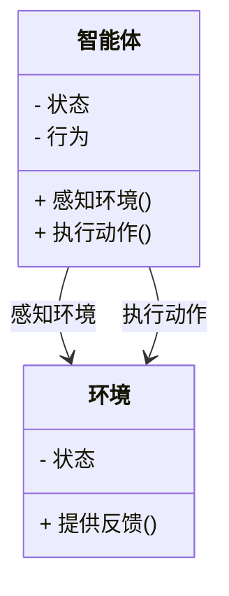

                 


# 多智能体系统在长期价值创造分析中的应用

## 关键词：多智能体系统, 长期价值创造, 强化学习, 分布式计算, 系统架构设计, 实际案例分析

## 摘要：  
本文探讨了多智能体系统（MAS）在长期价值创造分析中的应用，通过系统性分析MAS的核心概念、算法原理、系统架构及实际案例，揭示其在动态复杂环境下的协作与优化能力。文章结合理论与实践，为读者提供深入的技术见解，帮助理解和应用MAS技术。

---

# 第一部分：多智能体系统基础

## 第1章：多智能体系统概述

### 1.1 多智能体系统的基本概念

#### 1.1.1 多智能体系统的定义
多智能体系统（Multi-Agent System, MAS）是由多个智能体组成的分布式系统，这些智能体通过交互协作完成复杂任务。智能体（Agent）是具有感知、决策、执行能力的实体，能够独立工作并与其他智能体或环境交互。

#### 1.1.2 多智能体系统的特点
- **分布式**：多个智能体独立运行，无中心节点。
- **协作性**：智能体通过协作完成共同目标。
- **反应性**：智能体能够实时感知环境并做出反应。
- **动态性**：环境和任务可能动态变化。

#### 1.1.3 多智能体系统与单智能体系统的区别
| 属性         | 多智能体系统                    | 单智能体系统                    |
|--------------|-------------------------------|-------------------------------|
| 结构         | 分布式，多个智能体             | 集中式，单个智能体             |
| 协作         | 智能体之间协作完成任务         | 单个智能体独立完成任务         |
| 适应性       | 高，适应动态环境               | 中，依赖中心决策                |

### 1.2 多智能体系统的组成与结构

#### 1.2.1 智能体的基本组成
智能体由以下四个部分组成：
1. **感知**：获取环境信息（传感器、数据输入）。
2. **决策**：基于感知信息做出决策（状态机、规则引擎）。
3. **执行**：通过执行器或动作影响环境。
4. **通信**：与其他智能体或环境交互。

#### 1.2.2 多智能体系统的层次结构
多智能体系统通常分为以下层次：
1. **物理层**：智能体的物理实体和执行机构。
2. **感知层**：智能体的传感器和数据采集模块。
3. **认知层**：智能体的决策逻辑和知识表示。
4. **通信层**：智能体之间的信息交互和通信协议。

#### 1.2.3 多智能体系统的通信机制
通信机制包括：
1. **直接通信**：智能体之间直接交换信息。
2. **间接通信**：通过中间媒介（如共享数据库）进行信息交换。
3. **发布-订阅模型**：智能体发布事件，其他智能体订阅并接收。

### 1.3 多智能体系统的应用领域

#### 1.3.1 经济学中的应用
- **市场模拟**：模拟市场中的买家和卖家行为。
- **博弈论分析**：分析多方博弈中的策略选择。

#### 1.3.2 社会学中的应用
- **社会网络分析**：研究社交网络中的信息传播。
- **群体行为建模**：模拟群体行为和决策过程。

#### 1.3.3 管理学中的应用
- **组织协调**：优化组织内部资源分配和任务协作。
- **供应链管理**：优化供应链中的多方协作。

---

## 第2章：长期价值创造分析的背景与挑战

### 2.1 长期价值创造的定义

#### 2.1.1 价值创造的内涵
价值创造是指通过优化资源配置、提升效率、创新等方式为利益相关者创造更大的价值。长期价值创造强调在较长的时间跨度内持续创造价值。

#### 2.1.2 长期价值创造的特征
1. **持续性**：需要长期投入和积累。
2. **系统性**：涉及多方协作和资源优化。
3. **动态性**：适应环境变化和市场需求。

#### 2.1.3 长期价值创造的目标
1. **提升效率**：优化资源配置，降低成本。
2. **增强创新能力**：推动产品和服务创新。
3. **建立生态系统**：构建多方协作的生态系统。

### 2.2 长期价值创造中的问题与挑战

#### 2.2.1 信息不对称问题
- **信息分散**：多方参与者拥有分散信息，难以整合。
- **信息不透明**：信息传递过程中存在障碍，影响决策。

#### 2.2.2 协作与协调问题
- **协作复杂性**：多方协作涉及复杂的协调问题。
- **利益冲突**：不同参与者之间可能存在利益冲突。

#### 2.2.3 动态环境中的适应性问题
- **环境变化快**：市场需求和技术变化快，系统需要快速适应。
- **系统复杂性**：系统的复杂性增加适应和优化的难度。

### 2.3 多智能体系统在长期价值创造中的优势

#### 2.3.1 分布式决策的优势
- **去中心化决策**：避免单点故障，提高系统的鲁棒性。
- **局部优化**：每个智能体优化自身决策，整体实现全局最优。

#### 2.3.2 协作与协调的优势
- **智能体协作**：通过智能体之间的协作实现复杂任务。
- **动态适应**：智能体能够实时感知和适应环境变化。

#### 2.3.3 动态适应的优势
- **快速响应**：智能体能够快速响应环境变化。
- **自适应优化**：系统能够在动态环境中自动调整策略。

---

## 第3章：多智能体系统的概念模型

### 3.1 多智能体系统的概念属性对比

| 属性         | 智能体         | 系统           | 交互机制       |
|--------------|---------------|----------------|----------------|
| 组成         | 单个智能体     | 多个智能体     | 智能体之间     |
| 目标         | 完成特定任务   | 完成全局目标   | 协调完成目标   |
| 独立性       | 高度独立       | 分布式独立     | 相互依赖       |

### 3.2 多智能体系统的ER实体关系图

```mermaid
er
actor(智能体) -[参与]-> 系统: 参与系统运行
actor(智能体) -[通信]-> 其他智能体: 信息交互
系统 -[依赖]-> 环境: 获取环境信息
环境 -[影响]-> 系统: 环境变化影响系统
```

---

## 第4章：多智能体系统的算法原理

### 4.1 多智能体强化学习算法

#### 4.1.1 强化学习的基本原理
强化学习（Reinforcement Learning, RL）通过智能体与环境的交互，学习最优策略以最大化累计奖励。智能体通过试错方式探索环境，并根据奖励调整动作策略。

#### 4.1.2 多智能体强化学习的挑战
- **策略协调**：多个智能体之间需要协调策略，避免冲突。
- **信息共享**：智能体之间需要共享信息以实现协作。

#### 4.1.3 多智能体强化学习的实现
以下是一个简单的多智能体强化学习算法的Python代码示例：

```python
import numpy as np

class MultiAgentDQN:
    def __init__(self, num_agents, state_space, action_space):
        self.num_agents = num_agents
        self.state_space = state_space
        self.action_space = action_space
        # 初始化Q值表
        self.Q = np.zeros((num_agents, state_space, action_space))

    def choose_action(self, state, epsilon=0.1):
        if np.random.random() < epsilon:
            return np.random.randint(self.action_space)
        else:
            return np.argmax(self.Q[state])

    def update_Q(self, state, action, reward, next_state):
        gamma = 0.9
        alpha = 0.1
        # 更新Q值
        self.Q[state][action] += alpha * (reward + gamma * np.max(self.Q[next_state]) - self.Q[state][action])

# 示例用法
num_agents = 2
state_space = 5
action_space = 3
mas = MultiAgentDQN(num_agents, state_space, action_space)
action = mas.choose_action(0)
mas.update_Q(0, action, 1, 1)
```

#### 4.1.4 多智能体强化学习的数学模型
多智能体强化学习的数学模型可以表示为：

$$
Q(s, a) = Q(s, a) + \alpha \cdot (r + \gamma \cdot \max_{a'} Q(s', a') - Q(s, a))
$$

其中：
- \( s \) 表示状态
- \( a \) 表示动作
- \( r \) 表示奖励
- \( \gamma \) 表示折扣因子
- \( \alpha \) 表示学习率

---

### 4.2 分布式计算与协调机制

#### 4.2.1 分布式计算的基本原理
分布式计算通过将任务分解到多个节点并行执行，提高计算效率。在多智能体系统中，分布式计算用于优化资源利用和任务分配。

#### 4.2.2 协调机制
协调机制包括：
1. **共识算法**：如拜占庭容错（Byzantine Fault Tolerance）。
2. **分布式协调**：通过消息传递实现智能体之间的协作。

#### 4.2.3 分布式计算的实现
以下是一个简单的分布式任务分配算法的Python代码示例：

```python
import threading

class DistributedSystem:
    def __init__(self, num_agents):
        self.num_agents = num_agents
        self.tasks = []

    def distribute_task(self, task):
        self.tasks.append(task)
        for _ in range(self.num_agents):
            thread = threading.Thread(target=self.process_task)
            thread.start()

    def process_task(self):
        while True:
            if self.tasks:
                task = self.tasks.pop()
                self.execute_task(task)
                break

    def execute_task(self, task):
        # 具体任务执行逻辑
        print(f"Executing task: {task}")

# 示例用法
ds = DistributedSystem(3)
ds.distribute_task("Task 1")
ds.distribute_task("Task 2")
```

---

## 第5章：系统分析与架构设计

### 5.1 问题场景介绍

#### 5.1.1 问题背景
在长期价值创造分析中，需要优化多方协作，提升整体效率。例如，在供应链管理中，优化供应商、制造商、分销商之间的协作。

#### 5.1.2 问题描述
现有系统存在信息不对称、协作效率低、适应性差等问题，难以实现长期价值创造。

### 5.2 项目介绍

#### 5.2.1 项目目标
构建一个多智能体系统，优化多方协作，实现长期价值创造。

#### 5.2.2 项目范围
涵盖智能体设计、交互机制设计、系统架构设计等方面。

### 5.3 系统功能设计

#### 5.3.1 领域模型
领域模型（Domain Model）描述了系统中的实体及其关系。以下是领域模型的Mermaid类图：



### 5.4 系统架构设计

#### 5.4.1 系统架构
以下是系统架构的Mermaid图：


---

## 第6章：项目实战

### 6.1 环境配置

#### 6.1.1 安装依赖
```bash
pip install numpy
pip install matplotlib
```

#### 6.1.2 运行环境
- 操作系统：Linux/Windows/MacOS
- 语言：Python 3.8+

### 6.2 系统核心实现

#### 6.2.1 核心代码
```python
import numpy as np
import matplotlib.pyplot as plt

class MultiAgentSystem:
    def __init__(self, num_agents):
        self.num_agents = num_agents
        self.states = np.zeros(num_agents)
        self.rewards = np.zeros(num_agents)

    def step(self, actions):
        # 更新状态和奖励
        self.states = self.states + actions
        self.rewards = np.random.randn(self.num_agents)

    def get_reward(self):
        return self.rewards

# 示例用法
mas = MultiAgentSystem(3)
actions = np.array([1, 2, 3])
mas.step(actions)
rewards = mas.get_reward()
plt.bar(range(mas.num_agents), rewards)
plt.show()
```

---

## 第7章：总结与展望

### 7.1 总结
本文详细探讨了多智能体系统在长期价值创造分析中的应用，通过系统性分析MAS的核心概念、算法原理、系统架构及实际案例，揭示其在动态复杂环境下的协作与优化能力。

### 7.2 注意事项
- **数据隐私**：在MAS中，智能体之间的信息交互可能涉及数据隐私问题，需要采取适当的数据保护措施。
- **系统安全**：MAS的分布式特性可能增加系统的攻击面，需要注意系统安全。

### 7.3 未来展望
- **智能体协作优化**：进一步研究MAS中智能体协作的优化算法。
- **动态环境适应**：探索MAS在更复杂动态环境中的适应性。
- **多模态数据处理**：研究MAS在处理多模态数据方面的应用。

### 7.4 拓展阅读
- **《Multi-Agent Systems: Algorithmic, Complexity Theoretic, and Game Theoretic Foundations》**
- **《Reinforcement Learning: Theory and Algorithms》**

---

## 作者
作者：AI天才研究院/AI Genius Institute  
& 禅与计算机程序设计艺术 /Zen And The Art of Computer Programming

