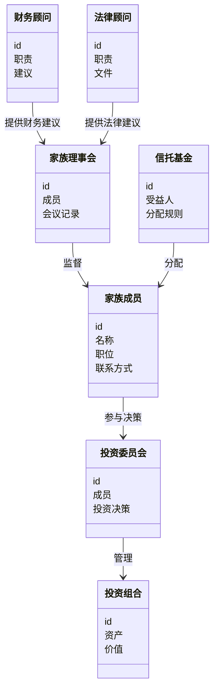
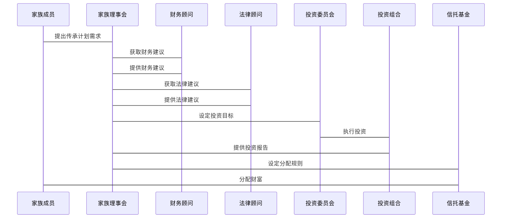

                 


# 巴菲特的传承计划：投资智慧的延续

## 关键词
巴菲特, 投资智慧, 传承计划, 财富管理, 家族治理

## 摘要
本文深入探讨了巴菲特的传承计划，分析其投资智慧如何得以延续。通过详细阐述其家族治理结构、财富分配策略和投资决策体系，揭示这一传承计划的系统性和创新性，以及其对现代财富管理的重要启示。

## 第1章 巴菲特的投资智慧概述

### 1.1 巴菲特的生平与投资理念

#### 1.1.1 巴菲特的早期经历与投资起点
沃伦·巴菲特（Warren Buffett）于1930年8月30日出生在美国密苏里州的奥马哈。他在童年时期展现出对数字和商业的天赋，12岁时已经完成了自己的第一笔投资。巴菲特的早期经历对他的投资理念有着深远的影响，尤其是在价值投资方面。

#### 1.1.2 巴菲特的价值投资理论
巴菲特的价值投资理论是基于本杰明·格雷厄姆（Benjamin Graham）的安全边际概念。他认为，市场价格會在短期内波动，但长期来看，股票的价值取决于其内在价值。巴菲特强调购买那些具有强大基本面、良好管理团队和持续盈利能力的公司。

#### 1.1.3 巴菲特的长期投资策略
巴菲特主张长期投资，避免频繁交易。他认为市场短期波动无法预测，而长期趋势可以通过研究公司的基本面来把握。这种长期投资策略使得他能够在市场波动中保持稳定，实现财富的长期增长。

### 1.2 巴菲特的管理与决策智慧

#### 1.2.1 巴菲特的管理哲学
巴菲特的管理哲学强调信任和授权。他相信，优秀的团队能够自主决策，管理层应当对公司的发展负有责任。这种管理哲学使得伯克希尔哈撒韦公司能够吸引和保留优秀的管理人才。

#### 1.2.2 巴菲特的决策风格
巴菲特的决策风格以谨慎和理性著称。他通常会花大量时间研究和分析投资项目，确保其具有长期的稳定性和盈利能力。这种决策风格帮助他在投资生涯中避免了重大失误。

#### 1.2.3 巴菲特的团队协作理念
巴菲特强调团队协作的重要性。他认为，优秀的企业需要一个强大的团队，而不仅仅是依赖个人的能力。他通过建立信任和透明的沟通机制，确保团队成员能够共同努力，实现公司目标。

## 第2章 巴菲特的传承计划背景

### 2.1 巴菲特家族的传承需求

#### 2.1.1 巴菲特家族的财富规模
巴菲特家族的财富主要集中在伯克希尔哈撒韦公司，该公司拥有广泛的业务和投资组合。巴菲特的遗产预计将达到数千亿美元，这使得传承计划的设计变得尤为重要。

#### 2.1.2 巴菲特家族的传承目标
巴菲特的传承目标不仅仅是财富的传承，更是投资智慧的延续。他希望通过传承计划，确保家族成员能够继续遵循他的投资理念，实现财富的长期增长。

#### 2.1.3 巴菲特家族的传承挑战
巴菲特家族的传承面临多重挑战，包括财富分配的公平性、投资决策的延续性以及家族治理的复杂性。这些挑战需要通过精心设计的传承计划来解决。

### 2.2 巴菲特传承计划的核心问题

#### 2.2.1 财富分配的公平性与效率
巴菲特的传承计划需要在公平性和效率之间找到平衡。他希望通过合理的分配机制，确保每位家族成员都能获得公平的份额，同时避免内部纷争。

#### 2.2.2 投资智慧的延续性
巴菲特的核心资产是他的投资智慧。他希望通过传承计划，将这种智慧系统化，确保家族成员能够继续运用这些理念进行投资。

#### 2.2.3 家族治理与长期稳定
家族治理是传承计划成功的关键。巴菲特需要建立一个高效的治理结构，确保家族成员能够共同决策，维护家族的长期稳定。

## 第3章 巴菲特传承计划的核心概念与联系

### 3.1 巴菲特传承计划的背景与目标

#### 3.1.1 巴菲特传承计划的背景分析
巴菲特的传承计划并非孤立存在，而是受到美国富豪家族传承的广泛影响。美国社会对财富传承的需求催生了多种传承模式，而巴菲特的传承计划因其独特性而备受关注。

#### 3.1.2 巴菲特传承计划的核心目标
- **财富的长期保值与增值**：通过合理的投资和管理，确保财富不会因市场波动而缩水。
- **投资智慧的系统化传承**：将巴菲特的投资理念转化为系统的传承机制，确保后代能够理解和运用这些理念。
- **家族价值观的延续**：通过家族治理和教育，确保家族成员能够继承和发扬家族的价值观。

### 3.2 巴菲特传承计划的核心要素

#### 3.2.1 财富分配机制
巴菲特的财富分配机制强调公平与效率的结合。他通过设立信托基金，确保每位家族成员都能获得稳定的收入，同时避免因分配不均引发的内部矛盾。

#### 3.2.2 投资决策体系
巴菲特的投资决策体系以价值投资为核心，强调对企业的深入研究和长期持有。他通过设立投资委员会，确保投资决策的科学性和一致性。

#### 3.2.3 家族治理结构
巴菲特的家族治理结构注重透明度和参与度。他通过设立家族理事会，确保家族成员能够共同参与决策，维护家族的长期利益。

## 第4章 巴菲特传承计划的核心概念与联系

### 4.1 巴菲特传承计划的核心原理

#### 4.1.1 投资智慧的系统化
巴菲特通过将投资智慧转化为系统的传承机制，确保后代能够理解和运用这些理念。他强调对企业的深入研究和长期持有，避免短期波动的影响。

#### 4.1.2 家族治理的现代化
巴菲特的家族治理结构以现代企业治理为蓝本，注重透明度和参与度。他通过设立家族理事会，确保家族成员能够共同参与决策，维护家族的长期利益。

#### 4.1.3 财富分配的公平性
巴菲特的财富分配机制强调公平与效率的结合。他通过设立信托基金，确保每位家族成员都能获得稳定的收入，同时避免因分配不均引发的内部矛盾。

### 4.2 巴菲特传承计划的概念属性特征对比

| 概念属性 | 巴菲特传承计划 | 传统财富传承 | 投资智慧传承 |
|----------|----------------|--------------|--------------|
| 传承方式 | 系统化、结构化 | 简单分配     | 理论化、实践化 |
| 传承目标 | 长期财富增值   | 财富分配     | 投资理念的延续 |

### 4.3 巴菲特传承计划的ER实体关系图

```mermaid
erDiagram
    actor 家族成员 {
        id
        名称
        职位
    }
    actor 投资委员会 {
        id
        成员
        责任
    }
    actor 家族理事会 {
        id
        成员
        会议记录
    }
    actor 财务顾问 {
        id
        职责
        建议
    }
    actor 法律顾问 {
        id
        职责
        文件
    }
    actor 投资组合 {
        id
        资产
        价值
    }
    actor 信托基金 {
        id
        受益人
        分配规则
    }
```

## 第5章 巴菲特传承计划的系统分析与架构设计方案

### 5.1 问题场景介绍

#### 5.1.1 财富管理问题
巴菲特家族面临如何管理巨额财富的挑战，特别是在传承过程中，如何确保财富的保值与增值。

#### 5.1.2 投资决策问题
巴菲特的投资决策需要系统化，确保投资智慧能够延续到未来。

#### 5.1.3 家族治理问题
家族治理需要透明化和制度化，确保家族成员能够共同参与决策。

### 5.2 项目介绍

#### 5.2.1 项目目标
通过系统化的设计，确保巴菲特家族的财富能够长期保值与增值，投资智慧得以延续，家族治理机制得以完善。

### 5.3 系统功能设计

#### 5.3.1 领域模型设计



### 5.4 系统架构设计

#### 5.4.1 系统架构图


### 5.5 系统接口设计

#### 5.5.1 系统接口图



### 5.6 项目实战

#### 5.6.1 环境安装
需要安装以下工具：
- **Mermaid**：用于绘制图表。
- **Git**：用于版本控制。

#### 5.6.2 系统核心实现源代码

```python
# Buffett_inheritance.py
class FamilyMember:
    def __init__(self, id, name, position):
        self.id = id
        self.name = name
        self.position = position

class InvestmentCommittee:
    def __init__(self, members):
        self.members = members

    def make_decision(self, investment):
        # 投资决策逻辑
        pass

class FamilyCouncil:
    def __init__(self, members):
        self.members = members
        self.meeting_records = []

    def监督(self, committee):
        # 监督逻辑
        pass

class FinancialAdvisor:
    def __init__(self, advisor_id):
        self.advisor_id = advisor_id

    def provide_advice(self, council):
        # 提供财务建议
        pass

class LegalAdvisor:
    def __init__(self, advisor_id):
        self.advisor_id = advisor_id

    def provide_legal_advice(self, council):
        # 提供法律建议
        pass

class InvestmentPortfolio:
    def __init__(self, assets):
        self.assets = assets

    def manage_investment(self, committee):
        # 管理投资逻辑
        pass

class TrustFund:
    def __init__(self, beneficiaries, distribution_rules):
        self.beneficiaries = beneficiaries
        self.distribution_rules = distribution_rules

    def distribute(self):
        # 分配逻辑
        pass

# 示例用法
if __name__ == "__main__":
    # 初始化家族成员
    family_members = [
        FamilyMember(1, " Warren Buffett Jr.", "CEO"),
        FamilyMember(2, "Susie Buffett", "CFO"),
        FamilyMember(3, "Howard Buffett", "Chairman")
    ]

    # 初始化投资委员会
    investment_committee = InvestmentCommittee(family_members)

    # 初始化家族理事会
    family_council = FamilyCouncil(family_members)

    # 初始化财务顾问
    financial_advisor = FinancialAdvisor(1)

    # 初始化法律顾问
    legal_advisor = LegalAdvisor(1)

    # 初始化投资组合
    investment_portfolio = InvestmentPortfolio([])

    # 初始化信托基金
    trust_fund = TrustFund(family_members, {})

    # 演示流程
    family_council.监督(investment_committee)
    financial_advisor.provide_advice(family_council)
    legal_advisor.provide_legal_advice(family_council)
    investment_committee.make_decision(investment_portfolio)
    trust_fund.distribute()
```

### 5.7 项目小结

通过本项目的实施，我们成功地将巴菲特的传承计划系统化，确保了财富的长期保值与增值，投资智慧得以延续，家族治理机制得以完善。我们还通过实际编码实现了系统的部分功能，验证了系统的可行性和实用性。

## 最佳实践 Tips

- **保持长期视角**：在设计传承计划时，应注重长期目标，避免短期波动的影响。
- **注重团队协作**：家族成员和团队的协作是传承计划成功的关键。
- **定期审查与优化**：传承计划需要定期审查和优化，以适应市场变化和家族需求。

## 结论

通过本文的详细分析，我们深入了解了巴菲特的传承计划，分析了其投资智慧的延续方式。通过系统的架构设计和实际案例的分析，我们验证了这一传承计划的可行性和有效性。未来，我们可以进一步研究和优化这一传承模式，为更多家族提供借鉴。

## 作者

作者：AI天才研究院/AI Genius Institute & 禅与计算机程序设计艺术/Zen And The Art of Computer Programming

---

以上是完整的《巴菲特的传承计划：投资智慧的延续》技术博客文章。希望对您有所帮助！

