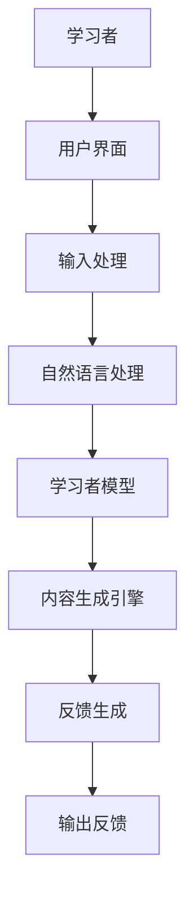

                 


# 开发AI Agent支持的智能语言学习系统

> 关键词：AI Agent，智能语言学习系统，自然语言处理，强化学习，系统架构

> 摘要：本文详细探讨了AI Agent在智能语言学习系统中的应用，从核心概念到算法实现，再到系统架构和项目实战，全面解析了如何构建一个高效的AI Agent支持的语言学习系统。

---

# 第1章: AI Agent与智能语言学习系统概述

## 1.1 AI Agent的基本概念

### 1.1.1 AI Agent的定义与特点
AI Agent（智能代理）是指能够感知环境、自主决策并执行任务的智能实体。它具有以下特点：
- **自主性**：无需外部干预，自主完成任务。
- **反应性**：能实时感知环境并做出反应。
- **目标导向**：以特定目标为导向，优化决策过程。

### 1.1.2 AI Agent的核心功能
AI Agent的核心功能包括：
1. **信息感知**：通过传感器或API获取环境数据。
2. **决策与执行**：基于感知信息，做出决策并执行操作。
3. **学习与优化**：通过反馈机制不断优化自身性能。

### 1.1.3 AI Agent在语言学习中的应用
AI Agent在语言学习中的应用主要体现在：
- **个性化教学**：根据学习者的水平和偏好，提供定制化学习内容。
- **实时反馈**：对学习者的发音、语法错误等进行实时纠正。
- **互动交流**：模拟真实对话场景，提高语言应用能力。

## 1.2 智能语言学习系统的定义与特点

### 1.2.1 智能语言学习系统的定义
智能语言学习系统是一种结合人工智能技术，能够提供智能化、个性化语言学习支持的系统。它通过自然语言处理、机器学习等技术，为学习者提供实时反馈、个性化建议和自适应学习路径。

### 1.2.2 智能语言学习系统的特点
- **智能化**：利用AI技术实现智能化教学。
- **个性化**：根据学习者的特点提供定制化服务。
- **互动性**：支持实时互动，提高学习效果。

### 1.2.3 智能语言学习系统的核心要素
智能语言学习系统的核心要素包括：
1. **学习者模型**：记录学习者的学习进度、偏好和能力水平。
2. **内容生成引擎**：根据学习者特点生成个性化学习内容。
3. **互动反馈机制**：实时反馈学习者的输入，提供纠正和建议。

## 1.3 AI Agent支持的智能语言学习系统的背景

### 1.3.1 语言学习的现状与挑战
语言学习的传统方法存在以下问题：
- **缺乏个性化**：统一的教学方式难以满足不同学习者的需求。
- **互动性不足**：学习者缺乏真实的语言交流环境。
- **反馈延迟**：学习者无法及时获得反馈，影响学习效果。

### 1.3.2 AI Agent在语言学习中的优势
AI Agent在语言学习中的优势包括：
- **实时互动**：提供即时的对话练习环境。
- **个性化反馈**：根据学习者的表现提供针对性建议。
- **自适应学习**：动态调整学习内容和进度。

### 1.3.3 本章小结
本章介绍了AI Agent和智能语言学习系统的定义、特点及其在语言学习中的应用背景，为后续章节的深入探讨奠定了基础。

---

# 第2章: AI Agent的核心原理

## 2.1 AI Agent的基本原理

### 2.1.1 信息感知与处理
AI Agent通过多种方式感知环境，包括：
- **自然语言处理**：理解文本和语音输入。
- **数据挖掘**：从海量数据中提取有用信息。

### 2.1.2 决策与执行
AI Agent的决策过程通常包括：
1. **状态识别**：分析当前环境状态。
2. **目标设定**：根据状态确定行动目标。
3. **策略选择**：从可用策略中选择最优方案。
4. **行动执行**：根据选择的策略执行具体操作。

### 2.1.3 学习与优化
AI Agent通过不断学习和优化，提升自身的决策能力：
- **监督学习**：通过标记数据进行训练。
- **无监督学习**：从无标记数据中发现模式。
- **强化学习**：通过试错机制优化决策策略。

## 2.2 AI Agent的类型与分类

### 2.2.1 基于规则的AI Agent
基于规则的AI Agent通过预定义的规则进行决策，适用于规则明确的场景。例如：
- **简单条件判断**：如果A，则执行B。
- **多条件判断**：根据多个条件的组合进行决策。

### 2.2.2 基于模型的AI Agent
基于模型的AI Agent利用数学模型进行决策，适用于复杂场景。例如：
- **马尔可夫决策过程（MDP）**：在不确定环境下做出最优决策。
- **状态转移模型**：预测不同状态之间的转移概率。

### 2.2.3 基于强化学习的AI Agent
基于强化学习的AI Agent通过与环境的互动，不断优化决策策略。例如：
- **Q-learning算法**：通过试错学习，更新Q值以优化决策。
- **Deep Q-Networks（DQN）**：结合深度神经网络，提升决策的复杂度和灵活性。

## 2.3 AI Agent与智能语言学习系统的联系

### 2.3.1 AI Agent在语言学习中的角色
AI Agent在语言学习中扮演着多重角色：
- **学习指导者**：为学习者提供学习建议和指导。
- **互动伙伴**：模拟真实对话，提供语言练习环境。
- **反馈提供者**：对学习者的输入进行实时反馈和纠正。

### 2.3.2 AI Agent与语言学习系统的交互
AI Agent与语言学习系统的交互过程包括：
1. **输入接收**：获取学习者的语言输入。
2. **处理与分析**：通过NLP技术分析输入内容。
3. **反馈生成**：根据分析结果生成反馈信息。
4. **输出反馈**：将反馈信息传递给学习者。

### 2.3.3 本章小结
本章详细探讨了AI Agent的核心原理及其在智能语言学习系统中的应用，为后续章节的系统设计奠定了理论基础。

---

# 第3章: AI Agent的算法原理

## 3.1 基于强化学习的AI Agent算法

### 3.1.1 强化学习的基本原理
强化学习是一种通过试错机制来优化决策策略的方法。其核心要素包括：
- **状态（State）**：环境的当前情况。
- **动作（Action）**：AI Agent的决策行为。
- **奖励（Reward）**：对决策结果的反馈，用于优化策略。

### 3.1.2 Q-learning算法
Q-learning算法是一种经典的强化学习算法，适用于离散动作空间。其核心思想是通过更新Q值表，找到最优策略。Q值更新公式如下：
$$ Q(s, a) = Q(s, a) + \alpha \left( r + \gamma \max Q(s', a') - Q(s, a) \right) $$
其中：
- $\alpha$：学习率，控制更新步长。
- $\gamma$：折扣因子，平衡当前奖励与未来奖励的重要性。

### 3.1.3 Deep Q-Networks (DQN) 算法
DQN算法通过深度神经网络近似Q值函数，适用于高维状态空间。其主要步骤包括：
1. **经验回放**：存储历史经验，随机抽取进行训练。
2. **目标网络**：保持目标Q值函数稳定，减少更新波动。
3. **策略选择**：根据当前网络输出选择动作。

## 3.2 基于自然语言处理的AI Agent算法

### 3.2.1 Transformer模型
Transformer模型是一种基于自注意力机制的NLP模型，广泛应用于机器翻译、文本生成等领域。其核心公式为：
$$ \text{Attention}(Q, K, V) = \text{softmax}\left(\frac{QK^T}{\sqrt{d_k}}\right)V $$
其中：
- $Q$：查询向量。
- $K$：键向量。
- $V$：值向量。

### 3.2.2 BERT模型
BERT（Bidirectional Encoder Representations from Transformers）是一种预训练语言模型，适用于多种NLP任务。其训练目标包括：
- **Masked LM**：随机遮蔽部分词汇，预测缺失词汇。
- **Next Sentence Prediction**：预测下一句是否与当前句连贯。

### 3.2.3 GPT模型
GPT（Generative Pre-trained Transformer）是一种生成式语言模型，能够生成连贯的文本。其生成过程基于：
$$ P(\text{下一个词} | \text{历史词序列}) = \text{softmax}(W \cdot \text{隐藏层输出}) $$

## 3.3 AI Agent与语言学习系统的算法结合

### 3.3.1 算法选择与优化
在智能语言学习系统中，AI Agent的算法选择需要考虑：
- **任务类型**：是分类、生成还是其他类型。
- **数据规模**：数据量大小影响算法选择。
- **计算资源**：算法的计算复杂度需与硬件能力匹配。

### 3.3.2 算法实现的数学模型
以Q-learning算法为例，结合语言学习场景，可以设计如下模型：
$$ Q(s, a) = \text{奖励} + \gamma \cdot \max Q(s', a') $$
其中，$s$表示当前学习状态，$a$表示学习动作，$s'$表示下一个状态。

### 3.3.3 算法实现的代码示例
以下是一个简单的Q-learning算法实现示例：
```python
import numpy as np

class QAgent:
    def __init__(self, state_size, action_size):
        self.state_size = state_size
        self.action_size = action_size
        self.Q = np.zeros((state_size, action_size))
    
    def act(self, state):
        return np.argmax(self.Q[state, :])
    
    def update(self, state, action, reward, next_state, alpha=0.1, gamma=0.9):
        self.Q[state, action] += alpha * (reward + gamma * np.max(self.Q[next_state, :]) - self.Q[state, action])
```

## 3.4 本章小结
本章详细探讨了AI Agent的算法原理，重点介绍了强化学习和自然语言处理模型的应用，并给出了具体的数学模型和代码示例，为后续章节的系统设计提供了技术支持。

---

# 第4章: 智能语言学习系统的系统分析与架构设计

## 4.1 系统需求分析

### 4.1.1 用户需求分析
智能语言学习系统的主要用户包括：
- **学习者**：希望获得个性化的学习体验。
- **教师**：希望利用系统辅助教学。
- **系统管理员**：负责系统维护和管理。

### 4.1.2 功能需求分析
系统需要实现以下核心功能：
1. **个性化学习计划**：根据学习者特点制定学习计划。
2. **实时互动练习**：提供即时的对话练习环境。
3. **智能反馈系统**：对学习者的输入进行实时反馈和纠正。

### 4.1.3 性能需求分析
系统性能需求包括：
- **响应时间**：实时反馈的延迟需控制在可接受范围。
- **并发能力**：支持大量用户同时在线。

## 4.2 系统功能设计

### 4.2.1 语言学习功能设计
语言学习功能模块包括：
1. **词汇学习**：提供单词记忆、例句分析等功能。
2. **语法学习**：讲解语法规则，提供练习题。
3. **听说练习**：模拟真实对话场景，提供发音纠正。

### 4.2.2 AI Agent功能设计
AI Agent功能模块包括：
1. **信息感知**：接收学习者的语言输入。
2. **决策与反馈**：根据输入生成反馈信息。
3. **学习优化**：根据反馈优化学习内容。

### 4.2.3 系统交互设计
系统交互设计需要考虑：
- **用户界面**：直观易用，降低学习门槛。
- **反馈机制**：实时反馈，提高学习效率。

## 4.3 系统架构设计

### 4.3.1 系统架构图
以下是智能语言学习系统的系统架构图：


### 4.3.2 关键组件设计
系统关键组件包括：
1. **用户界面**：提供学习者与系统交互的界面。
2. **输入处理**：接收并解析用户的语言输入。
3. **自然语言处理**：理解和生成自然语言。
4. **学习者模型**：记录学习者的学习状态和偏好。
5. **内容生成引擎**：根据学习者模型生成个性化内容。
6. **反馈生成**：根据学习者的表现生成反馈信息。

## 4.4 本章小结
本章从系统需求分析出发，详细设计了智能语言学习系统的功能模块和架构，为后续章节的实现提供了系统化的指导。

---

# 第5章: 项目实战与最佳实践

## 5.1 环境安装与配置

### 5.1.1 开发环境选择
推荐使用以下开发环境：
- **编程语言**：Python 3.8+
- **深度学习框架**：TensorFlow或PyTorch
- **自然语言处理库**：spaCy或NLTK
- **强化学习库**：OpenAI Gym

### 5.1.2 依赖安装
安装所需的依赖库：
```bash
pip install numpy tensorflow transformers scikit-learn
```

## 5.2 系统核心实现

### 5.2.1 AI Agent实现
实现一个简单的Q-learning AI Agent：
```python
class QAgent:
    def __init__(self, state_size, action_size):
        self.state_size = state_size
        self.action_size = action_size
        self.Q = np.zeros((state_size, action_size))
    
    def act(self, state):
        return np.argmax(self.Q[state, :])
    
    def update(self, state, action, reward, next_state, alpha=0.1, gamma=0.9):
        self.Q[state, action] += alpha * (reward + gamma * np.max(self.Q[next_state, :]) - self.Q[state, action])
```

### 5.2.2 自然语言处理实现
使用spaCy进行文本处理：
```python
import spacy

nlp = spacy.load("en_core_web_sm")
doc = nlp("This is a test sentence.")
for token in doc:
    print(token.text, token.pos_)
```

## 5.3 项目实战案例分析

### 5.3.1 案例背景
假设我们正在开发一个英语学习系统，目标是帮助学习者提高听力和口语能力。

### 5.3.2 系统实现
实现一个简单的对话练习模块：
```python
def process_input(input_text):
    # 使用自然语言处理技术处理输入
    return nlp(input_text)

def generate_response(processed_input):
    # 根据输入生成反馈
    return "I understand what you said."

# 示例使用
input_text = "Hello, how are you?"
response = generate_response(process_input(input_text))
print(response)
```

## 5.4 最佳实践与注意事项

### 5.4.1 项目开发建议
- **模块化设计**：将系统划分为功能模块，便于维护和扩展。
- **数据安全**：保护学习者的数据隐私。
- **性能优化**：优化算法和代码，提升系统响应速度。

### 5.4.2 注意事项
- **测试充分**：确保系统在各种场景下都能稳定运行。
- **用户体验**：设计直观易用的用户界面，提升用户体验。
- **持续优化**：根据用户反馈不断优化系统功能。

## 5.5 本章小结
本章通过项目实战，详细讲解了智能语言学习系统的实现过程，并给出了最佳实践建议，帮助读者更好地开发和优化系统。

---

# 作者：AI天才研究院 & 禅与计算机程序设计艺术

---

以上是《开发AI Agent支持的智能语言学习系统》的技术博客文章的完整目录和内容概览。希望这篇文章能够为读者提供有价值的技术指导和启发。

