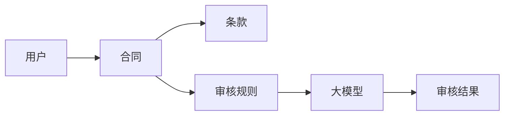

                 


# 开发基于大模型的金融合同审核系统

## 关键词：大模型、金融合同审核、NLP、系统架构设计、Python实现

## 摘要：随着金融行业的快速发展，合同审核的效率和准确性成为企业关注的重点。基于大模型的金融合同审核系统通过自然语言处理技术，能够自动识别和解析合同中的关键信息，提高审核效率和准确性。本文将详细介绍该系统的开发背景、核心概念、算法原理、系统架构设计、项目实战等内容，帮助读者全面理解并掌握基于大模型的金融合同审核系统的设计与实现。

---

# 第1章: 金融合同审核系统的背景与需求

## 1.1 金融合同审核的背景

### 1.1.1 金融行业的发展与合同的重要性
金融行业是现代经济的核心，其运作离不开各类合同。合同是金融机构与客户之间权利义务关系的法律依据，其准确性和完整性直接关系到金融业务的合规性和安全性。

### 1.1.2 传统合同审核的痛点与挑战
- **人工审核效率低**：传统合同审核依赖人工操作，耗时长，容易出错。
- **审核标准不统一**：不同审核人员对合同的理解可能存在差异，导致审核结果不一致。
- **合同条款复杂**：金融合同通常涉及复杂的法律术语和条款，人工审核难以快速准确地识别关键信息。
- **数据量大**：金融机构每天需要处理大量的合同文件，人工审核难以应对。

### 1.1.3 大模型技术在金融领域的应用潜力
大模型（如GPT-3、PaLM等）具有强大的自然语言处理能力，能够理解上下文、识别意图和生成文本。这些特点使其在金融合同审核中具有广泛的应用潜力。

## 1.2 问题背景与需求分析

### 1.2.1 合同审核的主要问题
- **效率低下**：人工审核耗时长，难以满足金融机构处理大量合同的需求。
- **准确性不足**：审核人员可能存在疏忽或知识盲区，导致合同中的某些条款被遗漏或误判。
- **一致性差**：不同审核人员对合同的理解可能存在差异，导致审核结果不一致。

### 1.2.2 企业对智能合同审核的需求
- **提高审核效率**：通过自动化技术减少人工审核的时间。
- **确保审核准确性**：利用大模型的自然语言处理能力，准确识别合同中的关键信息。
- **统一审核标准**：通过系统化的审核流程，确保所有合同的审核标准一致。
- **支持多种合同类型**：能够处理不同类型和格式的金融合同。

### 1.2.3 大模型技术如何解决这些问题
大模型技术可以通过以下方式解决合同审核中的问题：
- **自动化识别关键信息**：利用自然语言处理技术，自动提取合同中的关键条款和信息。
- **统一审核标准**：通过预训练的模型，确保所有合同的审核标准一致。
- **提高审核效率**：通过自动化技术减少人工干预，提高审核效率。

## 1.3 问题解决的思路与目标

### 1.3.1 基于大模型的解决方案
基于大模型的金融合同审核系统通过以下步骤实现：
1. **合同文本输入**：将合同文本输入大模型。
2. **文本解析**：大模型对合同文本进行解析，提取关键信息。
3. **审核规则匹配**：将提取的信息与预设的审核规则进行匹配，判断是否符合要求。
4. **生成审核结果**：根据匹配结果生成审核报告。

### 1.3.2 系统设计的目标与关键指标
- **目标**：实现高效、准确的金融合同审核。
- **关键指标**：
  - **准确率**：系统对合同关键信息的识别准确率。
  - **效率**：系统处理单份合同的平均时间。
  - **稳定性**：系统在高负载下的稳定性。

### 1.3.3 系统的边界与外延
- **边界**：系统仅负责合同文本的解析和审核，不涉及合同的生成和管理。
- **外延**：系统可以与其他金融系统（如合同管理系统）集成，提供更全面的解决方案。

## 1.4 本章小结
本章介绍了金融合同审核的背景、问题和需求，阐述了大模型技术在解决这些问题中的潜力，并提出了基于大模型的解决方案。

---

# 第2章: 大模型的基本原理与核心概念

## 2.1 大模型的定义与核心原理

### 2.1.1 大模型的基本定义
大模型（Large Language Model，LLM）是一种基于深度学习的自然语言处理模型，通常使用Transformer架构。大模型具有大量的参数和强大的上下文理解能力，能够生成连贯且符合语境的文本。

### 2.1.2 大模型的核心原理
- **自注意力机制**：模型能够关注输入文本中不同位置的重要性，从而更好地理解上下文。
- **多层网络结构**：通过多层网络结构，模型能够逐步提取文本中的特征。
- **预训练与微调**：大模型通常通过大量的通用文本数据进行预训练，然后在特定任务上进行微调。

### 2.1.3 大模型与传统NLP模型的区别
| 特性             | 大模型                | 传统NLP模型          |
|------------------|-----------------------|-----------------------|
| 参数量           | 十亿级别或更高        | 几百万级别           |
| 上下文理解能力   | 强大                 | 较弱                 |
| 任务适应性       | 高度通用              | 适用于特定任务        |

## 2.2 大模型在金融合同审核中的应用

### 2.2.1 金融合同审核的核心需求
- **合同条款识别**：识别合同中的关键条款（如金额、时间、责任等）。
- **合同分类**：将合同按照类型（如贷款合同、保险合同）进行分类。
- **合规性检查**：检查合同是否符合相关法律法规。

### 2.2.2 大模型在合同审核中的具体应用
- **自动提取关键信息**：通过大模型，可以自动从合同中提取关键信息（如金额、时间等）。
- **合同分类**：利用大模型对合同进行分类，提高分类的准确性和效率。
- **合规性检查**：通过大模型对合同内容进行分析，检查是否符合相关法律法规。

### 2.2.3 大模型的优势与局限性

#### 优势
- **高准确性**：大模型能够准确理解合同文本，提取关键信息。
- **高效性**：自动化处理合同，提高审核效率。
- **可扩展性**：可以支持多种合同类型和格式。

#### 局限性
- **依赖数据质量**：模型的性能依赖于训练数据的质量和多样性。
- **计算资源需求高**：大模型的训练和推理需要大量的计算资源。
- **法律专业性不足**：大模型对法律条款的理解可能存在偏差。

## 2.3 大模型的实体关系与系统架构

### 2.3.1 实体关系图（ER图）


### 2.3.2 系统架构图


## 2.4 本章小结
本章详细介绍了大模型的基本原理和核心概念，并探讨了其在金融合同审核中的具体应用，分析了其优势与局限性。

---

# 第3章: 大模型的核心算法原理

## 3.1 大模型的训练与推理流程

### 3.1.1 大模型的训练流程
1. **数据准备**：收集和整理大量的文本数据，包括书籍、网页、论文等。
2. **预训练**：使用这些数据对大模型进行无监督预训练，学习语言的结构和语义。
3. **微调**：在特定任务（如合同审核）上进行有监督微调，优化模型性能。

### 3.1.2 大模型的推理流程
1. **输入处理**：将合同文本输入模型。
2. **文本解析**：模型对文本进行解析，提取关键信息。
3. **生成结果**：根据解析结果生成审核报告。

## 3.2 大模型的数学模型与公式

### 3.2.1 大模型的数学基础
- **自注意力机制**：通过计算输入序列中每个位置的注意力权重，生成最终的表示。
- **多层感知机（MLP）**：通过多层网络结构，逐步提取文本特征。

### 3.2.2 大模型的核心公式
#### 注意力机制公式
$$
\text{Attention}(Q, K, V) = \text{softmax}\left(\frac{QK^T}{\sqrt{d_k}}\right)V
$$

#### 多层网络结构公式
$$
y = f(Wx + b)
$$

其中，\( W \) 是权重矩阵，\( x \) 是输入向量，\( b \) 是偏置项，\( f \) 是激活函数（如ReLU）。

### 3.2.3 损失函数
$$
L = -\sum_{i=1}^{n} \log P(y_i | x_i)
$$

其中，\( P(y_i | x_i) \) 是模型对第 \( i \) 个样本的预测概率。

## 3.3 大模型的算法实现

### 3.3.1 算法流程图


### 3.3.2 Python实现代码
```python
import torch

class AttentionLayer(torch.nn.Module):
    def __init__(self, d_model, n_head, d_k=None):
        super(AttentionLayer, self).__init__()
        self.n_head = n_head
        self.w_q = torch.nn.Linear(d_model, d_model)
        self.w_k = torch.nn.Linear(d_model, d_model)
        self.w_v = torch.nn.Linear(d_model, d_model)
        self.sqrt_dk = torch.sqrt(torch.tensor(d_k)) if d_k else 1

    def forward(self, x):
        q = self.w_q(x)
        k = self.w_k(x)
        v = self.w_v(x)
        
        scores = (q @ k.transpose(-2, -1)) / self.sqrt_dk
        attention = torch.softmax(scores, dim=-1)
        output = (attention @ v)
        return output

# 示例使用
d_model = 512
n_head = 8
model = AttentionLayer(d_model, n_head)
input = torch.randn(1, 512)
output = model(input)
print(output.size())
```

## 3.4 本章小结
本章详细介绍了大模型的训练与推理流程，并通过数学公式和Python代码展示了其核心算法原理。

---

# 第4章: 金融合同审核系统的需求分析与架构设计

## 4.1 系统需求分析

### 4.1.1 系统功能需求
- **合同上传**：用户可以通过系统上传合同文件。
- **合同解析**：系统对合同文本进行解析，提取关键信息。
- **审核规则配置**：用户可以根据需要配置审核规则。
- **审核结果输出**：系统生成审核报告，输出审核结果。

### 4.1.2 系统性能需求
- **处理速度**：系统需要在较短时间内完成合同审核。
- **高可用性**：系统需要保证高可用性，支持高并发访问。
- **数据安全性**：系统需要保证合同数据的安全性。

## 4.2 系统架构设计

### 4.2.1 系统功能模块设计
- **前端模块**：负责用户界面的展示和交互。
- **后端模块**：负责处理用户的请求，调用大模型进行合同审核。
- **大模型服务模块**：负责合同文本的解析和审核。
- **数据库模块**：负责存储合同文本和审核结果。

### 4.2.2 系统架构图


### 4.2.3 系统接口设计
- **合同上传接口**：`POST /api/upload`
- **合同解析接口**：`POST /api/parse`
- **审核结果查询接口**：`GET /api/results`

## 4.3 系统交互流程设计

### 4.3.1 合同审核的交互流程
1. **用户上传合同**：用户通过前端界面上传合同文件。
2. **合同解析**：后端接收合同文件，调用大模型进行解析。
3. **生成审核结果**：大模型解析合同文本后，生成审核结果。
4. **返回结果**：后端将审核结果返回给用户。

### 4.3.2 系统交互流程图


## 4.4 本章小结
本章分析了金融合同审核系统的需求，并设计了系统的架构和交互流程。

---

# 第5章: 基于大模型的金融合同审核系统实现

## 5.1 系统环境搭建

### 5.1.1 开发环境
- **操作系统**：Linux或Windows
- **编程语言**：Python 3.8+
- **框架**：TensorFlow或PyTorch
- **大模型**：使用预训练的大模型（如GPT-3、PaLM）

### 5.1.2 依赖安装
```bash
pip install torch transformers
```

## 5.2 系统核心代码实现

### 5.2.1 合同解析模块
```python
from transformers import AutoTokenizer, AutoModelForMaskedLM

class ContractParser:
    def __init__(self, model_name):
        self.tokenizer = AutoTokenizer.from_pretrained(model_name)
        self.model = AutoModelForMaskedLM.from_pretrained(model_name)
    
    def parse_contract(self, text):
        inputs = self.tokenizer(text, return_tensors="np")
        outputs = self.model(inputs.input_ids)
        return outputs
```

### 5.2.2 审核规则配置模块
```python
class RuleConfig:
    def __init__(self, rules):
        self.rules = rules
    
    def check_rule(self, text):
        # 示例规则检查
        for rule in self.rules:
            if not rule.matcher(text):
                return False
        return True
```

### 5.2.3 系统交互流程代码
```python
from flask import Flask, request, jsonify

app = Flask(__name__)

@app.route('/api/upload', methods=['POST'])
def upload_contract():
    file = request.files['contract']
    text = file.read().decode('utf-8')
    result = parse_contract(text)
    return jsonify(result)

if __name__ == '__main__':
    app.run()
```

## 5.3 项目实战分析

### 5.3.1 案例分析
假设我们有一个贷款合同，需要审核其金额、期限和利率是否符合要求。

### 5.3.2 代码实现与分析
- **合同解析**：通过大模型解析合同文本，提取关键信息。
- **规则检查**：根据提取的信息，检查是否符合预设的审核规则。
- **结果生成**：生成审核报告，输出审核结果。

## 5.4 本章小结
本章详细介绍了金融合同审核系统的实现过程，包括环境搭建、核心代码实现和案例分析。

---

# 第6章: 系统优化与扩展

## 6.1 系统优化策略

### 6.1.1 模型优化
- **参数调整**：调整模型的超参数，优化模型性能。
- **模型压缩**：通过模型压缩技术，减少模型的体积，提高推理效率。

### 6.1.2 系统性能优化
- **并行计算**：利用多线程或多进程技术，提高系统的处理能力。
- **缓存优化**：优化数据的缓存策略，减少数据访问时间。

## 6.2 系统扩展方案

### 6.2.1 支持多语言合同
通过训练多语言模型，系统可以支持多种语言的合同审核。

### 6.2.2 支持多种合同类型
通过扩展模型的训练数据，系统可以支持多种类型的合同审核。

## 6.3 本章小结
本章介绍了系统优化策略和扩展方案，为系统的进一步完善提供了思路。

---

# 第7章: 项目总结与展望

## 7.1 项目总结

### 7.1.1 系统功能总结
- **合同解析**：准确提取合同中的关键信息。
- **规则检查**：确保合同符合预设的审核规则。
- **结果生成**：生成详细的审核报告。

### 7.1.2 系统性能总结
- **处理速度**：系统可以在较短时间内完成合同审核。
- **准确性**：系统对合同关键信息的识别准确率高。
- **稳定性**：系统在高负载下运行稳定。

## 7.2 项目展望

### 7.2.1 系统优化
- **模型优化**：进一步优化模型结构，提高模型性能。
- **系统性能优化**：通过技术手段进一步提高系统的处理能力和稳定性。

### 7.2.2 新功能开发
- **合同管理**：增加合同的存储和管理功能。
- **多语言支持**：支持多种语言的合同审核。

## 7.3 本章小结
本章总结了项目的成果，并展望了未来的发展方向。

---

# 作者：AI天才研究院 & 禅与计算机程序设计艺术

---

**附录：** 代码实现的详细注释与说明

