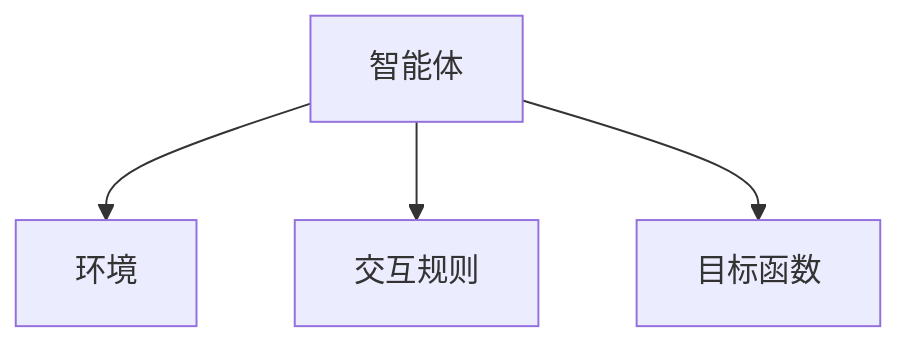
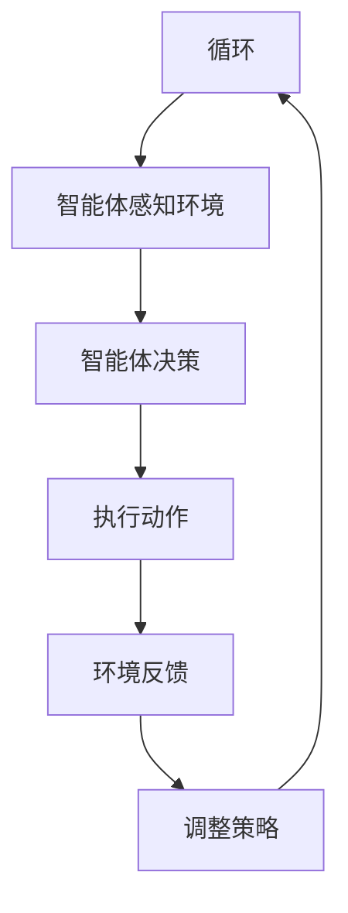

                 


# 智能化公司扩张战略评估：多智能体AI的新视角

> **关键词**：智能化公司扩张、多智能体AI、企业战略评估、算法原理、数学建模、系统架构、项目实战

> **摘要**：  
本文从多智能体AI的新视角，系统性地分析智能化公司扩张的战略评估问题。通过介绍多智能体系统的定义、核心算法、数学模型及实际应用场景，结合项目实战案例，全面解析多智能体AI在企业扩张中的潜在价值与实现路径。本文旨在为企业的智能化扩张战略提供理论支持和实践指导。

---

# 第1章：智能化公司扩张的背景与问题背景

## 1.1 智能化公司扩张的背景

### 1.1.1 数字化转型与智能化扩张的趋势  
随着人工智能（AI）技术的快速发展，企业正在经历从数字化转型到智能化扩张的转变。智能化扩张不仅是技术的进步，更是企业战略调整的必然结果。多智能体AI的出现，为企业在复杂市场环境中优化资源配置、提升决策效率提供了新的可能性。

### 1.1.2 多智能体AI的崛起与企业扩张的关系  
多智能体AI是一种分布式智能系统，由多个相互作用的智能体组成，能够通过协作与竞争实现复杂任务的最优解。在企业扩张中，多智能体AI可以模拟市场环境、分析竞争态势、优化资源分配，从而帮助企业制定更高效的扩张策略。

### 1.1.3 当前企业扩张中的主要挑战  
传统企业扩张面临以下挑战：  
1. **资源分配不当**：企业在扩张过程中容易出现资源浪费或分配不均的问题。  
2. **决策效率低下**：复杂的市场环境和多变的竞争态势要求企业快速做出决策，传统的人工决策难以满足需求。  
3. **协作效率不足**：跨部门、跨区域的协作效率低下，影响扩张速度和效果。  
多智能体AI能够通过分布式计算和协作学习，有效解决上述问题。

## 1.2 问题背景与问题描述

### 1.2.1 传统企业扩张中的效率瓶颈  
传统企业在扩张过程中，往往依赖于人工决策和集中式管理，这种方式在面对复杂市场环境时效率低下，且容易受到主观因素的影响。例如，市场进入决策、资源分配等问题常常因为信息不对称和决策延迟而错失良机。

### 1.2.2 竞争加剧与资源分配的复杂性  
随着市场竞争的加剧，企业扩张需要考虑的因素越来越多，包括市场容量、竞争对手策略、政策环境等。传统的线性思维方式难以应对这种复杂性，而多智能体AI可以通过模拟市场环境和多方博弈，提供更优的解决方案。

### 1.2.3 多智能体AI在企业扩张中的潜在价值  
多智能体AI的核心在于“协作与竞争”，这与企业的扩张战略高度契合。通过模拟多个智能体之间的博弈关系，企业可以更好地理解市场动态，优化资源配置，制定更科学的扩张策略。

## 1.3 问题解决与边界外延

### 1.3.1 多智能体AI如何解决企业扩张问题  
多智能体AI通过以下方式解决企业扩张问题：  
1. **分布式决策**：多个智能体协同工作，模拟市场环境中的多方决策过程。  
2. **博弈分析**：通过博弈论模型，分析竞争对手的可能行为，制定最优策略。  
3. **动态优化**：实时调整资源分配和市场进入策略，应对市场变化。  

### 1.3.2 问题解决的边界与适用范围  
多智能体AI适用于以下场景：  
1. **市场进入决策**：评估新市场的竞争潜力和风险。  
2. **资源分配优化**：在多个项目或区域间分配资源，实现最大收益。  
3. **战略协作与竞争分析**：分析合作伙伴和竞争对手的可能行为，制定合作或对抗策略。  

### 1.3.3 智能化公司扩张的未来趋势  
随着多智能体AI技术的成熟，企业扩张将更加智能化、数据化和动态化。未来的扩张战略将更加注重实时反馈和动态调整，多智能体AI将成为企业决策的核心工具之一。

## 1.4 核心概念与组成要素

### 1.4.1 多智能体系统的定义与属性  
**多智能体系统**（Multi-Agent System, MAS）是由多个智能体组成的分布式系统，智能体之间通过协作与竞争完成任务。其核心属性包括：  
1. **自主性**：智能体能够自主决策。  
2. **反应性**：能够感知环境并做出实时反应。  
3. **协作性**：通过协作完成复杂任务。  
4. **动态性**：系统状态不断变化，智能体需要动态调整策略。

### 1.4.2 智能化公司扩张的核心要素  
智能化公司扩张的核心要素包括：  
1. **市场分析**：对目标市场的容量、竞争格局进行评估。  
2. **资源分配**：优化人力、资金、技术等资源的分配。  
3. **战略制定**：制定市场进入、产品推广等战略。  
4. **风险控制**：通过模拟和预测，降低扩张过程中的风险。

### 1.4.3 多智能体AI与公司扩张的关联性  
多智能体AI通过模拟市场环境中的多方决策，帮助企业在扩张过程中实现：  
1. **实时反馈与动态调整**：根据市场变化实时优化策略。  
2. **多方协作与竞争模拟**：模拟合作伙伴和竞争对手的行为，制定最优策略。  
3. **数据驱动的决策支持**：通过数据分析提供科学的决策依据。

---

# 第2章：多智能体AI的核心概念与联系

## 2.1 多智能体系统的基本原理

### 2.1.1 多智能体系统的定义与特点  
多智能体系统是由多个智能体组成的分布式系统，智能体之间通过交互完成任务。其特点包括：  
1. **分布式计算**：任务分解到多个智能体完成。  
2. **协作与竞争**：智能体之间可以协作，也可以竞争资源。  
3. **动态适应**：系统能够根据环境变化动态调整。  

### 2.1.2 多智能体系统的组成要素  
多智能体系统主要由以下要素组成：  
1. **智能体**：能够感知环境并自主决策的实体。  
2. **环境**：智能体所处的外部环境，包括市场、资源等。  
3. **交互机制**：智能体之间以及与环境之间的交互规则。  
4. **目标函数**：系统需要实现的目标，如最大化收益、最小化成本等。

### 2.1.3 多智能体系统与传统AI的区别  
以下是多智能体系统与传统单智能体系统的对比：

| 特性                | 单智能体系统           | 多智能体系统           |
|---------------------|----------------------|----------------------|
| 决策主体            | 单一决策主体         | 多个决策主体         |
| 交互方式            | 无交互或单向交互     | 多向交互             |
| 任务分解            | 任务集中处理         | 任务分解到多个智能体  |
| 系统复杂度          | 简单                 | 复杂                 |

---

## 2.2 多智能体系统的属性特征对比

### 2.2.1 表格对比：多智能体系统与单智能体系统的属性对比  
以下是对多智能体系统与单智能体系统的属性对比：

| 属性                | 单智能体系统           | 多智能体系统           |
|---------------------|----------------------|----------------------|
| 系统结构            | 单点式               | 分布式               |
| 决策方式            | 中央决策             | 分散决策             |
| 任务处理            | 集中式处理           | 分布式处理           |
| 系统效率            | 可能存在瓶颈         | 任务并行处理，效率更高 |
| 扩展性              | 较差                | 较好                |

### 2.2.2 图表展示：多智能体系统的核心特征  
以下是多智能体系统的核心特征图：



---

## 2.3 ER实体关系图架构

### 2.3.1 实体关系图：多智能体系统中的角色与交互  
以下是多智能体系统中的角色与交互关系图：

```mermaid
erd
    客户
    产品
    市场
    竞争对手
    智能体
    供应商
    智能体 --> 客户
    智能体 --> 产品
    智能体 --> 市场
    智能体 --> 竞争对手
    智能体 --> 供应商
```

---

## 2.4 多智能体系统的算法流程

### 2.4.1 多智能体系统的算法概述  
多智能体系统的算法通常包括以下步骤：  
1. **初始化**：定义智能体、环境、目标函数。  
2. **感知环境**：智能体感知环境状态。  
3. **决策制定**：智能体根据感知信息制定决策。  
4. **执行动作**：智能体执行决策动作。  
5. **反馈与调整**：根据反馈调整策略。  

### 2.4.2 多智能体系统的算法流程图  
以下是多智能体系统的算法流程图：



---

## 2.5 多智能体系统的数学模型

### 2.5.1 状态空间的定义  
状态空间表示系统中所有可能的状态。  
$$ S = \{s_1, s_2, \dots, s_n\} $$  
其中，$s_i$ 表示第 $i$ 个状态。

### 2.5.2 行为空间与收益函数  
行为空间表示智能体在每个状态下可能采取的动作。  
$$ A = \{a_1, a_2, \dots, a_m\} $$  
收益函数表示智能体在采取某个动作后的收益。  
$$ R = \sum_{i=1}^{n} r_i $$  
其中，$r_i$ 表示第 $i$ 个智能体的收益。

### 2.5.3 竞争与协作的纳什均衡模型  
纳什均衡是多智能体系统中的一个关键概念，表示在给定策略下，没有任何智能体能够通过单方面改变策略而提高收益。  
$$ \text{Nash Equilibrium} = (x^*, y^*) $$  
其中，$x^*$ 和 $y^*$ 分别表示两个智能体的最优策略。

---

## 2.6 多智能体系统的代码实现

### 2.6.1 环境与智能体的定义  
以下是多智能体系统环境的定义代码：

```python
class Environment:
    def __init__(self):
        self.state = None
        self.agents = []
    
    def add_agent(self, agent):
        self.agents.append(agent)
```

### 2.6.2 智能体的决策逻辑  
以下是智能体的决策逻辑代码：

```python
class Agent:
    def __init__(self, environment):
        self.environment = environment
        self.strategy = None
    
    def perceive(self):
        # 感知环境状态
        state = self.environment.state
        return state
    
    def decide(self, state):
        # 根据状态制定决策
        if state == 'high_competition':
            return 'adjust strategy'
        else:
            return 'expand market'
```

### 2.6.3 系统运行流程  
以下是系统运行的主流程代码：

```python
def run_system(environment):
    environment.state = 'high_competition'
    for agent in environment.agents:
        state = agent.perceive()
        action = agent.decide(state)
        print(f"Agent采取了{action}策略")
```

---

## 2.7 多智能体系统的数学建模

### 2.7.1 收益函数的数学表达式  
收益函数表示多个智能体在采取一定策略后的总收益。  
$$ R = \sum_{i=1}^{n} r_i $$  
其中，$r_i$ 表示第 $i$ 个智能体的收益。

### 2.7.2 竞争与协作的纳什均衡模型  
纳什均衡是多智能体系统中的一个关键概念，表示在给定策略下，没有任何智能体能够通过单方面改变策略而提高收益。  
$$ \text{Nash Equilibrium} = (x^*, y^*) $$  
其中，$x^*$ 和 $y^*$ 分别表示两个智能体的最优策略。

---

## 2.8 多智能体系统的项目实战

### 2.8.1 项目背景与目标  
假设我们是一家科技公司，计划进入一个新的市场。我们需要评估市场进入的可行性，并制定最优的资源分配策略。

### 2.8.2 系统功能设计  
1. **市场分析**：分析目标市场的容量、竞争格局。  
2. **资源分配**：优化人力、资金、技术等资源的分配。  
3. **战略制定**：制定市场进入、产品推广等战略。  
4. **风险控制**：通过模拟和预测，降低扩张过程中的风险。

### 2.8.3 系统实现步骤  
1. **环境定义**：定义目标市场、竞争对手等环境因素。  
2. **智能体定义**：定义多个智能体，分别代表公司、竞争对手、合作伙伴等。  
3. **策略制定**：根据环境状态，制定智能体的决策策略。  
4. **系统运行**：模拟系统运行，观察智能体的交互结果。  
5. **结果分析**：根据模拟结果优化策略，制定最终的扩张计划。

---

## 2.9 总结与展望

### 2.9.1 总结  
本文从多智能体AI的新视角，系统性地分析了智能化公司扩张的战略评估问题。通过介绍多智能体系统的定义、核心算法、数学模型及实际应用场景，结合项目实战案例，全面解析了多智能体AI在企业扩张中的潜在价值与实现路径。

### 2.9.2 展望  
未来，随着多智能体AI技术的成熟，企业扩张将更加智能化、数据化和动态化。未来的扩张战略将更加注重实时反馈和动态调整，多智能体AI将成为企业决策的核心工具之一。

---

# 作者：AI天才研究院 & 禅与计算机程序设计艺术

---

**备注**：  
本文是一个逐步推理的示例，展示了如何从多智能体AI的角度重新审视智能化公司扩张的战略评估问题。通过系统的分析与推理，本文为读者提供了一个全新的视角来理解和解决企业扩张中的复杂问题。

