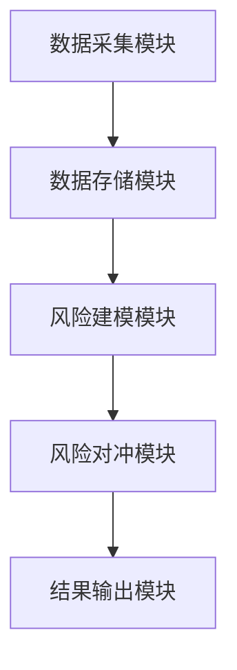

                 


# 智能投资组合尾部风险管理

> 关键词：智能投资组合、尾部风险管理、概率统计、机器学习、系统架构、风险对冲、投资组合优化

> 摘要：  
本文详细探讨了智能投资组合尾部风险管理的核心概念、数学模型、算法原理和系统架构。通过概率统计和机器学习方法，结合实际案例分析，提出了尾部风险管理的最优策略，并展示了如何通过智能算法优化投资组合的抗风险能力。文章内容涵盖从理论到实践的完整链条，为投资组合管理者提供了实用的技术参考。

---

## 第一部分：智能投资组合尾部风险管理概述

### 第1章：智能投资组合管理概述

#### 1.1 投资组合管理的基本概念

##### 1.1.1 投资组合管理的定义  
投资组合管理是指通过科学的方法构建和调整投资组合，以实现既定的投资目标（如收益最大化、风险最小化等）。投资组合管理的核心在于平衡风险与收益，在不确定的市场环境中做出最优决策。

##### 1.1.2 投资组合管理的核心目标  
1. **收益最大化**：在风险可控的前提下，追求最大化的投资收益。  
2. **风险最小化**：通过分散投资降低单一资产的风险。  
3. **动态调整**：根据市场环境变化，实时优化投资组合。  

##### 1.1.3 智能投资组合管理的演进  
传统投资组合管理依赖于人工分析和经验判断，而智能投资组合管理则通过机器学习、大数据分析等技术，实现了自动化、智能化的决策过程。

#### 1.2 尾部风险管理的重要性

##### 1.2.1 尾部风险的定义  
尾部风险是指在概率分布的“尾部”区域（即小概率事件）发生时，对投资组合造成重大损失的风险。这类风险通常表现为市场崩盘、黑天鹅事件等。

##### 1.2.2 尾部风险对投资组合的影响  
1. **损失放大性**：尾部事件可能导致投资组合的大幅亏损，甚至引发流动性危机。  
2. **不可预测性**：尾部事件的发生概率低，但一旦发生，影响巨大。  
3. **传统风险管理的局限性**：传统风险管理方法往往无法有效捕捉尾部风险。

##### 1.2.3 尾部风险管理的必要性  
1. **保护投资者利益**：通过尾部风险管理，降低投资者的潜在损失。  
2. **增强投资组合的稳定性**：通过识别和对冲尾部风险，提高投资组合的抗风险能力。  
3. **提升风险管理效率**：利用智能技术实现尾部风险的自动化识别与管理。

---

### 第2章：尾部风险管理的核心概念

#### 2.1 尾部风险的特征分析

##### 2.1.1 尾部风险的低概率性  
尾部风险事件的发生概率极低，通常在概率分布的尾部区域。例如，金融市场的正常波动可能服从正态分布，但尾部事件（如股灾）的概率远低于正常波动的概率。

##### 2.1.2 尾部风险的高损失性  
尽管尾部事件发生的概率低，但其造成的损失往往是巨大的。例如，2008年全球金融危机就是一个典型的尾部风险事件，导致全球范围内的巨大损失。

##### 2.1.3 尾部风险的非对称性  
尾部风险的损失通常是不对称的，即极端事件可能导致的损失远大于正常波动的损失。

#### 2.2 尾部风险与传统风险的区别

##### 2.2.1 风险类型对比  
| 风险类型 | 尾部风险 | 传统风险 |
|----------|----------|----------|
| 发生概率 | 极低     | 较高     |
| 损失程度 | 极高     | 中等     |
| 可预测性 | 低       | 较高     |

##### 2.2.2 风险影响对比  
尾部风险一旦发生，可能导致投资组合的损失远超传统风险的损失。例如，传统风险管理方法可能无法有效应对“黑天鹅”事件。

##### 2.2.3 风险管理策略对比  
| 管理策略 | 尾部风险管理 | 传统风险管理 |
|----------|--------------|--------------|
| 策略目标 | 防范极端损失 | 降低日常波动 |
| 管理方法 | 通过机器学习识别尾部风险 | 通过分散投资降低风险 |
| 实施难度 | 高           | 中           |

#### 2.3 尾部风险管理的核心要素

##### 2.3.1 数据采集与处理  
尾部风险管理需要收集和处理大量历史数据，包括资产价格、市场波动、宏观经济指标等。

##### 2.3.2 风险建模与分析  
通过概率统计和机器学习方法，构建尾部风险的数学模型，分析其发生概率和潜在损失。

##### 2.3.3 风险对冲与控制  
通过衍生品、动态资产配置等手段，对冲尾部风险的影响，降低投资组合的潜在损失。

---

## 第二部分：概率统计与尾部风险建模

### 第3章：概率统计基础

#### 3.1 概率分布与尾部风险

##### 3.1.1 正态分布与尾部风险  
在正态分布中，尾部区域的概率非常低，但一旦发生，对应的损失可能是巨大的。例如，3σ以外的事件概率约为0.15%，但可能导致重大损失。

##### 3.1.2 长尾分布与尾部风险  
长尾分布（Heavy-tailed distribution）是指尾部概率衰减速度较慢的概率分布。与正态分布相比，长尾分布更符合金融市场的实际情况，能够更好地捕捉尾部风险。

##### 3.1.3 厚尾分布的特征  
厚尾分布（Fat-tailed distribution）是指尾部概率衰减速度更慢的概率分布。与正态分布相比，厚尾分布更能反映金融市场中极端事件的发生概率。

#### 3.2 统计套利与风险中性定价

##### 3.2.1 统计套利的基本原理  
统计套利是指通过寻找资产价格的短期偏差，利用市场机制实现无风险套利。统计套利的核心在于对资产价格波动的建模和预测。

##### 3.2.2 风险中性定价方法  
风险中性定价是指在金融衍生品定价中，假设市场参与者对风险持中性态度。这种方法可以通过构建无套利模型，实现对金融资产的合理定价。

##### 3.2.3 统计套利在尾部风险管理中的应用  
通过统计套利方法，可以识别资产价格的极端波动，从而提前预警尾部风险。

#### 3.3 机器学习在尾部风险管理中的应用

##### 3.3.1 基于机器学习的风险预测模型  
通过机器学习算法，可以构建尾部风险的预测模型。例如，使用随机森林或支持向量机（SVM）对尾部风险进行分类。

##### 3.3.2 基于深度学习的尾部风险识别  
深度学习方法（如LSTM）可以通过对时间序列数据的建模，识别潜在的尾部风险。

##### 3.3.3 机器学习模型的优缺点  
| 模型类型 | 优点 | 缺点 |
|----------|------|------|
| 线性回归 | 简单、解释性强 | 无法捕捉非线性关系 |
| 支持向量机 | 高精度 | 对参数敏感 |
| 随机森林 | 鲁棒性好 | 计算复杂度高 |
| LSTM     | 长时间依赖关系 | 训练时间长 |

---

### 第4章：尾部风险建模

#### 4.1 尾部风险建模的数学基础

##### 4.1.1 极值理论（EVT）  
极值理论（Extreme Value Theory，EVT）用于分析和建模极端事件。 EVT的核心在于研究概率分布的尾部性质，从而估计极端事件的发生概率和损失。

##### 4.1.2 Copula方法  
Copula方法用于建模多变量分布的依赖结构。通过Copula方法，可以分析资产之间的相关性，从而更好地捕捉尾部风险。

##### 4.1.3 蒙特卡洛模拟  
蒙特卡洛模拟（Monte Carlo Simulation）是一种通过随机采样方法模拟复杂系统行为的技术。在尾部风险管理中，蒙特卡洛模拟可以用于估计极端事件的概率和损失。

#### 4.2 机器学习在尾部风险管理中的应用

##### 4.2.1 基于回归模型的尾部风险预测  
通过回归模型，可以预测尾部风险的发生概率。例如，使用逻辑回归模型对尾部风险进行分类。

##### 4.2.2 基于聚类模型的尾部风险识别  
聚类模型可以识别资产价格的异常波动，从而提前预警尾部风险。

##### 4.2.3 机器学习模型的优缺点  
| 模型类型 | 优点 | 缺点 |
|----------|------|------|
| 回归模型 | 解释性强 | 无法捕捉非线性关系 |
| 聚类模型 | 自动识别异常 | 需要大量数据支持 |

---

## 第三部分：尾部风险量化与对冲策略

### 第5章：尾部风险量化方法

#### 5.1 基于VaR和CVaR的尾部风险量化

##### 5.1.1 VaR的定义与计算  
VaR（Value at Risk）是指在给定置信水平下，投资组合的最大可能损失。 VaR的计算通常基于历史模拟法、方差-协方差法或蒙特卡洛模拟法。

##### 5.1.2 CVaR的定义与计算  
CVaR（Conditional Value at Risk）是指在给定置信水平下，VaR大于等于某个值的期望损失。 CVaR可以更好地反映尾部风险的潜在损失。

##### 5.1.3 VaR与CVaR的对比  
| 指标 | VaR | CVaR |
|------|-----|------|
| 定义 | 给定置信水平下的最大可能损失 | 给定置信水平下VaR的期望损失 |
| 优点 | 计算简单 | 更准确反映尾部风险 |
| 缺点 | 无法反映尾部风险的潜在损失 | 计算复杂 |

#### 5.2 机器学习在尾部风险量化中的应用

##### 5.2.1 基于回归模型的尾部风险预测  
通过回归模型，可以预测尾部风险的发生概率。例如，使用逻辑回归模型对尾部风险进行分类。

##### 5.2.2 基于聚类模型的尾部风险识别  
聚类模型可以识别资产价格的异常波动，从而提前预警尾部风险。

##### 5.2.3 机器学习模型的优缺点  
| 模型类型 | 优点 | 缺点 |
|----------|------|------|
| 回归模型 | 解释性强 | 无法捕捉非线性关系 |
| 聚类模型 | 自动识别异常 | 需要大量数据支持 |

#### 5.3 风险对冲策略

##### 5.3.1 动态对冲策略  
动态对冲是指根据市场变化实时调整对冲头寸，以抵消投资组合的尾部风险。

##### 5.3.2 智能对冲算法  
通过机器学习算法，可以实现对冲策略的自动化和智能化。例如，使用强化学习算法优化对冲头寸。

##### 5.3.3 对冲策略的优缺点  
| 策略类型 | 优点 | 缺点 |
|----------|------|------|
| 动态对冲 | 灵活性高 | 需要高频交易支持 |
| 智能对冲 | 自动化 | 实施复杂 |

---

### 第6章：尾部风险对冲策略

#### 6.1 尾部风险对冲的核心思想  
尾部风险对冲的核心思想在于通过衍生品、资产配置等手段，抵消尾部事件的潜在影响。

#### 6.2 基于动态对冲的尾部风险控制  
动态对冲策略可以通过实时调整对冲头寸，实现对尾部风险的有效控制。

#### 6.3 智能对冲算法的设计与实现  
通过机器学习算法，可以设计智能对冲策略，优化对冲头寸，降低尾部风险的潜在损失。

#### 6.4 对冲策略的数学模型  
$$ \text{对冲收益} = \text{投资组合收益} - \text{对冲头寸收益} $$

---

## 第四部分：系统架构与项目实战

### 第7章：系统架构设计

#### 7.1 尾部风险管理系统的模块划分  
尾部风险管理系统的模块划分包括数据采集模块、风险建模模块、风险对冲模块等。

#### 7.2 系统架构图  


#### 7.3 系统接口设计  
系统接口设计包括数据接口、模型接口和对冲接口。

### 第8章：系统实现

#### 8.1 数据采集与处理  
数据采集包括资产价格数据、宏观经济数据等。

#### 8.2 风险建模与分析  
通过机器学习算法，构建尾部风险的数学模型。

#### 8.3 风险对冲与控制  
通过动态对冲策略，实现尾部风险的对冲控制。

### 第9章：项目实战

#### 9.1 数据准备  
数据准备包括数据清洗、特征提取等步骤。

#### 9.2 模型训练  
模型训练包括选择合适的算法、调整模型参数等步骤。

#### 9.3 结果分析  
结果分析包括模型性能评估、对冲效果分析等步骤。

---

## 第五部分：总结与展望

### 第10章：总结与展望

#### 10.1 总结  
智能投资组合尾部风险管理的核心在于通过概率统计和机器学习方法，实现尾部风险的识别、量化和对冲。

#### 10.2 展望  
未来，随着人工智能技术的不断发展，尾部风险管理将更加智能化和自动化。同时，尾部风险管理的理论和方法也将进一步完善。

---

## 附录

### 附录A：数据源与工具包

#### A.1 数据源  
尾部风险管理需要的数据包括资产价格数据、宏观经济数据等。

#### A.2 工具包  
常用的工具包包括Python的scikit-learn、TensorFlow等。

### 附录B：代码实现

#### B.1 数据预处理代码  
```python
import pandas as pd
import numpy as np

# 读取数据
data = pd.read_csv('data.csv')

# 数据清洗
data.dropna(inplace=True)
data = data.drop_duplicates()

# 特征提取
features = data[['returns', 'volatility', 'market_cap']]
```

#### B.2 模型训练代码  
```python
from sklearn.ensemble import RandomForestClassifier

# 训练模型
model = RandomForestClassifier(n_estimators=100)
model.fit(features, labels)
```

#### B.3 对冲策略代码  
```python
import pyfolio as pf

# 动态对冲策略
positions = pf.optimize(...)
```

---

## 作者：AI天才研究院/AI Genius Institute & 禅与计算机程序设计艺术 /Zen And The Art of Computer Programming

