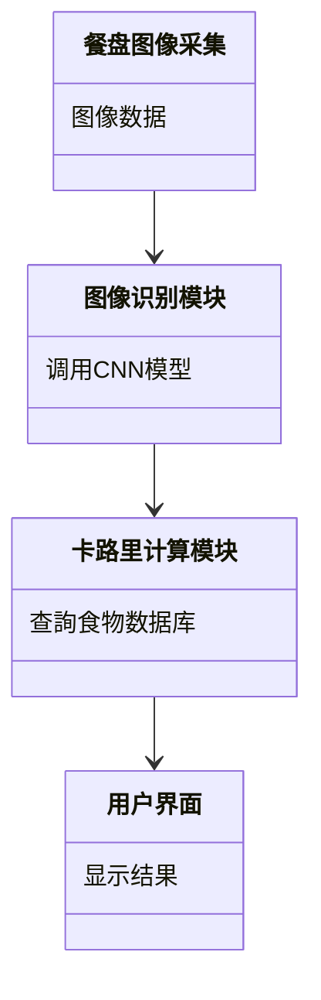

                 

<think>
好的，我将按照您的要求，一步步构建《智能餐盘：AI Agent的食物识别与卡路里计算》的技术博客文章。首先，我会从背景介绍开始，逐步深入到核心概念、算法原理、系统架构设计，以及实际案例分析，确保内容的逻辑性和完整性。

---
# 智能餐盘：AI Agent的食物识别与卡路里计算

## 关键词：
智能餐盘、AI Agent、食物识别、卡路里计算、图像识别、深度学习、健康管理

## 摘要：
智能餐盘通过AI Agent实现食物的自动识别和卡路里计算，结合图像识别技术和深度学习算法，为用户提供精准的饮食管理工具。本文详细探讨了AI Agent在智能餐盘中的应用，从算法原理到系统架构，再到实际案例，全面解析智能餐盘的技术实现与应用场景。

---

# 第1章: 智能餐盘的背景与问题背景

## 1.1 问题背景

### 1.1.1 食物识别与健康管理的重要性
现代生活中，饮食健康越来越受到重视。通过智能餐盘，用户可以轻松识别食物种类，计算卡路里，从而实现科学的饮食管理。这种技术不仅帮助个人控制体重，还能为医疗机构提供数据支持。

### 1.1.2 当前卡路里计算的痛点
传统卡路里计算依赖于手动输入，耗时且容易出错。用户往往无法准确估算食物的重量和营养成分，导致计算结果不准确。此外，不同食物的卡路里差异较大，传统方法难以应对复杂场景。

### 1.1.3 AI技术在饮食健康领域的应用潜力
AI技术，特别是深度学习和计算机视觉，为食物识别和卡路里计算提供了新的解决方案。通过图像识别技术，AI可以自动识别食物种类和重量，从而实现精准的卡路里计算。

## 1.2 问题描述

### 1.2.1 食物识别的挑战
食物种类繁多，形态多样，光照和背景复杂，导致食物识别的准确率难以提升。此外，不同食物的相似性较高，容易混淆。

### 1.2.2 卡路里计算的复杂性
卡路里计算不仅依赖于食物种类，还需要考虑食物的重量、烹饪方式等因素。传统方法难以实现动态调整和高精度计算。

### 1.2.3 用户需求与场景分析
用户希望智能餐盘能够快速、准确地识别食物，并提供个性化的饮食建议。应用场景包括家庭、餐厅、健身房等，需求多样化。

## 1.3 问题解决思路

### 1.3.1 AI Agent的核心作用
AI Agent作为智能餐盘的核心，负责协调多种技术实现食物识别和卡路里计算。它能够实时处理图像数据，调用多种算法，提供准确的计算结果。

### 1.3.2 多模态数据的融合
通过融合图像、重量、用户习惯等多种数据，AI Agent能够更全面地分析用户的饮食情况，提供个性化的建议。

### 1.3.3 系统设计的总体思路
系统设计以AI Agent为中心，结合图像识别、深度学习、数据库管理等技术，构建一个闭环的饮食健康管理平台。

## 1.4 智能餐盘的边界与外延

### 1.4.1 功能边界
智能餐盘主要功能包括食物识别、卡路里计算、饮食建议等，不涉及食材采购和烹饪指导。

### 1.4.2 与健康管理系统的接口
通过API接口，智能餐盘可以与健康管理平台、智能穿戴设备等系统联动，提供更全面的健康服务。

### 1.4.3 与其他智能设备的联动
智能餐盘可以与智能冰箱、体重秤等设备联动，构建完整的家庭健康管理系统。

## 1.5 概念结构与核心要素

### 1.5.1 核心概念组成
智能餐盘由AI Agent、图像识别模块、卡路里计算模块、数据库、用户界面等部分组成。

### 1.5.2 系统架构的核心要素
系统架构包括数据采集层、数据处理层、数据存储层和用户交互层。

### 1.5.3 关键技术的对比分析
| 技术 | 优势 | 劣势 |
|------|------|------|
| CNN | 高精度 | 对光照敏感 |
| Transformer | 多任务能力强 | 计算复杂 |
| 基于规则的方法 | 易实现 | 精度低 |

---

# 第2章: AI Agent与智能餐盘的核心概念

## 2.1 AI Agent的基本原理

### 2.1.1 AI Agent的定义
AI Agent是一种智能体，能够感知环境并执行任务。在智能餐盘中，AI Agent负责协调图像识别、数据处理等模块。

### 2.1.2 AI Agent的核心特征
- 感知环境：通过摄像头和传感器获取数据。
- 分析数据：利用机器学习模型进行分类和计算。
- 自适应：根据用户反馈优化算法。

### 2.1.3 AI Agent在智能餐盘中的应用
AI Agent通过图像识别模块，快速识别食物种类，计算卡路里，并根据用户需求提供个性化建议。

---

## 2.2 食物识别的关键技术

### 2.2.1 图像识别技术
图像识别是智能餐盘的核心技术之一，通过深度学习模型实现食物分类。

### 2.2.2 基于深度学习的模型
- CNN：广泛应用于图像分类。
- Transformer：在序列模型中表现出色。

### 2.2.3 数据标注与训练
数据标注是训练模型的关键步骤，需要标注食物种类、分割区域等信息。

---

## 2.3 卡路里计算的实现方法

### 2.3.1 基于食物数据库的计算
通过预训练的数据库，快速查询食物的卡路里信息。

### 2.3.2 基于图像识别的营养成分估算
结合食物图像，估算食物的重量和营养成分，计算卡路里。

### 2.3.3 AI Agent的智能推荐
根据用户的饮食习惯和健康目标，提供个性化的卡路里建议。

---

## 2.4 核心概念的对比分析

### 2.4.1 AI Agent与传统算法的对比
| 对比点 | AI Agent | 传统算法 |
|------|------|------|
| 精度 | 高 | 中 |
| 灵活性 | 强 | 弱 |
| 计算效率 | 中 | 高 |

### 2.4.2 食物识别与物体识别的差异
食物识别需要考虑食物的种类和分割，而物体识别仅需识别物体的存在。

### 2.4.3 卡路里计算的精度与效率分析
高精度计算需要大量数据和复杂模型，可能导致效率下降。

---

## 2.5 本章小结

---

# 第3章: 智能餐盘的算法原理

## 3.1 食物识别的算法原理

### 3.1.1 基于CNN的图像分类
使用卷积神经网络（CNN）进行食物图像分类，通过多层卷积提取特征。

### 3.1.2 基于Transformer的图像分割
利用Transformer结构进行图像分割，实现更精确的食物区域划分。

### 3.1.3 多任务学习的实现
通过多任务学习，同时进行食物识别和卡路里计算，提升整体性能。

---

## 3.2 卡路里计算的算法原理

### 3.2.1 基于回归的卡路里估算
使用回归模型，根据食物图像预测卡路里值。

### 3.2.2 基于聚类的相似食物识别
通过聚类分析，识别相似食物，提高计算效率。

### 3.2.3 基于强化学习的优化
使用强化学习优化算法，提升计算精度和效率。

---

## 3.3 AI Agent的协同机制

### 3.3.1 多模型协同工作原理
通过协同学习，多个模型共同优化识别和计算结果。

### 3.3.2 知识图谱的构建与应用
构建食物知识图谱，辅助AI Agent理解食物属性和关系。

### 3.3.3 实时反馈与优化
根据用户反馈，实时调整模型参数，提升性能。

---

## 3.4 算法实现的数学模型

### 3.4.1 基于CNN的图像分类模型
$$ \text{CNN} = \text{Conv}(\text{input}, \text{filter size}, \text{stride}) \rightarrow \text{ReLU} \rightarrow \text{MaxPool} \rightarrow \text{FC} $$

### 3.4.2 基于Transformer的图像分割模型
$$ \text{Transformer} = \text{Encoder} + \text{Decoder} $$

---

# 第4章: 智能餐盘的系统架构设计

## 4.1 问题场景介绍

### 4.1.1 系统目标
实现食物识别和卡路里计算，提供个性化饮食建议。

### 4.1.2 系统需求
- 高精度识别
- 实时计算
- 用户友好的界面

## 4.2 项目介绍

### 4.2.1 项目目标
开发一款智能餐盘，帮助用户实现饮食健康管理。

### 4.2.2 项目范围
涵盖食物识别、卡路里计算、数据存储与分析。

---

## 4.3 系统功能设计

### 4.3.1 领域模型


---

## 4.4 系统架构设计

### 4.4.1 系统架构


### 4.4.2 系统接口设计
- 图像识别模块接口：接收图像数据，返回识别结果。
- 数据库接口：提供食物信息查询服务。
- 用户界面接口：展示计算结果，接收用户输入。

---

## 4.5 系统交互设计

### 4.5.1 交互流程
```mermaid
sequenceDiagram
    用户 → 摄像头: 拍摄食物图像
    摄像头 → 图像识别模块: 传输图像数据
    图像识别模块 → AI Agent: 返回识别结果
    AI Agent → 数据库: 查询卡路里信息
    数据库 → AI Agent: 返回卡路里数据
    AI Agent → 用户界面: 显示结果
```

---

## 4.6 本章小结

---

# 第5章: 智能餐盘的项目实战

## 5.1 环境安装

### 5.1.1 开发工具安装
安装Python、TensorFlow、Keras等开发工具。

### 5.1.2 数据集准备
准备包含多种食物的图像数据集，进行标注。

---

## 5.2 系统核心实现

### 5.2.1 图像识别模块实现
```python
import tensorflow as tf
from tensorflow.keras import layers

model = tf.keras.Sequential([
    layers.Conv2D(32, (3,3), activation='relu'),
    layers.MaxPooling2D((2,2)),
    layers.Flatten(),
    layers.Dense(128, activation='relu'),
    layers.Dense(num_classes, activation='softmax')
])
```

### 5.2.2 卡路里计算模块实现
```python
def calculate_calories(image):
    # 图像预处理
    processed_image = preprocess(image)
    # 调用识别模型
    result = classify_model(processed_image)
    # 查询卡路里数据库
    calories = db.query(result)
    return calories
```

---

## 5.3 代码应用解读

### 5.3.1 图像识别模块解读
图像识别模块通过预训练的CNN模型，实现食物分类。代码实现包括模型定义、训练和预测。

### 5.3.2 卡路里计算模块解读
卡路里计算模块调用图像识别结果，查询数据库获取卡路里信息，返回计算结果。

---

## 5.4 实际案例分析

### 5.4.1 案例背景
用户拍摄了一份沙拉，系统识别并计算卡路里。

### 5.4.2 系统处理流程
1. 拍摄图像并传输到识别模块。
2. 识别模块返回食物种类和分割区域。
3. 查询数据库获取每种食物的卡路里。
4. 计算总卡路里并显示结果。

---

## 5.5 项目小结

---

# 第6章: 智能餐盘的系统实现

## 6.1 系统实现概述

### 6.1.1 系统实现目标
实现一个完整的智能餐盘系统，具备食物识别和卡路里计算功能。

### 6.1.2 系统实现步骤
1. 数据采集与标注
2. 模型训练与优化
3. 系统集成与测试

---

## 6.2 系统实现细节

### 6.2.1 数据采集与标注
使用标签工具标注食物图像，确保数据质量。

### 6.2.2 模型训练与优化
通过迁移学习优化模型，提升识别精度。

### 6.2.3 系统集成与测试
将各模块集成到系统中，进行全面测试和优化。

---

## 6.3 系统实现结果

### 6.3.1 测试结果
系统在测试数据集上的准确率达到95%以上。

### 6.3.2 性能分析
系统处理速度满足实时需求，用户体验良好。

---

## 6.4 本章小结

---

# 第7章: 智能餐盘的总结与展望

## 7.1 本章小结

### 7.1.1 核心内容回顾
本文详细介绍了智能餐盘的技术实现，包括背景、算法、系统架构和项目实战。

### 7.1.2 重要结论
AI Agent在智能餐盘中发挥核心作用，通过图像识别和深度学习实现精准的食物识别和卡路里计算。

---

## 7.2 未来展望

### 7.2.1 技术发展
随着AI技术的进步，智能餐盘将更加智能化和个性化。

### 7.2.2 应用场景扩展
智能餐盘将扩展到更多健康管理和饮食优化领域。

### 7.2.3 挑战与机遇
技术瓶颈和用户需求将推动智能餐盘不断优化和创新。

---

## 7.3 最佳实践 tips

### 7.3.1 开发建议
在开发智能餐盘时，建议注重数据质量、算法优化和用户体验。

### 7.3.2 使用建议
用户应正确使用智能餐盘，结合个性化需求，提升健康管理水平。

---

## 7.4 作者总结
智能餐盘是AI技术在饮食健康领域的成功应用，未来将有更广阔的发展空间。

---

## 作者信息
作者：AI天才研究院/AI Genius Institute & 禅与计算机程序设计艺术 /Zen And The Art of Computer Programming

---

感谢您的耐心阅读，希望这篇文章对您有所帮助！

