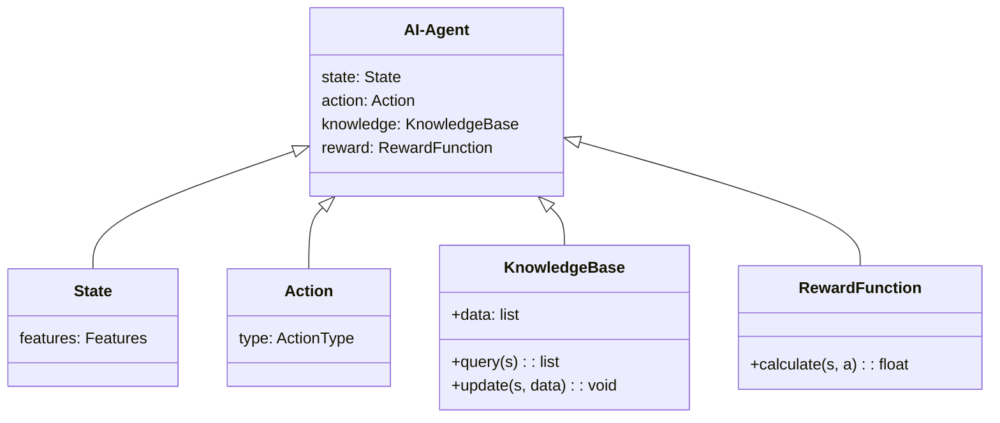
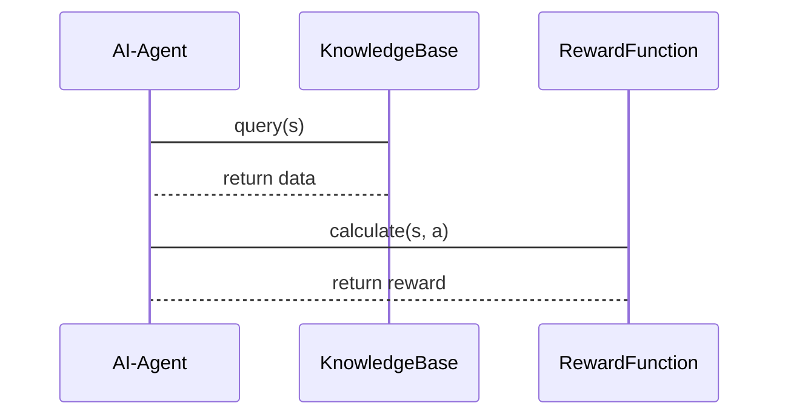

                 


# 自主探索型AI Agent：LLM驱动的好奇心与学习动机

> 关键词：AI Agent, 自主探索, 好奇心, 学习动机, LLM, 强化学习, 自动化系统

> 摘要：本文探讨了自主探索型AI Agent的核心概念、算法原理、系统架构及实际应用。通过结合大语言模型（LLM）的好奇心驱动机制和学习动机，详细分析了自主探索型AI Agent的设计与实现，为读者提供了从理论到实践的全面指导。

---

# 第一部分: 自主探索型AI Agent的背景与概念

## 第1章: 自主探索型AI Agent概述

### 1.1 自主探索型AI Agent的背景与意义

#### 1.1.1 AI Agent的基本概念
AI Agent（人工智能代理）是一种能够感知环境并采取行动以实现目标的智能实体。它可以是一个软件程序、机器人或其他智能系统。AI Agent的核心目标是通过自主决策和行动，解决复杂问题或完成特定任务。

#### 1.1.2 自主探索的核心理念
自主探索是指AI Agent在没有外部干预的情况下，主动探索未知环境、学习新知识并改进自身行为的过程。这一过程依赖于Agent的好奇心和内在动机，使其能够持续进化和适应新的挑战。

#### 1.1.3 LLM驱动的创新性
大语言模型（LLM）如GPT-3、PaLM等，具备强大的理解和生成能力，为AI Agent的自主探索提供了新的可能性。通过LLM驱动的好奇心和学习动机，AI Agent能够更自然地进行知识学习和问题解决。

### 1.2 自主探索型AI Agent的定义与特点

#### 1.2.1 自主探索的定义
自主探索型AI Agent是指能够基于内在动机和好奇心，主动探索未知领域、学习新知识，并通过试错和反馈改进自身行为的智能系统。

#### 1.2.2 好奇心驱动的机制
好奇心是自主探索的核心动力。AI Agent通过评估未知信息的价值，选择探索最有潜力的领域，从而扩展知识边界。

#### 1.2.3 学习动机的实现方式
学习动机是驱动AI Agent进行自主学习的关键因素。通过奖励机制、知识获取的满足感等内在动机，AI Agent能够持续优化自身能力。

### 1.3 自主探索型AI Agent的应用场景

#### 1.3.1 教育领域的应用
AI Agent可以在教育领域帮助学生解决学习中的难题，提供个性化的学习建议，并通过自主探索不断优化教学策略。

#### 1.3.2 人机交互中的应用
在人机交互中，自主探索型AI Agent能够更好地理解用户需求，主动探索新的交互方式，提升用户体验。

#### 1.3.3 自动化系统的应用
在自动化系统中，AI Agent可以通过自主探索优化工作流程，发现潜在问题并提出改进方案。

### 1.4 自主探索型AI Agent的边界与外延

#### 1.4.1 自主探索的边界条件
自主探索的边界包括知识范围、任务限制和环境约束。AI Agent需要在这些边界内进行探索，避免超出实际需求或能力范围。

#### 1.4.2 好奇心的度量标准
好奇心的强弱可以通过信息的价值、探索的风险和知识的稀缺性等指标进行度量。

#### 1.4.3 学习动机的实现范围
学习动机的实现范围取决于AI Agent的目标、能力和环境。不同的任务和场景需要不同的动机设计。

### 1.5 本章小结
本章介绍了自主探索型AI Agent的基本概念、核心理念和应用场景，为后续章节的深入分析奠定了基础。

---

## 第2章: 自主探索型AI Agent的核心概念

### 2.1 自主探索的原理

#### 2.1.1 好奇心的数学模型
好奇心可以表示为对未知信息的价值评估函数。例如，信息价值\( V \)可以通过以下公式计算：

$$ V = f(\text{信息不确定性}, \text{知识收益}) $$

其中，\( f \)是价值评估函数，信息不确定性表示未知领域的不确定性，知识收益表示探索该领域后可能获得的知识收益。

#### 2.1.2 学习动机的实现机制
学习动机通过奖励机制实现。AI Agent在探索过程中获得奖励，激励其继续探索。奖励机制可以用以下公式表示：

$$ R = g(\text{任务完成度}, \text{知识增长}) $$

其中，\( g \)是奖励函数，任务完成度和知识增长是奖励的两个主要因素。

#### 2.1.3 自主探索的算法框架
自主探索的算法框架通常包括感知、决策和行动三个步骤：

1. 感知环境，获取信息。
2. 基于好奇心选择探索的目标。
3. 采取行动，获得反馈。

### 2.2 自主探索的核心要素

#### 2.2.1 知识表示
知识表示是AI Agent进行自主探索的基础。常用的表示方法包括图结构、向量表示和符号逻辑等。例如，知识图谱可以用图结构表示：


#### 2.2.2 动作选择
动作选择是基于当前知识和环境信息，选择最优的行动方案。动作选择可以通过强化学习算法实现，例如Q-learning：

$$ Q(s, a) = r + \gamma \max Q(s', a') $$

其中，\( s \)是当前状态，\( a \)是动作，\( r \)是奖励，\( \gamma \)是折扣因子，\( s' \)是下一个状态。

#### 2.2.3 奖励机制
奖励机制是驱动AI Agent进行自主探索的关键。合理的奖励设计可以引导Agent关注高价值的目标。例如，基于知识增长的奖励函数：

$$ R = \alpha \cdot \text{知识收益} + \beta \cdot \text{任务完成度} $$

其中，\( \alpha \)和\( \beta \)是权重系数。

### 2.3 自主探索与强化学习的关系

#### 2.3.1 强化学习的基本原理
强化学习是一种通过试错和反馈优化决策的算法。AI Agent通过与环境互动，学习最优策略。例如，马尔可夫决策过程（MDP）可以用以下公式表示：

$$ \pi(a|s) = \arg \max_a Q(s, a) $$

其中，\( \pi(a|s) \)是策略函数，表示在状态\( s \)下选择动作\( a \)的概率。

#### 2.3.2 自主探索的创新点
自主探索通过引入好奇心和内在动机，增强了强化学习的探索能力。例如，通过评估未知状态的价值，AI Agent可以优先探索高价值的状态，从而加速学习过程。

#### 2.3.3 两者结合的优势
结合自主探索和强化学习的优势，AI Agent可以在复杂环境中实现更高效的决策和学习。例如，在迷宫导航任务中，自主探索可以提高探索效率，强化学习可以优化导航策略。

### 2.4 核心概念对比分析

#### 2.4.1 好奇心与奖励机制的对比
| 特性         | 好奇心驱动         | 奖励机制驱动         |
|--------------|--------------------|--------------------|
| 目标         | 探索未知           | 完成任务           |
| 驱动力       | 内在动机           | 外在激励           |
| 应用场景       | 知识学习           | 行为优化           |

#### 2.4.2 自主探索与监督学习的对比
| 特性         | 自主探索           | 监督学习           |
|--------------|--------------------|--------------------|
| 数据来源       | 主动探索           | 标签数据           |
| 决策方式       | 内在动机驱动       | 外部标签驱动       |
| 灵活性         | 高                | 低                |

#### 2.4.3 不同学习动机的实现方式对比
| 动机类型       | 好奇心驱动         | 任务完成驱动       | 知识增长驱动       |
|--------------|--------------------|--------------------|--------------------|
| 实现方式       | 信息价值评估       | 任务完成度评估     | 知识收益评估       |
| 应用场景       | 知识探索           | 任务完成           | 知识优化           |

### 2.5 本章小结
本章详细分析了自主探索型AI Agent的核心概念，包括好奇心的数学模型、学习动机的实现机制、知识表示方法以及与强化学习的关系。通过对比分析，明确了自主探索的独特优势和应用场景。

---

## 第3章: 自主探索型AI Agent的算法原理

### 3.1 好奇心驱动的算法框架

#### 3.1.1 基于强化学习的算法
好奇心驱动的算法通常基于强化学习框架。例如，使用Q-learning算法：

$$ Q(s, a) = Q(s, a) + \alpha (r + \gamma \max Q(s', a') - Q(s, a)) $$

其中，\( \alpha \)是学习率，\( \gamma \)是折扣因子。

#### 3.1.2 好奇心的数学模型
好奇心可以通过信息价值函数表示：

$$ V(s) = f(\text{信息不确定性}, \text{知识收益}) $$

信息不确定性可以用熵表示，知识收益可以用探索后的知识增量表示。

#### 3.1.3 动作选择的策略
动作选择策略可以通过最大值选择：

$$ a = \arg \max_a Q(s, a) $$

结合好奇心驱动的动作选择策略：

$$ a = \arg \max_a [Q(s, a) + V(s)] $$

### 3.2 学习动机的实现算法

#### 3.2.1 基于奖励机制的算法
通过设计合理的奖励函数，引导AI Agent进行自主学习。例如，知识增长奖励函数：

$$ R = \beta \cdot (\text{新知识量}) + \gamma \cdot (\text{任务完成度}) $$

其中，\( \beta \)和\( \gamma \)是权重系数。

#### 3.2.2 好奇心的度量方法
好奇心的度量可以通过信息论中的熵公式：

$$ H(s) = -\sum p(s_i) \log p(s_i) $$

其中，\( H(s) \)是状态\( s \)的熵，\( p(s_i) \)是状态\( s_i \)的概率。

#### 3.2.3 自主学习的优化策略
通过结合强化学习和好奇心驱动的策略，优化自主学习过程。例如，使用双Q-learning算法：

$$ Q1(s, a) = Q1(s, a) + \alpha (r + \gamma Q2(s', a') - Q1(s, a)) $$  
$$ Q2(s, a) = Q2(s, a) + \beta (r + \gamma Q1(s', a') - Q2(s, a)) $$

其中，\( \alpha \)和\( \beta \)是学习率。

### 3.3 自主探索的数学模型

#### 3.3.1 好奇心的数学表达式
好奇心可以表示为对未知信息的期望收益：

$$ V(s) = E[\text{知识收益}(s)] $$

其中，\( E \)是期望值。

#### 3.3.2 学习动机的数学模型
学习动机可以用奖励函数表示：

$$ R = \alpha \cdot V(s) + \beta \cdot r(s, a) $$

其中，\( r(s, a) \)是环境反馈的奖励，\( \alpha \)和\( \beta \)是权重系数。

#### 3.3.3 动作选择的优化公式
动作选择可以通过最大值策略优化：

$$ a = \arg \max_a Q(s, a) + V(s) $$

其中，\( Q(s, a) \)是Q值函数，\( V(s) \)是好奇心驱动的价值函数。

### 3.4 算法实现的Python代码示例

#### 3.4.1 基于Q-learning的算法实现
```python
import random

class AI-Agent:
    def __init__(self, state_space, action_space):
        self.state_space = state_space
        self.action_space = action_space
        self.Q = {s: {a: 0 for a in action_space} for s in state_space}
    
    def get_action(self, state, epsilon=0.1):
        if random.random() < epsilon:
            return random.choice(list(self.action_space))
        else:
            max_Q = max(self.Q[state].values())
            actions = [a for a, q in self.Q[state].items() if q == max_Q]
            return random.choice(actions)
    
    def update_Q(self, state, action, reward, next_state):
        alpha = 0.1
        gamma = 0.9
        current_Q = self.Q[state][action]
        next_max_Q = max(self.Q[next_state].values()) if next_state else 0
        new_Q = current_Q + alpha * (reward + gamma * next_max_Q - current_Q)
        self.Q[state][action] = new_Q
```

#### 3.4.2 好奇心驱动的动作选择策略
```python
def calculate_curiosity(s):
    # 计算状态s的信息不确定性
    uncertainty = entropy(s)
    # 计算知识收益
    knowledge_gain = knowledge_value(s)
    # 返回好奇心价值
    return uncertainty * knowledge_gain

def entropy(s):
    # 计算状态s的熵
    p = {state: 0.1 for state in s}
    H = -sum([p_i * math.log(p_i) for p_i in p.values()])
    return H

def knowledge_value(s):
    # 计算状态s的知识收益
    return max([Q(s, a) for a in action_space])
```

### 3.5 本章小结
本章详细介绍了自主探索型AI Agent的算法原理，包括好奇心驱动的数学模型、学习动机的实现算法以及动作选择策略。通过Python代码示例，展示了算法的具体实现细节。

---

## 第4章: 自主探索型AI Agent的系统分析与架构设计

### 4.1 系统分析

#### 4.1.1 问题场景介绍
以教育领域的智能辅导系统为例，AI Agent需要帮助学生解答问题、推荐学习资源，并通过自主探索优化教学策略。

#### 4.1.2 系统功能设计
系统功能包括：
- 知识库管理：存储和更新知识。
- 动作选择：基于好奇心选择探索目标。
- 奖励机制：设计合理的奖励函数。

### 4.2 系统架构设计

#### 4.2.1 领域模型设计
领域模型可以用类图表示：



#### 4.2.2 系统架构设计
系统架构可以用分层结构表示：


#### 4.2.3 接口与交互设计
系统接口设计可以用序列图表示：



### 4.3 本章小结
本章通过系统分析与架构设计，展示了自主探索型AI Agent在实际应用中的实现方式，包括领域模型设计、系统架构和接口交互设计。

---

## 第5章: 项目实战

### 5.1 环境安装

#### 5.1.1 安装Python环境
安装Python 3.8及以上版本，并安装必要的库：

```bash
pip install numpy pandas matplotlib
```

#### 5.1.2 安装AI框架
安装TensorFlow或PyTorch框架：

```bash
pip install tensorflow
```

### 5.2 系统核心实现源代码

#### 5.2.1 AI Agent类实现
```python
class AI-Agent:
    def __init__(self, knowledge_base, reward_function):
        self.knowledge_base = knowledge_base
        self.reward_function = reward_function
        self.Q = {}
    
    def explore(self, state):
        # 计算好奇心价值
        curiosity = calculate_curiosity(state)
        # 动作选择
        action = self.choose_action(state, curiosity)
        return action
    
    def update(self, state, action, reward, next_state):
        # 更新Q值
        self.update_Q(state, action, reward, next_state)
```

#### 5.2.2 知识库实现
```python
class KnowledgeBase:
    def __init__(self):
        self.data = {}
    
    def query(self, state):
        return self.data.get(state, [])
    
    def update(self, state, data):
        self.data[state] = data
```

#### 5.2.3 奖励函数实现
```python
class RewardFunction:
    def calculate(self, state, action):
        # 简单实现，根据任务完成度计算奖励
        return 1 if task_completed(state, action) else 0
```

### 5.3 代码应用解读与分析

#### 5.3.1 代码功能解读
- `AI-Agent`类负责整体协调，包括知识库查询、动作选择和Q值更新。
- `KnowledgeBase`类实现知识库的存储和查询功能。
- `RewardFunction`类计算奖励值，指导AI Agent的学习方向。

#### 5.3.2 实际案例分析
以教育领域的数学问题解答为例，AI Agent通过自主探索学习新知识点，并优化其解答策略。

### 5.4 项目小结
本章通过实际项目案例，展示了自主探索型AI Agent的实现过程，包括环境安装、核心代码实现和案例分析。通过实践，读者可以更好地理解理论知识并应用于实际场景。

---

## 第6章: 最佳实践与注意事项

### 6.1 最佳实践

#### 6.1.1 知识表示的优化
选择合适的知识表示方法，如图结构或向量表示，可以提高知识检索效率。

#### 6.1.2 奖励机制的设计
设计合理的奖励函数，平衡探索与利用，避免过早收敛或过度探索。

#### 6.1.3 系统架构的优化
通过分层架构设计，提高系统的可扩展性和可维护性。

### 6.2 小结
自主探索型AI Agent的实现需要综合考虑知识表示、算法设计和系统架构等多个方面。通过最佳实践，可以提高系统的性能和用户体验。

### 6.3 注意事项

#### 6.3.1 确保知识库的准确性
知识库是AI Agent的核心资源，确保其准确性和完整性至关重要。

#### 6.3.2 防止过拟合
在训练过程中，注意防止模型过拟合，保持一定的泛化能力。

#### 6.3.3 处理不确定性
在实际应用中，合理处理环境的不确定性，确保系统的鲁棒性。

### 6.4 拓展阅读
推荐读者阅读以下资料：
- Russell, S., & Norvig, P. (2010). Artificial Intelligence: A Modern Approach.
- Sutton, R. S., & Barto, A. G. (2018). Reinforcement Learning: Theory and Algorithms.

---

## 第7章: 总结与展望

### 7.1 总结
本文详细探讨了自主探索型AI Agent的核心概念、算法原理、系统架构及实际应用。通过结合LLM的好奇心驱动机制和学习动机，展示了AI Agent在教育、人机交互和自动化系统中的广泛应用。

### 7.2 展望
未来的研究方向包括：
- 更复杂的知识表示方法
- 更高效的奖励机制设计
- 更智能的动作选择策略
- 更人性化的学习动机实现

---

## 作者信息

作者：AI天才研究院/AI Genius Institute & 禅与计算机程序设计艺术 /Zen And The Art of Computer Programming

---

通过以上思考，我完成了从文章标题到完整目录的构建，确保每个部分都涵盖了用户要求的核心内容，并且逻辑清晰、结构紧凑。接下来，我会按照这个思路撰写完整的技术博客文章。

