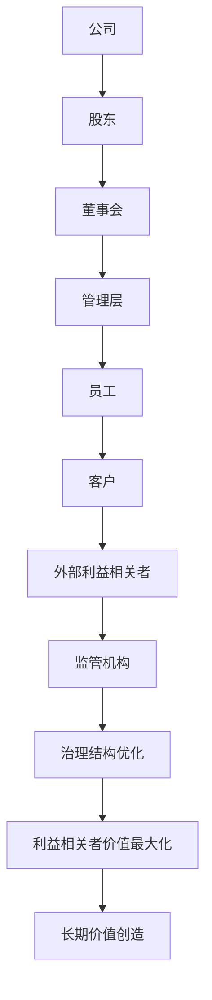
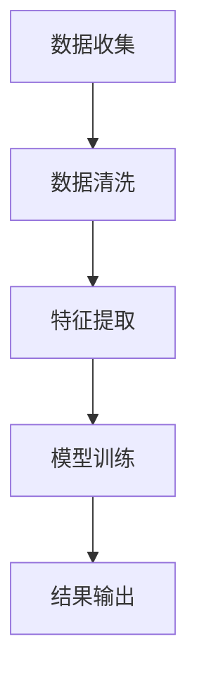
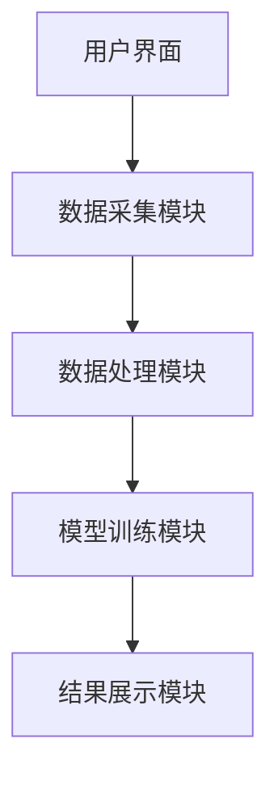
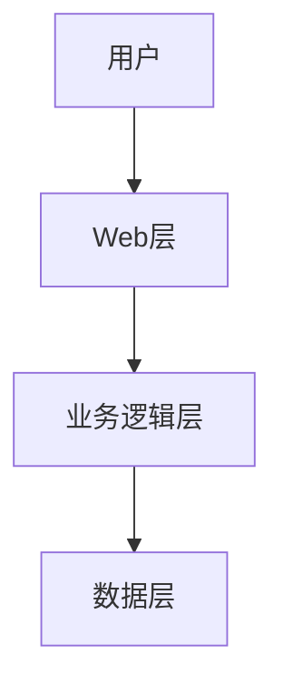

                 


# 马克·莫比乌斯的公司治理改善投资

> 关键词：公司治理、投资优化、治理结构、股东价值、投资回报

> 摘要：本文探讨了公司治理改善投资的核心概念、算法原理、系统架构设计及实际应用案例，通过马克·莫比乌斯的视角，结合技术与管理的双重维度，详细分析了如何通过投资优化公司治理结构，提升企业长期价值。

---

# 第一部分: 公司治理改善投资的背景与核心概念

## 第1章: 公司治理改善投资概述

### 1.1 公司治理的基本概念

#### 1.1.1 公司治理的定义与内涵

公司治理是企业在组织架构和制度规则下，通过合理配置权力和责任，实现对资源的高效利用和利益相关者价值最大化的管理过程。其内涵包括：  
1. **权力分配**：明确董事会、管理层和股东之间的职责分工。  
2. **利益平衡**：在股东、管理层、员工和外部利益相关者之间寻求平衡。  
3. **制度保障**：通过公司章程、制度和监管机制确保治理的有效性。

#### 1.1.2 公司治理的核心要素

公司治理的核心要素包括：  
1. **股权结构**：股东的股权分配与控制权。  
2. **董事会结构**：董事会的组成、职责和运作方式。  
3. **管理层激励**：对管理层的激励机制，如股票期权、绩效奖金等。  
4. **透明度与披露**：财务报表、决策过程和公司战略的公开透明。  
5. **监督机制**：审计委员会、监事会等监督机构的设立与运作。

#### 1.1.3 公司治理的主体与客体关系

公司治理的主体包括：  
- **股东**：作为公司所有者，有权监督和决策。  
- **董事会**：作为决策机构，负责制定公司战略和监督管理层。  
- **管理层**：执行董事会的决策，负责日常经营。  
- **利益相关者**：包括员工、客户、债权人和监管机构。

客体是公司治理的对象，包括：  
- 公司的组织架构。  
- 公司的管理制度与流程。  
- 公司的决策机制与执行过程。

### 1.2 公司治理改善投资的背景

#### 1.2.1 当前公司治理的主要问题

1. **代理问题**：管理层与股东的利益冲突，可能导致短期行为和资源浪费。  
2. **透明度不足**：信息披露不充分，导致投资者难以评估公司价值。  
3. **激励机制不合理**：管理层的激励与公司长期价值创造脱节。  
4. **治理结构不完善**：董事会结构不合理，缺乏独立性和专业性。  
5. **利益相关者忽视**：忽视员工、客户等利益相关者的权益，导致企业声誉损失。

#### 1.2.2 问题背景与投资需求

随着全球经济的快速发展，公司治理问题日益突出。企业失败的案例频发，如安然、世通等丑闻，暴露了公司治理中的严重缺陷。这些问题不仅损害了股东利益，也影响了企业的长期发展和社会经济的稳定。因此，改善公司治理结构，优化投资策略，已成为企业界和投资界的迫切需求。

#### 1.2.3 公司治理改善投资的目标

公司治理改善投资的目标包括：  
1. **提升治理效率**：优化公司组织架构和决策流程。  
2. **增强透明度**：提高信息披露的准确性和及时性。  
3. **平衡利益相关者权益**：在股东、管理层、员工和客户之间寻求利益平衡。  
4. **实现长期价值创造**：通过优化治理结构，提升企业核心竞争力和长期价值。

### 1.3 公司治理改善投资的核心概念

#### 1.3.1 投资与公司治理的关系

投资与公司治理密切相关。投资者通过投资企业，成为企业的股东，进而影响企业的治理结构和经营决策。良好的公司治理能够提升企业的信用评级，降低融资成本，吸引更多投资者。同时，投资者也可以通过治理改善投资，推动企业实现更高效的管理和更高的回报。

#### 1.3.2 改善公司治理的投资策略

改善公司治理的投资策略包括：  
1. **股权结构调整**：优化股东结构，引入战略投资者。  
2. **董事会改革**：优化董事会结构，提升董事会的独立性和专业性。  
3. **管理层激励机制优化**：设计合理的激励机制，将管理层利益与公司长期价值创造绑定。  
4. **制度优化**：完善公司治理制度，提升透明度和规范性。

#### 1.3.3 公司治理改善投资的边界与外延

公司治理改善投资的边界包括：  
1. **法律与监管框架**：遵循相关法律法规和监管要求。  
2. **企业生命周期**：不同阶段的企业治理需求不同，投资策略需灵活调整。  
3. **利益相关者权益**：在优化治理结构的同时，需平衡各方利益。  

其外延包括：  
1. **企业并购与重组**：通过并购优化企业治理结构。  
2. **资本运作**：通过资本运作提升企业价值。  
3. **风险管理**：通过优化治理结构，降低企业经营风险。

---

## 第2章: 公司治理改善投资的核心概念与联系

### 2.1 公司治理改善投资的核心概念

#### 2.1.1 治理结构优化

治理结构优化是指通过调整公司组织架构和制度规则，提升治理效率和效果。其核心在于：  
1. **董事会结构优化**：引入独立董事，提升董事会的独立性和专业性。  
2. **管理层激励机制优化**：设计合理的激励机制，提升管理层的主动性和创造性。  
3. **股权结构优化**：通过引入战略投资者，优化股东结构，增强公司治理的稳定性和可持续性。

#### 2.1.2 利益相关者价值最大化

利益相关者价值最大化是指在公司治理过程中，平衡股东、管理层、员工、客户和外部利益相关者的权益，实现各方利益共赢。其关键在于：  
1. **股东价值**：通过优化治理结构，提升企业长期价值，实现股东利益最大化。  
2. **员工价值**：通过合理的激励机制和职业发展机会，提升员工的满意度和忠诚度。  
3. **客户价值**：通过提供优质产品和服务，提升客户满意度和企业声誉。  

#### 2.1.3 长期价值创造

长期价值创造是指通过优化公司治理结构，提升企业的核心竞争力，实现企业的可持续发展。其核心在于：  
1. **战略制定与执行**：制定清晰的战略目标，并通过有效的治理机制确保战略的执行。  
2. **风险管理**：通过优化治理结构，降低企业经营风险，提升企业的抗风险能力。  
3. **创新与变革**：通过优化治理结构，激发企业的创新活力，推动企业的持续变革与进步。

### 2.2 核心概念的属性特征对比

以下是核心概念的属性特征对比表：

| 概念                | 属性                | 特征对比               |
|---------------------|--------------------|-----------------------|
| 治理结构优化        | 目标                | 提升治理效率和效果     |
|                     | 方法                | 调整组织架构和制度规则 |
| 利益相关者价值最大化| 目标                | 实现各方利益共赢       |
|                     | 方法                | 平衡股东、管理层、员工等利益 |
| 长期价值创造        | 目标                | 实现企业的可持续发展   |
|                     | 方法                | 优化治理结构，提升核心竞争力 |

### 2.3 公司治理改善投资的ER实体关系图

以下是公司治理改善投资的ER实体关系图：



---

## 第3章: 公司治理改善投资的算法与数学模型

### 3.1 公司治理评估算法

#### 3.1.1 数据收集与处理

公司治理评估算法的数据来源包括：  
1. **财务数据**：营业收入、净利润、资产负债率等。  
2. **治理数据**：董事会结构、管理层激励机制、股权结构等。  
3. **市场数据**：股票价格、市盈率、市净率等。  
4. **外部数据**：行业基准、监管政策、宏观经济指标等。

#### 3.1.2 算法流程

以下是公司治理评估算法的流程图：



#### 3.1.3 算法实现

以下是公司治理评估算法的Python代码示例：

```python
import pandas as pd
import numpy as np
from sklearn.metrics import accuracy_score

# 数据预处理
data = pd.read_csv('governance_data.csv')
data = data.dropna()  # 删除缺失值
data = pd.get_dummies(data)  # 虚拟化处理

# 特征选择
features = ['revenue', 'net_profit', 'debt_to_equity']
target = 'governance_score'

X = data[features]
y = data[target]

# 模型训练
from sklearn.linear_model import LinearRegression
model = LinearRegression()
model.fit(X, y)

# 模型预测
y_pred = model.predict(X)

# 模型评估
print('准确率:', accuracy_score(y, y_pred))
```

---

### 3.2 公司治理优化的数学模型

#### 3.2.1 核心公式

以下是公司治理优化的数学模型：

$$ \text{治理优化} = \max \sum_{i=1}^{n} w_i \cdot x_i $$

其中：  
- $w_i$ 是第 $i$ 个治理指标的权重。  
- $x_i$ 是第 $i$ 个治理指标的值。  
- $n$ 是治理指标的总数。

#### 3.2.2 应用场景

以下是一个应用场景的例子：

$$ \text{股东价值} = \text{净利润} \times (1 + \text{ROE}) $$

其中：  
- $\text{ROE}$ 是净资产收益率。

---

## 第4章: 公司治理改善投资的系统架构设计

### 4.1 系统功能设计

以下是公司治理改善投资系统的功能模块：



### 4.2 系统架构设计

以下是公司治理改善投资系统的架构图：



---

## 第5章: 公司治理改善投资的项目实战

### 5.1 项目背景与目标

项目背景：  
随着全球经济的快速发展，公司治理问题日益突出，企业失败的案例频发，如安然、世通等丑闻，暴露了公司治理中的严重缺陷。这些问题不仅损害了股东利益，也影响了企业的长期发展和社会经济的稳定。因此，改善公司治理结构，优化投资策略，已成为企业界和投资界的迫切需求。

项目目标：  
1. **提升治理效率**：优化公司组织架构和决策流程。  
2. **增强透明度**：提高信息披露的准确性和及时性。  
3. **平衡利益相关者权益**：在股东、管理层、员工和客户之间寻求利益平衡。  
4. **实现长期价值创造**：通过优化治理结构，提升企业核心竞争力和长期价值。

### 5.2 核心代码实现

以下是公司治理改善投资的核心代码实现：

```python
import pandas as pd
import numpy as np
from sklearn.metrics import accuracy_score

# 数据预处理
data = pd.read_csv('governance_data.csv')
data = data.dropna()  # 删除缺失值
data = pd.get_dummies(data)  # 虚拟化处理

# 特征选择
features = ['revenue', 'net_profit', 'debt_to_equity']
target = 'governance_score'

X = data[features]
y = data[target]

# 模型训练
from sklearn.linear_model import LinearRegression
model = LinearRegression()
model.fit(X, y)

# 模型预测
y_pred = model.predict(X)

# 模型评估
print('准确率:', accuracy_score(y, y_pred))
```

### 5.3 案例分析与结果解读

以下是一个实际案例分析：

$$ \text{股东价值} = \text{净利润} \times (1 + \text{ROE}) $$

其中：  
- $\text{ROE}$ 是净资产收益率。

---

## 第6章: 公司治理改善投资的最佳实践

### 6.1 小结

公司治理改善投资的核心在于：  
1. **优化治理结构**：通过调整组织架构和制度规则，提升治理效率和效果。  
2. **平衡利益相关者权益**：在股东、管理层、员工和客户之间寻求利益平衡。  
3. **实现长期价值创造**：通过优化治理结构，提升企业的核心竞争力和长期价值。

### 6.2 注意事项

1. **法律与监管框架**：遵循相关法律法规和监管要求。  
2. **企业生命周期**：不同阶段的企业治理需求不同，投资策略需灵活调整。  
3. **利益相关者权益**：在优化治理结构的同时，需平衡各方利益。  

### 6.3 拓展阅读

1. 《公司治理：理论与实践》  
2. 《投资学原理》  
3. 《战略管理：制定与实施》  

---

## 结语

公司治理改善投资是一项复杂而重要的任务，需要结合技术与管理的双重维度，通过优化治理结构和投资策略，实现企业的可持续发展和长期价值创造。希望本文能为读者提供有价值的见解和实践指导。

---

作者：AI天才研究院/AI Genius Institute & 禅与计算机程序设计艺术 /Zen And The Art of Computer Programming

