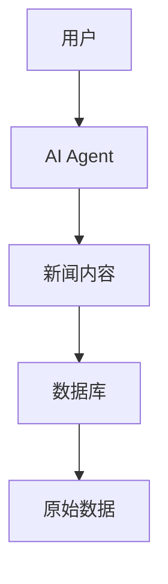
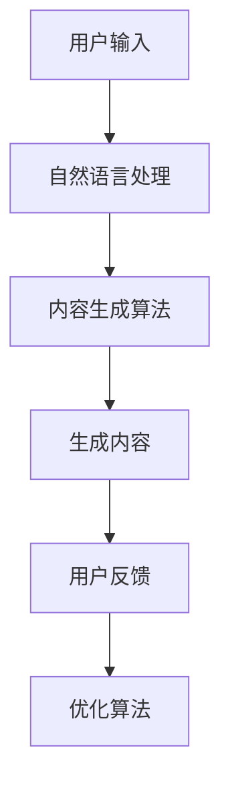
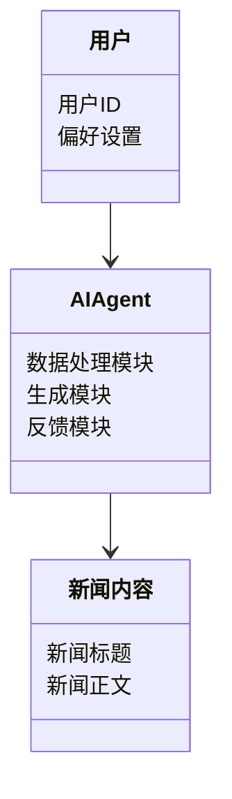
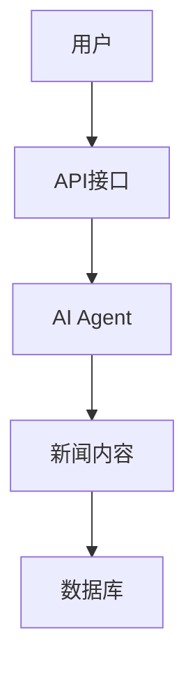
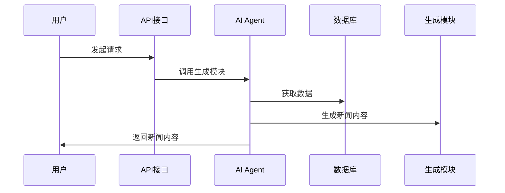

                 


# AI Agent在新闻媒体中的内容生成应用

## 关键词：AI Agent, 新闻媒体, 内容生成, 自然语言处理, 生成算法, 用户反馈

## 摘要：  
随着人工智能技术的迅速发展，AI Agent在新闻媒体中的应用越来越广泛。本文详细探讨了AI Agent在新闻内容生成中的应用，从背景介绍、核心概念、算法原理到系统架构设计、项目实战、应用案例分析，以及未来展望，全面解析了AI Agent在新闻媒体中的内容生成应用。通过本文，读者可以深入了解AI Agent在新闻媒体中的工作原理、实际应用以及未来发展方向。

---

## 第一部分: AI Agent在新闻媒体中的背景介绍

### 第1章: AI Agent与新闻媒体的背景介绍

#### 1.1 AI Agent的基本概念
##### 1.1.1 AI Agent的定义与特点
AI Agent（人工智能代理）是一种能够感知环境、自主决策并执行任务的智能体。在新闻媒体领域，AI Agent主要用于内容生成，通过自然语言处理技术，理解和分析数据，生成符合要求的新闻内容。

特点：
- **自主性**：无需人工干预，自动完成内容生成任务。
- **适应性**：能够根据数据和反馈动态调整生成策略。
- **高效性**：快速处理大量数据，提高内容生成效率。

##### 1.1.2 新闻媒体中的内容生成需求
新闻媒体对内容生成的需求主要体现在以下几点：
- **高效性**：新闻事件发生后，需要快速生成相关报道。
- **多样性**：满足不同用户对新闻内容的需求。
- **准确性**：确保新闻内容的准确性和客观性。

##### 1.1.3 AI Agent在新闻内容生成中的优势
AI Agent在新闻内容生成中的优势包括：
- **快速响应**：能够快速处理数据并生成内容。
- **24/7可用性**：全天候运行，随时生成内容。
- **可扩展性**：能够处理大量数据，生成大量内容。

#### 1.2 新闻媒体内容生成的现状与挑战
##### 1.2.1 传统新闻内容生成的流程与问题
传统新闻内容生成流程通常包括以下几个步骤：
1. 采集数据。
2. 编辑整理。
3. 写作成文。
4. 审核发布。

存在的问题：
- **效率低**：传统流程耗时较长，难以满足快速发布的需求。
- **主观性**：编辑的主观判断可能影响新闻的客观性。
- **一致性**：难以保证新闻内容的一致性和准确性。

##### 1.2.2 AI技术在新闻内容生成中的应用现状
目前，AI技术在新闻内容生成中的应用主要体现在以下几个方面：
- **自动写作**：利用自然语言处理技术生成新闻稿。
- **数据驱动**：通过分析大量数据生成新闻内容。
- **个性化推荐**：根据用户偏好生成定制化新闻内容。

##### 1.2.3 当前AI Agent在新闻媒体中的应用边界与外延
AI Agent在新闻媒体中的应用边界主要在于其生成内容的质量和可解释性。目前，AI Agent主要应用于辅助编辑、新闻推荐等领域，但尚未完全取代人类编辑。

外延方面，AI Agent可以应用于新闻采集、内容分发、用户互动等多个环节。

#### 1.3 AI Agent在新闻媒体中的核心要素组成
##### 1.3.1 数据来源与处理
AI Agent需要处理多来源的数据，包括新闻标题、正文、评论等。数据处理包括清洗、分类和标注等步骤。

##### 1.3.2 自然语言处理技术
自然语言处理技术是AI Agent生成新闻内容的核心技术，包括分词、句法分析、语义理解等。

##### 1.3.3 内容生成算法
内容生成算法包括基于规则的生成和基于模型的生成。目前，基于深度学习的生成模型（如GPT）应用广泛。

##### 1.3.4 用户反馈与优化机制
用户反馈是优化AI Agent生成内容的重要手段。通过收集用户反馈，可以不断改进生成算法，提高内容质量。

---

## 第二部分: AI Agent的核心概念与联系

### 第2章: AI Agent的核心概念与联系

#### 2.1 AI Agent的核心原理
##### 2.1.1 自然语言处理技术的原理
自然语言处理技术通过理解和生成人类语言，帮助AI Agent进行内容生成。核心步骤包括分词、句法分析、语义理解等。

##### 2.1.2 内容生成算法的原理
内容生成算法包括基于规则的生成和基于模型的生成。基于深度学习的生成模型（如GPT）通过训练大量数据生成高质量文本。

##### 2.1.3 用户反馈机制的作用
用户反馈机制通过收集用户对生成内容的反馈，优化生成算法，提高内容质量。

#### 2.2 核心概念对比分析
##### 2.2.1 AI Agent与传统内容生成工具的对比
| 特性               | AI Agent                   | 传统内容生成工具           |
|--------------------|-----------------------------|-----------------------------|
| 自主性             | 高                          | 低                          |
| 适应性             | 高                          | 低                          |
| 效率               | 高                          | 低                          |

##### 2.2.2 不同AI Agent模型的性能对比
| 模型名称           | GPT                          | BERT                        |
|--------------------|------------------------------|------------------------------|
| 主要用途           | 内容生成                     | 语义理解                     |
| 性能               | 生成高质量文本               | 高精度语义理解               |

##### 2.2.3 数据来源与处理方式的对比
| 数据来源           | AI Agent                   | 传统内容生成工具           |
|--------------------|-----------------------------|-----------------------------|
| 多样性             | 高                          | 低                          |
| 处理效率           | 高                          | 低                          |

#### 2.3 ER实体关系图架构


---

## 第三部分: AI Agent在新闻媒体中的算法原理

### 第3章: AI Agent在新闻媒体中的算法原理

#### 3.1 算法原理概述
##### 3.1.1 自然语言处理技术的应用
自然语言处理技术在AI Agent中的应用包括分词、句法分析、语义理解等，帮助生成符合语法规则的新闻内容。

##### 3.1.2 内容生成算法的实现
内容生成算法包括基于规则的生成和基于模型的生成。基于模型的生成（如GPT）通过深度学习生成高质量文本。

##### 3.1.3 用户反馈机制的优化
用户反馈机制通过收集用户对生成内容的反馈，优化生成算法，提高内容质量。

#### 3.2 算法流程图


#### 3.3 数学模型与公式
##### 3.3.1 文本生成的数学模型
文本生成的数学模型通常采用交叉熵损失函数，公式如下：
$$
\text{loss} = -\frac{1}{N}\sum_{i=1}^{N}\log P(x_i)
$$
其中，\( P(x_i) \) 是生成概率，\( N \) 是文本长度。

##### 3.3.2 损失函数的优化
优化目标是最小化交叉熵损失函数：
$$
\min \text{loss}
$$
常用Adam优化器进行优化。

---

## 第四部分: AI Agent在新闻媒体中的系统架构设计

### 第4章: AI Agent在新闻媒体中的系统架构设计

#### 4.1 系统功能设计
##### 4.1.1 领域模型


##### 4.1.2 系统架构


#### 4.2 系统接口设计
##### 4.2.1 输入接口
用户通过API接口输入数据和请求。

##### 4.2.2 输出接口
生成的新闻内容通过API接口返回给用户。

#### 4.3 系统交互流程


---

## 第五部分: AI Agent在新闻媒体中的项目实战

### 第5章: AI Agent在新闻媒体中的项目实战

#### 5.1 环境安装
项目需要安装以下环境：
- Python 3.8+
- PyTorch
- Transformers库
- Mermaid工具

#### 5.2 核心代码实现
##### 5.2.1 数据处理模块
```python
import torch
from transformers import GPT2LMHeadModel, GPT2Tokenizer

def generate_news(title, content):
    model = GPT2LMHeadModel.from_pretrained('gpt2')
    tokenizer = GPT2Tokenizer.from_pretrained('gpt2')
    inputs = tokenizer.encode(title + content, add_special_tokens=True)
    outputs = model.generate(inputs, max_length=500, temperature=0.7)
    return tokenizer.decode(outputs[0], skip_special_tokens=True)
```

##### 5.2.2 用户反馈模块
```python
def feedback(user_input, generated_text):
    # 模拟用户反馈
    if 'relevant' in user_input:
        return 'positive'
    else:
        return 'negative'
```

#### 5.3 代码解读与分析
##### 5.3.1 数据处理模块解读
数据处理模块负责将输入数据进行清洗、分类和标注，确保生成内容的质量。

##### 5.3.2 用户反馈模块解读
用户反馈模块通过收集用户对生成内容的反馈，优化生成算法，提高内容质量。

#### 5.4 案例分析与详细讲解
##### 5.4.1 案例分析
以新闻标题“某某公司发布新产品”为例，AI Agent生成新闻正文。

##### 5.4.2 详细讲解
生成过程包括数据处理、模型调用、结果返回等步骤，确保生成内容的准确性和一致性。

#### 5.5 项目小结
通过项目实战，验证了AI Agent在新闻内容生成中的可行性，同时发现了需要进一步优化的地方。

---

## 第六部分: AI Agent在新闻媒体中的应用案例分析

### 第6章: AI Agent在新闻媒体中的应用案例分析

#### 6.1 新闻写作中的应用
##### 6.1.1 AI Agent在新闻写作中的表现
AI Agent能够快速生成新闻稿，但需要人工审核。

##### 6.1.2 优缺点分析
优点：高效性、可扩展性；缺点：内容质量、可解释性。

#### 6.2 编辑辅助中的应用
##### 6.2.1 AI Agent在编辑辅助中的作用
AI Agent可以帮助编辑进行数据整理、内容优化。

##### 6.2.2 案例分析
通过具体案例展示AI Agent在编辑辅助中的实际应用。

#### 6.3 内容分发与个性化推荐
##### 6.3.1 AI Agent在内容分发中的应用
AI Agent可以根据用户偏好生成个性化推荐内容。

##### 6.3.2 案例分析
通过具体案例展示AI Agent在内容分发中的实际效果。

#### 6.4 个性化推荐中的应用
##### 6.4.1 AI Agent在个性化推荐中的作用
AI Agent可以根据用户行为生成个性化推荐内容。

##### 6.4.2 案例分析
通过具体案例展示AI Agent在个性化推荐中的实际应用。

---

## 第七部分: AI Agent在新闻媒体中的未来展望

### 第7章: AI Agent在新闻媒体中的未来展望

#### 7.1 未来技术发展趋势
##### 7.1.1 多模态生成技术
未来，AI Agent将更加注重多模态生成，结合图像、视频等多模态信息生成新闻内容。

##### 7.1.2 智能交互技术
智能交互技术将进一步发展，实现更自然的用户互动。

#### 7.2 伦理与社会影响
##### 7.2.1 伦理问题
AI Agent在新闻媒体中的应用需要考虑内容的准确性和客观性，避免虚假新闻的产生。

##### 7.2.2 社会影响
AI Agent的应用可能会导致新闻编辑人员的减少，需要考虑其对社会的影响。

#### 7.3 挑战与机遇
##### 7.3.1 技术挑战
生成内容的质量和可解释性是主要挑战。

##### 7.3.2 机遇
AI Agent的应用将为新闻媒体带来新的发展机遇，推动行业智能化转型。

#### 7.4 对新闻行业的深远影响
##### 7.4.1 新闻生产方式的变革
AI Agent将改变新闻生产方式，实现自动化、智能化。

##### 7.4.2 新闻消费模式的变革
AI Agent将推动新闻消费模式的变革，实现个性化、定制化。

---

## 作者：AI天才研究院/AI Genius Institute & 禅与计算机程序设计艺术/Zen And The Art of Computer Programming

---

通过本文，读者可以全面了解AI Agent在新闻媒体中的内容生成应用，从背景介绍到系统架构设计，再到项目实战和应用案例分析，最后展望未来的发展方向。希望本文能够为新闻媒体领域的技术实践者和研究人员提供有价值的参考和启示。

