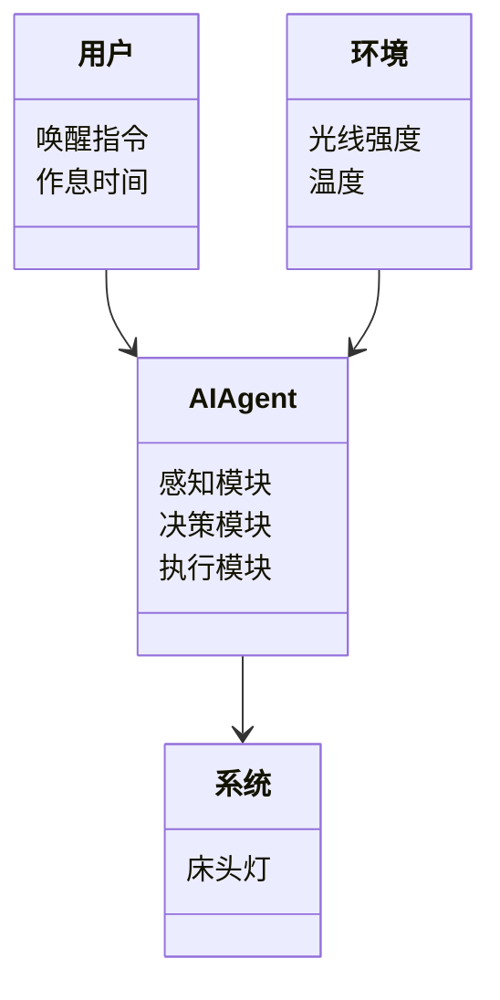
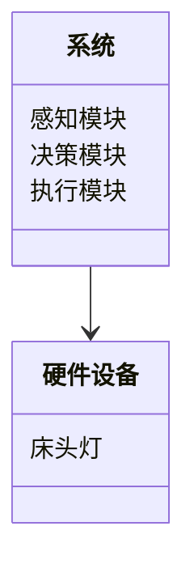
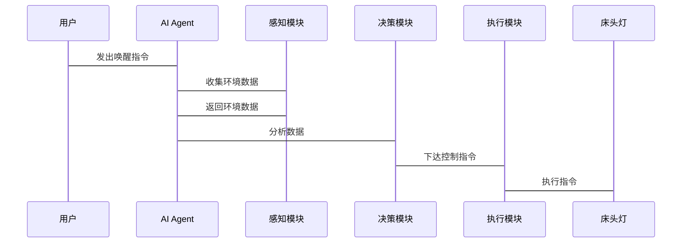

                 


# AI Agent在智能床头灯中的智能唤醒系统

## 关键词：AI Agent, 智能床头灯, 智能唤醒系统, 人工智能, 物联网

## 摘要：  
本文探讨了AI Agent在智能床头灯中的智能唤醒系统的实现与应用。通过结合人工智能与物联网技术，AI Agent能够实现床头灯的智能化控制，特别是智能唤醒系统的优化设计。本文详细分析了AI Agent的核心概念、算法原理、系统架构，并通过实际案例展示了智能唤醒系统的实现过程，最后提出了系统的优化与未来发展方向。

---

# 第一部分: AI Agent与智能床头灯的背景与概念

## 第1章: AI Agent与智能床头灯概述

### 1.1 AI Agent的基本概念
#### 1.1.1 AI Agent的定义与特点
AI Agent（人工智能代理）是指能够感知环境、自主决策并执行任务的智能实体。它具备以下特点：  
- **自主性**：能够在没有外部干预的情况下自主运作。  
- **反应性**：能够实时感知环境变化并做出响应。  
- **目标导向性**：通过设定目标来驱动行为。  
- **学习能力**：能够通过数据学习和优化自身行为。

#### 1.1.2 AI Agent的核心功能与应用场景
AI Agent的核心功能包括感知、决策和执行。在智能床头灯中，AI Agent主要用于实现智能唤醒、环境感知和用户交互等功能。其应用场景广泛，包括智能家居、医疗健康、工业自动化等领域。

#### 1.1.3 AI Agent与传统自动化系统的区别
与传统自动化系统相比，AI Agent具备更强的智能性和适应性。传统自动化系统依赖于预设的规则和程序，而AI Agent能够通过学习和推理优化自身行为，适应环境变化。

### 1.2 智能床头灯的定义与特点
#### 1.2.1 智能床头灯的功能概述
智能床头灯是一种结合了物联网和人工智能技术的床头灯，具备以下功能：  
- **智能开关控制**：通过语音或手机APP控制开关。  
- **亮度调节**：根据用户需求自动调节亮度。  
- **环境感知**：通过传感器感知环境光线、温度和湿度等。  
- **智能唤醒**：根据用户的作息习惯自动开启或关闭。

#### 1.2.2 智能床头灯的硬件组成与技术特点
智能床头灯的硬件组成包括：  
- **主控芯片**：如Arduino或Raspberry Pi。  
- **传感器**：如光线传感器、温度传感器。  
- **无线通信模块**：如Wi-Fi、蓝牙模块。  
- **执行机构**：如电机控制电路。  

#### 1.2.3 智能床头灯与传统床头灯的区别
智能床头灯通过集成传感器、无线通信和智能算法，具备更强的智能化和自动化能力。传统床头灯仅具备基本的开关和亮度调节功能，无法实现智能化控制。

### 1.3 AI Agent在智能床头灯中的应用
#### 1.3.1 AI Agent在智能床头灯中的核心作用
AI Agent在智能床头灯中主要负责感知环境、分析用户需求并执行相应的操作。例如，AI Agent可以根据用户的作息习惯，智能调节床头灯的开关时间。

#### 1.3.2 AI Agent在智能唤醒系统中的具体应用
智能唤醒系统是AI Agent在智能床头灯中的重要应用之一。通过分析用户的睡眠周期和作息习惯，AI Agent能够实现精准的唤醒服务。

#### 1.3.3 AI Agent与其他智能设备的协同工作
AI Agent可以通过物联网平台与其他智能设备协同工作，例如与智能音箱、智能窗帘等设备联动，实现智能家居的全方位智能化控制。

### 1.4 本章小结
本章介绍了AI Agent的基本概念、智能床头灯的功能特点以及AI Agent在智能床头灯中的应用。通过这些内容，读者可以理解AI Agent在智能床头灯中的核心作用。

---

# 第二部分: AI Agent在智能唤醒系统中的核心概念与原理

## 第2章: AI Agent的感知与决策机制

### 2.1 AI Agent的感知模块
#### 2.1.1 感知模块的功能与作用
感知模块是AI Agent的“眼睛”和“耳朵”，负责收集环境数据。例如，光线传感器可以感知房间的亮度，温度传感器可以感知环境温度。

#### 2.1.2 常见的感知技术与传感器类型
常用的感知技术包括：  
- **光线传感器**：用于感知环境亮度。  
- **温度传感器**：用于感知环境温度。  
- **湿度传感器**：用于感知环境湿度。  
- **麦克风**：用于语音识别和唤醒词检测。

#### 2.1.3 感知数据的处理与分析
感知数据的处理包括数据采集、预处理和特征提取。例如，AI Agent可以通过滤波算法处理传感器数据，提取有用的特征信息。

### 2.2 AI Agent的决策模块
#### 2.2.1 决策模块的核心算法与原理
决策模块是AI Agent的核心，负责根据感知数据做出决策。常见的决策算法包括规则引擎、基于机器学习的分类算法等。

#### 2.2.2 常见的决策算法对比与选择
不同的决策算法适用于不同的场景。例如，规则引擎适用于简单的条件判断，而机器学习算法适用于复杂场景的决策。

#### 2.2.3 决策模块的优化与改进
决策模块的优化可以通过算法改进、参数调优等方式实现。例如，可以通过集成学习算法提高决策的准确性。

### 2.3 AI Agent的执行模块
#### 2.3.1 执行模块的功能与实现
执行模块是AI Agent的“手”，负责执行决策结果。例如，AI Agent可以根据决策结果控制床头灯的开关和亮度。

#### 2.3.2 执行模块与硬件设备的交互
执行模块通过与硬件设备的接口进行交互，例如通过GPIO接口控制电机或LED灯。

#### 2.3.3 执行模块的反馈与优化
执行模块可以通过反馈机制优化自身的执行策略。例如，AI Agent可以根据用户的反馈调整唤醒时间。

### 2.4 本章小结
本章详细介绍了AI Agent的感知、决策和执行模块，分析了各种算法和技术的实现原理和应用场景。

---

# 第三部分: AI Agent智能唤醒系统的算法原理与数学模型

## 第3章: 唤醒算法的核心原理

### 3.1 唤醒算法的基本原理
#### 3.1.1 唤醒算法的定义与分类
唤醒算法是指用于识别用户唤醒指令的算法。常见的唤醒算法包括基于规则的唤醒算法和基于机器学习的唤醒算法。

#### 3.1.2 唤醒算法的核心步骤与流程
唤醒算法的核心步骤包括：  
1. **数据采集**：采集用户的语音或动作数据。  
2. **数据预处理**：对采集的数据进行降噪处理。  
3. **特征提取**：提取数据中的特征信息。  
4. **模型训练**：训练分类器，识别唤醒指令。  
5. **决策与执行**：根据识别结果执行相应的操作。

#### 3.1.3 唤醒算法的性能指标与评估方法
唤醒算法的性能指标包括准确率、召回率和F1值。评估方法可以通过交叉验证和测试集验证。

### 3.2 基于语音识别的唤醒算法
#### 3.2.1 语音识别的基本原理与实现方法
语音识别是通过将语音信号转换为文本的过程。常用的语音识别算法包括隐马尔可夫模型（HMM）和深度学习模型（如CNN、RNN）。

#### 3.2.2 唤醒词的训练与优化
唤醒词是用户用于唤醒AI Agent的特定词汇或短语。唤醒词的训练需要考虑语音特征和用户习惯。

#### 3.2.3 基于深度学习的语音识别模型
基于深度学习的语音识别模型（如卷积神经网络和循环神经网络）在唤醒算法中表现优异，能够实现高精度的语音识别。

### 3.3 唤醒算法的数学模型与公式
#### 3.3.1 唤醒算法的数学模型
唤醒算法的数学模型可以通过概率模型和统计模型来描述。例如，隐马尔可夫模型可以用以下公式表示：

$$ P(y|x) = \sum_{i=1}^{n} P(x|y_i) P(y_i) $$

其中，$y$是目标状态，$x$是观测数据，$P(y_i)$是状态转移概率。

#### 3.3.2 唤醒算法的具体实现示例
以下是一个基于简单规则的唤醒算法实现示例：

```python
def wake_word_detection(audio_data):
    # 对音频数据进行预处理
    processed_data = preprocess(audio_data)
    # 提取特征
    features = extract_features(processed_data)
    # 与预设的唤醒词特征进行对比
    if compare_features(features, target_features):
        return True
    else:
        return False
```

### 3.4 本章小结
本章详细介绍了唤醒算法的基本原理、实现方法和数学模型，重点分析了基于语音识别的唤醒算法。

---

# 第四部分: AI Agent智能唤醒系统的系统架构与设计

## 第4章: 系统架构与设计

### 4.1 问题场景介绍
智能床头灯的智能唤醒系统需要实现以下功能：  
- **用户身份识别**：识别用户的唤醒指令。  
- **时间管理**：根据用户的作息习惯设定唤醒时间。  
- **环境感知**：根据环境光线和声音调整唤醒策略。

### 4.2 项目介绍
本项目旨在设计一个基于AI Agent的智能唤醒系统，实现床头灯的智能开关控制。系统主要包括感知模块、决策模块和执行模块。

### 4.3 系统功能设计
#### 4.3.1 领域模型设计
以下是领域模型的Mermaid图：



#### 4.3.2 系统架构设计
以下是系统架构的Mermaid图：



#### 4.3.3 系统接口设计
系统接口设计包括：  
- **用户接口**：通过语音或APP控制床头灯。  
- **设备接口**：与床头灯和其他智能设备的通信接口。  
- **数据接口**：与云端数据存储的接口。

#### 4.3.4 系统交互设计
以下是系统交互的Mermaid图：



### 4.4 本章小结
本章通过系统架构设计和交互设计，详细描述了AI Agent智能唤醒系统的实现方案。

---

# 第五部分: AI Agent智能唤醒系统的项目实战

## 第5章: 项目实战

### 5.1 环境安装与配置
#### 5.1.1 开发环境选择
推荐使用Raspberry Pi作为主控芯片，搭配Python编程语言。

#### 5.1.2 传感器与硬件设备安装
安装光线传感器和麦克风模块，确保硬件设备正常工作。

### 5.2 系统核心实现
#### 5.2.1 AI Agent的核心代码实现
以下是AI Agent的核心代码示例：

```python
class AIAssistant:
    def __init__(self):
        self.sensor = LightSensor()
        selfspeaker = Speaker()

    def感知环境(self):
        光线强度 = self.sensor.read_light()
        return 光线强度

    def 决策(self, 光线强度):
        if 光线强度 < 50:
            return "开启床头灯"
        else:
            return "关闭床头灯"

    def 执行(self, 指令):
        if 指令 == "开启床头灯":
            selfspeaker.speak("好的，正在开启床头灯。")
            self床头灯.开启()
        else:
            selfspeaker.speak("好的，正在关闭床头灯。")
            self床头灯.关闭()
```

#### 5.2.2 唤醒算法的代码实现
以下是唤醒算法的代码示例：

```python
def 唤醒检测():
    audio_data = microphone.record(5)
    processed_data = preprocess(audio_data)
    features = extract_features(processed_data)
    if compare_features(features, 目标特征):
        return True
    else:
        return False
```

### 5.3 系统测试与优化
#### 5.3.1 系统测试
测试内容包括：  
- **功能测试**：测试AI Agent的感知、决策和执行功能。  
- **性能测试**：测试系统在高负载下的运行情况。  
- **用户体验测试**：收集用户的使用反馈。

#### 5.3.2 系统优化
根据测试结果优化系统性能，例如优化算法模型、提升传感器精度等。

### 5.4 本章小结
本章通过实际项目案例，详细讲解了AI Agent智能唤醒系统的实现过程，包括环境安装、代码实现和系统测试。

---

# 第六部分: AI Agent智能唤醒系统的优化与未来展望

## 第6章: 系统优化与未来展望

### 6.1 系统优化方案
#### 6.1.1 算法优化
- 提升唤醒算法的准确率。  
- 优化决策模块的响应速度。  

#### 6.1.2 系统架构优化
- 引入边缘计算技术，提升系统的实时性。  
- 优化硬件设备的性能。  

### 6.2 未来展望
随着人工智能和物联网技术的不断发展，智能床头灯的智能唤醒系统将更加智能化和个性化。未来的研究方向包括：  
- **多模态交互**：结合视觉、语音等多种交互方式。  
- **个性化服务**：根据用户的个性化需求提供定制化服务。  
- **能源优化**：提升系统的能效比，延长设备的续航时间。

### 6.3 本章小结
本章提出了系统的优化方案，并展望了未来的发展方向。

---

# 结语

通过本文的详细讲解，读者可以全面了解AI Agent在智能床头灯中的智能唤醒系统的实现与应用。从核心概念到算法实现，从系统架构到项目实战，本文为读者提供了一个完整的解决方案。未来，随着技术的不断进步，智能床头灯的智能唤醒系统将更加智能化和人性化，为用户提供更优质的服务。

---

# 作者

作者：AI天才研究院/AI Genius Institute  
& 禅与计算机程序设计艺术 /Zen And The Art of Computer Programming

---

以上是《AI Agent在智能床头灯中的智能唤醒系统》的完整目录大纲和文章内容。

