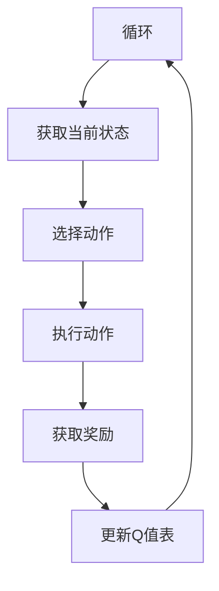
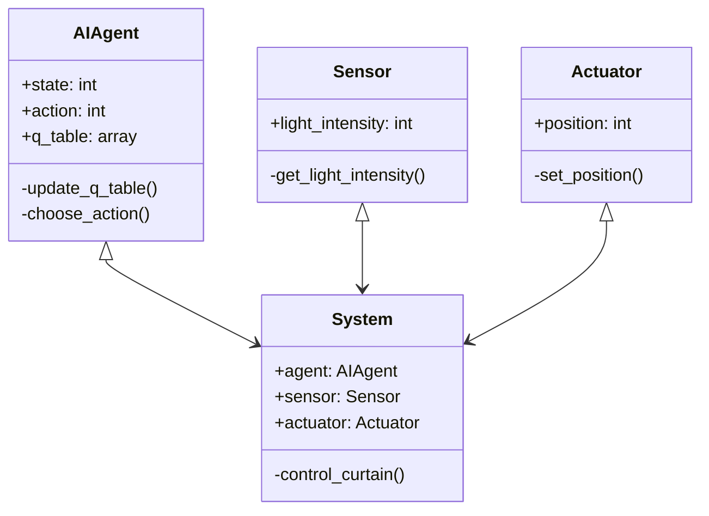
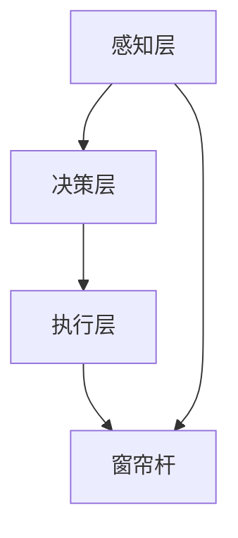
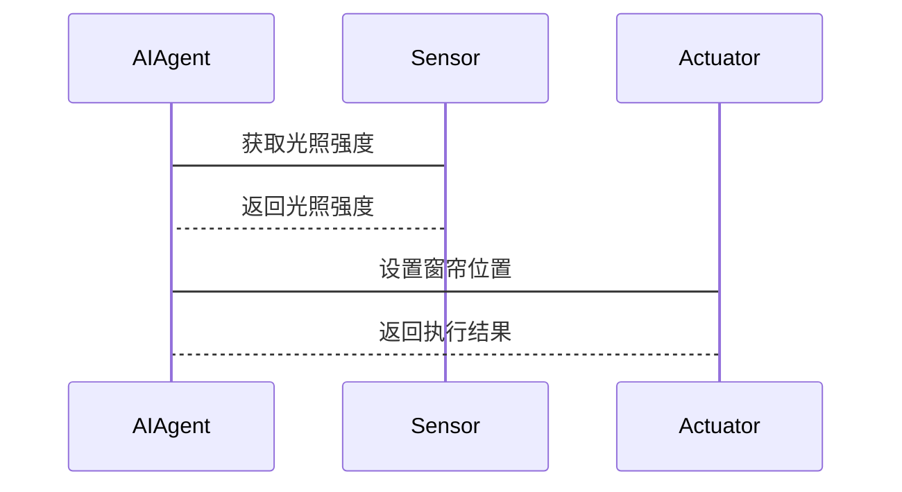

                 


# AI Agent在智能窗帘杆中的日光优化

> 关键词：AI Agent, 智能窗帘杆, 日光优化, 强化学习, 系统架构

> 摘要：本文探讨了AI Agent在智能窗帘杆中的日光优化应用，详细分析了AI Agent的核心原理、算法实现、系统架构设计，并通过项目实战展示了如何通过AI技术优化日光利用，同时提供了一系列最佳实践和未来展望。

---

# 第1章: AI Agent在智能窗帘杆中的日光优化背景介绍

## 1.1 问题背景
### 1.1.1 智能窗帘杆的现状与挑战
智能窗帘杆作为一种智能家居设备，旨在通过自动化控制来优化日光利用，从而提高能源效率和居住舒适度。然而，现有的智能窗帘杆在日光优化方面存在以下挑战：
- **能源浪费**：传统窗帘无法根据光照强度和时间自动调节，导致能源浪费。
- **用户体验不足**：用户需要手动调整窗帘，体验较差。
- **环境适应性差**：无法根据天气变化智能调整，导致日光利用效率低下。

### 1.1.2 日光优化的重要性
日光优化是指通过智能调整窗帘的开合角度和时间，最大化利用自然光，减少能源消耗，同时提升室内采光和舒适度。日光优化的重要性体现在：
- **节能减排**：减少人工照明的使用，降低能源消耗。
- **提高舒适度**：通过优化日光分布，提升室内采光和视觉舒适度。
- **智能化家居**：作为智能家居的一部分，智能窗帘杆的日光优化是实现全屋智能控制的重要环节。

### 1.1.3 AI Agent在日光优化中的作用
AI Agent（人工智能代理）是一种能够感知环境、自主决策并执行任务的智能系统。在日光优化中，AI Agent可以：
- **感知环境**：通过光照传感器、天气预报等数据，实时感知环境光照情况。
- **自主决策**：基于感知数据，利用强化学习或机器学习算法，优化窗帘的开合角度和时间。
- **执行任务**：通过与窗帘杆的物理接口，执行优化后的窗帘控制任务。

---

## 1.2 问题描述
### 1.2.1 日光优化的目标
日光优化的目标是在不同天气和光照条件下，智能调整窗帘的开合角度和时间，以最大化自然光的利用效率，同时满足用户的舒适度需求。

### 1.2.2 智能窗帘杆的控制需求
智能窗帘杆需要实现以下功能：
- **实时感知光照强度**：通过光照传感器获取实时光照数据。
- **预测光照变化**：基于天气预报和历史数据，预测未来的光照情况。
- **智能决策**：根据实时和预测数据，优化窗帘的开合角度和时间。
- **执行控制**：通过电机或其他执行机构，调整窗帘的开合状态。

### 1.2.3 AI Agent在日光优化中的具体任务
AI Agent的具体任务包括：
- **数据采集与处理**：采集光照、天气、时间等数据，并进行预处理。
- **状态识别**：识别当前光照状态（晴天、阴天、夜晚等）。
- **决策优化**：基于当前和预测的光照状态，优化窗帘的开合角度和时间。
- **执行控制**：将优化结果转化为具体的窗帘控制指令。

---

## 1.3 问题解决
### 1.3.1 AI Agent的核心解决方案
AI Agent的核心解决方案是通过强化学习算法，建立一个能够实时感知环境、自主决策并执行任务的智能系统。具体包括：
- **强化学习模型**：通过强化学习训练AI Agent，使其能够在不同光照条件下优化窗帘的开合角度和时间。
- **多传感器融合**：结合光照传感器、天气预报、时间等多种数据源，提高决策的准确性。
- **动态调整**：根据实时数据动态调整窗帘的开合状态，确保日光优化的持续性和高效性。

### 1.3.2 日光优化算法的设计思路
日光优化算法的设计思路是基于强化学习的Q-learning算法。通过状态-动作-奖励机制，AI Agent可以在不同的光照状态下，选择最优的窗帘开合角度和时间，以最大化日光利用效率。

### 1.3.3 智能窗帘杆的实现方案
智能窗帘杆的实现方案包括：
- **硬件部分**：包括光照传感器、电机、窗帘杆、控制器等。
- **软件部分**：包括数据采集、算法处理、控制指令生成等模块。
- **通信接口**：通过物联网协议（如Wi-Fi、蓝牙等）实现设备间的通信与协同。

---

## 1.4 边界与外延
### 1.4.1 系统边界定义
智能窗帘杆的日光优化系统边界包括：
- **输入**：光照强度、天气预报、时间等数据。
- **输出**：窗帘的开合角度和时间。
- **外部系统**：与智能家居系统（如智能灯泡、空调等）的协同工作。

### 1.4.2 日光优化的适用范围
日光优化的适用范围包括：
- **家庭环境**：适用于客厅、卧室等房间的窗帘控制。
- **商业环境**：适用于办公室、酒店等场所的窗帘控制。
- **智能社区**：作为智能社区的一部分，实现全社区的日光优化。

### 1.4.3 AI Agent的限制与扩展
AI Agent的限制包括：
- **环境依赖性**：依赖于光照传感器和天气预报等外部数据，可能受到传感器精度和数据来源的影响。
- **计算资源**：需要一定的计算资源来实时处理数据并进行决策。
- **安全性**：需要考虑数据安全和系统安全性，防止恶意攻击。

---

## 1.5 核心概念结构
### 1.5.1 日光优化的核心要素
日光优化的核心要素包括：
- **光照强度**：光照强度的感知和测量。
- **天气预报**：基于天气预报预测未来的光照变化。
- **窗帘状态**：窗帘的开合角度和时间。

### 1.5.2 AI Agent的功能模块
AI Agent的功能模块包括：
- **感知模块**：负责采集和处理环境数据。
- **决策模块**：负责基于感知数据进行优化决策。
- **执行模块**：负责将决策结果转化为具体的控制指令。

### 1.5.3 系统的输入输出关系
系统的输入包括：
- 光照强度
- 天气预报
- 时间

系统的输出包括：
- 窗帘的开合角度
- 窗帘的开合时间

---

## 1.6 本章小结
本章从背景介绍、问题描述和问题解决三个方面，详细阐述了AI Agent在智能窗帘杆中的日光优化应用。通过分析日光优化的重要性、AI Agent的核心作用以及系统的实现方案，为后续章节的深入分析奠定了基础。

---

# 第2章: AI Agent的核心原理

## 2.1 AI Agent的定义与特点
### 2.1.1 AI Agent的基本定义
AI Agent是一种能够感知环境、自主决策并执行任务的智能系统。它通过与环境的交互，不断优化自身的行为，以实现预设的目标。

### 2.1.2 AI Agent的特点
AI Agent具有以下特点：
- **自主性**：能够自主决策和行动，无需人工干预。
- **反应性**：能够实时感知环境并做出反应。
- **学习性**：能够通过学习提高自身的决策能力。
- **协作性**：能够与其他智能系统协同工作。

### 2.1.3 AI Agent的核心功能
AI Agent的核心功能包括：
- **感知**：通过传感器或其他数据源感知环境状态。
- **决策**：基于感知数据，利用算法进行优化决策。
- **执行**：将决策结果转化为具体的执行动作。

---

## 2.2 AI Agent的核心原理
### 2.2.1 感知模块
感知模块通过光照传感器、天气预报等数据源，实时感知环境状态。数据经过预处理后，输入到决策模块。

### 2.2.2 决策模块
决策模块基于强化学习算法，优化窗帘的开合角度和时间。通过Q-learning算法，AI Agent可以在不同的光照状态下，选择最优的窗帘控制策略。

### 2.2.3 执行模块
执行模块通过电机或其他执行机构，调整窗帘的开合状态，实现日光优化的目标。

---

## 2.3 AI Agent的算法实现
### 2.3.1 强化学习算法
强化学习是一种通过试错机制优化决策的算法。在日光优化中，AI Agent通过与环境的交互，不断优化窗帘的开合角度和时间。

### 2.3.2 Q-learning算法
Q-learning算法是一种常用的强化学习算法。通过状态-动作-奖励机制，AI Agent可以学习到最优的窗帘控制策略。

---

## 2.4 AI Agent与传统窗帘的对比分析
### 2.4.1 功能对比
| 功能 | 传统窗帘 | 智能窗帘杆 |
|------|----------|------------|
| 开合控制 | 手动或定时 | 自动优化 |
| 光照利用 | 固定时间 | 动态优化 |
| 能源效率 | 低 | 高 |

### 2.4.2 性能对比
| 性能指标 | 传统窗帘 | 智能窗帘杆 |
|----------|----------|------------|
| 能源效率 | 低 | 高 |
| 舒适度 | 一般 | 高 |
| 智能化程度 | 低 | 高 |

### 2.4.3 智能化对比
智能窗帘杆通过AI Agent实现了智能化的日光优化，能够根据光照变化实时调整窗帘的开合状态，而传统窗帘无法实现这一点。

---

## 2.5 AI Agent的ER实体关系图
```mermaid
er
  actor: 用户
  system: AI Agent系统
  device: 窗帘杆
  sensor: 光照传感器
  action: 窗帘开合动作
  state: 窗帘状态
  relation: 实体之间的关联关系
```

---

## 2.6 本章小结
本章详细介绍了AI Agent的核心原理，包括感知、决策和执行三个模块，以及强化学习算法的实现。通过与传统窗帘的对比分析，进一步明确了AI Agent在日光优化中的优势和作用。

---

# 第3章: AI Agent的日光优化算法实现

## 3.1 算法原理
### 3.1.1 强化学习的Q-learning算法
Q-learning算法是一种基于值函数的强化学习算法。通过状态-动作-奖励机制，AI Agent可以学习到最优的窗帘控制策略。

### 3.1.2 算法流程
1. **初始化**：初始化Q值表，所有状态-动作对的Q值初始化为0。
2. **感知**：通过光照传感器获取当前光照强度。
3. **决策**：基于当前状态和Q值表，选择最优动作（窗帘开合角度）。
4. **执行**：执行选择的动作，调整窗帘的开合状态。
5. **反馈**：根据执行结果，更新Q值表。
6. **优化**：不断迭代，优化Q值表，提高日光优化效率。

---

## 3.2 算法流程图


---

## 3.3 算法实现代码
```python
import numpy as np
import random

# 状态空间：光照强度（0-100）
# 动作空间：窗帘开合角度（0-100）
# 奖励函数：日光利用效率（0-1）
# 学习率：0.1
# 折扣因子：0.9

class AIAgent:
    def __init__(self):
        self.q_table = np.zeros((101, 101))
    
    def choose_action(self, state):
        if random.random() < 0.9:
            return np.argmax(self.q_table[state])
        else:
            return random.randint(0, 100)
    
    def update_q_table(self, state, action, reward):
        self.q_table[state, action] = self.q_table[state, action] * 0.9 + reward * 0.1

# 示例代码
agent = AIAgent()
state = 50  # 当前光照强度
action = agent.choose_action(state)
reward = 1  # 假设日光利用效率提高
agent.update_q_table(state, action, reward)
```

---

## 3.4 算法的数学模型
Q-learning算法的数学模型如下：

$$ Q(s, a) = Q(s, a) \times \alpha + r + \gamma \times \max_{a'} Q(s', a') $$

其中：
- \( Q(s, a) \)：状态-动作对的Q值
- \( \alpha \)：学习率
- \( r \)：奖励
- \( \gamma \)：折扣因子
- \( s' \)：下一个状态
- \( a' \)：下一个动作

---

## 3.5 本章小结
本章详细介绍了AI Agent的日光优化算法实现，包括Q-learning算法的原理、流程图和代码实现。通过数学模型的描述，进一步明确了算法的优化机制和实现细节。

---

# 第4章: AI Agent的日光优化系统分析与架构设计

## 4.1 问题场景介绍
智能窗帘杆的日光优化系统适用于家庭、办公室、酒店等多种场景。通过AI Agent的智能控制，实现日光的高效利用。

---

## 4.2 项目介绍
本项目旨在通过AI Agent技术，优化智能窗帘杆的日光利用效率，减少能源消耗，提高用户体验。

---

## 4.3 系统功能设计
### 4.3.1 领域模型类图


---

## 4.4 系统架构设计
### 4.4.1 分层架构
系统采用分层架构，包括：
- **感知层**：负责数据采集。
- **决策层**：负责优化决策。
- **执行层**：负责控制窗帘。

### 4.4.2 系统架构图


---

## 4.5 系统接口设计
### 4.5.1 系统接口
- **传感器接口**：与光照传感器通信，获取光照强度数据。
- **执行机构接口**：与窗帘杆通信，控制窗帘的开合角度。
- **用户接口**：提供用户交互界面，设置参数和查看状态。

---

## 4.6 系统交互序列图


---

## 4.7 本章小结
本章从系统分析与架构设计的角度，详细介绍了AI Agent的日光优化系统的实现方案，包括领域模型类图、系统架构设计和系统交互序列图。

---

# 第5章: AI Agent的日光优化项目实战

## 5.1 环境搭建
### 5.1.1 硬件环境
- 光照传感器
- 窗帘杆
- 电机
- 控制器

### 5.1.2 软件环境
- Python 3.8+
- NumPy库
- scikit-learn库

---

## 5.2 系统核心实现
### 5.2.1 传感器数据采集
```python
class Sensor:
    def __init__(self):
        self.light_intensity = 0
    
    def get_light_intensity(self):
        # 模拟光照强度数据
        self.light_intensity = random.randint(0, 100)
        return self.light_intensity
```

### 5.2.2 日光优化算法实现
```python
class AIAgent:
    def __init__(self):
        self.q_table = np.zeros((101, 101))
    
    def choose_action(self, state):
        if random.random() < 0.9:
            return np.argmax(self.q_table[state])
        else:
            return random.randint(0, 100)
    
    def update_q_table(self, state, action, reward):
        self.q_table[state, action] = self.q_table[state, action] * 0.9 + reward * 0.1
```

### 5.2.3 窗帘控制实现
```python
class Actuator:
    def __init__(self):
        self.position = 0
    
    def set_position(self, position):
        self.position = position
        print(f"窗帘开合角度调整为：{self.position}%")
```

### 5.2.4 系统主程序
```python
agent = AIAgent()
sensor = Sensor()
actuator = Actuator()

while True:
    state = sensor.get_light_intensity()
    action = agent.choose_action(state)
    agent.update_q_table(state, action, reward)
    actuator.set_position(action)
```

---

## 5.3 实际案例分析
### 5.3.1 晴天场景
- **光照强度**：100
- **窗帘开合角度**：0（完全打开）

### 5.3.2 阴天场景
- **光照强度**：30
- **窗帘开合角度**：50（部分打开）

---

## 5.4 本章小结
本章通过项目实战，详细介绍了AI Agent的日光优化系统的实现过程，包括环境搭建、核心代码实现和实际案例分析。

---

# 第6章: AI Agent的日光优化最佳实践

## 6.1 实践建议
### 6.1.1 传感器选择
- 选择高精度的光照传感器，确保数据的准确性。
- 考虑传感器的安装位置，避免遮挡。

### 6.1.2 算法调优
- 根据实际场景调整学习率和折扣因子。
- 定期更新Q值表，保持算法的有效性。

### 6.1.3 系统安全性
- 加强数据安全，防止恶意攻击。
- 设定权限控制，避免非授权操作。

---

## 6.2 小结
本章总结了AI Agent的日光优化系统在实际应用中的最佳实践，包括传感器选择、算法调优和系统安全性等方面。

---

# 第7章: 总结与展望

## 7.1 总结
AI Agent在智能窗帘杆中的日光优化应用，通过实时感知环境、自主决策并执行任务，实现了日光的高效利用。本文详细介绍了AI Agent的核心原理、算法实现、系统架构设计和项目实战。

---

## 7.2 展望
未来，随着AI技术的不断发展，AI Agent在智能窗帘杆中的日光优化应用将更加智能化和高效化。可以通过以下方面进一步优化：
- **多目标优化**：同时优化能源效率和用户体验。
- **多设备协同**：与其他智能家居设备协同工作，实现全屋智能控制。
- **边缘计算**：通过边缘计算提高系统的实时性和响应速度。

---

# 参考文献
1. Richard S. Sutton, Andrew G. Barto. 《Introduction to Reinforcement Learning》.
2. DeepMind. 《Deep Q-Networks》.
3. OpenAI. 《AI Safety Research》.

---

# 作者：AI天才研究院/AI Genius Institute & 禅与计算机程序设计艺术/Zen And The Art of Computer Programming

---

以上是《AI Agent在智能窗帘杆中的日光优化》的技术博客文章目录大纲和内容概要。希望对您有所帮助！

