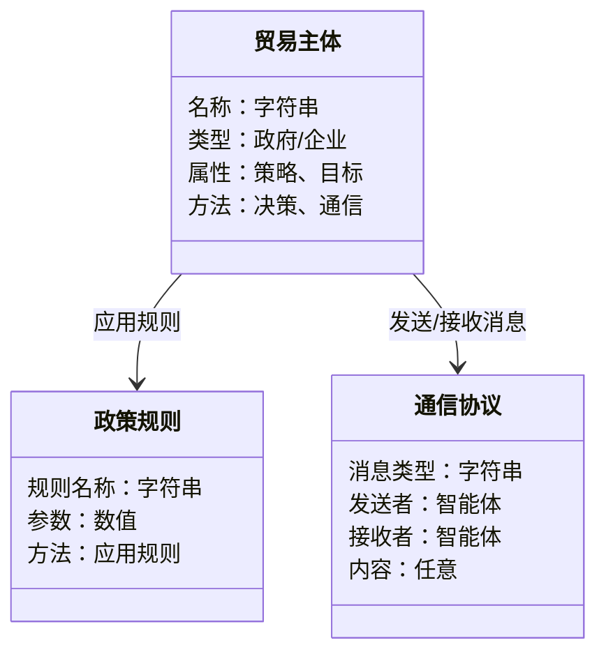
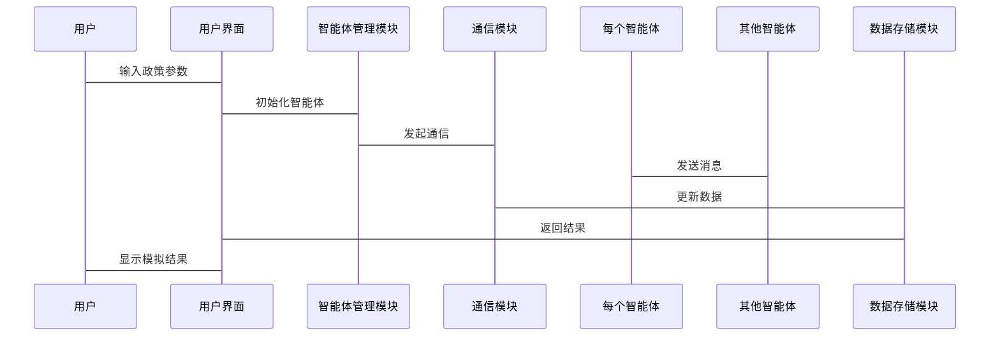

                 


# 利用多智能体系统模拟不同贸易政策：评估全球化风险

## 关键词：多智能体系统, 贸易政策模拟, 全球化风险, 分布式计算, 贸易模型, 政策评估

## 摘要：  
本文通过多智能体系统的视角，详细探讨了如何模拟不同贸易政策及其对全球化风险的影响。文章首先介绍了多智能体系统的概念和其在贸易政策模拟中的应用，随后分析了多智能体系统的核心原理和算法，结合实际案例展示了如何构建和实现一个贸易政策模拟系统。通过系统的架构设计、算法实现和案例分析，本文为政策制定者和研究人员提供了一种创新的方法来评估和优化贸易政策，从而降低全球化过程中的潜在风险。

---

## 第一部分: 背景介绍

### 第1章: 多智能体系统概述

#### 1.1 多智能体系统的基本概念
##### 1.1.1 多智能体系统的定义
多智能体系统（Multi-Agent System, MAS）是由多个智能体组成的分布式系统，这些智能体能够自主决策、协作或竞争以完成特定目标。智能体可以是软件程序、算法或其他实体，能够感知环境并采取行动。

##### 1.1.2 多智能体系统的特征
- **分布式性**：智能体分布在网络中，独立运行。
- **自主性**：每个智能体能够自主决策。
- **协作性**：智能体之间可以通过通信协作完成任务。
- **反应性**：能够实时感知环境变化并调整行为。

##### 1.1.3 多智能体系统的分类
- **基于任务的MAS**：智能体协作完成特定任务。
- **基于市场的MAS**：智能体通过市场机制进行资源分配。
- **基于知识的MAS**：智能体基于知识库进行推理和决策。

#### 1.2 贸易政策的基本概念
##### 1.2.1 贸易政策的定义
贸易政策是指国家或组织为促进或限制贸易活动而制定的规则和策略，包括关税、贸易壁垒、补贴等。

##### 1.2.2 贸易政策的分类
- **自由贸易政策**：减少贸易壁垒，促进商品自由流动。
- **保护贸易政策**：通过关税或其他手段保护本国产业。
- **区域贸易政策**：在特定区域内制定的贸易规则。

##### 1.2.3 贸易政策的影响
贸易政策直接影响国际贸易流量、企业竞争力和经济发展。例如，关税可能增加进口成本，影响消费者价格。

#### 1.3 问题背景与研究意义
##### 1.3.1 全球化风险的定义
全球化风险是指全球化过程中可能出现的负面效应，如经济不平等加剧、供应链中断等。

##### 1.3.2 多智能体系统在贸易政策模拟中的作用
多智能体系统能够模拟复杂的贸易关系和政策效果，帮助政策制定者优化决策。

##### 1.3.3 研究的创新点与意义
通过多智能体系统模拟贸易政策，可以更直观地观察政策效果，为政策优化提供数据支持。

### 第2章: 多智能体系统与贸易政策的关系

#### 2.1 多智能体系统在贸易政策模拟中的应用
##### 2.1.1 多智能体系统的分布式计算特点
多智能体系统能够处理复杂的分布式计算问题，适合模拟全球贸易网络中多主体的交互。

##### 2.1.2 贸易政策的复杂性与多智能体系统的适应性
贸易政策涉及多个利益相关者，多智能体系统能够模拟这些主体的交互和决策过程。

#### 2.2 贸易政策模拟的多智能体模型构建
##### 2.2.1 模型的基本架构
- **智能体定义**：每个贸易主体（如企业、政府）作为一个智能体。
- **规则定义**：智能体根据预设规则进行决策。
- **动态演化**：模拟贸易政策实施后的动态变化。

##### 2.2.2 智能体的定义与角色分配
- **政府智能体**：制定和调整贸易政策。
- **企业智能体**：根据政策调整生产和贸易行为。
- **消费者智能体**：反映市场需求变化。

##### 2.2.3 模型的动态演化过程
模拟过程中，智能体根据环境变化调整行为，模型逐步演化，反映政策效果。

#### 2.3 多智能体系统模拟贸易政策的优势
##### 2.3.1 高度的灵活性与可扩展性
多智能体系统能够轻松扩展，适应不同规模的贸易模拟。

##### 2.3.2 能够模拟复杂的交互关系
通过智能体之间的通信和协作，可以模拟复杂的贸易网络和政策影响。

##### 2.3.3 便于进行风险评估与政策优化
通过模拟不同政策场景，可以评估风险并优化政策。

---

## 第二部分: 核心概念与联系

### 第3章: 多智能体系统的核心原理

#### 3.1 多智能体系统的原理
##### 3.1.1 分布式计算原理
多智能体系统采用分布式计算，每个智能体独立运行，通过通信协作完成任务。

##### 3.1.2 智能体之间的通信机制
智能体之间通过消息传递进行通信，协调行动和共享信息。

##### 3.1.3 协作与竞争关系的动态平衡
智能体在协作中寻求共赢，在竞争中实现资源优化。

#### 3.2 贸易政策模拟的核心要素
##### 3.2.1 贸易主体的定义与属性
- **主体属性**：企业规模、市场份额、利润率等。
- **行为规则**：价格调整、生产决策等。

##### 3.2.2 贸易规则的建模方法
通过数学模型描述贸易规则，如关税计算、贸易壁垒等。

##### 3.2.3 贸易数据的采集与处理
从真实贸易数据中提取特征，用于模拟和验证模型。

### 第4章: 核心概念的联系与对比

#### 4.1 多智能体系统与传统贸易模型的对比
##### 4.1.1 模型构建方式的对比
- **传统模型**：集中式、静态。
- **多智能体系统**：分布式、动态。

##### 4.1.2 计算效率的对比
多智能体系统在处理复杂问题时效率更高。

##### 4.1.3 模型灵活性的对比
多智能体系统更灵活，能够适应复杂变化。

#### 4.2 贸易政策模拟中的关键属性对比
##### 4.2.1 不同贸易政策的对比
- **自由贸易**：促进竞争，降低价格。
- **保护贸易**：保护本地产业，可能导致价格上涨。

##### 4.2.2 政策效果的量化对比
通过模拟不同政策，量化其对经济的影响。

##### 4.2.3 政策风险的对比
不同政策下的风险程度不同，需要通过模拟进行评估。

---

## 第三部分: 算法原理讲解

### 第5章: 多智能体系统的算法原理

#### 5.1 粒子群优化算法
粒子群优化（PSO）是一种模拟鸟群觅食行为的优化算法，常用于解决复杂问题。

##### 5.1.1 算法原理
粒子在解空间中飞行，通过更新速度和位置找到最优解。

##### 5.1.2 算法实现
```python
import random

class Particle:
    def __init__(self, dimensions, bounds):
        self.dimensions = dimensions
        self.bounds = bounds
        self.position = [random.uniform(b[0], b[1]) for b in bounds]
        self.velocity = [0.0 for _ in range(dimensions)]
        self.best = self.position.copy()
        self.pbest = self.position.copy()

def update_particle(particle, best_particle, w=0.8, c1=1, c2=1.5):
    r1 = random.uniform(0, 1)
    r2 = random.uniform(0, 1)
    for i in range(particle.dimensions):
        particle.velocity[i] = w * particle.velocity[i] + c1 * r1 * (particle.pbest[i] - particle.position[i]) + c2 * r2 * (best_particle.position[i] - particle.position[i])
        particle.position[i] += particle.velocity[i]
        # 约束检查
        if particle.position[i] < particle.bounds[i][0]:
            particle.position[i] = particle.bounds[i][0]
        elif particle.position[i] > particle.bounds[i][1]:
            particle.position[i] = particle.bounds[i][1]
        # 更新粒子的最优解
        if sum(particle.position) < sum(particle.best):
            particle.best = particle.position.copy()
            particle.pbest = particle.position.copy()

def optimize(particles, update_function, iterations=100):
    best = particles[0].position.copy()
    for _ in range(iterations):
        for particle in particles:
            update_particle(particle, best)
            if sum(particle.best) < sum(best):
                best = particle.best.copy()
    return best
```

##### 5.1.3 算法的应用
在贸易政策模拟中，粒子群优化算法可以用于优化关税设置，找到最优的政策参数。

#### 5.2 多智能体系统的通信协议
##### 5.2.1 通信机制
智能体通过消息传递进行通信，定义了消息的格式和传输方式。

##### 5.2.2 协议实现
使用FIPA（Foundation for Intelligent Physical Agents）标准协议，定义了智能体之间的交互规则。

---

## 第四部分: 系统分析与架构设计

### 第6章: 系统分析与架构设计

#### 6.1 问题场景介绍
模拟不同贸易政策对全球供应链的影响，评估政策风险。

#### 6.2 项目介绍
开发一个基于多智能体系统的贸易政策模拟平台，支持用户自定义政策参数。

#### 6.3 系统功能设计
##### 6.3.1 领域模型


#### 6.4 系统架构设计
##### 6.4.1 系统架构图


#### 6.5 系统接口设计
##### 6.5.1 API接口
- `/api/add_agent`：添加智能体
- `/api/remove_agent`：移除智能体
- `/api/run_simulation`：启动模拟

##### 6.5.2 数据接口
- 输入数据：贸易主体属性、政策参数
- 输出数据：模拟结果、风险评估

#### 6.6 系统交互设计
##### 6.6.1 交互流程


---

## 第五部分: 项目实战

### 第7章: 项目实战

#### 7.1 环境安装
- **Python 3.8+**
- **库依赖**：numpy, matplotlib, mesa, mesa-abm

#### 7.2 核心代码实现
##### 7.2.1 智能体类
```python
class TradeAgent(ABM):
    def __init__(self, unique_id, model):
        super().__init__(unique_id, model)
        self.type = "government"  # 或 "enterprise"
        self.strategy = "free_trade"  # 或 "protectionist"
```

##### 7.2.2 模型类
```python
class TradeModel(Model):
    def __init__(self, N=100):
        super().__init__()
        self.N = N
        self.schedule = RandomOrder()
        self.grid = Grid(1, N)
        for i in range(N):
            if i < N/2:
                agent = TradeAgent(i, self)
            else:
                agent = EnterpriseAgent(i, self)
            self.schedule.add(agent)
            self.grid.place_agent(agent, (0, i))
```

##### 7.2.3 模拟运行
```python
model = TradeModel()
model.run(100)
```

#### 7.3 案例分析
##### 7.3.1 案例一：自由贸易政策
模拟100家企业在自由贸易政策下的竞争情况，观察市场份额和价格变化。

##### 7.3.2 案例二：保护贸易政策
模拟同一组企业在保护贸易政策下的行为变化，比较两种政策下的市场表现。

##### 7.3.3 案例三：混合政策
模拟部分企业享受关税优惠，观察政策对整体经济的影响。

#### 7.4 项目小结
通过项目实战，我们验证了多智能体系统在贸易政策模拟中的可行性，并展示了如何通过模拟优化政策。

---

## 第六部分: 最佳实践与小结

### 第8章: 最佳实践与小结

#### 8.1 最佳实践
##### 8.1.1 模型设计
- 简化模型，专注于关键变量。
- 使用实际数据校准模型。

##### 8.1.2 模拟实现
- 确保算法高效，避免计算瓶颈。
- 使用可视化工具展示模拟结果。

#### 8.2 小结
本文通过多智能体系统模拟贸易政策，展示了如何利用技术手段优化政策制定过程，降低全球化风险。

#### 8.3 注意事项
- 模型的复杂性与计算资源需求成正比。
- 需要结合实际数据进行验证和调整。

#### 8.4 拓展阅读
- 推荐阅读《Multi-Agent Systems: Algorithmic, Complexity, and Theory》。

---

## 作者

作者：AI天才研究院/AI Genius Institute & 禅与计算机程序设计艺术 /Zen And The Art of Computer Programming

