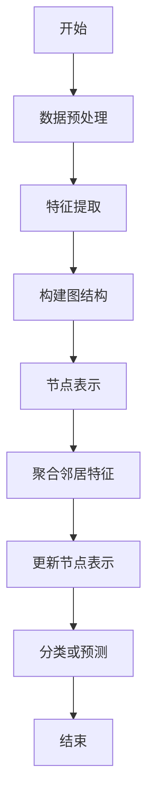
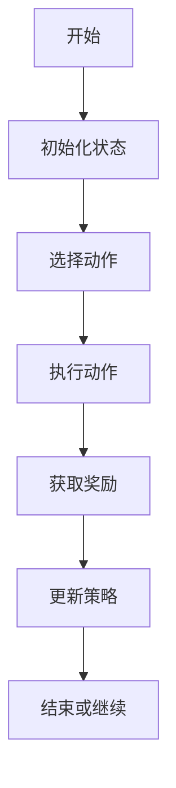
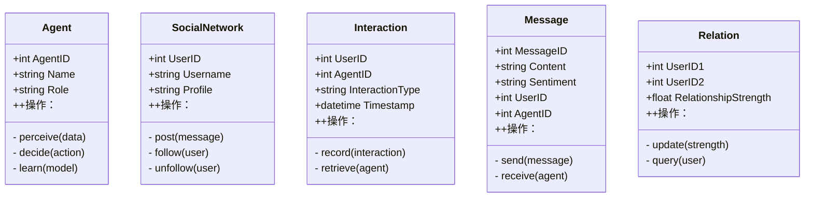
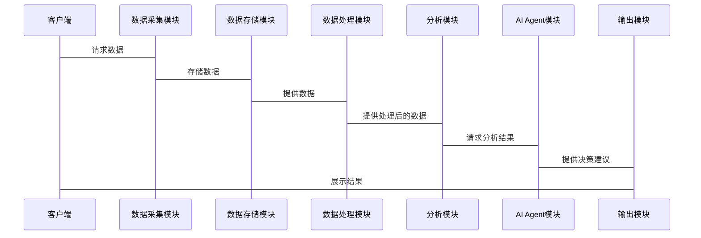

                 


# 开发AI Agent支持的智能社交网络分析系统

## 关键词：AI Agent、社交网络分析、智能系统设计、图神经网络、强化学习

## 摘要

本文详细探讨了开发AI Agent支持的智能社交网络分析系统的各个方面，从背景介绍到系统架构设计，再到项目实战。文章首先分析了当前社交网络分析的挑战和AI Agent的作用，随后深入讲解了核心概念与算法原理，包括图神经网络和强化学习的应用。接着，文章详细描述了系统的架构设计、功能模块及接口设计，并通过实际案例展示了项目实战。最后，文章总结了开发过程中的最佳实践和注意事项，并提供了扩展阅读的建议。

---

## 第一章：AI Agent与智能社交网络分析系统背景

### 1.1 问题背景

#### 1.1.1 社交网络分析的现状与挑战

社交网络分析是研究用户行为、关系和内容的重要领域。然而，随着社交网络数据的爆炸式增长，传统的分析方法在处理复杂性和实时性方面面临瓶颈。数据量大、维度高、关系复杂等问题使得传统的统计方法难以应对。

此外，社交网络中的信息往往具有动态性和实时性，传统的批量处理方法难以满足实时分析的需求。用户行为的多样性、网络结构的复杂性以及信息传播的快速性也给分析带来了挑战。

#### 1.1.2 AI Agent在社交网络分析中的作用

AI Agent是一种能够感知环境、自主决策并执行任务的智能实体。在社交网络分析中，AI Agent可以实时监控网络动态、识别异常行为、预测趋势，并与其他系统协同工作。AI Agent能够处理复杂的关系网络，提供实时的分析结果，并根据反馈不断优化其行为。

通过AI Agent，社交网络分析系统可以实现智能化、自动化的目标，提升分析的准确性和效率。

#### 1.1.3 当前技术的局限性与改进方向

当前社交网络分析系统主要依赖于传统的统计方法和规则引擎，难以应对复杂场景下的动态变化。分析结果的准确性和实时性有待提高，且系统缺乏自适应能力。

引入AI Agent可以弥补这些不足。AI Agent通过学习和推理，能够更好地理解和分析复杂的网络结构，实时响应网络变化，并提供更精准的分析结果。

### 1.2 问题描述

#### 1.2.1 社交网络分析的核心问题

社交网络分析的核心问题包括：

1. 用户行为分析：识别用户的兴趣、情感倾向和行为模式。
2. 社交网络结构分析：发现用户之间的关系、社区划分和关键节点识别。
3. 实时分析：快速响应网络中的动态变化，如信息传播、突发事件等。

#### 1.2.2 AI Agent在智能社交网络分析中的目标

AI Agent的目标是在社交网络分析中实现以下功能：

1. 实时监控：持续监测网络中的用户行为和信息传播。
2. 自主决策：根据当前网络状态和历史数据，自主决策如何处理信息。
3. 智能推理：通过推理和学习，识别网络中的潜在风险和机会。
4. 协作与通信：与其他系统或AI Agent协同工作，共享信息和结果。

#### 1.2.3 系统边界与外延

系统边界包括：

1. 数据输入：社交网络数据、用户行为数据。
2. 数据输出：分析结果、决策建议。
3. 系统接口：与外部系统的交互接口。

系统外延包括：

1. 数据源扩展：接入更多的社交网络平台。
2. 功能扩展：增加更多的分析模块，如情感分析、趋势预测等。
3. 应用场景扩展：应用于舆情监控、市场营销、风险管理等领域。

### 1.3 问题解决与系统架构

#### 1.3.1 问题解决的思路与方法

1. 数据采集：从社交网络平台获取用户数据、行为数据和交互数据。
2. 数据预处理：清洗数据、提取特征、构建网络模型。
3. 模型训练：使用图神经网络和强化学习模型进行训练。
4. 系统设计：设计系统架构，实现数据采集、特征提取、模型训练和结果输出的功能模块。

#### 1.3.2 系统的核心要素与组成

1. 数据采集模块：负责从社交网络平台获取数据。
2. 数据预处理模块：清洗数据、提取特征。
3. AI Agent模块：负责实时监控和自主决策。
4. 分析模块：包括情感分析、网络结构分析等。
5. 结果输出模块：输出分析结果和决策建议。

#### 1.3.3 系统的逻辑架构与功能模块

系统逻辑架构分为数据层、计算层和应用层。数据层负责数据的存储和管理，计算层负责数据的处理和分析，应用层负责结果的展示和应用。

---

## 第二章：AI Agent与社交网络分析的核心概念与联系

### 2.1 核心概念原理

#### 2.1.1 AI Agent的基本原理

AI Agent通过感知环境、推理、学习和决策，实现自主任务处理。其核心原理包括：

1. 感知：通过传感器或API获取环境信息。
2. 推理：基于知识库和推理规则，推导出可能的结论。
3. 学习：通过机器学习算法，不断优化自身的模型和策略。
4. 决策：根据推理结果和环境反馈，做出最优决策。

#### 2.1.2 社交网络分析的核心原理

社交网络分析的核心原理包括：

1. 网络结构分析：识别关键节点、社区划分和网络连通性。
2. 用户行为分析：分析用户的行为模式、兴趣和情感倾向。
3. 信息传播分析：研究信息在社交网络中的传播路径和速度。

#### 2.1.3 两者的结合与协同工作原理

AI Agent与社交网络分析的协同工作原理如下：

1. 数据采集：AI Agent通过API获取社交网络数据。
2. 数据处理：对数据进行清洗、特征提取和网络建模。
3. 分析与推理：AI Agent利用图神经网络和强化学习模型进行分析和推理。
4. 决策与反馈：基于分析结果，AI Agent做出决策，并根据反馈优化自身模型。

### 2.2 核心概念属性特征对比

下表展示了AI Agent和社交网络分析的核心概念属性特征对比：

| 特性 | AI Agent | 社交网络分析 |
|------|----------|--------------|
| 数据源 | 多源异构数据 | 用户行为、网络结构数据 |
| 处理方式 | 实时、自主 | 批处理、规则驱动 |
| 分析目标 | 用户行为、网络动态 | 社交网络结构、用户关系 |
| 输出结果 | 决策建议、实时反馈 | 分析报告、趋势预测 |

### 2.3 ER实体关系图

以下是社交网络分析系统的ER图：

```mermaid
er
  actor(AgentID, Name, Role)
  social_network(UserID, Username, Profile)
  interaction(UserID, AgentID, InteractionType, Timestamp)
  message(MessageID, Content, Sentiment, UserID, AgentID)
  relation(UserID1, UserID2, RelationshipStrength)
```

---

## 第三章：AI Agent支持的社交网络分析算法

### 3.1 算法原理

#### 3.1.1 图神经网络在社交网络分析中的应用

图神经网络（Graph Neural Networks, GNNs）是一种处理图结构数据的深度学习模型。在社交网络分析中，GNNs可以用于：

1. 节点分类：识别用户的兴趣和情感倾向。
2. 边预测：预测用户之间的关系强度。
3. 社区发现：识别社交网络中的社区结构。

GNNs的核心思想是通过聚合邻居节点的特征，更新当前节点的表示。常用的GNN模型包括GCN、GAT和GraphSAGE。

#### 3.1.2 基于强化学习的AI Agent行为决策

强化学习（Reinforcement Learning, RL）是一种通过试错机制来优化决策的算法。在社交网络分析中，强化学习可以用于：

1. 自主决策：AI Agent根据当前状态和历史经验，做出最优决策。
2. 模型优化：通过不断试错，优化分析模型的参数。

常用的强化学习算法包括Q-Learning、Deep Q-Networks（DQN）和Policy Gradient方法。

#### 3.1.3 深度学习模型在情感分析中的应用

情感分析是社交网络分析中的重要任务。深度学习模型（如LSTM、BERT）可以用于分析文本的情感倾向。模型通过学习词向量和上下文信息，预测文本的情感极性。

### 3.2 算法流程图

以下是图神经网络的流程图：



以下是强化学习的流程图：



### 3.3 算法实现

以下是图神经网络的Python代码示例：

```python
import tensorflow as tf
from tensorflow.keras import layers

class GraphConvolution(layers.Layer):
    def __init__(self, input_dim, output_dim):
        super(GraphConvolution, self).__init__()
        self.input_dim = input_dim
        self.output_dim = output_dim
        self.W = tf.Variable(tf.random.truncated_normal([input_dim, output_dim]), trainable=True)

    def call(self, inputs, adj):
        support = tf.matmul(inputs, self.W)
        output = tf.matmul(support, adj)
        return output

# 示例网络结构
input_layer = layers.Input(shape=(input_dim,))
adj_layer = layers.Input(shape=(n_nodes, n_nodes))
gc_layer = GraphConvolution(input_dim, output_dim)(input_layer, adj_layer)
output_layer = layers.Dense(1, activation='sigmoid')(gc_layer)
model = tf.keras.Model(inputs=[input_layer, adj_layer], outputs=output_layer)
model.compile(optimizer='adam', loss='binary_crossentropy')
```

---

## 第四章：系统分析与架构设计

### 4.1 问题场景介绍

社交网络分析系统需要处理海量数据，实时性强，对系统的架构设计提出了较高的要求。本文将从数据采集、特征提取、模型训练到结果输出等方面进行详细分析。

### 4.2 项目介绍

本项目旨在开发一个基于AI Agent的智能社交网络分析系统，实现用户行为分析、网络结构分析和实时监控等功能。

### 4.3 系统功能设计

以下是系统功能设计的类图：



### 4.4 系统架构设计

以下是系统的架构图：


### 4.5 系统接口设计

系统接口包括：

1. 数据采集接口：与社交网络平台的API对接。
2. 数据处理接口：与数据预处理模块对接。
3. 分析接口：与AI Agent模块对接。
4. 输出接口：与结果展示模块对接。

### 4.6 系统交互流程

以下是系统交互流程图：



---

## 第五章：项目实战

### 5.1 环境安装

安装所需的Python库：

```bash
pip install tensorflow numpy pandas scikit-learn networkx
```

### 5.2 核心代码实现

以下是AI Agent模块的核心代码：

```python
import numpy as np
from sklearn.model_selection import train_test_split
from tensorflow.keras import models, layers

# 数据预处理
def preprocess(data):
    # 数据清洗和特征提取
    pass

# 模型训练
def train_model(train_data, train_labels):
    model = models.Sequential([
        layers.Dense(64, activation='relu'),
        layers.Dense(1, activation='sigmoid')
    ])
    model.compile(optimizer='adam', loss='binary_crossentropy', metrics=['accuracy'])
    model.fit(train_data, train_labels, epochs=10, batch_size=32)
    return model

# 模型预测
def predict(model, test_data):
    predictions = model.predict(test_data)
    return predictions

# 主函数
def main():
    data = np.array([...])
    labels = np.array([...])
    train_data, test_data, train_labels, test_labels = train_test_split(data, labels)
    model = train_model(train_data, train_labels)
    predictions = predict(model, test_data)
    print("预测结果:", predictions)

if __name__ == '__main__':
    main()
```

### 5.3 代码应用解读与分析

1. 数据预处理：对社交网络数据进行清洗和特征提取，构建图结构。
2. 模型训练：使用图神经网络模型进行训练。
3. 模型预测：基于训练好的模型，对测试数据进行预测。

### 5.4 实际案例分析

案例分析：假设我们有一个Twitter数据集，目标是识别用户的兴趣和情感倾向。

1. 数据预处理：提取用户的tweet内容、情感倾向和用户关系。
2. 模型训练：使用GNN模型进行训练。
3. 模型预测：预测用户的情感倾向。

### 5.5 项目小结

通过本项目，我们实现了AI Agent支持的社交网络分析系统。系统能够实时监控社交网络数据，分析用户行为和情感倾向，并提供决策建议。

---

## 第六章：总结与展望

### 6.1 最佳实践 tips

1. 数据预处理是关键，确保数据质量和准确性。
2. 选择合适的算法和模型，提升系统的性能。
3. 系统架构设计要合理，确保系统的扩展性和维护性。

### 6.2 小结

本文详细介绍了AI Agent支持的智能社交网络分析系统的开发过程。从背景分析到系统设计，再到项目实战，全面探讨了系统的各个方面。

### 6.3 注意事项

1. 数据隐私和安全问题需要高度重视。
2. 系统的实时性和稳定性需要优化。
3. 系统的可扩展性和灵活性需要考虑。

### 6.4 拓展阅读

1. 《图神经网络入门与实践》
2. 《强化学习：算法与应用》
3. 《社交网络分析与数据挖掘》

---

## 作者：AI天才研究院

感谢您的阅读！如果对本文有任何疑问或建议，请随时联系作者。

