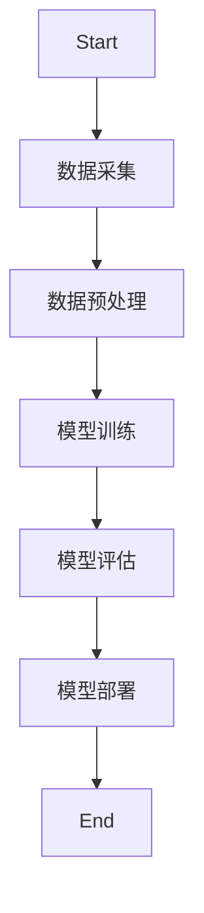
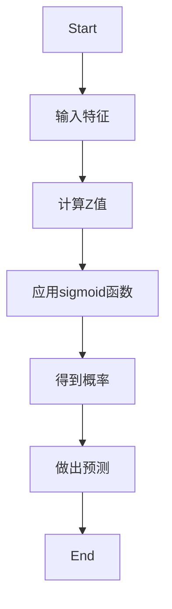
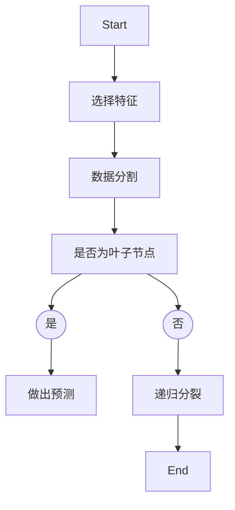
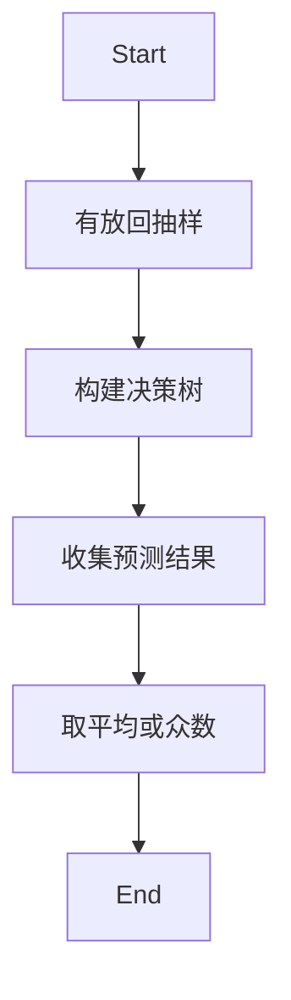
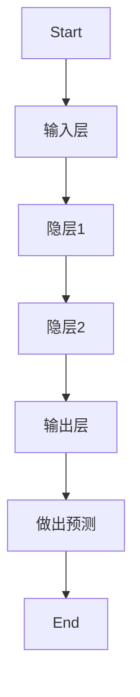
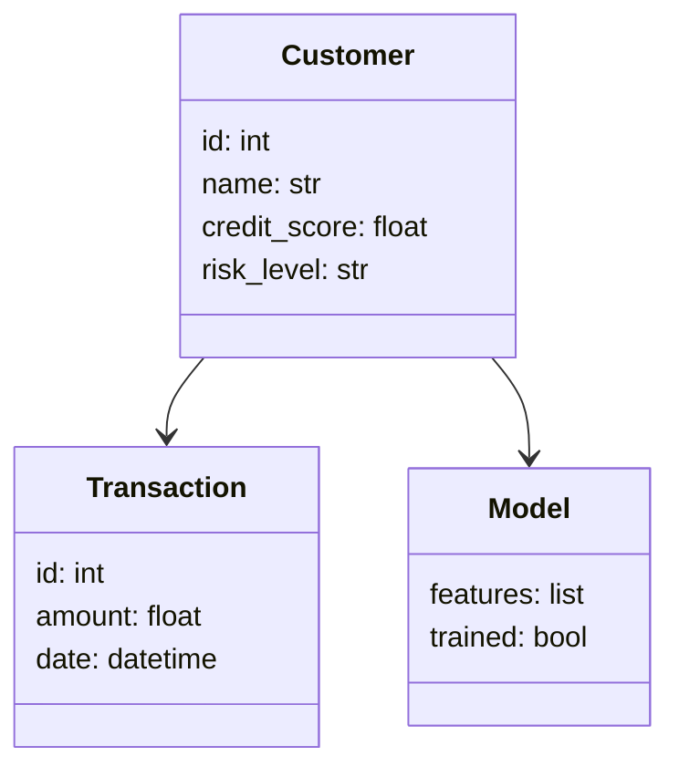
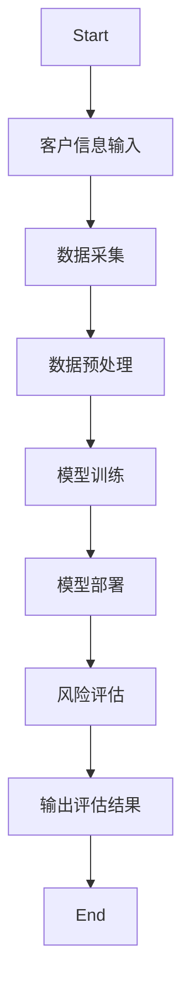

                 


# 开发智能化的企业信用风险评估模型

**关键词：** 企业信用风险评估模型、智能化、风险评估、机器学习、金融风控、算法实现

**摘要：**  
企业信用风险评估模型是企业在信贷决策中识别和管理客户信用风险的核心工具。随着人工智能和大数据技术的快速发展，智能化的信用风险评估模型逐渐取代传统方法，成为现代企业风控体系的重要组成部分。本文将从模型的背景与概念、核心概念与原理、算法实现与优化、系统架构设计、项目实战与部署、总结与展望等多个方面，详细阐述智能化企业信用风险评估模型的开发过程与实现方法。

---

# 第一部分: 企业信用风险评估模型的背景与基础

# 第1章: 信用风险评估模型的背景与概念

## 1.1 信用风险评估的定义与问题背景
### 1.1.1 信用风险的基本概念
信用风险是指企业或个人在信贷活动中，由于债务人或交易对手无法履行其合同义务而给债权人带来的损失风险。它是企业风险管理中的核心问题之一。

### 1.1.2 信用风险对企业的影响
信用风险直接影响企业的财务健康和经营稳定性。高信用风险可能导致企业面临坏账损失、资金链断裂等问题，进而影响企业的整体经营状况。

### 1.1.3 传统信用风险评估方法的局限性
传统的信用风险评估方法主要依赖于财务报表分析和人工审核，存在效率低、主观性强、覆盖面窄等问题。随着数据量的爆炸式增长和企业规模的扩大，传统方法难以满足现代企业的需求。

## 1.2 企业信用风险评估模型的核心问题
### 1.2.1 问题的提出与解决目标
企业信用风险评估模型的目标是通过数据驱动的方法，量化客户的信用风险，为企业信贷决策提供科学依据。核心问题是如何从海量数据中提取有效的特征，并构建高精度的预测模型。

### 1.2.2 问题的边界与外延
信用风险评估模型的边界包括客户的基本信息、财务数据、交易记录等。其外延则涉及宏观经济环境、行业风险、政策法规等多个方面。

### 1.2.3 核心要素与组成结构
企业信用风险评估模型的核心要素包括：
1. 数据特征：客户的基本信息、财务数据、行为数据等。
2. 模型算法：逻辑回归、决策树、随机森林等。
3. 评估指标：准确率、召回率、F1值等。

## 1.3 信用风险评估模型的重要性
### 1.3.1 在企业风险管理中的作用
信用风险评估模型是企业风险管理的重要工具，能够帮助企业识别高风险客户，降低坏账率，优化信贷资产配置。

### 1.3.2 对企业信贷决策的价值
通过模型量化客户的信用风险，企业可以更加科学地制定信贷政策，优化客户筛选流程，提高信贷决策的效率和准确性。

### 1.3.3 智能化模型的优势与潜力
智能化信用风险评估模型通过引入机器学习算法和大数据技术，能够处理海量数据，发现传统方法难以捕捉的规律，显著提高了模型的预测精度和可解释性。

---

# 第二部分: 信用风险评估模型的核心概念与联系

# 第2章: 信用风险评估模型的核心概念与原理

## 2.1 信用风险评估模型的框架
### 2.1.1 数据输入与特征提取
模型的输入数据包括客户的基本信息、财务数据、交易记录等。特征提取是将这些数据转化为模型可识别的特征向量的过程。

### 2.1.2 模型构建与训练
通过机器学习算法对特征数据进行建模和训练，生成能够预测客户信用风险的模型。

### 2.1.3 结果输出与解释
模型输出客户信用风险的评分或等级，并提供评分的解释和建议。

## 2.2 核心概念的属性特征对比
### 2.2.1 数据特征的分类与对比
数据特征可以分为定量特征（如收入、资产规模）和定性特征（如行业、地区）。不同特征对信用风险的影响程度不同。

### 2.2.2 模型算法的优劣势分析
| 算法名称       | 优势                           | 劣势                           |
|----------------|--------------------------------|--------------------------------|
| 逻辑回归       | 解释性强，适合二分类问题       | 非线性关系处理能力较弱         |
| 决策树         | 易解释，适合复杂数据结构       | � prone to overfitting           |
| 随机森林       | 鲁棒性高，适合高维数据         | 计算复杂度较高                   |
| 神经网络       | 非线性处理能力强               | 解释性差，难以调试               |

### 2.2.3 评估指标的定义与计算
| 评估指标       | 定义                                   | 计算公式                           |
|----------------|------------------------------------|----------------------------------|
| 准确率         | 正确预测的样本数占总样本数的比例     | $\text{Accuracy} = \frac{TP + TN}{TP + FP + FN + TN}$ |
| 召回率         | 正确预测的正类样本数占实际正类样本数的比例 | $\text{Recall} = \frac{TP}{TP + FN}$ |
| F1值           | 准确率和召回率的调和平均值         | $\text{F1} = 2 \cdot \frac{\text{Precision} \cdot \text{Recall}}{\text{Precision} + \text{Recall}}$ |

## 2.3 实体关系图与流程图
### 2.3.1 ER实体关系图


### 2.3.2 核心流程图


---

# 第三部分: 信用风险评估模型的算法实现与优化

# 第3章: 常用算法原理与实现

## 3.1 逻辑回归算法
### 3.1.1 算法原理
逻辑回归是一种经典的二分类算法，适用于将客户分为高风险和低风险两类。其核心思想是通过sigmoid函数将线性回归的结果映射到概率空间。

### 3.1.2 算法流程图


### 3.1.3 逻辑回归的数学模型
$$ P(y=1|x) = \frac{1}{1 + e^{-\beta x}} $$

### 3.1.4 代码实现
```python
import numpy as np
from sklearn.linear_model import LogisticRegression

# 数据预处理
X = ...  # 特征矩阵
y = ...  # 标签向量

# 训练模型
model = LogisticRegression()
model.fit(X, y)

# 预测概率
probability = model.predict_proba(X)[:, 1]
```

## 3.2 决策树算法
### 3.2.1 算法原理
决策树是一种基于树状结构的分类算法，通过特征分裂的方式逐步缩小数据范围，最终做出预测。

### 3.2.2 决策树流程图


### 3.2.3 决策树的数学模型
决策树的分裂标准通常采用信息增益或基尼指数：
$$ \text{信息增益} = H(\text{原始分布}) - H(\text{分裂后的分布}) $$

### 3.2.4 代码实现
```python
from sklearn.tree import DecisionTreeClassifier

# 数据预处理
X = ...  # 特征矩阵
y = ...  # 标签向量

# 训练模型
model = DecisionTreeClassifier()
model.fit(X, y)

# 预测结果
prediction = model.predict(X)
```

## 3.3 随机森林算法
### 3.3.1 算法原理
随机森林是一种基于决策树的集成算法，通过构建多棵决策树并对结果进行投票或平均，提高模型的准确性和鲁棒性。

### 3.3.2 随机森林流程图


### 3.3.3 随机森林的数学模型
随机森林通过Bagging方法生成多个基分类器，最终预测结果为基分类器预测结果的加权平均或投票结果：
$$ y_{\text{pred}} = \argmax_{i} \sum_{j=1}^{n} y_j^{(i)} $$

### 3.3.4 代码实现
```python
from sklearn.ensemble import RandomForestClassifier

# 数据预处理
X = ...  # 特征矩阵
y = ...  # 标签向量

# 训练模型
model = RandomForestClassifier()
model.fit(X, y)

# 预测结果
probability = model.predict_proba(X)[:, 1]
```

## 3.4 神经网络算法
### 3.4.1 算法原理
神经网络是一种模拟人脑神经网络结构的深度学习算法，通过多层非线性变换捕捉数据中的复杂模式。

### 3.4.2 神经网络流程图


### 3.4.3 神经网络的数学模型
神经网络通过多层感知机（MLP）实现非线性分类：
$$ y_{\text{pred}} = \sigma(w_2 \sigma(w_1 x + b_1) + b_2) $$

### 3.4.4 代码实现
```python
from sklearn.neural_network import MLPClassifier

# 数据预处理
X = ...  # 特征矩阵
y = ...  # 标签向量

# 训练模型
model = MLPClassifier(hidden_layer_sizes=(100, 50))
model.fit(X, y)

# 预测结果
probability = model.predict_proba(X)[:, 1]
```

---

# 第四部分: 信用风险评估模型的系统架构设计

# 第4章: 系统架构设计与实现

## 4.1 系统设计背景与目标
### 4.1.1 问题场景介绍
企业信用风险评估系统的应用场景包括银行信贷审批、供应链金融、企业贷款管理等。

### 4.1.2 系统功能需求
系统需要实现数据采集、特征提取、模型训练、风险评估、结果展示等功能。

## 4.2 领域模型设计
### 4.2.1 领域模型的定义
领域模型是系统功能实现的基础，描述了系统中的核心实体及其关系。

### 4.2.2 领域模型的类图


## 4.3 系统架构设计
### 4.3.1 系统架构图


### 4.3.2 关键模块设计
- **数据采集模块**：负责从数据库或外部接口获取客户数据。
- **数据预处理模块**：对数据进行清洗、特征提取和归一化处理。
- **模型训练模块**：使用机器学习算法对数据进行建模和训练。
- **模型部署模块**：将训练好的模型部署到生产环境，供其他模块调用。
- **风险评估模块**：接收客户信息，调用模型进行信用风险评估，并输出评估结果。

## 4.4 接口设计与交互流程
### 4.4.1 系统接口设计
- **输入接口**：客户基本信息、财务数据、交易记录等。
- **输出接口**：客户信用评分、风险等级、预警信息等。

### 4.4.2 系统交互流程图


---

# 第五部分: 信用风险评估模型的项目实战与部署

# 第5章: 项目实战与部署

## 5.1 环境安装与数据准备
### 5.1.1 开发环境安装
- 安装Python、Jupyter Notebook、Scikit-learn、XGBoost等工具。

### 5.1.2 数据准备
- 数据来源：企业客户的基本信息、财务数据、交易记录等。
- 数据格式：CSV、Excel、数据库等。

## 5.2 系统核心代码实现
### 5.2.1 数据预处理代码
```python
import pandas as pd
from sklearn.preprocessing import StandardScaler

# 读取数据
df = pd.read_csv('customer_data.csv')

# 数据清洗
df.dropna(inplace=True)

# 特征提取
features = df[['income', 'assets', 'debt', 'industry']]
labels = df['credit_risk']

# 数据标准化
scaler = StandardScaler()
features_scaled = scaler.fit_transform(features)
```

### 5.2.2 模型训练代码
```python
from sklearn.ensemble import RandomForestClassifier
from sklearn.metrics import accuracy_score, recall_score, f1_score

# 训练模型
model = RandomForestClassifier(n_estimators=100, max_depth=5)
model.fit(features_scaled, labels)

# 模型评估
y_pred = model.predict(features_scaled)
print(f"Accuracy: {accuracy_score(labels, y_pred)}")
print(f"Recall: {recall_score(labels, y_pred)}")
print(f"F1 Score: {f1_score(labels, y_pred)}")
```

### 5.2.3 模型部署代码
```python
from flask import Flask, request, jsonify

app = Flask(__name__)
model = ...  # 已训练好的模型
scaler = ...  # 数据标准化器

@app.route('/predict', methods=['POST'])
def predict():
    data = request.json
    features = [[data['income'], data['assets'], data['debt'], data['industry']]]
    features_scaled = scaler.transform(features)
    prediction = model.predict(features_scaled)
    return jsonify({'credit_risk': int(prediction[0])})

if __name__ == '__main__':
    app.run(debug=True)
```

## 5.3 项目部署与测试
### 5.3.1 系统部署
- 将模型部署到服务器，通过API接口提供服务。
- 使用Docker容器化部署，确保系统的稳定性和可扩展性。

### 5.3.2 系统测试
- 功能测试：测试模型的预测能力、系统的响应速度和准确性。
- 压力测试：在高并发情况下测试系统的性能和稳定性。

---

# 第六部分: 总结与展望

# 第6章: 总结与展望

## 6.1 项目总结
### 6.1.1 项目成果
通过开发智能化的企业信用风险评估模型，企业可以显著提高信贷决策的效率和准确性，降低信用风险。

### 6.1.2 最佳实践
- 数据预处理是模型训练的关键，需重视特征工程。
- 选择合适的算法和参数调优可以显著提高模型性能。
- 模型部署和维护是系统落地的重要环节，需重视系统架构设计。

## 6.2 未来展望
### 6.2.1 智能化模型的优化方向
- 引入深度学习算法（如LSTM、BERT）提高模型的非线性处理能力。
- 结合知识图谱技术，增强模型的语义理解能力。

### 6.2.2 技术与行业趋势
- 随着大数据和AI技术的不断发展，信用风险评估模型将更加智能化和自动化。
- 区块链技术的应用将提升信用评估的透明度和可信度。

---

# 作者：AI天才研究院/AI Genius Institute & 禅与计算机程序设计艺术 /Zen And The Art of Computer Programming

