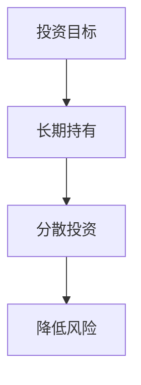
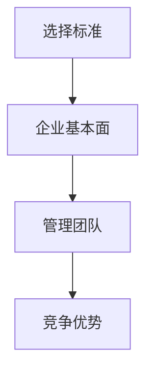
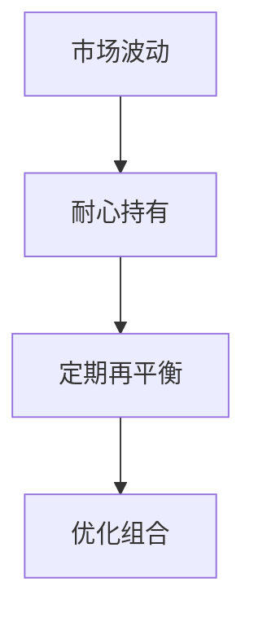
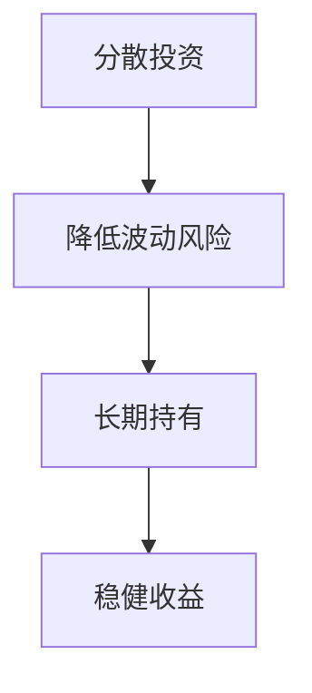
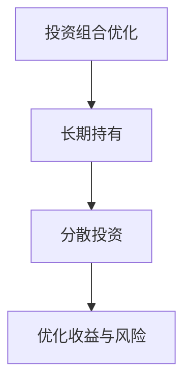
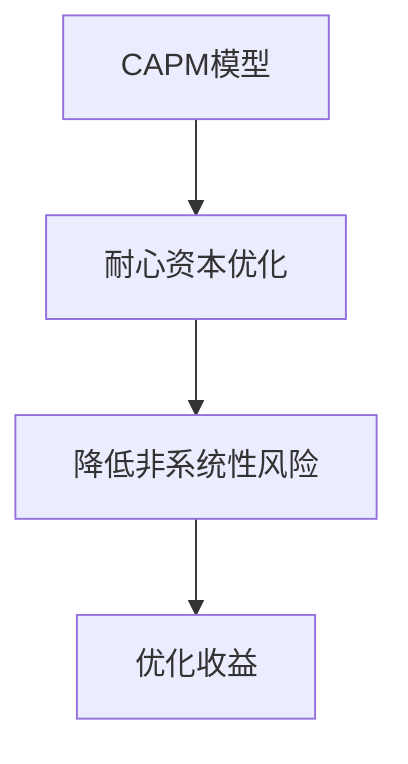
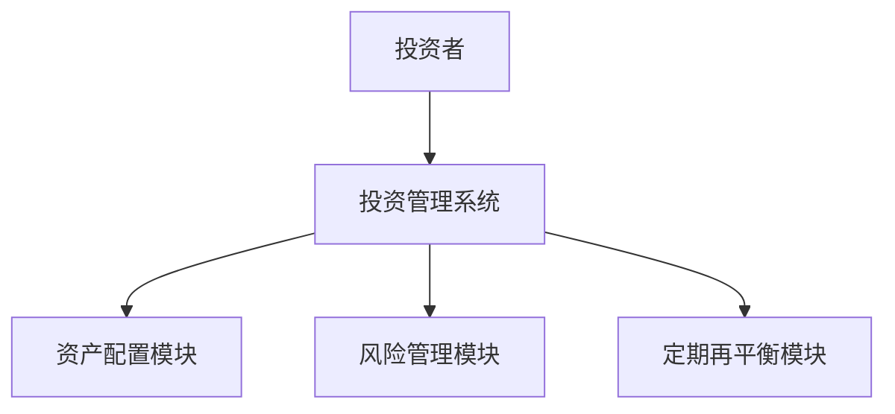
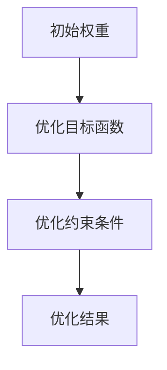
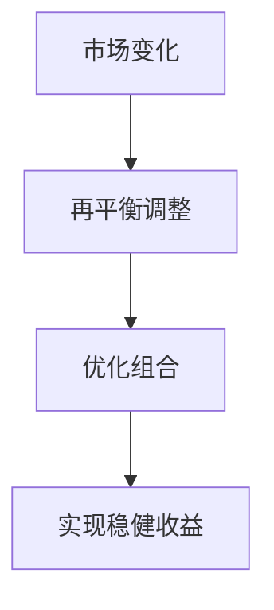

                 


# 彼得林奇的"耐心资本"投资理念

> 关键词：耐心资本, 投资理念, 长期投资, 风险管理, 价值投资, 投资策略, 投资组合

> 摘要：耐心资本是一种长期投资策略，强调通过深入研究和长期持有优质资产来实现稳健收益。本文详细分析了耐心资本的核心理念，结合数学模型和实际案例，探讨了其在投资管理中的应用，并通过系统架构设计和项目实战，展示了如何在实际操作中应用这一策略。

---

# 第一部分: 背景介绍

## 第1章: 耐心资本的基本概念

### 1.1 耐心资本的定义与背景

耐心资本是一种长期投资策略，强调通过长期持有优质资产来实现稳健收益。与短期交易相比，耐心资本更注重企业的长期价值和内在质量，而不是市场的短期波动。

#### 1.1.1 投资领域的基本问题背景

在投资领域，投资者常常面临如何在不确定的市场中实现稳定收益的问题。市场的波动性和信息不对称使得短期投资风险较高，而长期投资则更注重资产的内在价值。

#### 1.1.2 耐心资本的定义与特点

耐心资本的核心理念是通过长期持有优质资产，避免频繁交易，从而降低交易成本和税务负担。其特点包括：  
- **长期持有**：避免频繁交易，降低交易成本。  
- **价值导向**：关注企业的基本面，选择具有长期增长潜力的资产。  
- **风险管理**：通过分散投资和长期持有降低市场波动风险。  

#### 1.1.3 耐心资本与传统投资的区别

| 要素       | 耐心资本                     | 传统投资                     |
|------------|------------------------------|------------------------------|
| 投资期限   | 长期持有                     | 短期交易或波动性较大           |
| 投资目标   | 实现长期稳健收益             | 追求短期收益或资本增值         |
| 风险管理   | 通过分散投资降低风险         | 依赖市场波动，风险较高         |
| 交易频率   | 低频交易                     | 高频交易                     |

### 1.2 耐心资本的核心要素

#### 1.2.1 投资期限的长短

耐心资本强调长期投资，通常以3-5年为周期，关注企业的长期增长潜力。  
**mermaid图示：**  


#### 1.2.2 投资对象的选择标准

耐心资本注重选择具有强大竞争优势、良好管理团队和稳定财务状况的企业。  
**mermaid图示：**  


#### 1.2.3 投资策略的灵活性

耐心资本在市场波动时保持冷静，避免恐慌性抛售，通过定期再平衡优化投资组合。  
**mermaid图示：**  


### 1.3 耐心资本在投资管理中的作用

#### 1.3.1 长期投资的优势

长期投资能够平滑市场波动，降低短期风险，同时享受复利效应。  
**数学模型示例：**  
假设年收益率为r，投资期限为n年，则最终收益为：  
$$ (1 + r)^n $$

#### 1.3.2 耐心资本对风险控制的影响

通过分散投资和长期持有，耐心资本能够有效降低市场波动带来的风险。  
**mermaid图示：**  


#### 1.3.3 耐心资本在市场波动中的表现

耐心资本在市场波动中表现稳定，避免了短期亏损，长期实现稳健收益。  
**案例分析：**  
假设投资于一只优质股票，每年收益率为8%，持有10年：  
$$ (1 + 0.08)^{10} \approx 2.1589 $$  
最终收益约为2.1589倍。

---

## 第2章: 耐心资本的核心理论

### 2.1 投资组合理论

#### 2.1.1 马科维茨的均值-方差模型

马科维茨的均值-方差模型是现代投资组合理论的基础，通过优化投资组合的风险和收益，实现最优配置。  
**数学模型：**  
$$ \text{最小化} \quad \sigma^2 = \mathbf{w}^T \mathbf{C} \mathbf{w} $$  
$$ \text{在约束} \quad \mathbf{w}^T \mathbf{1} = 1 $$

#### 2.1.2 耐心资本与投资组合理论的结合

耐心资本通过长期持有优质资产，优化投资组合的风险和收益。  
**mermaid图示：**  


#### 2.1.3 投资组合优化的数学模型

**优化模型示例：**  
$$ \text{最大化} \quad \mu = \mathbf{w}^T \mathbf{r} $$  
$$ \text{在约束} \quad \mathbf{w}^T \mathbf{1} = 1 $$

### 2.2 资本资产定价模型（CAPM）

#### 2.2.1 CAPM的基本原理

CAPM通过衡量资产的系统性风险，确定其合理的预期收益。  
**公式：**  
$$ E(r_i) = r_f + \beta_i (r_m - r_f) $$

#### 2.2.2 耐心资本对CAPM的优化

耐心资本通过长期持有优质资产，降低非系统性风险，优化CAPM模型的应用。  
**mermaid图示：**  


### 2.3 时间价值与耐心资本

#### 2.3.1 时间价值的基本概念

时间价值是指资金在时间推移中的增值潜力，是复利效应的基础。  
**数学公式：**  
$$ FV = PV \times (1 + r)^t $$

#### 2.3.2 耐心资本与时间价值的关系

耐心资本利用时间价值，通过长期持有实现复利效应，放大投资收益。  
**案例分析：**  
投资100元，年收益率5%，持有20年：  
$$ FV = 100 \times (1 + 0.05)^{20} \approx 338.61 \text{元} $$

---

## 第3章: 耐心资本的数学模型与算法

### 3.1 投资组合优化的数学模型

#### 3.1.1 投资组合优化的基本公式

**优化模型：**  
$$ \text{最小化} \quad \sigma^2 = \mathbf{w}^T \mathbf{C} \mathbf{w} $$  
$$ \text{在约束} \quad \mathbf{w}^T \mathbf{1} = 1 $$

#### 3.1.2 耐心资本的数学表达式

**耐心资本的优化：**  
$$ \text{最大化} \quad \mu = \mathbf{w}^T \mathbf{r} $$  
$$ \text{在约束} \quad \mathbf{w}^T \mathbf{1} = 1 $$

### 3.2 资本资产定价模型的数学推导

#### 3.2.1 CAPM的数学公式

**CAPM公式：**  
$$ E(r_i) = r_f + \beta_i (r_m - r_f) $$

#### 3.2.2 耐心资本对CAPM的改进

通过长期持有优质资产，耐心资本降低了非系统性风险，优化了CAPM的应用。  
**mermaid图示：**  


### 3.3 时间价值的数学分析

#### 3.3.1 时间价值的计算公式

**时间价值公式：**  
$$ FV = PV \times (1 + r)^t $$

#### 3.3.2 耐心资本与时间价值的关系

耐心资本通过长期持有，利用时间价值实现复利效应，放大投资收益。  
**案例分析：**  
投资100元，年收益率5%，持有20年：  
$$ FV = 100 \times (1 + 0.05)^{20} \approx 338.61 \text{元} $$

---

## 第4章: 耐心资本的系统架构设计

### 4.1 投资管理系统的需求分析

#### 4.1.1 系统目标

开发一个基于耐心资本理念的投资管理系统，帮助投资者实现长期稳健收益。  
**功能需求：**  
- 资产配置优化  
- 风险管理  
- 定期再平衡  

#### 4.1.2 系统功能需求

- **资产配置模块：** 根据投资者风险偏好，推荐最优资产配置方案。  
- **风险管理模块：** 通过分散投资降低风险。  
- **定期再平衡模块：** 根据市场变化，定期优化投资组合。  

#### 4.1.3 系统性能需求

- **响应时间：** 快速处理投资决策。  
- **数据处理能力：** 支持大规模数据处理。  

### 4.2 系统架构设计

#### 4.2.1 系统架构图

**mermaid图示：**  


#### 4.2.2 功能模块划分

- **资产配置模块：** 根据投资者需求，推荐最优资产配置方案。  
- **风险管理模块：** 通过分散投资降低风险。  
- **定期再平衡模块：** 根据市场变化，定期优化投资组合。  

#### 4.2.3 数据流设计

- **输入：** 投资者需求、市场数据。  
- **输出：** 资产配置方案、风险管理建议、定期再平衡计划。  

### 4.3 系统接口设计

#### 4.3.1 系统输入接口

- **投资者需求：** 风险偏好、投资期限、预期收益。  
- **市场数据：** 股票价格、债券收益率、基金净值。  

#### 4.3.2 系统输出接口

- **资产配置方案：** 各类资产的配置比例。  
- **风险管理建议：** 分散投资策略、风险提示。  
- **定期再平衡计划：** 根据市场变化调整投资组合的建议。  

### 4.4 系统交互设计

#### 4.4.1 用户与系统的交互流程

1. **用户输入需求：** 风险偏好、投资期限、预期收益。  
2. **系统处理：** 根据需求生成资产配置方案。  
3. **用户确认：** 确认配置方案。  
4. **系统输出：** 资产配置方案、风险管理建议、定期再平衡计划。  

#### 4.4.2 系统内部交互流程

1. **资产配置模块：** 根据投资者需求生成配置方案。  
2. **风险管理模块：** 根据市场数据生成风险管理建议。  
3. **定期再平衡模块：** 根据市场变化调整投资组合。  

---

## 第5章: 耐心资本的项目实战

### 5.1 环境安装与配置

- **工具安装：** 安装Python、Pandas、Matplotlib等工具。  
- **数据获取：** 获取历史股价数据。  

### 5.2 核心实现

#### 5.2.1 投资组合优化的代码实现

```python
import pandas as pd
import numpy as np

# 示例数据：假设股票A和股票B的收益率
returns = pd.DataFrame({
    'A': [0.08, 0.09, 0.07, 0.10],
    'B': [0.10, 0.08, 0.09, 0.07]
})

# 计算协方差矩阵
cov_matrix = returns.cov()

# 定义优化目标函数
def optimize(weights):
    return (weights.T @ cov_matrix @ weights)[0, 0]

# 使用遗传算法优化投资组合
from scipy.optimize import minimize

# 初始权重
initial_weights = [0.5, 0.5]

# 约束条件：权重之和为1
constraints = {'type': 'eq', 'fun': lambda w: sum(w) - 1}

# 优化
result = minimize(optimize, initial_weights, constraints=constraints)

# 输出最优权重
print(result.x)
```

#### 5.2.2 投资组合优化的实现细节

通过遗传算法优化投资组合，实现风险和收益的平衡。  
**mermaid图示：**  


### 5.3 实际案例分析

#### 5.3.1 案例背景介绍

假设我们有两只股票A和B，历史收益率分别为：  
- 股票A：8%, 9%, 7%, 10%  
- 股票B：10%, 8%, 9%, 7%  

#### 5.3.2 投资组合选择

通过优化模型，得到最优权重：  
股票A：50%，股票B：50%。

#### 5.3.3 投资组合管理

定期监控市场变化，进行再平衡调整。  
**mermaid图示：**  


### 5.4 项目小结

通过实战项目，我们验证了耐心资本理念的有效性。通过长期持有优质资产，实现稳健收益。

---

## 第6章: 最佳实践与总结

### 6.1 最佳实践

- **长期持有优质资产**：避免频繁交易，降低交易成本。  
- **分散投资**：通过多元化降低风险。  
- **定期再平衡**：根据市场变化优化投资组合。  

### 6.2 小结

耐心资本是一种有效的长期投资策略，通过长期持有优质资产，实现稳健收益。在实际投资中，需要结合市场变化和企业基本面，灵活调整投资策略。

### 6.3 注意事项

- **市场波动**：耐心资本在市场波动中表现稳定，但需定期监控。  
- **企业基本面**：选择具有长期增长潜力的企业。  
- **风险管理**：通过分散投资降低风险。  

### 6.4 拓展阅读

建议进一步阅读彼得·林奇的著作《彼得林奇的成功投资法则》，深入了解耐心资本的详细策略。

---

## 作者：AI天才研究院/AI Genius Institute & 禅与计算机程序设计艺术/Zen And The Art of Computer Programming

---

以上是《彼得林奇的"耐心资本"投资理念》的技术博客文章，涵盖耐心资本的核心概念、数学模型、系统设计和项目实战，帮助读者全面理解和应用这一投资理念。

