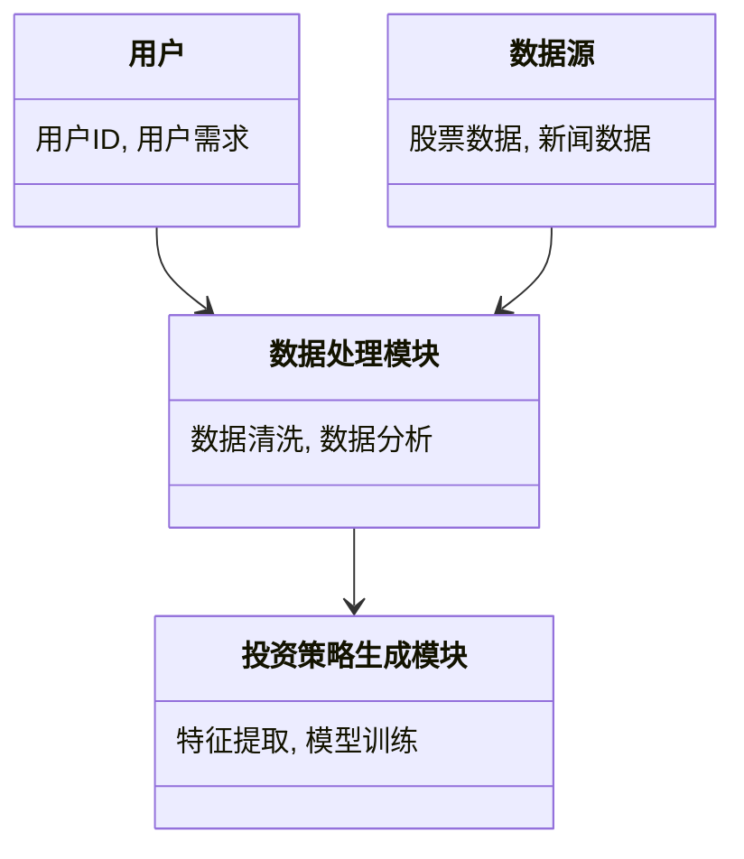

                 


# 投资理财智能助手的基本概念

> **关键词**: 投资理财、智能助手、人工智能、机器学习、数据挖掘、自然语言处理、系统架构

> **摘要**: 本文系统地介绍了投资理财智能助手的基本概念，涵盖其背景、核心概念、算法原理、系统架构、项目实战及最佳实践。通过详细分析投资理财智能助手的功能、技术实现和实际应用，为读者提供全面的理论与实践指导。

---

## 第1章: 投资理财智能助手的背景与问题背景

### 1.1 问题背景

#### 1.1.1 投资理财领域的发展现状

随着全球经济的快速发展，投资理财已成为个人和机构财务管理的重要手段。传统投资理财工具主要依赖人工分析和经验判断，存在效率低、风险高、覆盖范围有限等问题。近年来，人工智能（AI）和大数据技术的快速发展为投资理财领域带来了新的机遇。

#### 1.1.2 传统投资理财工具的局限性

传统投资理财工具主要依赖人工分析，存在以下问题：
- 数据处理能力有限，难以应对海量数据。
- 分析效率低，难以实时响应用户需求。
- 风险评估不够精准，容易受主观因素影响。
- 个性化服务不足，难以满足多样化的需求。

#### 1.1.3 智能化投资理财助手的需求与趋势

随着技术进步，智能化投资理财助手的需求日益增长。其主要需求包括：
- 提供实时数据分析和预测。
- 实现个性化的投资建议。
- 降低投资风险，提高决策效率。
- 提供便捷的用户交互体验。

智能化投资理财助手的发展趋势：
- 基于AI和大数据的分析能力不断提升。
- 服务场景更加多元化。
- 用户交互更加智能化、个性化。

---

### 1.2 问题描述

#### 1.2.1 投资者在理财过程中的主要问题

投资者在理财过程中面临的主要问题包括：
- 数据获取困难，难以进行精准分析。
- 投资决策依赖经验，缺乏科学依据。
- 风险控制能力不足，容易遭受损失。
- 缺乏个性化服务，难以满足多样化需求。

#### 1.2.2 智能助手在投资理财中的定位与作用

智能助手在投资理财中的定位：
- 作为辅助工具，帮助投资者进行数据分析、风险评估和投资策略制定。
- 提供实时监控和提醒服务，帮助投资者及时调整投资策略。

智能助手的作用：
- 提高投资决策的科学性和精准性。
- 提供个性化的投资建议。
- 实时监控市场动态，降低投资风险。

#### 1.2.3 智能助手的核心目标与价值

智能助手的核心目标：
- 帮助投资者实现高效、精准的投资决策。
- 提供个性化的投资服务，满足多样化需求。
- 实时监控市场动态，降低投资风险。

智能助手的价值：
- 提高投资效率，降低成本。
- 增强投资决策的科学性，降低风险。
- 提供便捷、高效的用户交互体验。

---

## 第2章: 投资理财智能助手的核心概念

### 2.1 核心概念与定义

#### 2.1.1 投资理财智能助手的定义

投资理财智能助手是一种基于人工智能和大数据技术的辅助工具，通过分析市场数据、用户需求和投资目标，提供实时的投资建议、风险评估和资产配置方案。

#### 2.1.2 智能助手的基本功能与服务

智能助手的基本功能包括：
- 数据采集与分析：收集市场数据、用户需求和投资目标。
- 投资策略生成：基于数据分析生成投资策略。
- 风险评估：评估投资策略的风险。
- 用户交互：与用户进行实时互动，提供个性化服务。

#### 2.1.3 智能助手与传统理财工具的区别

| **特征**             | **传统理财工具**             | **智能助手**               |
|----------------------|------------------------------|---------------------------|
| 数据处理能力         | 有限                        | 强大                      |
| 分析效率             | 低                          | 高                        |
| 风险评估             | 粗放                        | 精准                      |
| 个性化服务           | 有限                        | 丰富                      |
| 用户交互体验         | 简单                        | 智能                      |

---

### 2.2 核心概念的属性与特征对比

#### 2.2.1 智能助手的核心属性

- **数据驱动**：基于大数据分析，提供科学的投资建议。
- **实时性**：能够实时监控市场动态，快速响应用户需求。
- **个性化**：根据用户需求提供定制化的投资方案。
- **智能化**：通过AI技术实现自动化分析和决策。

#### 2.2.2 传统理财工具的属性

- **经验驱动**：依赖专家经验进行投资决策。
- **低效性**：数据分析和决策过程耗时较长。
- **固定性**：投资策略相对固定，难以实时调整。
- **非个性化**：难以满足多样化的需求。

#### 2.2.3 两者属性对比分析

通过对比分析可以看出，智能助手在数据处理能力、分析效率和个性化服务方面具有显著优势，能够更好地满足现代投资理财的需求。

---

## 第3章: 投资理财智能助手的核心原理与技术

### 3.1 核心原理

#### 3.1.1 数据驱动的理财决策

智能助手通过收集和分析海量市场数据，结合用户需求，生成投资策略。数据驱动的理财决策能够提高投资的科学性和精准性。

#### 3.1.2 人工智能在投资分析中的应用

人工智能技术（如机器学习、深度学习）在投资分析中的应用：
- **预测市场趋势**：通过历史数据预测未来市场走势。
- **识别投资机会**：发现潜在的投资机会。
- **风险评估**：评估投资策略的风险。

#### 3.1.3 自然语言处理在用户交互中的作用

自然语言处理（NLP）技术在用户交互中的应用：
- **意图识别**：识别用户的理财需求。
- **情感分析**：分析用户情绪，提供个性化服务。
- **对话生成**：与用户进行自然对话，提供投资建议。

---

### 3.2 技术实现

#### 3.2.1 数据采集与处理

数据采集与处理流程：
1. 数据采集：从多个来源（如股票市场、新闻平台）获取数据。
2. 数据清洗：去除噪声数据，确保数据质量。
3. 数据分析：通过统计分析和机器学习算法提取有用信息。

#### 3.2.2 模型训练与优化

模型训练与优化：
- **特征提取**：从数据中提取关键特征。
- **模型选择**：选择合适的算法（如随机森林、支持向量机）。
- **模型优化**：通过调参和交叉验证提高模型性能。

#### 3.2.3 用户交互与反馈机制

用户交互与反馈机制：
- **用户输入**：用户输入需求和目标。
- **系统响应**：系统根据需求生成投资策略。
- **反馈优化**：根据用户反馈优化系统响应。

---

## 第4章: 投资理财智能助手的功能模块与系统架构

### 4.1 功能模块划分

#### 4.1.1 数据采集模块

数据采集模块负责从多个数据源（如股票市场、新闻平台）获取数据，并进行初步清洗和处理。

#### 4.1.2 数据分析模块

数据分析模块利用机器学习算法对数据进行深度分析，提取有用信息并生成投资策略。

#### 4.1.3 投资策略生成模块

投资策略生成模块根据分析结果生成个性化投资策略，并提供实时监控和调整建议。

#### 4.1.4 用户交互模块

用户交互模块负责与用户进行实时互动，提供个性化服务和反馈。

---

### 4.2 系统架构设计

#### 4.2.1 分层架构设计

系统架构采用分层设计，包括数据层、业务逻辑层和用户交互层。

#### 4.2.2 模块间的交互关系

模块间的交互关系：
- 数据采集模块与数据分析模块交互。
- 数据分析模块与投资策略生成模块交互。
- 投资策略生成模块与用户交互模块交互。

#### 4.2.3 系统的可扩展性与灵活性

系统设计注重可扩展性和灵活性，能够根据需求快速调整和优化。

---

## 第5章: 投资理财智能助手的算法原理与数学模型

### 5.1 算法原理

#### 5.1.1 机器学习在投资预测中的应用

机器学习在投资预测中的应用：
- **回归分析**：预测股票价格。
- **分类算法**：识别市场趋势。
- **聚类分析**：发现投资机会。

#### 5.1.2 自然语言处理在用户意图识别中的应用

自然语言处理在用户意图识别中的应用：
- **意图识别**：识别用户的理财需求。
- **情感分析**：分析用户情绪，提供个性化服务。

#### 5.1.3 数据挖掘在投资组合优化中的作用

数据挖掘在投资组合优化中的作用：
- **特征提取**：提取关键投资特征。
- **模式识别**：识别投资机会和风险。

---

### 5.2 数学模型与公式

#### 5.2.1 投资组合优化的数学模型

$$ \text{目标函数: } \max \mu w^T \sigma^{-1} w $$

其中：
- \( \mu \) 表示收益。
- \( w \) 表示投资权重。
- \( \sigma \) 表示风险。

#### 5.2.2 风险评估的马科维茨模型

$$ \text{风险函数: } \min w^T \Sigma w $$

其中：
- \( \Sigma \) 表示协方差矩阵。

#### 5.2.3 时间序列预测的ARIMA模型

$$ ARIMA(p, d, q) $$

其中：
- \( p \) 表示自回归阶数。
- \( d \) 表示差分阶数。
- \( q \) 表示移动平均阶数。

---

## 第6章: 投资理财智能助手的系统分析与架构设计

### 6.1 系统分析

#### 6.1.1 问题场景介绍

系统需要解决的主要问题包括：
- 实时监控市场动态。
- 提供个性化投资建议。
- 管理用户数据和隐私。

#### 6.1.2 项目目标与范围

项目目标：
- 提供高效的理财服务。
- 实现个性化的投资建议。
- 提供实时市场监控。

项目范围：
- 数据采集与处理。
- 投资策略生成。
- 用户交互与反馈。

#### 6.1.3 系统功能需求分析

系统功能需求分析：
- 数据采集与处理。
- 投资策略生成。
- 用户交互与反馈。

---

### 6.2 系统架构设计

#### 6.2.1 领域模型设计



---

### 6.2.2 系统架构设计

```mermaid
client --> server
client <---> db
server <---> db
```

其中：
- `client` 表示用户交互界面。
- `server` 表示系统服务器。
- `db` 表示数据库。

---

## 第7章: 投资理财智能助手的项目实战

### 7.1 项目实战

#### 7.1.1 环境安装

项目实战环境安装：
- 安装Python和相关库（如pandas、numpy、scikit-learn）。
- 安装Jupyter Notebook进行数据分析和可视化。

#### 7.1.2 系统核心实现源代码

以下是一个简单的投资策略生成代码示例：

```python
import pandas as pd
import numpy as np
from sklearn.linear_model import LinearRegression

# 数据采集与处理
data = pd.read_csv('market_data.csv')
data = data.dropna()

# 特征提取
features = data[['open', 'high', 'low', 'volume']]
target = data['close']

# 模型训练
model = LinearRegression()
model.fit(features, target)

# 预测
new_data = pd.read_csv('new_market_data.csv')
new_features = new_data[['open', 'high', 'low', 'volume']]
predictions = model.predict(new_features)

print('预测的收盘价:', predictions)
```

#### 7.1.3 代码应用解读与分析

代码解读：
- 数据采集与处理：从CSV文件中读取市场数据，去除缺失值。
- 特征提取：提取开盘价、最高价、最低价和成交量作为特征。
- 模型训练：使用线性回归模型进行训练。
- 预测：基于新数据生成投资策略。

---

### 7.2 实际案例分析

实际案例分析：
- 数据来源：股票市场数据。
- 数据分析：使用机器学习模型预测股票价格。
- 投资策略生成：根据预测结果生成投资建议。

---

## 第8章: 投资理财智能助手的最佳实践

### 8.1 最佳实践

#### 8.1.1 系统优化建议

系统优化建议：
- 提高数据处理效率。
- 优化算法性能。
- 提升用户交互体验。

#### 8.1.2 使用注意事项

使用注意事项：
- 数据隐私保护。
- 系统稳定性和安全性。
- 用户教育和培训。

---

### 8.2 小结

通过本文的介绍，我们全面了解了投资理财智能助手的基本概念、核心原理、系统架构和实际应用。智能助手的出现为投资理财领域带来了新的机遇，能够帮助投资者实现高效、精准的投资决策。

---

## 作者

**作者：AI天才研究院/AI Genius Institute & 禅与计算机程序设计艺术 /Zen And The Art of Computer Programming**

---

**注**：以上内容为示例性的文章结构和部分章节内容，实际撰写时需要根据具体需求进行调整和补充。

