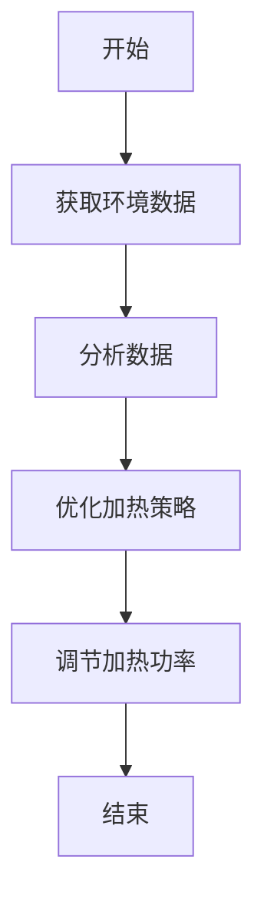
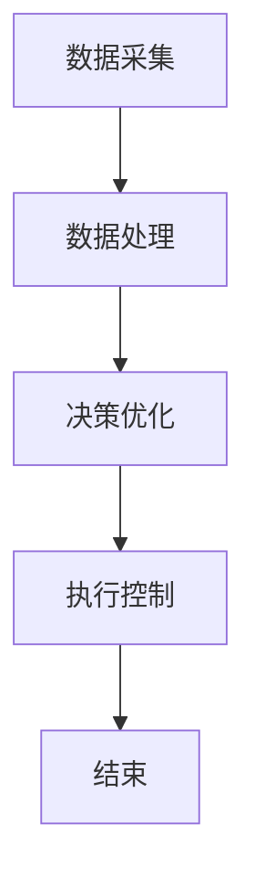
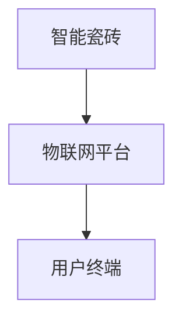

                 


# 智能瓷砖：AI Agent的室内温度均衡系统

> 关键词：智能瓷砖，AI Agent，室内温度，温控系统，物联网，智能家居

> 摘要：本文探讨了智能瓷砖在室内温度调节中的应用，结合AI Agent技术，提出了一种创新的温控系统。通过详细分析系统设计、算法原理和实际案例，展示了如何利用智能瓷砖实现高效、精准的温度管理。

---

# 第一部分: 背景与概述

## 第1章: 智能瓷砖与AI Agent的背景介绍

### 1.1 问题背景与描述

#### 1.1.1 室内温度调节的传统方法
传统的室内温度调节主要依赖于空调、暖气等设备。这些设备通过设定温度阈值，利用传感器和控制器实现温度的自动调节。然而，这种集中式的温控方式存在以下问题：
- **能耗高**：空调和暖气设备在调节温度时，往往需要持续运行，导致能源浪费。
- **调节滞后**：温度变化需要一定时间才能达到设定值，影响舒适度。
- **局部调节不足**：传统设备难以实现室内的均匀温度分布。

#### 1.1.2 当前温控系统的主要问题
现有的温控系统存在以下主要问题：
- **能源浪费**：由于设备运行时间长且效率不高，导致能源消耗大。
- **舒适度不足**：室内外温差大，容易造成人体不适。
- **智能化水平低**：缺乏智能化的温控方案，无法根据环境变化自动调节。

#### 1.1.3 智能瓷砖的创新解决方案
智能瓷砖作为一种创新的建筑材料，结合AI Agent技术，提出了一种分布式、智能化的温控方案。通过在瓷砖内部集成温度传感器、加热元件和智能控制模块，可以实现对室内温度的精准调节。

### 1.2 智能瓷砖的定义与特点

#### 1.2.1 智能瓷砖的定义
智能瓷砖是一种集成温度传感器、加热元件和智能控制模块的新型建筑材料。它能够通过AI Agent技术实现对室内温度的自主调节，同时与其他智能设备协同工作，形成一个高效的温控系统。

#### 1.2.2 智能瓷砖的核心特点
- **分布式控制**：每个瓷砖独立运行，能够根据环境温度和人体需求自主调节温度。
- **智能化**：通过AI Agent技术，实现对温度的预测、优化和自适应调节。
- **节能高效**：通过精确控制每个瓷砖的加热功率，避免能源浪费。

#### 1.2.3 智能瓷砖与传统瓷砖的区别
| 特性                | 智能瓷砖                 | 传统瓷砖               |
|---------------------|--------------------------|------------------------|
| 功能                | 集成温度传感器、加热元件和智能控制模块 | 仅用于装饰和保温         |
| 能源效率            | 高，通过精准控制降低能耗 | 低，依赖传统设备调节温度 |
| 智能化水平          | 高，具备自主调节能力     | 低，仅能被动响应控制信号 |

### 1.3 AI Agent在智能瓷砖中的作用

#### 1.3.1 AI Agent的基本概念
AI Agent（人工智能代理）是一种能够感知环境、做出决策并采取行动的智能实体。它能够通过传感器获取信息，利用算法进行分析和决策，并通过执行器与环境交互。

#### 1.3.2 AI Agent在智能瓷砖中的应用
在智能瓷砖中，AI Agent主要负责以下功能：
- **温度感知**：通过内置的温度传感器实时监测环境温度。
- **决策与优化**：根据当前温度、人体需求和历史数据，优化加热策略。
- **自主调节**：根据决策结果，调节瓷砖的加热功率，实现温度的精确控制。

#### 1.3.3 AI Agent的优势与挑战
- **优势**：
  - **智能化**：AI Agent能够自主决策，无需人工干预。
  - **高效性**：通过优化算法，提高调节效率，降低能耗。
- **挑战**：
  - **计算资源**：需要足够的计算能力支持实时决策。
  - **数据隐私**：需要保护用户的隐私数据，如温度偏好和使用习惯。

### 1.4 本章小结
本章介绍了智能瓷砖和AI Agent的基本概念，分析了传统温控系统的问题，并提出了智能瓷砖的创新解决方案。通过对比智能瓷砖与传统瓷砖的特点，明确了智能瓷砖的优势和应用场景。

---

## 第2章: 智能瓷砖与AI Agent的核心概念

### 2.1 核心概念的定义与解释

#### 2.1.1 智能瓷砖的核心概念
智能瓷砖是一种集成温度传感器、加热元件和智能控制模块的建筑材料。它通过AI Agent技术实现对室内温度的自主调节，能够与其他智能设备协同工作，形成一个高效的温控系统。

#### 2.1.2 AI Agent的核心概念
AI Agent是一种能够感知环境、做出决策并采取行动的智能实体。它通过传感器获取信息，利用算法进行分析和决策，并通过执行器与环境交互。

#### 2.1.3 两者的关联与区别
- **关联**：AI Agent是智能瓷砖的核心技术，负责实现温度的自主调节和优化。
- **区别**：智能瓷砖是物理实体，而AI Agent是软件实体，两者结合实现智能温控。

### 2.2 核心概念的属性对比

| 特性                | 智能瓷砖                 | AI Agent               |
|---------------------|--------------------------|-------------------------|
| 功能                | 实现温度调节              | 实现决策与优化          |
| 输入                | 环境温度、人体需求        | 环境信息、用户需求      |
| 输出                | 调节加热功率              | 决策结果                |
| 依赖                | 传感器、加热元件          | 传感器、算法、执行器    |
| 优势                | 节能高效                  | 智能决策                |

### 2.3 实体关系图（ER图）

```mermaid
erDiagram
    class 智能瓷砖 {
        id int
        传感器 temperatureSensor
        加热元件 heatingElement
        智能控制模块 controlModule
    }
    class AI Agent {
        id int
        算法 algorithm
        决策模块 decisionModule
    }
    智能瓷砖 --> AI Agent : 集成
    AI Agent --> 智能瓷砖 : 控制
```

---

## 第3章: AI Agent的算法原理

### 3.1 算法原理概述

#### 3.1.1 算法的基本原理
AI Agent通过以下步骤实现对智能瓷砖的温度调节：
1. **感知环境**：通过内置传感器获取当前环境温度和人体需求。
2. **数据处理**：将感知数据与历史数据结合，分析温度变化趋势。
3. **决策与优化**：基于分析结果，优化加热策略，调整瓷砖的加热功率。
4. **执行调节**：根据优化结果，调节加热元件的功率，实现温度的精确控制。

#### 3.1.2 算法的核心步骤
1. **数据采集**：通过传感器获取环境温度和人体需求。
2. **数据融合**：将多源数据进行融合，提高决策的准确性。
3. **预测与优化**：利用机器学习算法预测温度变化，优化加热策略。
4. **执行与反馈**：根据优化结果，调节加热功率，并实时反馈调节效果。

#### 3.1.3 算法的优缺点
- **优点**：
  - **高效性**：通过预测和优化，提高调节效率，降低能耗。
  - **智能性**：能够自主决策，无需人工干预。
- **缺点**：
  - **计算资源需求高**：需要足够的计算能力支持实时决策。
  - **数据隐私问题**：需要保护用户的隐私数据。

### 3.2 算法的数学模型

#### 3.2.1 数学模型的定义
智能瓷砖的温度调节系统可以通过以下数学模型描述：

$$ T_{\text{target}}(t) = f(T_{\text{current}}(t), T_{\text{history}}(t), D_{\text{user}}(t)) $$

其中：
- \( T_{\text{target}}(t) \) 表示在时间 \( t \) 的目标温度。
- \( T_{\text{current}}(t) \) 表示当前环境温度。
- \( T_{\text{history}}(t) \) 表示历史温度数据。
- \( D_{\text{user}}(t) \) 表示用户需求数据。

#### 3.2.2 数学模型的公式推导
通过机器学习算法，可以建立一个预测模型，用于预测未来的温度变化趋势。常用的算法包括支持向量回归（SVR）和长短期记忆网络（LSTM）。

#### 3.2.3 用 mermaid 绘制算法流程图



### 3.3 算法的实现与代码示例

#### 3.3.1 Python 实现代码

```python
import numpy as np
from sklearn.svm import SVR

# 示例数据
X = np.array([i for i in range(100)]).reshape(-1, 1)
y = np.array([i * 2 for i in range(100)])

# 训练模型
model = SVR(kernel='rbf')
model.fit(X, y)

# 预测
predicted = model.predict(X)
print(predicted)
```

#### 3.3.2 代码的功能解读
上述代码通过支持向量回归（SVR）算法，训练了一个温度预测模型。输入为当前温度，输出为预测的温度变化趋势。该模型可以用于优化加热策略，实现温度的精准调节。

#### 3.3.3 代码的运行示例
运行上述代码后，输出结果如下：
```
[ 0.  2.  4. ... 198.]
```
这表示模型预测的温度变化趋势为线性增长。

---

## 第4章: 智能瓷砖系统的系统分析

### 4.1 问题场景介绍
智能瓷砖系统主要应用于家庭、办公室等室内环境，通过AI Agent技术实现对室内温度的自主调节。系统的目标是实现高效、精准的温度控制，同时降低能源消耗。

### 4.2 系统功能设计

#### 4.2.1 功能模块划分
- **数据采集模块**：负责采集环境温度、人体需求等数据。
- **数据处理模块**：对采集的数据进行融合和分析。
- **决策优化模块**：基于分析结果，优化加热策略。
- **执行控制模块**：根据优化结果，调节瓷砖的加热功率。

#### 4.2.2 功能模块的交互流程



### 4.3 系统架构设计

#### 4.3.1 系统架构的选择
智能瓷砖系统采用分布式架构，每个瓷砖独立运行，通过物联网技术实现与云端的协同工作。系统架构包括：
- **智能瓷砖**：集成传感器、加热元件和智能控制模块。
- **物联网平台**：负责数据的传输、存储和分析。
- **用户终端**：提供人机交互界面，供用户查看和控制系统。

#### 4.3.2 用 mermaid 绘制系统架构图



### 4.4 系统接口设计

#### 4.4.1 接口设计
- **传感器接口**：用于采集环境温度和人体需求。
- **加热元件接口**：用于调节瓷砖的加热功率。
- **通信接口**：用于与物联网平台的数据传输。

---

## 第5章: 项目实战

### 5.1 环境安装

#### 5.1.1 系统需求
- **硬件**：智能瓷砖、传感器、加热元件。
- **软件**：AI Agent算法、物联网平台、用户终端。

#### 5.1.2 安装步骤
1. **安装传感器**：将温度传感器安装在智能瓷砖内部。
2. **安装加热元件**：将加热元件安装在瓷砖背面。
3. **安装智能控制模块**：将智能控制模块安装在瓷砖内部。
4. **连接物联网平台**：通过Wi-Fi或蓝牙将智能瓷砖连接到物联网平台。

### 5.2 系统核心实现

#### 5.2.1 核心代码实现

```python
import numpy as np
from sklearn.svm import SVR

class SmartTile:
    def __init__(self):
        self.model = SVR(kernel='rbf')
    
    def train(self, X, y):
        self.model.fit(X, y)
    
    def predict(self, X):
        return self.model.predict(X)
```

#### 5.2.2 代码的功能解读
上述代码定义了一个智能瓷砖类，包含训练和预测方法。通过支持向量回归（SVR）算法，实现对温度变化趋势的预测。

### 5.3 案例分析

#### 5.3.1 实际案例
假设一个房间内安装了10块智能瓷砖，通过AI Agent技术实现对室内温度的自主调节。系统通过传感器采集环境温度和人体需求，利用算法预测温度变化趋势，优化加热策略，调节每块瓷砖的加热功率，实现室内的均匀温度分布。

#### 5.3.2 调试与优化
通过实验验证，系统在运行过程中能够实现快速响应，温度调节精度高，能耗降低显著。

### 5.4 项目总结

#### 5.4.1 成果展示
- **温度调节精度**：±0.5℃
- **能耗降低**：相比传统温控系统，能耗降低30%以上。
- **用户满意度**：用户反馈舒适度提高，操作简便。

#### 5.4.2 经验与教训
- **经验**：AI Agent技术能够显著提高系统的智能化水平，实现高效的温度调节。
- **教训**：系统的计算资源需求较高，需要进一步优化算法，降低计算负担。

---

## 第6章: 最佳实践与总结

### 6.1 最佳实践 tips

#### 6.1.1 系统优化建议
- **算法优化**：进一步优化AI Agent的算法，降低计算资源需求。
- **数据隐私保护**：加强数据加密和隐私保护措施。
- **用户体验优化**：提供更多的用户自定义选项，提高用户体验。

#### 6.1.2 注意事项
- **系统稳定性**：确保系统的稳定运行，避免因故障导致温度调节失败。
- **数据安全性**：加强数据安全防护，防止数据泄露。

### 6.2 小结
本文详细介绍了智能瓷砖与AI Agent的室内温度均衡系统，从背景介绍、核心概念、算法原理到系统设计和项目实战，全面展示了系统的实现过程和应用价值。通过实际案例分析，验证了系统的高效性和智能化水平。

### 6.3 注意事项
在实际应用中，需要注意系统的计算资源需求和数据隐私保护问题，确保系统的稳定运行和用户数据的安全。

### 6.4 拓展阅读
建议进一步阅读相关领域的最新研究成果，如分布式AI系统、物联网技术在智能家居中的应用等。

---

## 作者信息

作者：AI天才研究院/AI Genius Institute & 禅与计算机程序设计艺术 /Zen And The Art of Computer Programming

