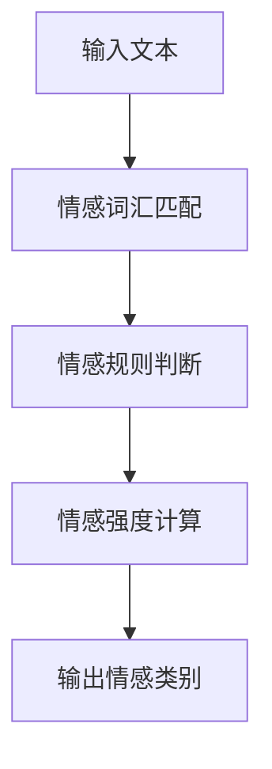
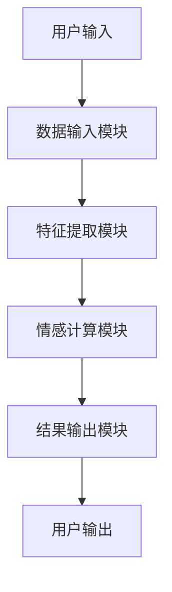

                 


# 构建AI Agent的情感计算模型

> 关键词：情感计算，AI Agent，自然语言处理，深度学习，人机交互，用户体验

> 摘要：本文将详细介绍如何构建基于情感计算的AI Agent模型，从情感计算的基本概念到AI Agent的情感计算模型实现，再到实际应用中的系统设计与优化。文章将从背景介绍出发，逐步深入讲解情感计算的核心概念、算法原理、系统架构设计和项目实战，最后结合实际案例进行详细分析。通过本文的学习，读者将能够掌握构建AI Agent情感计算模型的核心技术与方法。

---

# 第1章: 情感计算与AI Agent的背景介绍

## 1.1 情感计算的基本概念

### 1.1.1 情感计算的定义
情感计算（Affective Computing）是一种通过计算手段研究人类情感、情绪及其相关行为的学科，旨在理解和模拟人类的情感状态。情感计算的核心目标是让计算机能够识别、理解和回应人类的情感，从而实现更自然、更智能的交互。

### 1.1.2 情感计算的核心要素
- **情感识别**：通过文本、语音、图像等输入数据，识别出对应的情感状态。
- **情感建模**：建立情感状态的数学模型，描述情感的特征和关系。
- **情感推理**：基于情感模型，推断出更复杂的情感状态或行为。

### 1.1.3 情感计算的应用场景
- **人机交互**：提升用户体验，使交互更加自然和智能。
- **智能助手**：通过情感计算，AI Agent可以更好地理解用户需求，提供更贴心的服务。
- **心理健康支持**：通过分析用户的情感状态，提供心理支持或建议。

## 1.2 AI Agent的基本概念

### 1.2.1 AI Agent的定义
AI Agent（人工智能代理）是指具有感知环境和自主决策能力的智能实体。AI Agent能够通过感知环境信息，执行任务，与用户或其他系统进行交互。

### 1.2.2 AI Agent的分类
- **简单反射型Agent**：基于规则进行简单反应，适用于任务单一的场景。
- **基于模型的反射型Agent**：基于内部模型进行决策，适用于复杂任务。
- **目标驱动型Agent**：具有明确的目标，通过规划和推理实现目标。
- **效用驱动型Agent**：基于效用函数进行决策，追求效用最大化。

### 1.2.3 AI Agent与情感计算的关系
情感计算为AI Agent提供了情感理解能力，使其能够更好地与人类用户进行交互，提升用户体验和交互效率。

## 1.3 情感计算在AI Agent中的作用

### 1.3.1 情感计算对AI Agent的增强作用
- **情感识别**：通过情感计算，AI Agent能够理解用户的情感状态。
- **情感反馈**：基于情感计算结果，AI Agent可以生成更符合用户情感需求的反馈。
- **情感记忆**：记录用户的情感变化，提升长期交互的智能化水平。

### 1.3.2 情感计算在人机交互中的应用
- **情感驱动的交互设计**：通过情感计算优化交互流程。
- **情感反馈的实时响应**：根据用户情感状态调整交互策略。

### 1.3.3 情感计算对用户体验的提升
- **个性化服务**：基于用户情感状态，提供个性化推荐和定制化服务。
- **情感支持**：在用户情绪低落时，提供情感支持和安慰。

## 1.4 本章小结
本章介绍了情感计算的基本概念、核心要素以及应用场景，同时详细讲解了AI Agent的定义、分类及其与情感计算的关系。通过本章的学习，读者可以理解情感计算在AI Agent中的重要作用，以及如何通过情感计算提升人机交互的智能化水平。

---

# 第2章: 情感计算的核心概念

## 2.1 情感计算的数学模型

### 2.1.1 情感计算的输入与输出
- **输入**：文本、语音、图像等多模态数据。
- **输出**：情感类别（如正面、负面、中性）或情感强度（如情感值）。

### 2.1.2 情感计算的特征提取
- **文本特征**：词袋模型、TF-IDF、词嵌入（如Word2Vec）。
- **语音特征**：音调、语速、停顿等。
- **图像特征**：面部表情、眼神、姿态等。

### 2.1.3 情感计算的分类模型
- **二分类模型**：正面与负面情感分类。
- **多分类模型**：情感类别包括愤怒、悲伤、快乐、惊讶等。

## 2.2 情感计算的核心算法

### 2.2.1 基于规则的情感计算
- **规则库的构建**：通过预定义的情感词汇和规则，进行情感分类。
- **情感强度计算**：通过规则匹配，计算情感强度。

### 2.2.2 基于机器学习的情感计算
- **算法选择**：支持向量机（SVM）、随机森林（Random Forest）、朴素贝叶斯（Naive Bayes）等。
- **数据特征提取**：文本特征提取、数值化处理。

### 2.2.3 基于深度学习的情感计算
- **模型选择**：卷积神经网络（CNN）、循环神经网络（RNN）、Transformer模型。
- **模型训练**：使用标注数据进行监督学习。

## 2.3 情感计算的特征分析

### 2.3.1 文本特征提取
- **词袋模型**：将文本表示为词的出现情况。
- **TF-IDF**：计算词的重要程度。
- **词嵌入**：将词表示为低维向量。

### 2.3.2 声调特征提取
- **音调分析**：通过音调变化判断情感状态。
- **语速分析**：通过语速变化判断情感状态。

### 2.3.3 面部表情特征提取
- **面部特征点检测**：通过面部特征点提取表情信息。
- **表情分类**：基于特征点的分类模型。

## 2.4 本章小结
本章详细介绍了情感计算的数学模型、核心算法和特征分析方法。通过本章的学习，读者可以理解情感计算的基本原理和实现方法，为后续的算法实现和系统设计打下基础。

---

# 第3章: 情感计算的算法实现

## 3.1 基于规则的情感计算算法

### 3.1.1 规则库的构建
- **情感词汇表**：预定义的情感词汇，如“快乐”、“悲伤”等。
- **情感规则**：通过组合情感词汇和上下文信息，构建情感规则。

### 3.1.2 基于规则的情感分类
- **规则匹配**：通过规则匹配输入数据，判断情感类别。
- **情感强度计算**：根据匹配规则的数量和权重，计算情感强度。

### 3.1.3 基于规则的情感计算流程图


## 3.2 基于机器学习的情感计算算法

### 3.2.1 机器学习模型的选择
- **SVM**：适用于小规模数据集。
- **随机森林**：适用于特征较多的场景。
- **朴素贝叶斯**：适用于文本分类任务。

### 3.2.2 数据特征提取与处理
- **文本特征提取**：使用TF-IDF提取文本特征。
- **数据标准化**：对特征进行标准化处理。

### 3.2.3 情感分类器的训练与优化
- **模型训练**：使用标注数据训练情感分类器。
- **模型优化**：通过交叉验证调整模型参数。

## 3.3 基于深度学习的情感计算算法

### 3.3.1 深度学习模型的选择
- **CNN**：适用于文本序列的特征提取。
- **RNN**：适用于长文本的情感分析。
- **Transformer**：适用于需要全局信息的情感计算任务。

### 3.3.2 模型的训练与优化
- **模型训练**：使用大规模数据训练情感计算模型。
- **模型优化**：通过调整学习率、批量大小等参数优化模型性能。

### 3.3.3 情感计算的模型评估
- **准确率**：模型正确分类的比例。
- **召回率**：模型识别出所有正样本的比例。
- **F1值**：准确率和召回率的调和平均值。

## 3.4 本章小结
本章详细讲解了基于规则、机器学习和深度学习的情感计算算法。通过本章的学习，读者可以掌握情感计算的不同实现方法，并根据实际需求选择合适的算法。

---

# 第4章: 情感计算系统的架构设计

## 4.1 系统功能模块划分

### 4.1.1 数据输入模块
- **文本输入**：接收用户输入的文本数据。
- **语音输入**：接收用户的语音数据。
- **图像输入**：接收用户的情感表达图像。

### 4.1.2 特征提取模块
- **文本特征提取**：对输入文本进行特征提取。
- **语音特征提取**：对输入语音进行特征提取。
- **图像特征提取**：对输入图像进行特征提取。

### 4.1.3 情感计算模块
- **情感识别**：基于特征数据进行情感识别。
- **情感推理**：基于情感识别结果进行情感推理。

### 4.1.4 结果输出模块
- **情感分类结果**：输出情感类别。
- **情感强度结果**：输出情感强度值。

## 4.2 系统架构设计

### 4.2.1 分层架构设计
- **数据层**：存储和管理数据。
- **计算层**：进行特征提取和情感计算。
- **应用层**：提供用户交互界面和结果展示。

### 4.2.2 模块间的交互关系
- **数据输入模块**与**特征提取模块**交互。
- **特征提取模块**与**情感计算模块**交互。
- **情感计算模块**与**结果输出模块**交互。

### 4.2.3 系统的可扩展性设计
- **模块化设计**：各个模块独立开发，便于扩展。
- **接口标准化**：模块间通过标准化接口进行交互。

## 4.3 系统接口设计

### 4.3.1 接口定义
- **输入接口**：接收输入数据。
- **输出接口**：输出情感计算结果。

### 4.3.2 接口实现
- **文本接口**：处理文本输入。
- **语音接口**：处理语音输入。
- **图像接口**：处理图像输入。

## 4.4 系统交互流程图


## 4.5 本章小结
本章详细介绍了情感计算系统的架构设计，包括功能模块划分、系统架构设计和接口设计。通过本章的学习，读者可以理解如何构建一个高效、可扩展的情感计算系统。

---

# 第5章: 项目实战——构建AI Agent的情感计算模型

## 5.1 项目背景与目标
- **项目背景**：构建一个基于情感计算的AI Agent，实现情感识别、情感推理和情感反馈功能。
- **项目目标**：提升AI Agent的情感理解能力，使其能够与用户进行更自然的交互。

## 5.2 项目环境与工具
- **开发环境**：Python 3.8+
- **开发工具**：PyCharm、Jupyter Notebook
- **依赖库**：TensorFlow、Keras、scikit-learn、NLTK

## 5.3 项目实现步骤

### 5.3.1 数据准备
- **数据来源**：收集多模态数据（文本、语音、图像）。
- **数据预处理**：清洗数据、标注情感类别。

### 5.3.2 特征提取
- **文本特征提取**：使用TF-IDF提取文本特征。
- **语音特征提取**：提取音调、语速等特征。
- **图像特征提取**：提取面部表情特征。

### 5.3.3 模型训练
- **选择模型**：基于实验选择最优模型。
- **训练模型**：使用标注数据训练情感计算模型。

### 5.3.4 系统集成
- **模块集成**：将各个模块集成到系统中。
- **系统测试**：进行功能测试和性能测试。

## 5.4 项目代码实现

### 5.4.1 数据准备与特征提取
```python
from sklearn.feature_extraction.text import TfidfVectorizer

# 文本特征提取
vectorizer = TfidfVectorizer()
X = vectorizer.fit_transform(text_data)
```

### 5.4.2 模型训练与评估
```python
from sklearn.svm import SVC
from sklearn.metrics import accuracy_score

# 模型训练
model = SVC()
model.fit(X, y)

# 模型评估
y_pred = model.predict(X_test)
accuracy = accuracy_score(y_test, y_pred)
print(f"Accuracy: {accuracy}")
```

## 5.5 项目小结
通过本章的项目实战，读者可以掌握情感计算模型的实现方法，并能够将其应用到实际项目中。通过不断优化模型和系统设计，可以进一步提升AI Agent的情感计算能力。

---

# 第6章: 高级主题与最佳实践

## 6.1 情感计算的优化与提升

### 6.1.1 模型优化
- **超参数调优**：通过网格搜索优化模型性能。
- **模型融合**：结合多种模型提升性能。

### 6.1.2 特征优化
- **特征选择**：去除冗余特征，提升模型性能。
- **特征工程**：通过特征组合提升模型效果。

## 6.2 情感计算的实际应用注意事项

### 6.2.1 数据质量
- **数据清洗**：确保数据质量，减少噪声。
- **数据标注**：准确标注情感类别。

### 6.2.2 模型选择
- **任务需求**：根据任务需求选择合适的模型。
- **数据规模**：根据数据规模选择模型复杂度。

## 6.3 情感计算的未来发展

### 6.3.1 多模态情感计算
- **多模态数据融合**：结合文本、语音、图像等多种数据源进行情感计算。
- **跨模态情感分析**：研究不同模态数据之间的关联性。

### 6.3.2 情感计算的实时性
- **实时情感计算**：提升计算效率，实现实时情感分析。
- **轻量化模型**：优化模型结构，降低计算成本。

## 6.4 本章小结
本章探讨了情感计算的优化方法、实际应用注意事项和未来发展。通过本章的学习，读者可以更好地理解情感计算的局限性和潜力，为未来的研发工作提供参考。

---

# 第7章: 总结与展望

## 7.1 本文总结
- 本文详细介绍了情感计算的基本概念、核心算法和系统设计。
- 通过项目实战，展示了情感计算模型的实现方法。

## 7.2 未来展望
- **多模态情感计算**：结合多种数据源进行情感计算，提升计算精度。
- **情感计算的实时性**：优化模型结构，实现实时情感分析。
- **情感计算的智能化**：结合人工智能技术，提升情感计算的智能化水平。

## 7.3 本章小结
本文总结了情感计算在AI Agent中的应用，并展望了未来的发展方向。希望通过本文的学习，读者能够掌握情感计算的核心技术，并将其应用到实际项目中。

---

# 作者：AI天才研究院/AI Genius Institute & 禅与计算机程序设计艺术 /Zen And The Art of Computer Programming

---

通过本文的详细讲解，读者可以系统地掌握情感计算的核心概念、算法实现和系统设计方法。结合实际案例和最佳实践，读者能够将情感计算技术应用到实际项目中，提升AI Agent的智能化水平。

