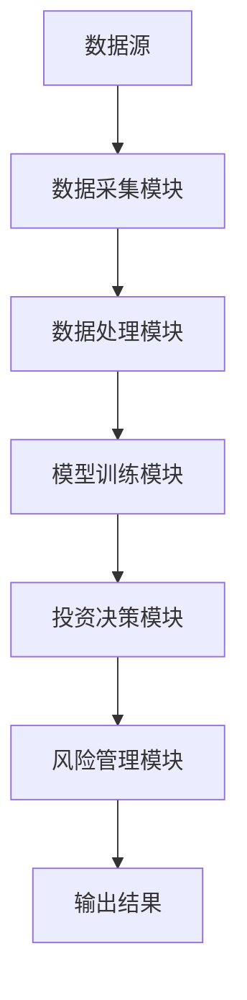
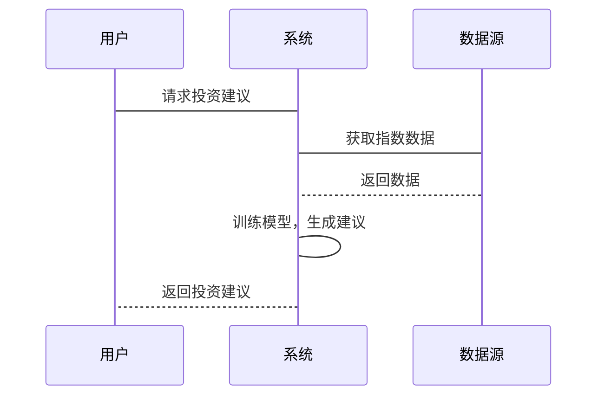

                 


# 约翰·伯格的指数投资策略遇上AI：效率的极致追求

> 关键词：指数投资，AI，效率优化，机器学习，约翰·伯格

> 摘要：本文探讨了约翰·伯格的指数投资策略与人工智能技术的结合，分析了AI如何提升指数投资的效率与精确度。文章从指数投资的基本原理、AI的核心技术、两者的结合优化、系统设计与实现、项目实战案例，到未来挑战与展望，进行了全面而深入的分析。通过实际案例和系统架构设计，展示了AI在指数投资中的应用潜力与实际价值。

---

# 第一部分：指数投资策略概述

## 第1章：指数投资策略的背景与核心概念

### 1.1 指数投资的定义与历史发展

#### 1.1.1 指数投资的基本概念
指数投资是一种被动投资策略，其核心是通过复制特定市场指数的表现来实现投资收益。与主动管理型投资不同，指数投资不依赖于对市场的预测或选股能力，而是通过持有整个市场的代表性样本（如股票指数或债券指数）来实现长期稳定的收益。

#### 1.1.2 指数投资的历史演变
指数投资的概念最早可以追溯到20世纪30年代，但真正的发展始于20世纪70年代。1975年，约翰·伯格（John Bogle）创立了第一只指数基金——先锋500指数基金（Vanguard 500 Index Fund），标志着指数投资进入了一个新的发展阶段。随着金融市场的日益复杂化和投资者对低费用、高透明度投资产品的追求，指数投资逐渐成为全球范围内广泛采用的投资策略之一。

#### 1.1.3 指数投资的核心原理
指数投资的核心原理在于“不要尝试战胜市场”，而是通过分散投资来降低风险，同时以最小的成本获取市场的平均收益。其核心要素包括：
1. **分散投资**：通过投资整个市场的指数，避免单一资产的风险。
2. **低成本**：指数基金的管理费用通常低于主动管理型基金。
3. **长期持有**：指数投资强调长期投资，避免频繁交易带来的成本和风险。

---

### 1.2 约翰·伯格的指数投资策略

#### 1.2.1 约翰·伯格的生平与贡献
约翰·伯格是指数投资领域的先驱者，他于1949年创立了先锋集团（Vanguard Group），并开发了第一只低成本的指数基金——先锋500指数基金。伯格的贡献不仅在于他创立了指数基金，还在于他倡导的“买入并持有”的投资理念，强调长期投资和低成本运作。

#### 1.2.2 伯格指数投资策略的特点
伯格的指数投资策略具有以下几个显著特点：
1. **被动管理**：通过跟踪市场指数，避免主动管理的高昂费用和频繁交易。
2. **分散化**：投资于多个资产类别或市场指数，降低特定资产或市场的风险。
3. **低成本**：通过大规模运作和自动化管理，降低基金的管理费用和交易成本。

#### 1.2.3 伯格策略的核心要素
- **市场指数选择**：选择具有广泛代表性的指数，如标普500指数。
- **分散化投资**：通过投资指数基金实现资产的广泛分散。
- **长期持有**：避免短期交易，降低交易成本和税务负担。

---

### 1.3 指数投资的优缺点分析

#### 1.3.1 指数投资的优势
1. **低成本**：指数基金的管理费用通常低于主动管理型基金。
2. **分散风险**：通过投资整个市场指数，降低单一资产的风险。
3. **透明度高**：投资者可以清晰地了解基金的投资组合和运作方式。
4. **长期收益稳定**：长期来看，指数投资往往能够跑赢大多数主动管理型基金。

#### 1.3.2 指数投资的局限性
1. **缺乏灵活性**：指数投资是被动的，无法根据市场变化进行调整。
2. **市场风险**：如果市场整体表现不佳，指数投资也会受到拖累。
3. **无法超越市场**：指数投资的目标是跟踪市场表现，而不是跑赢市场。

#### 1.3.3 指数投资与主动投资的对比
| 对比维度         | 指数投资               | 主动投资               |
|------------------|-----------------------|-----------------------|
| 管理方式         | 被动跟踪市场指数       | 主动选股、择时         |
| 成本             | 低管理费用             | 高管理费用             |
| 风险             | 分散化风险较低         | 集中化风险较高         |
| 收益目标         | 追求市场平均收益       | 追求超越市场的收益     |

---

## 第2章：指数基金与投资组合管理

### 2.1 指数基金的运作机制

#### 2.1.1 指数基金的构造方法
指数基金的构造方法包括以下几种：
1. **完全复制法**：完全复制目标指数的成分股，以实现与指数相同的收益。
2. **抽样法**：通过选择部分成分股来近似跟踪指数的表现，通常适用于成分股较多的指数。
3. **优化法**：通过优化算法选择最优的成分股组合，以降低跟踪误差。

#### 2.1.2 指数基金的费用结构
指数基金的费用结构主要包括：
1. **管理费用**：支付给基金管理公司的费用。
2. **交易费用**：由于频繁交易产生的佣金和其他费用。
3. **其他费用**：如托管费、审计费等。

#### 2.1.3 指数基金的风险管理
指数基金的风险管理主要通过分散化投资、严格跟踪指数成分股以及控制跟踪误差来实现。此外，投资者还可以通过选择不同风险等级的指数基金来管理整体投资组合的风险。

---

### 2.2 投资组合优化的理论基础

#### 2.2.1 马科维茨的有效前沿理论
马科维茨的有效前沿理论是投资组合优化的重要理论基础。该理论认为，投资者可以通过合理配置不同资产的比例，构建出在给定风险水平下收益最高的投资组合，或者在给定收益水平下风险最低的投资组合。这些最优组合构成了所谓的“有效前沿”。

#### 2.2.2 现金流贴现模型
现金流贴现模型（DCF模型）是一种用于评估资产内在价值的分析工具，常用于股票投资。通过预测未来现金流并将其贴现为现值，投资者可以估算出资产的合理价格。

#### 2.2.3 风险与收益的平衡
在投资组合管理中，风险与收益的平衡是核心问题。通过资产配置、分散化投资和风险管理工具（如期权、保险等），投资者可以在不同风险承受能力下实现收益目标的平衡。

---

### 2.3 指数投资的全球化视角

#### 2.3.1 全球化投资的机遇
随着全球经济一体化的深入，投资者可以通过投资全球指数基金来分散风险并抓住全球市场的增长机遇。

#### 2.3.2 地缘政治风险对指数投资的影响
地缘政治风险可能对指数投资产生重大影响，尤其是在指数成分股涉及多个市场或行业的情况下。

#### 2.3.3 跨国指数基金的构建策略
跨国指数基金的构建需要考虑不同市场的波动性、相关性、流动性等因素，以实现全球化投资的收益目标。

---

# 第二部分：人工智能技术基础

## 第3章：人工智能的核心概念与技术

### 3.1 机器学习的基本原理

#### 3.1.1 机器学习的定义与分类
机器学习是一种人工智能技术，其核心是通过数据训练模型，使其能够从经验中学习并做出预测或决策。机器学习可以分为监督学习、无监督学习、强化学习等。

#### 3.1.2 监督学习、无监督学习与强化学习的对比
| 对比维度         | 监督学习              | 无监督学习             | 强化学习             |
|------------------|----------------------|-----------------------|---------------------|
| 数据类型         | 标签数据              | 无标签数据             | 剂量反馈数据         |
| 目标             | 预测目标变量         | 发现数据结构           | 学习最优策略         |
| 应用场景         | 分类、回归            | 聚类、降维             | 自动控制、游戏AI     |

#### 3.1.3 人工智能的核心算法概述
人工智能的核心算法包括支持向量机（SVM）、随机森林（Random Forest）、神经网络（Neural Network）等。

---

### 3.2 深度学习与神经网络

#### 3.2.1 神经网络的定义与结构
神经网络是一种模仿人脑结构和功能的计算模型，由多个层次的节点和连接组成。典型的神经网络结构包括输入层、隐藏层和输出层。

#### 3.2.2 深度学习的特征与优势
深度学习的特征包括非线性、多层次结构、大数据处理能力等。其优势在于能够自动提取数据特征，适用于图像识别、自然语言处理等复杂任务。

---

### 3.3 人工智能在金融领域的应用

#### 3.3.1 金融时间序列分析
金融时间序列分析是人工智能在金融领域的重要应用之一，主要用于股票价格预测、市场趋势分析等。

#### 3.3.2 自然语言处理在金融新闻中的应用
自然语言处理技术可以用于分析金融新闻、公司财报等文本数据，提取情感倾向、市场情绪等信息。

#### 3.3.3 强化学习在量化交易中的应用
强化学习可以通过模拟交易环境，训练出能够优化交易策略的智能体，从而实现自动化交易。

---

## 第4章：人工智能在指数投资中的应用

### 4.1 人工智能优化指数投资的潜力

#### 4.1.1 数据预处理与特征提取
在指数投资中，人工智能可以通过大数据分析，提取更多的特征，如市场情绪、技术指标等，以提高预测的准确性。

#### 4.1.2 市场预测与投资决策
人工智能可以用于预测市场走势，优化投资组合配置，降低风险。

#### 4.1.3 风险管理与组合优化
通过机器学习算法，人工智能可以实现动态风险评估和投资组合优化，提高整体投资效率。

---

### 4.2 人工智能技术对指数投资的优化

#### 4.2.1 数据预处理与清洗
在指数投资中，数据的质量直接影响模型的预测效果。人工智能可以通过自动化数据清洗和特征工程，提高数据的可用性。

#### 4.2.2 时间序列预测模型
时间序列预测模型（如ARIMA、LSTM）可以用于预测指数价格走势，帮助投资者做出更科学的投资决策。

#### 4.2.3 风险管理与组合优化
通过机器学习算法，人工智能可以实现动态风险评估和投资组合优化，降低投资风险，提高收益。

---

## 第5章：系统设计与实现

### 5.1 系统架构设计

#### 5.1.1 系统功能模块
指数投资AI系统的主要功能模块包括：
1. 数据采集模块：收集指数数据、市场新闻等。
2. 数据处理模块：清洗、特征提取。
3. 模型训练模块：训练预测模型。
4. 投资决策模块：基于模型输出做出投资决策。
5. 风险管理模块：监控和管理投资风险。

#### 5.1.2 系统架构图


---

### 5.2 系统接口设计

#### 5.2.1 数据接口
系统需要与数据源（如金融数据API）进行交互，获取指数数据、市场新闻等。

#### 5.2.2 用户接口
用户可以通过Web界面或API与系统交互，查看投资建议、风险评估等信息。

#### 5.2.3 系统交互流程


---

## 第6章：项目实战与优化

### 6.1 项目环境搭建

#### 6.1.1 安装开发环境
安装Python、Jupyter Notebook、Pandas、NumPy等开发工具。

#### 6.1.2 数据源选择
选择合适的金融数据源，如Yahoo Finance、Quandl等。

---

### 6.2 核心算法实现

#### 6.2.1 时间序列预测模型
使用LSTM（长短期记忆网络）进行指数价格预测。

```python
import numpy as np
from tensorflow.keras.models import Sequential
from tensorflow.keras.layers import LSTM, Dense

# 假设我们有训练数据X和标签y
model = Sequential()
model.add(LSTM(64, input_shape=(timesteps, features)))
model.add(Dense(1))
model.compile(loss='mean_squared_error', optimizer='adam')
model.fit(X_train, y_train, epochs=100, batch_size=32)
```

#### 6.2.2 投资组合优化
使用遗传算法优化投资组合配置。

```python
import numpy as np
from sklearn.datasets import make_spares
from sklearn.ensemble import RandomForestClassifier

X, y = make_spares(n_samples=100, n_features=10, random_state=42)
model = RandomForestClassifier(n_estimators=100)
model.fit(X, y)
```

---

### 6.3 实战案例分析

#### 6.3.1 数据回测
对模型进行历史数据回测，验证其预测准确性和投资收益。

#### 6.3.2 模型优化
根据回测结果，调整模型参数，优化投资策略。

---

## 第7章：挑战与未来展望

### 7.1 当前的挑战

#### 7.1.1 数据质量与完整性
指数投资AI系统依赖于高质量的数据，数据缺失或噪声可能影响模型的预测效果。

#### 7.1.2 模型的可解释性
复杂的AI模型（如深度学习模型）往往缺乏可解释性，这在金融领域尤为重要。

#### 7.1.3 模型的过拟合与泛化能力
AI模型在训练数据上表现良好，但在实际应用中可能面临过拟合问题，导致预测效果不佳。

---

### 7.2 未来的展望

#### 7.2.1 AI与区块链的结合
区块链技术可以提高金融数据的安全性和透明度，为指数投资AI系统提供更可靠的数据支持。

#### 7.2.2 云计算与分布式计算
云计算和分布式计算可以为指数投资AI系统提供强大的计算能力，支持更大规模的数据处理和模型训练。

#### 7.2.3 多模态数据的融合
通过融合文本、图像等多种数据类型，AI系统可以实现更全面的市场分析和预测。

---

## 结语

随着人工智能技术的不断发展，其在指数投资中的应用潜力巨大。通过AI技术的优化，指数投资可以实现更高的效率和精度，为投资者带来更大的收益。然而，AI在金融领域的应用也面临诸多挑战，需要我们在技术、数据和政策等多个方面进行探索和优化。

---

## 作者

作者：AI天才研究院/AI Genius Institute & 禅与计算机程序设计艺术/Zen And The Art of Computer Programming

