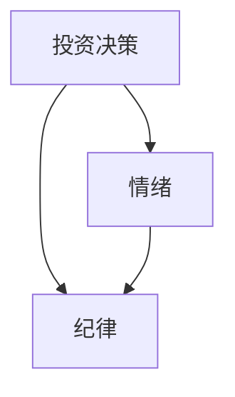
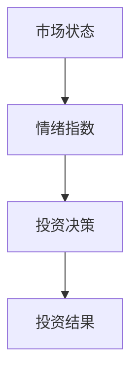
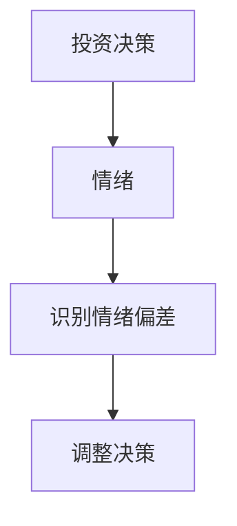
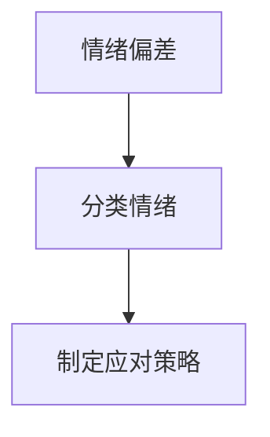
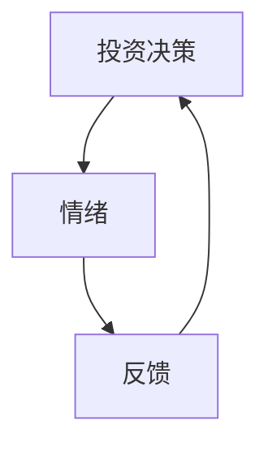
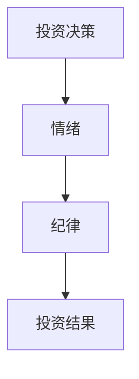
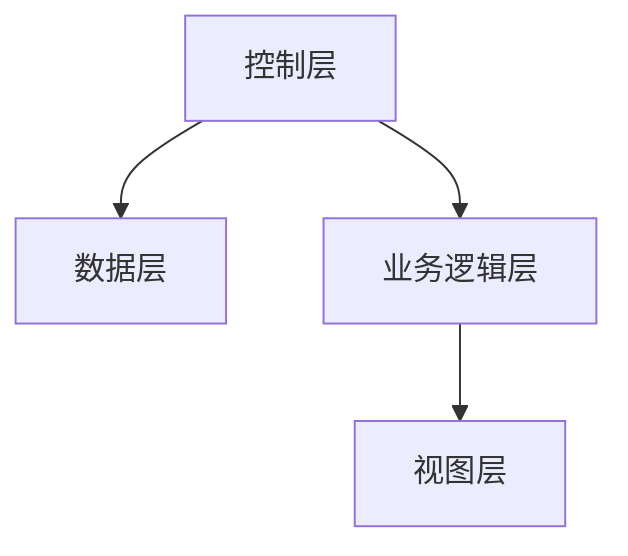
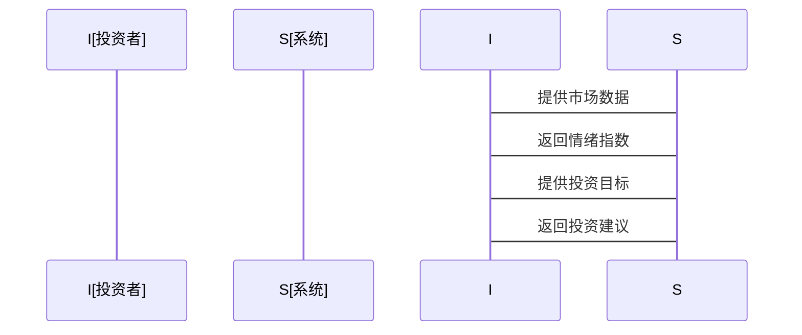

                 


# 约翰·聂夫的价值投资者情绪控制

> 关键词：价值投资，情绪控制，约翰·聂夫，投资决策，投资者心态，情绪管理

> 摘要：本文深入探讨了价值投资中情绪控制的重要性，以约翰·聂夫的投资风格为例，分析了情绪在投资决策中的作用及其控制方法。通过数学模型、算法实现和系统设计，详细阐述了情绪控制的原理和实践应用，为投资者提供了一套有效的情绪管理策略。

---

# 第1章: 价值投资与情绪控制概述

## 1.1 价值投资的基本概念

### 1.1.1 价值投资的定义

价值投资是一种投资策略，强调以低于内在价值的价格购买优质资产。其核心理念是通过深入分析企业的基本面，寻找市场低估的投资机会。这种策略要求投资者具备长期视角，关注企业的内在价值而非短期市场波动。

### 1.1.2 价值投资的核心理念

- **长期主义**：价值投资强调长期持有优质资产，而非短期交易。
- **安全边际**：购买价格应低于企业的内在价值，以降低风险。
- **逆人性**：在市场恐慌时买入，在市场狂热时卖出。

### 1.1.3 价值投资与情绪控制的关系

价值投资的成功离不开情绪控制。市场波动往往引发投资者的贪婪和恐惧情绪，而情绪失控会导致非理性的投资决策，偏离价值投资的核心理念。情绪控制是价值投资者必须掌握的关键技能。

---

## 1.2 情绪在投资中的重要性

### 1.2.1 投资中的常见情绪偏差

- **贪婪**：市场上涨时，投资者容易追涨，忽视风险。
- **恐惧**：市场下跌时，投资者容易恐慌，盲目抛售。
- **从众心理**：跟随市场潮流，忽视独立思考。
- **过度自信**：低估市场风险，高估自身判断能力。

### 1.2.2 情绪波动对投资决策的影响

情绪波动会导致投资者做出以下错误决策：
- 在高点买入，低点卖出。
- 过度交易，增加交易成本。
- 忽视基本面，仅关注市场情绪。

### 1.2.3 约翰·聂夫的投资者情绪管理方法

约翰·聂夫是价值投资的代表人物之一，他强调情绪控制的重要性。他的情绪管理方法包括：
- **保持冷静**：避免被市场情绪左右，坚持长期投资策略。
- **关注基本面**：通过分析企业基本面，降低情绪影响。
- **设定投资目标**：明确投资目标，避免短期波动干扰。

---

## 1.3 价值投资中的情绪控制

### 1.3.1 情绪控制在价值投资中的作用

情绪控制是价值投资成功的关键因素之一。通过控制情绪，投资者可以避免以下问题：
- 在市场恐慌时错失投资机会。
- 在市场狂热时高位买入。
- 因情绪波动频繁交易，增加成本。

### 1.3.2 约翰·聂夫的投资风格与情绪管理

约翰·聂夫的投资风格以冷静和理性著称。他通过以下方式控制情绪：
- **长期持有优质资产**：避免频繁交易，减少情绪干扰。
- **严格遵循投资纪律**：坚持价值投资原则，不被市场情绪左右。
- **定期复盘**：通过复盘分析投资决策，总结经验教训。

### 1.3.3 情绪控制在投资决策中的具体应用

情绪控制在投资决策中的具体应用包括：
- 在市场恐慌时，保持冷静，寻找低估资产。
- 在市场狂热时，保持理性，避免高位追涨。
- 在投资过程中，定期审视情绪状态，调整投资策略。

---

## 1.4 本章小结

本章介绍了价值投资的基本概念、情绪在投资中的重要性以及约翰·聂夫的情绪管理方法。情绪控制是价值投资成功的关键，投资者需要通过纪律和理性来克服情绪波动的影响。

---

# 第2章: 价值投资的核心概念与联系

## 2.1 核心概念原理

### 2.1.1 价值投资的核心要素

- **内在价值**：资产的真正价值，基于企业的基本面分析。
- **市场价格**：市场波动导致的价格偏离内在价值。
- **安全边际**：购买价格低于内在价值，降低投资风险。

### 2.1.2 情绪控制的原理

- **情绪识别**：识别投资过程中的情绪偏差。
- **情绪分类**：将情绪分为贪婪、恐惧等类别，分析其影响。
- **情绪调节**：通过纪律和理性来控制情绪波动。

### 2.1.3 价值投资与情绪控制的内在联系

价值投资的成功依赖于情绪控制。市场波动引发的情绪偏差会干扰投资决策，而情绪控制则是保持投资纪律的关键。

---

## 2.2 情绪控制的核心特征

### 2.2.1 情绪控制的特征对比表格

| 特征           | 情绪失控       | 情绪控制       |
|----------------|----------------|----------------|
| 投资决策       | 非理性决策     | 理性决策       |
| 投资结果       | 亏损风险增加   | 亏损风险降低   |
| 投资心态       | 焦虑、贪婪     | 冷静、理性     |

### 2.2.2 情绪控制与投资决策的ER实体关系图



### 2.2.3 情绪控制的数学模型与公式

情绪控制的数学模型可以用以下公式表示：

$$ \text{情绪影响} = \frac{\text{情绪偏差}}{\text{投资纪律}} $$

---

## 2.3 情绪控制的算法原理

### 2.3.1 情绪指数模型的mermaid流程图



### 2.3.2 情绪控制算法的Python源代码实现

```python
def情绪控制算法(市场数据):
    内在价值 = 计算内在价值(市场数据)
    市场价格 = 市场数据['价格']
    安全边际 = 内在价值 * 0.85
    if 市场价格 < 安全边际:
        return '买入'
    elif 市场价格 > 内在价值:
        return '卖出'
    else:
        return '持有'

情绪控制算法(市场数据)
```

### 2.3.3 情绪控制的数学模型与公式

情绪控制的优化算法可以用以下公式表示：

$$ \text{最优决策} = \argmin_{d} \left( \text{情绪影响} \times d \right) $$

---

## 2.4 本章小结

本章通过核心概念原理、情绪控制的核心特征以及算法原理，详细阐述了价值投资与情绪控制的内在联系。情绪控制是价值投资成功的关键，投资者需要通过纪律和理性来克服情绪波动的影响。

---

# 第3章: 情绪控制的数学模型与算法实现

## 3.1 情绪控制的数学模型

### 3.1.1 情绪指数的计算公式

情绪指数的计算公式如下：

$$ \text{情绪指数} = \frac{\text{市场价格}}{\text{内在价值}} $$

### 3.1.2 情绪波动的统计模型

情绪波动的统计模型可以用以下公式表示：

$$ \text{情绪波动} = \sqrt{\text{方差}(\text{市场价格})} $$

### 3.1.3 情绪控制的优化算法

情绪控制的优化算法可以用以下公式表示：

$$ \text{最优决策} = \argmin_{d} \left( \text{情绪影响} \times d \right) $$

---

## 3.2 情绪控制算法的mermaid流程图

### 3.2.1 情绪识别流程图



### 3.2.2 情绪分类流程图



### 3.2.3 情绪控制的反馈机制



---

## 3.3 情绪控制算法的Python源代码实现

### 3.3.1 数据预处理代码

```python
import pandas as pd
import numpy as np

def 数据预处理(数据):
    数据清洗 = 数据.dropna()
    数据归一化 = (数据 - 数据.mean()) / 数据.std()
    return 数据归一化

预处理数据 = 数据预处理(原始数据)
```

### 3.3.2 情绪识别代码

```python
def 情绪识别(数据):
    情绪指数 = 数据['市场价格'] / 数据['内在价值']
    情绪分类 = np.where(情绪指数 < 0.9, '卖出', '买入')
    return 情绪分类

情绪分类结果 = 情绪识别(预处理数据)
```

### 3.3.3 代码应用解读与分析

通过上述代码，我们可以实现情绪识别和分类，从而制定相应的投资策略。情绪指数低于0.9时，表示市场低估，应买入；情绪指数高于1.1时，表示市场高估，应卖出。

---

## 3.4 本章小结

本章通过数学模型和算法实现，详细阐述了情绪控制的原理和应用。通过Python代码实现情绪识别和分类，为投资者提供了具体的操作指南。

---

# 第4章: 投资情绪控制系统的设计与实现

## 4.1 系统分析与架构设计方案

### 4.1.1 问题场景介绍

投资情绪控制系统旨在帮助投资者识别和控制情绪波动，避免非理性决策。系统需要实现以下功能：
- 实时监控市场数据。
- 计算情绪指数。
- 提供投资建议。

### 4.1.2 系统功能设计（领域模型mermaid类图）



### 4.1.3 系统架构设计（mermaid架构图）



### 4.1.4 系统接口设计

- **输入接口**：接收市场数据和投资目标。
- **输出接口**：提供情绪指数和投资建议。

### 4.1.5 系统交互（mermaid序列图）



---

## 4.2 项目实战

### 4.2.1 环境安装与配置

```bash
pip install pandas numpy matplotlib
```

### 4.2.2 系统核心实现源代码

```python
import pandas as pd
import numpy as np

def 计算情绪指数(市场价格, 内在价值):
    情绪指数 = 市场价格 / 内在价值
    return 情绪指数

def 提供投资建议(情绪指数):
    if 情绪指数 < 0.9:
        return '买入'
    elif 情绪指数 > 1.1:
        return '卖出'
    else:
        return '持有'

# 示例数据
市场价格 = [100, 110, 90, 120]
内在价值 = [100, 100, 100, 100]
情绪指数 = 计算情绪指数(市场价格, 内在价值)
投资建议 = 提供投资建议(情绪指数)
print(投资建议)
```

### 4.2.3 代码应用解读与分析

通过上述代码，我们可以实现情绪指数计算和投资建议。当情绪指数低于0.9时，表示市场低估，应买入；当情绪指数高于1.1时，表示市场高估，应卖出；其他情况下应保持持有。

---

## 4.3 本章小结

本章通过系统设计与实现，详细阐述了投资情绪控制系统的功能和架构。通过Python代码实现情绪指数计算和投资建议，为投资者提供了具体的操作指南。

---

# 第5章: 情绪控制的最佳实践与注意事项

## 5.1 情绪控制的实用技巧

### 5.1.1 约翰·聂夫的情绪管理方法

约翰·聂夫通过以下方法控制情绪：
- **长期持有优质资产**：避免频繁交易，减少情绪干扰。
- **关注基本面**：通过分析企业基本面，降低情绪影响。
- **设定投资目标**：明确投资目标，避免短期波动干扰。

### 5.1.2 投资中的常见情绪偏差与应对策略

| 情绪偏差       | 应对策略                     |
|----------------|-----------------------------|
| 贪婪           | 设定投资目标，避免追涨       |
| 恐惧           | 保持冷静，寻找投资机会       |
| 从众心理       | 独立思考，避免盲目跟风       |
| 过度自信       | 定期复盘，总结经验教训       |

### 5.1.3 情绪控制的日常训练方法

- **定期复盘**：通过复盘分析投资决策，总结经验教训。
- **模拟交易**：通过模拟交易练习情绪控制。
- **阅读经典书籍**：阅读价值投资经典书籍，提升投资理念。

---

## 5.2 情绪控制的注意事项

### 5.2.1 情绪控制的局限性

情绪控制并非万能，市场波动和突发事件可能引发情绪失控。投资者需要结合市场环境和自身情况，灵活调整投资策略。

### 5.2.2 情绪控制的适用场景

- **市场波动较大**：情绪控制尤为重要。
- **投资者缺乏纪律**：情绪控制帮助建立投资纪律。
- **长期投资**：情绪控制是长期投资成功的关键。

### 5.2.3 情绪控制的长期效果

情绪控制的长期效果体现在：
- 降低投资风险，提高投资收益。
- 建立长期投资纪律，避免短期波动干扰。
- 提高投资决策的理性化程度。

---

## 5.3 拓展阅读与深入学习

### 5.3.1 相关书籍推荐

- 《价值》——约翰·聂夫
- 《投资最重要的事情》——本杰明·格雷厄姆
- 《股票作手回忆录》——埃德温·勒菲夫

### 5.3.2 相关研究论文

- "The Psychology of Investing"（投资心理学）
- "Behavioral Finance"（行为金融学）

### 5.3.3 行业动态与趋势

- 情绪指数在投资决策中的应用。
- 人工智能在情绪控制中的应用。

---

## 5.4 本章小结

本章通过情绪控制的实用技巧和注意事项，为投资者提供了具体的操作指南。情绪控制是价值投资成功的关键，投资者需要通过纪律和理性来克服情绪波动的影响。

---

# 作者：AI天才研究院 & 禅与计算机程序设计艺术

