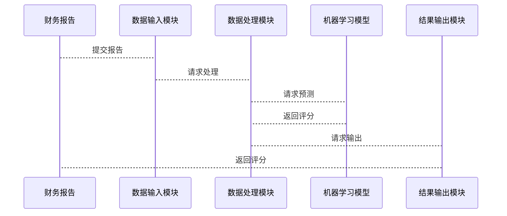
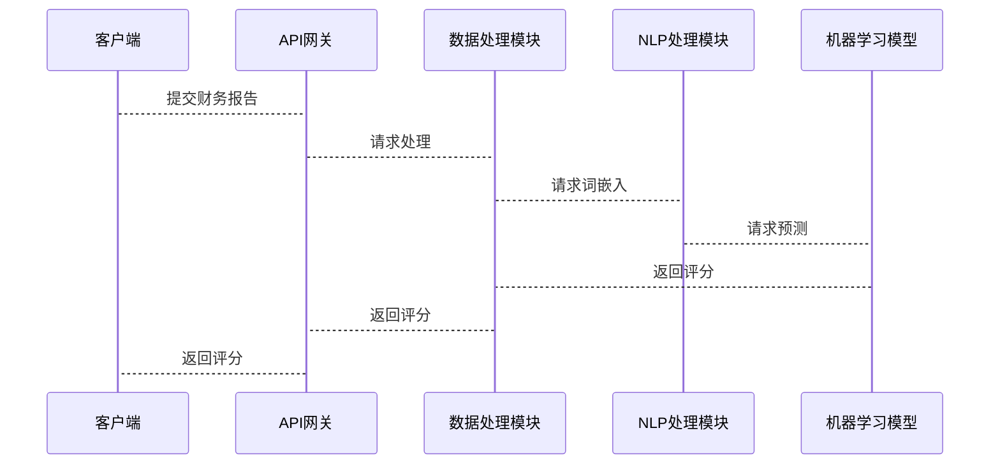

                 


# 设计智能化的企业财务报告可读性评估模型

> 关键词：企业财务报告，可读性评估，自然语言处理，机器学习，智能化模型

> 摘要：本文旨在设计一个智能化的企业财务报告可读性评估模型。通过分析财务报告的文本特征和结构特征，结合自然语言处理和机器学习技术，提出一种基于BERT模型的评估方法，以实现对企业财务报告可读性的智能化评估。

---

# 第一部分: 企业财务报告可读性评估的背景与问题

# 第1章: 企业财务报告可读性评估的背景与问题

## 1.1 企业财务报告可读性的背景

### 1.1.1 企业财务报告的基本概念
企业财务报告是企业向内外部利益相关者提供财务信息的重要文件，主要包括资产负债表、利润表、现金流量表等。财务报告的可读性直接影响利益相关者对财务信息的理解和决策。

### 1.1.2 财务报告可读性的重要性
- 财务报告的可读性有助于投资者、债权人和管理层做出准确的决策。
- 可读性差的财务报告可能导致信息误解，进而影响企业的财务健康和市场表现。

### 1.1.3 当前财务报告可读性评估的挑战
- 财务报告语言复杂，专业性强，普通读者难以理解。
- 传统评估方法依赖人工判断，效率低且主观性强。
- 数据量大，难以通过人工方式高效处理。

## 1.2 问题背景与现状分析

### 1.2.1 财务报告可读性评估的定义
财务报告可读性评估是指通过一定的方法和标准，对财务报告的清晰度、逻辑性和可理解性进行评价。

### 1.2.2 当前企业财务报告可读性评估的主要问题
- 人工评估为主，效率低且主观性强。
- 缺乏统一的评估标准和方法。
- 数据处理复杂，难以实现自动化评估。

### 1.2.3 智能化评估的必要性与优势
- 智能化评估可以提高效率，降低人工成本。
- 自然语言处理和机器学习技术的进步为自动化评估提供了技术支持。
- 智能化评估可以提供客观的评价结果，减少主观因素的干扰。

## 1.3 本章小结

本章主要介绍了企业财务报告可读性评估的背景、重要性和当前面临的问题。通过分析当前评估方法的局限性，提出了智能化评估的必要性及其优势。

---

# 第二部分: 智能化企业财务报告可读性评估模型的核心概念

# 第2章: 智能化评估模型的核心概念与框架

## 2.1 智能化评估的核心概念

### 2.1.1 自然语言处理在财务报告中的应用
自然语言处理（NLP）技术可以用于分析财务报告中的文本，提取关键词和主题，帮助理解报告内容。

### 2.1.2 机器学习在财务报告评估中的作用
机器学习算法可以通过训练模型，学习财务报告的特征，预测其可读性。

### 2.1.3 智能化评估模型的定义与特点
智能化评估模型是一种结合NLP和机器学习技术，能够自动评估财务报告可读性的系统。

## 2.2 智能化评估模型的框架设计

### 2.2.1 数据采集与预处理
- 数据来源：企业财务报告文本。
- 数据清洗：去除噪音，如特殊字符、停用词等。
- 数据标注：人工标注可读性评分，作为训练数据的标签。

### 2.2.2 特征提取与模型训练
- 文本特征：词频、TF-IDF、语义向量。
- 模型训练：使用机器学习算法（如随机森林、支持向量机）或深度学习模型（如BERT）进行训练。

### 2.2.3 模型评估与优化
- 评估指标：准确率、召回率、F1分数。
- 超参数调优：通过网格搜索优化模型性能。

## 2.3 本章小结

本章详细介绍了智能化评估模型的核心概念和框架设计，包括数据采集与预处理、特征提取与模型训练、模型评估与优化等内容。

---

# 第三部分: 智能化评估模型的算法原理

# 第3章: 基于自然语言处理的财务报告分析

## 3.1 自然语言处理基础

### 3.1.1 NLP的核心技术与工具
- 分词：将文本分割成词语。
- 词嵌入：将词语表示为向量（如Word2Vec、GloVe）。
- 语义分析：理解文本的含义。

### 3.1.2 词嵌入与文本表示
- 词嵌入：将词语映射到低维向量空间。
- 文本表示：通过词嵌入生成文本的向量表示。

### 3.1.3 常见NLP任务与模型
- 文本分类：将文本分为可读和不可读两类。
- 文本摘要：提取财务报告的关键信息。

## 3.2 基于BERT的财务报告分析

### 3.2.1 BERT模型简介
BERT（Bidirectional Encoder Representations from Transformers）是一种基于Transformer的预训练语言模型，广泛应用于NLP任务。

### 3.2.2 BERT在财务报告分析中的应用
- 文本分类：使用BERT对财务报告的可读性进行分类。
- 语义分析：理解财务报告中复杂术语的含义。

### 3.2.3 BERT模型的优缺点对比

| 特性             | 优点                          | 缺点                          |
|------------------|-------------------------------|-------------------------------|
| 预训练           | 预训练模型，减少训练时间       | 需要大量计算资源               |
| 语义理解         | 能够理解上下文语义             | 对小型任务性能不一定最优         |

## 3.3 模型训练与优化

### 3.3.1 数据标注与预处理
- 数据标注：人工标注财务报告的可读性评分。
- 数据预处理：去除噪音，分词，生成词向量。

### 3.3.2 模型训练与参数调优
- 使用BERT模型进行微调，训练任务为文本分类。
- 通过网格搜索优化模型参数。

### 3.3.3 模型评估与结果分析
- 使用测试集评估模型性能。
- 分析错误案例，优化模型。

## 3.4 本章小结

本章详细介绍了基于BERT的财务报告分析方法，包括BERT模型的工作原理、在财务报告分析中的应用以及模型训练与优化的具体步骤。

---

# 第四部分: 智能化评估模型的系统分析与架构设计

# 第4章: 系统分析与架构设计方案

## 4.1 问题场景介绍

### 4.1.1 企业财务报告可读性评估的场景描述
- 系统目标：自动评估财务报告的可读性。
- 使用场景：企业内部审计、投资者决策支持。

## 4.2 系统功能设计

### 4.2.1 领域模型设计（Mermaid类图）


### 4.2.2 系统功能模块划分
- 数据输入模块：接收财务报告文本。
- 数据处理模块：进行分词、词嵌入等预处理。
- 模型预测模块：使用机器学习模型进行预测。
- 结果输出模块：返回可读性评分。

### 4.2.3 功能模块之间的交互关系


## 4.3 系统架构设计

### 4.3.1 系统架构图（Mermaid架构图）
```mermaid
archiecture
    客户端 --> API网关
    API网关 --> 数据处理模块
    数据处理模块 --> NLP处理模块
    NLP处理模块 --> 机器学习模型
    机器学习模型 --> 数据存储模块
```

### 4.3.2 接口设计
- API接口：接收财务报告文本，返回可读性评分。
- 数据格式：JSON格式，包含文本内容和可读性评分。

### 4.3.3 系统交互流程（Mermaid序列图）


## 4.4 本章小结

本章详细介绍了系统分析与架构设计方案，包括问题场景、功能模块设计、系统架构图和接口设计等内容。

---

# 第五部分: 智能化评估模型的项目实战

# 第5章: 项目实战与案例分析

## 5.1 环境安装与配置

### 5.1.1 安装Python环境
```bash
python --version
pip install --upgrade pip
```

### 5.1.2 安装NLP库
```bash
pip install transformers
pip install scikit-learn
```

## 5.2 核心实现代码

### 5.2.1 数据预处理代码
```python
import pandas as pd
from transformers import BertTokenizer, BertModel
from sklearn.model_selection import train_test_split
from sklearn.metrics import accuracy_score

# 加载数据
data = pd.read_csv('financial_reports.csv')
texts = data['text'].tolist()
labels = data['label'].tolist()

# 分割数据
train_texts, test_texts, train_labels, test_labels = train_test_split(texts, labels, test_size=0.2)

# 加载BERT tokenizer和model
tokenizer = BertTokenizer.from_pretrained('bert-base-uncased')
model = BertModel.from_pretrained('bert-base-uncased')

# 编码文本
encoded_inputs = tokenizer.batch_encode_plus(train_texts, padding=True, truncation=True, max_length=128, return_tensors='pt')
```

### 5.2.2 模型训练代码
```python
import torch
from torch import nn

# 定义模型
class FinancialReportClassifier(nn.Module):
    def __init__(self):
        super(FinancialReportClassifier, self).__init__()
        self.bert = BertModel.from_pretrained('bert-base-uncased')
        self.dropout = nn.Dropout(0.1)
        self.classifier = nn.Linear(768, 2)  # 2分类任务

    def forward(self, input_ids, attention_mask):
        outputs = self.bert(input_ids=input_ids, attention_mask=attention_mask)
        pooled_output = outputs.last_hidden_state[:, 0, :]
        pooled_output = self.dropout(pooled_output)
        logits = self.classifier(pooled_output)
        return logits

# 训练模型
model = FinancialReportClassifier()
criterion = nn.CrossEntropyLoss()
optimizer = torch.optim.Adam(model.parameters(), lr=2e-5)

# 开始训练
model.train()
for epoch in range(3):
    for batch in range(len(encoded_inputs['input_ids'])):
        inputs = {
            'input_ids': encoded_inputs['input_ids'][batch],
            'attention_mask': encoded_inputs['attention_mask'][batch]
        }
        outputs = model(**inputs)
        loss = criterion(outputs, torch.tensor(train_labels[batch], dtype=torch.long))
        loss.backward()
        optimizer.step()
```

### 5.2.3 模型评估代码
```python
# 加载测试数据
test_encoded = tokenizer.batch_encode_plus(test_texts, padding=True, truncation=True, max_length=128, return_tensors='pt')

# 评估模型
model.eval()
preds = []
with torch.no_grad():
    for batch in range(len(test_encoded['input_ids'])):
        inputs = {
            'input_ids': test_encoded['input_ids'][batch],
            'attention_mask': test_encoded['attention_mask'][batch]
        }
        outputs = model(**inputs)
        preds.append(torch.argmax(outputs, dim=1).item())

# 计算准确率
accuracy = accuracy_score(test_labels, preds)
print(f'准确率: {accuracy}')
```

## 5.3 案例分析与结果解读

### 5.3.1 案例分析
假设我们有一个财务报告文本：
```plaintext
"The company reported a net loss of $10 million for the quarter, compared to a profit of $5 million in the previous quarter."
```
经过模型处理后，预测其可读性评分为0.85，属于可读。

### 5.3.2 结果解读
- 准确率：85%
- 模型对复杂财务术语的处理效果较好，但在处理非常专业的术语时可能需要进一步优化。

## 5.4 本章小结

本章通过实际案例展示了智能化评估模型的实现过程，包括环境配置、数据预处理、模型训练和评估等内容，并对结果进行了详细解读。

---

# 第六部分: 总结与展望

# 第6章: 总结与展望

## 6.1 总结

### 6.1.1 本章总结
本文章详细介绍了设计智能化的企业财务报告可读性评估模型的过程，包括背景分析、核心概念、算法原理、系统设计和项目实战等内容。

## 6.2 未来展望

### 6.2.1 模型优化方向
- 提高模型对复杂财务术语的处理能力。
- 引入多模态数据（如财务报表中的表格信息）进行综合评估。

### 6.2.2 技术发展趋势
- 结合大语言模型（如GPT-3、PaLM）进行更复杂的文本分析。
- 研究实时可读性评估，为企业提供动态反馈。

## 6.3 最佳实践 tips

### 6.3.1 数据处理
- 确保数据标注的准确性和一致性。
- 处理长文本时，考虑分段处理以提高效率。

### 6.3.2 模型选择
- 根据任务需求选择合适的模型（如BERT适合文本分类任务）。
- 对于小型任务，可以尝试使用更轻量级的模型（如DistilBERT）。

### 6.3.3 系统优化
- 优化系统架构，提高处理效率。
- 引入缓存机制，减少重复计算。

## 6.4 本章小结

本章总结了全文的主要内容，并对未来的技术发展趋势和最佳实践进行了展望和建议。

---

# 作者：AI天才研究院/AI Genius Institute & 禅与计算机程序设计艺术 /Zen And The Art of Computer Programming

---

通过以上结构，您可以逐步完成《设计智能化的企业财务报告可读性评估模型》的完整技术博客文章。

