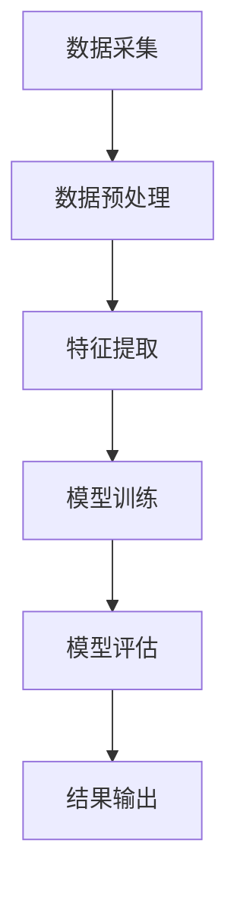
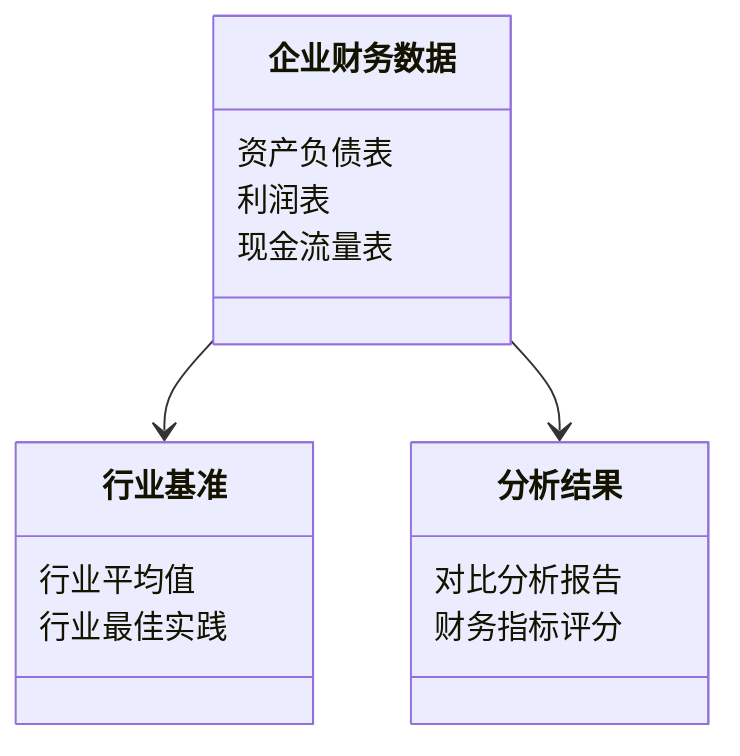
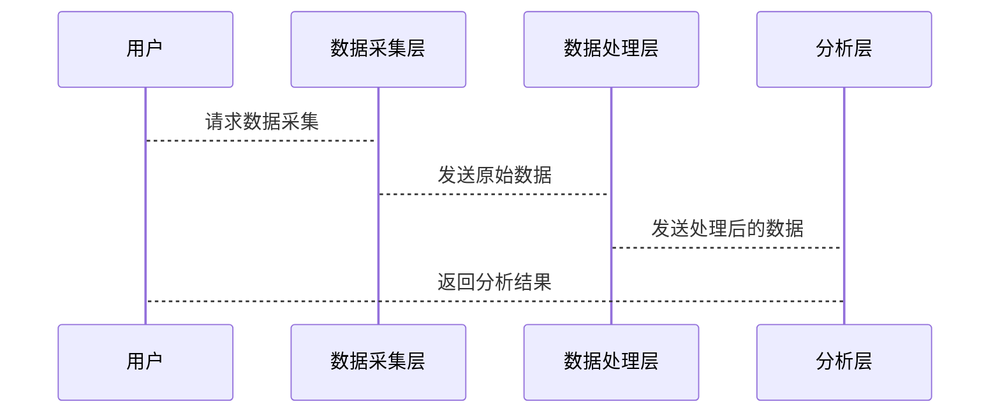

                 


```markdown
# 设计智能化的企业财务报表同行业对比分析系统

> 关键词：企业财务报表，同行业对比，智能化分析，机器学习，深度学习，大数据分析

> 摘要：本文详细介绍了设计智能化的企业财务报表同行业对比分析系统的过程。首先，我们从传统财务报表分析的局限性入手，探讨了智能化分析的必要性。接着，我们介绍了系统的整体架构，包括数据采集与预处理、智能化分析模型的设计与实现。最后，通过实际案例分析，展示了系统的应用场景和实际效果。本文还提供了系统的开发步骤和代码实现，帮助读者更好地理解和应用这一系统。

---

# 第一部分: 智能化企业财务报表同行业对比分析系统背景介绍

## 第1章: 问题背景与描述

### 1.1 问题背景

#### 1.1.1 传统财务报表分析的局限性
传统的财务报表分析主要依赖人工操作，存在以下问题：
- 数据量大：企业财务报表数据种类繁多，人工分析效率低。
- 数据复杂：财务数据涉及多个维度，人工难以全面分析。
- 数据差异：同行业企业间的财务数据差异性大，人工对比耗时耗力。

#### 1.1.2 同行业对比分析的重要性
同行业对比分析是企业财务管理的重要手段，可以帮助企业发现自身的优势和劣势，优化经营策略。

#### 1.1.3 智能化分析的必要性
随着企业数据量的激增，传统的分析方法已无法满足需求，智能化分析成为必然选择。

### 1.2 问题描述

#### 1.2.1 财务报表数据的多样性与复杂性
财务报表数据包括资产负债表、利润表、现金流量表等，数据量大且复杂。

#### 1.2.2 同行业对比的标准化需求
同行业对比需要标准化的指标体系和统一的分析方法。

#### 1.2.3 智能化系统的建设目标
设计智能化的财务报表分析系统，实现自动化的数据采集、处理和分析。

## 第2章: 问题解决与系统边界

### 2.1 问题解决思路

#### 2.1.1 数据采集与处理方案
- 数据源选择：从企业数据库、公开财务报告等多渠道采集数据。
- 数据清洗流程：去除无效数据、填补缺失值、处理异常值。
- 数据标准化方法：将数据转换为统一格式，便于后续分析。

#### 2.1.2 智能化算法选择
- 选择适合的机器学习算法，如随机森林和K-means，用于分类和聚类分析。
- 使用深度学习模型，如神经网络，进行复杂模式识别。

#### 2.1.3 系统架构设计
- 分层架构：分为数据采集层、数据处理层、分析层和用户界面层。
- 微服务架构：各功能模块独立开发，便于扩展和维护。

### 2.2 系统边界与外延

#### 2.2.1 系统功能边界
- 数据采集与预处理：包括数据清洗、转换和标准化。
- 智能化分析：包括分类、聚类和回归分析。
- 用户界面：提供数据可视化和分析结果展示。

#### 2.2.2 系统数据边界
- 数据来源：企业内部数据库、公开财务报告。
- 数据格式：结构化数据和非结构化数据。

#### 2.2.3 系统用户边界
- 主要用户：企业财务人员、管理层。
- 次要用户：企业审计人员、外部投资者。

## 第3章: 核心概念与系统组成

### 3.1 核心概念

#### 3.1.1 财务报表数据
- 资产负债表：记录企业的资产、负债和所有者权益。
- 利润表：记录企业的收入、成本和利润。
- 现金流量表：记录企业的现金流入和流出情况。

#### 3.1.2 同行业对比分析
- 行业基准：同行业企业的平均值或最佳实践。
- 绩效评估：通过对比分析，评估企业的财务状况。

#### 3.1.3 智能化分析模型
- 机器学习模型：用于分类、聚类和预测。
- 深度学习模型：用于复杂模式识别和非线性分析。

### 3.2 核心概念联系

#### 3.2.1 核心概念属性对比表

| 概念       | 属性1：数据类型 | 属性2：分析目标 | 属性3：应用场景 |
|------------|----------------|-----------------|----------------|
| 财务报表数据 | 结构化数据      | 财务状况分析    | 企业内部管理   |
| 对比分析    | 对比分析        | 绩效评估        | 行业基准制定   |
| 智能化模型  | 机器学习模型    | 预测与分类      | 自动化分析     |

#### 3.2.2 ER实体关系图

```mermaid
erd
    图表
        实体1：企业
        实体2：财务报表
        实体3：行业
        实体4：分析结果

        关系：企业拥有财务报表，财务报表属于行业，行业生成分析结果。
```

---

# 第二部分: 核心概念与系统架构

## 第4章: 核心概念原理

### 4.1 数据采集与预处理

#### 4.1.1 数据源选择
- 企业内部数据库：ERP系统、财务管理系统。
- 第三方数据源：同行业公开财务报告、行业数据库。

#### 4.1.2 数据清洗流程
1. 去除重复数据。
2. 处理缺失值：使用均值、中位数填充。
3. 去除异常值：基于统计方法或机器学习方法。

#### 4.1.3 数据标准化方法
- 标准差标准化：$(x - \mu)/\sigma$
- 最小-最大标准化：$(x - \text{min})/(\text{max} - \text{min})$

### 4.2 智能化分析模型

#### 4.2.1 机器学习算法选择
- 随机森林：用于分类和回归。
- K-means：用于聚类分析。

#### 4.2.2 深度学习模型应用
- 神经网络：用于复杂模式识别。
- LSTM：用于时间序列分析。

#### 4.2.3 混合模型的优势
- 综合多种算法的优势，提升准确率和泛化能力。

## 第5章: 算法原理与实现

### 5.1 算法原理

#### 5.1.1 机器学习分类算法
- 随机森林：基于决策树的集成学习方法。
- SVM：支持向量机，适用于高维数据分类。

#### 5.1.2 聚类算法
- K-means：基于距离的聚类方法。
- DBSCAN：基于密度的聚类方法。

#### 5.1.3 回归分析
- 线性回归：用于预测连续型变量。
- Lasso回归：用于特征选择和降维。

### 5.2 算法实现流程图



### 5.3 算法实现代码示例

#### 5.3.1 随机森林分类代码

```python
from sklearn.ensemble import RandomForestClassifier
from sklearn.model_selection import train_test_split
from sklearn.metrics import accuracy_score

# 加载数据
data = ... # 数据集

# 分割数据
X = data.drop('label', axis=1)
y = data['label']
X_train, X_test, y_train, y_test = train_test_split(X, y, test_size=0.2)

# 训练模型
model = RandomForestClassifier(n_estimators=100)
model.fit(X_train, y_train)

# 预测结果
y_pred = model.predict(X_test)

# 评估准确率
print("Accuracy:", accuracy_score(y_test, y_pred))
```

#### 5.3.2 K-means聚类代码

```python
from sklearn.cluster import KMeans
from sklearn.metrics import silhouette_score

# 加载数据
data = ... # 数据集

# 聚类
model = KMeans(n_clusters=3)
model.fit(data)

# 计算轮廓系数
score = silhouette_score(data, model.labels_)
print("Silhouette Score:", score)
```

### 5.4 数学模型和公式

#### 5.4.1 随机森林分类模型
随机森林通过集成多个决策树投票结果进行分类，公式如下：
$$
\text{预测类别} = \text{多数决策树的预测结果}
$$

#### 5.4.2 K-means聚类模型
K-means算法通过最小化平方误差进行聚类，公式如下：
$$
\text{目标函数} = \sum_{i=1}^{k} \sum_{j=1}^{n_i} (x_j - \mu_i)^2
$$

---

# 第三部分: 系统分析与架构设计方案

## 第6章: 问题场景介绍

### 6.1 项目介绍

#### 6.1.1 项目目标
设计一个智能化的企业财务报表同行业对比分析系统，实现自动化的数据采集、处理和分析。

#### 6.1.2 项目范围
- 数据采集：企业内部数据库、公开财务报告。
- 数据分析：同行业对比、财务指标分析。
- 用户界面：数据可视化、分析结果展示。

## 第7章: 系统功能设计

### 7.1 领域模型设计



### 7.2 系统架构设计


## 第8章: 系统接口设计

### 8.1 系统接口

#### 8.1.1 数据采集接口
```http
GET /api/data/collection
POST /api/data/process
```

#### 8.1.2 数据分析接口
```http
POST /api/analysis/classification
POST /api/analysis/clustering
```

### 8.2 系统交互流程图



---

# 第四部分: 项目实战

## 第9章: 环境安装与配置

### 9.1 环境要求
- 操作系统：Windows/Mac/Linux
- Python版本：3.6+
- 安装依赖：scikit-learn、pandas、numpy

### 9.2 安装步骤
```bash
pip install scikit-learn
pip install pandas
pip install numpy
```

## 第10章: 核心代码实现

### 10.1 数据采集与预处理代码

```python
import pandas as pd
import numpy as np

# 数据加载
data = pd.read_csv('financial_data.csv')

# 数据清洗
data = data.dropna()
data = data.drop_duplicates()

# 数据标准化
from sklearn.preprocessing import StandardScaler

scaler = StandardScaler()
data_scaled = scaler.fit_transform(data)
```

### 10.2 智能化分析模型实现

```python
from sklearn.ensemble import RandomForestClassifier
from sklearn.metrics import accuracy_score

# 模型训练
model = RandomForestClassifier(n_estimators=100)
model.fit(X_train, y_train)

# 模型预测
y_pred = model.predict(X_test)
print("Accuracy:", accuracy_score(y_test, y_pred))
```

## 第11章: 案例分析与解读

### 11.1 案例分析
以某行业为例，分析企业的财务报表，生成对比分析报告。

### 11.2 代码应用解读
- 数据采集：从企业数据库中获取财务数据。
- 数据处理：清洗和标准化数据。
- 模型训练：训练随机森林分类模型。
- 模型评估：评估模型的准确率。

## 第12章: 项目小结

### 12.1 项目总结
智能化的企业财务报表同行业对比分析系统能够显著提高分析效率，帮助企业更好地进行财务决策。

### 12.2 注意事项
- 数据质量和完整性直接影响分析结果。
- 算法选择需根据具体场景调整参数。
- 系统的可扩展性和维护性需在设计阶段考虑。

---

# 第五部分: 最佳实践与总结

## 第13章: 最佳实践 tips

### 13.1 技术建议
- 使用分布式计算框架（如Spark）处理大规模数据。
- 采用自动化机器学习平台（如AutoML）优化模型。

### 13.2 实践建议
- 定期更新模型，适应数据变化。
- 结合领域知识，优化特征工程。

## 第14章: 小结与展望

### 14.1 小结
本文详细介绍了设计智能化的企业财务报表同行业对比分析系统的过程，包括系统架构、算法选择和项目实战。

### 14.2 注意事项
- 系统设计需结合企业实际需求。
- 数据隐私和安全需高度重视。
- 系统的易用性和用户体验需持续优化。

### 14.3 未来展望
随着人工智能技术的发展，智能化财务分析系统将更加智能化和自动化。

---

# 作者信息

作者：AI天才研究院/AI Genius Institute & 禅与计算机程序设计艺术/Zen And The Art of Computer Programming
```

