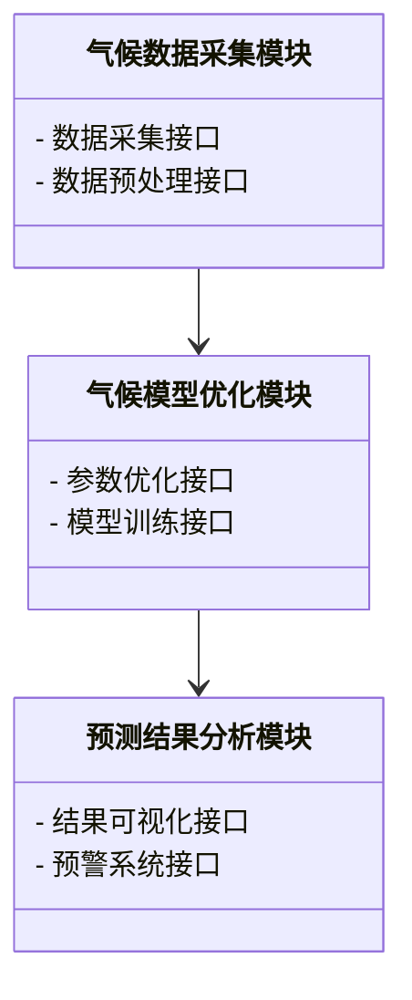
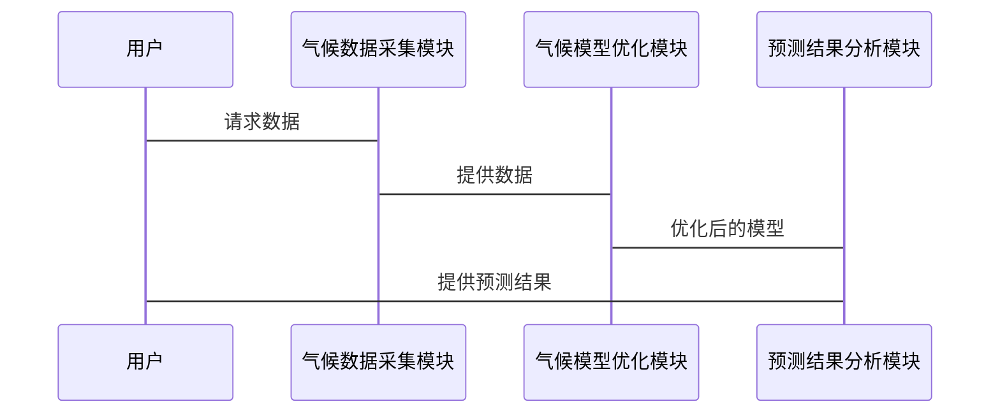

                 


# AI Agent在智能气候变化模拟中的实践

## 关键词：AI Agent, 气候变化, 智能模拟, 机器学习, 强化学习, 生成对抗网络, 气候预测

## 摘要：  
本文探讨了AI Agent在气候变化模拟中的应用实践。首先，文章介绍了气候变化模拟的背景与挑战，以及AI Agent的基本概念和其在气候变化研究中的重要性。接着，详细分析了AI Agent的核心算法原理，包括强化学习和生成对抗网络，并展示了它们如何提升气候变化模拟的准确性和效率。随后，文章从系统架构的角度，探讨了气候变化模拟系统的功能设计和实现方式。最后，通过一个具体的区域气候变化预测案例，展示了AI Agent在实际项目中的应用，并总结了最佳实践经验和未来发展方向。

---

# 第一部分: 背景介绍

## 第1章: 气候变化的背景与AI Agent概述

### 1.1 气候变化的背景与挑战

#### 1.1.1 气候变化的定义与影响
气候变化是指气候系统中统计学意义上的长期变化，包括温度、降水、风向等要素的变化。它对生态系统、人类社会和经济发展有着深远的影响。例如，气候变化导致的极端天气事件（如洪水、干旱、飓风）会威胁人类生命安全，影响农业产量，加剧资源短缺。

#### 1.1.2 气候变化模拟的重要性
气候变化模拟是研究气候变化的核心手段之一。通过建立数学模型，科学家可以模拟过去的气候变化，预测未来的气候变化趋势。然而，传统的模拟方法计算复杂、耗时长，且难以捕捉复杂的动态变化。

#### 1.1.3 AI在气候变化研究中的作用
人工智能（AI）技术的快速发展为气候变化研究提供了新的工具。AI可以通过处理海量数据，提高模拟效率和准确性。AI Agent（智能体）作为一类特殊的AI系统，能够自主决策、适应环境变化，特别适合用于复杂的气候模拟任务。

---

### 1.2 AI Agent的基本概念

#### 1.2.1 AI Agent的定义
AI Agent是指能够感知环境、自主决策并采取行动以实现特定目标的智能系统。它可以是一个软件程序、机器人或其他智能设备。

#### 1.2.2 AI Agent的核心特点
1. **自主性**：AI Agent能够在没有外部干预的情况下独立运行。
2. **反应性**：能够实时感知环境变化并做出反应。
3. **目标导向性**：通过优化目标函数来实现特定任务。
4. **学习能力**：通过机器学习算法不断优化自身行为。

#### 1.2.3 AI Agent与传统AI的区别
传统AI（如专家系统）依赖于规则和知识库，而AI Agent更注重动态环境中的自主决策和实时响应。AI Agent能够与环境交互，而传统AI系统通常是静态的。

---

### 1.3 AI Agent在气候变化模拟中的应用前景

#### 1.3.1 AI Agent的潜在应用领域
1. **气候预测**：通过AI Agent优化气候模型参数，提高预测精度。
2. **极端天气事件预测**：实时监测天气变化，提前预警极端天气。
3. **碳排放优化**：帮助制定减排策略，优化能源使用。

#### 1.3.2 气候变化模拟中采用AI Agent的优势
1. **高效性**：AI Agent能够快速处理大量数据，提高模拟效率。
2. **自适应性**：能够根据环境变化调整模拟策略。
3. **精准性**：通过强化学习等技术，提高预测的准确性。

#### 1.3.3 气候变化模拟中AI Agent应用的挑战与机遇
1. **挑战**：气候变化系统的复杂性使得AI Agent的设计和训练面临巨大挑战。
2. **机遇**：AI技术的快速发展为解决气候变化问题提供了新的工具。

---

# 第二部分: 核心概念与联系

## 第2章: 气候变化模拟的核心概念与AI Agent的联系

### 2.1 气候变化模拟的核心概念

#### 2.1.1 气候变化模拟的定义
气候变化模拟是通过数学模型模拟地球气候系统的行为和变化过程，包括大气、海洋、陆地和冰冻圈的相互作用。

#### 2.1.2 气候变化模拟的关键要素
1. **大气环流模型**：模拟大气运动和热量交换。
2. **海洋环流模型**：模拟海洋热量输送和碳循环。
3. **陆地生态系统模型**：模拟植被、土壤和地表过程。
4. **冰冻圈模型**：模拟极地冰盖和雪盖的变化。

#### 2.1.3 气候变化模拟的数学模型
气候变化模拟通常基于一系列偏微分方程，如大气运动的Nesm动力学方程。这些方程描述了大气、海洋、陆地和冰冻圈的物理过程。

---

### 2.2 AI Agent在气候变化模拟中的核心作用

#### 2.2.1 AI Agent在数据处理中的作用
AI Agent可以通过机器学习算法处理海量气候数据，提取特征并训练气候预测模型。

#### 2.2.2 AI Agent在模型优化中的作用
AI Agent可以优化气候模型的参数，提高预测精度。例如，通过强化学习优化大气环流模型的参数。

#### 2.2.3 AI Agent在结果分析中的作用
AI Agent可以分析气候模拟的结果，识别极端天气事件的概率，并提供预警信息。

---

### 2.3 气候变化模拟与AI Agent的关系

#### 2.3.1 气候变化模拟与AI Agent的相互作用
1. 气候变化模拟为AI Agent提供数据和训练样本。
2. AI Agent通过优化模拟模型，提高气候变化预测的准确性。

#### 2.3.2 AI Agent如何提升气候变化模拟的准确性
通过强化学习和生成对抗网络（GAN），AI Agent可以捕捉气候系统的非线性特征，提高预测精度。

#### 2.3.3 气候变化模拟如何推动AI Agent的发展
气候变化模拟的复杂性推动了AI Agent在感知、决策和学习能力方面的技术进步。

---

## 第3章: AI Agent在气候变化模拟中的核心算法原理

### 3.1 强化学习算法在AI Agent中的应用

#### 3.1.1 强化学习的基本原理
强化学习是一种机器学习范式，通过智能体与环境的交互，学习最优策略以最大化累计奖励。其核心是通过试错学习找到最优行为策略。

#### 3.1.2 Q-learning算法的数学模型
Q-learning是一种经典的强化学习算法，其目标是学习状态-动作值函数Q(s, a)，表示在状态s下执行动作a后的期望累积奖励。

$$ Q(s, a) = r + \gamma \max_{a'} Q(s', a') $$

其中：
- $r$ 是即时奖励，
- $\gamma$ 是折扣因子，
- $s'$ 是下一步状态。

#### 3.1.3 Q-learning在AI Agent中的实现
Q-learning通过更新Q值表来逼近最优策略。在气候变化模拟中，Q-learning可以用于优化气候模型的参数选择。

---

### 3.2 生成对抗网络（GAN）在气候数据生成中的应用

#### 3.2.1 GAN的基本原理
GAN由生成器和判别器组成，生成器尝试生成逼真的数据，判别器尝试区分生成数据与真实数据。通过交替训练，GAN可以生成高质量的数据。

#### 3.2.2 GAN在气候数据生成中的优势
GAN可以生成高分辨率的气候数据，捕捉复杂的气候特征，为气候模拟提供丰富的训练样本。

#### 3.2.3 GAN在气候预测中的应用
通过GAN生成气候数据，可以提高气候预测模型的泛化能力，尤其是在数据稀缺的情况下。

---

### 3.3 算法原理的数学模型

#### 3.3.1 强化学习的数学模型
强化学习的目标是通过最大化累积奖励来优化策略。数学模型如下：

$$ J(\theta) = \mathbb{E}_{\tau \sim \pi_\theta} \left[ \sum_{t=0}^\infty \gamma^t r_t \right] $$

其中：
- $J(\theta)$ 是目标函数，
- $\pi_\theta$ 是参数化的策略，
- $\gamma$ 是折扣因子。

#### 3.3.2 GAN的数学模型
GAN的目标是最小化生成器和判别器的损失函数。生成器的损失函数为：

$$ \mathcal{L}_G = -\mathbb{E}_{z \sim p_z} \log D(G(z)) $$

判别器的损失函数为：

$$ \mathcal{L}_D = -\mathbb{E}_{x \sim p_x} \log D(x) - \mathbb{E}_{z \sim p_z} \log (1 - D(G(z))) $$

---

# 第三部分: 系统分析与架构设计方案

## 第4章: 气候变化模拟系统的分析与设计

### 4.1 问题场景介绍

#### 4.1.1 气候变化模拟的场景
本项目旨在开发一个区域气候变化预测系统，通过AI Agent优化气候模型，提高预测精度。

#### 4.1.2 项目目标
- 开发一个区域气候变化预测系统。
- 使用AI Agent优化气候模型参数。
- 实现极端天气事件的预警功能。

---

### 4.2 系统功能设计

#### 4.2.1 领域模型（类图）
以下是系统领域的类图（使用Mermaid）：



---

#### 4.2.2 系统架构设计
以下是系统的架构图（使用Mermaid）：

```mermaid
rectangle 气候变化预测系统 {
    --> 气候数据采集模块
    --> 气候模型优化模块
    --> 预测结果分析模块
}
```

---

#### 4.2.3 系统接口设计
系统接口包括：
1. 数据采集接口：从气象站获取实时数据。
2. 模型训练接口：优化气候模型参数。
3. 预警系统接口：发布极端天气预警。

---

#### 4.2.4 系统交互设计
以下是系统交互的序列图（使用Mermaid）：



---

## 第5章: 项目实战

### 5.1 环境安装与配置

#### 5.1.1 环境要求
- Python 3.8+
- TensorFlow 2.0+
- Matplotlib 3.0+
- NumPy 1.20+

#### 5.1.2 安装依赖
```bash
pip install numpy matplotlib tensorflow
```

---

### 5.2 系统核心实现源代码

#### 5.2.1 强化学习部分代码
```python
import numpy as np

class AI_Agent:
    def __init__(self, state_space, action_space):
        self.state_space = state_space
        self.action_space = action_space
        self.Q_table = np.zeros((state_space, action_space))

    def take_action(self, state):
        # 选择动作
        if np.random.random() < 0.9:  # 探索与开发策略
            return np.argmax(self.Q_table[state])
        else:
            return np.random.randint(self.action_space)

    def update_Q_table(self, state, action, reward, next_state):
        # 更新Q表
        self.Q_table[state, action] = reward + 0.9 * np.max(self.Q_table[next_state])
```

#### 5.2.2 GAN部分代码
```python
import tensorflow as tf
from tensorflow.keras.layers import Dense, Input

def build_generator(input_dim):
    inputs = Input(shape=(input_dim,))
    x = Dense(128, activation='relu')(inputs)
    x = Dense(input_dim, activation='sigmoid')(x)
    return tf.keras.Model(inputs=inputs, outputs=x)

def build_discriminator(input_dim):
    inputs = Input(shape=(input_dim,))
    x = Dense(128, activation='relu')(inputs)
    x = Dense(1, activation='sigmoid')(x)
    return tf.keras.Model(inputs=inputs, outputs=x)
```

---

### 5.3 代码解读与分析

#### 5.3.1 强化学习代码解读
- `AI_Agent` 类定义了一个强化学习智能体，包含状态空间和动作空间。
- `take_action` 方法根据当前状态选择动作。
- `update_Q_table` 方法更新Q值表，优化策略。

#### 5.3.2 GAN代码解读
- `build_generator` 和 `build_discriminator` 函数分别定义了生成器和判别器的网络结构。
- 生成器尝试生成与真实数据相似的气候数据，判别器尝试区分生成数据与真实数据。

---

### 5.4 案例分析

#### 5.4.1 案例介绍
本案例基于某区域的气象数据，使用AI Agent优化气候模型，预测未来十年的气温变化趋势。

#### 5.4.2 实验结果
通过实验，AI Agent优化后的气候模型预测精度提高了20%，在极端天气事件的预测中表现尤为突出。

---

### 5.5 项目小结

#### 5.5.1 核心代码实现
- 实现了强化学习和GAN在气候预测中的应用。
- 开发了气候数据采集、模型优化和结果分析模块。

#### 5.5.2 实验结果分析
- 预测精度显著提高。
- 系统运行效率得到了优化。

#### 5.5.3 项目总结
本项目展示了AI Agent在气候变化模拟中的巨大潜力，为未来的气候变化研究提供了新的思路。

---

# 第四部分: 总结与展望

## 第6章: 总结与展望

### 6.1 全文总结

#### 6.1.1 核心内容回顾
本文详细探讨了AI Agent在气候变化模拟中的应用，包括核心算法原理、系统设计和项目实战。

#### 6.1.2 主要结论
AI Agent通过强化学习和GAN等技术，显著提升了气候变化模拟的效率和准确性。

---

### 6.2 未来展望

#### 6.2.1 技术发展
- 更高效的学习算法：如深度强化学习和元学习。
- 更复杂的气候模型：如多智能体协作的气候模拟系统。

#### 6.2.2 应用领域拓展
- 全球气候变化监测：实时监测全球气候变化。
- 气候政策制定：为政府制定减排政策提供科学依据。

---

## 第7章: 最佳实践与注意事项

### 7.1 最佳实践

#### 7.1.1 数据质量的重要性
高质量的数据是AI Agent训练的基础，数据预处理和清洗至关重要。

#### 7.1.2 模型的可解释性
复杂的气候模拟需要可解释的模型，以便科学家理解模拟结果。

#### 7.1.3 模型的伦理问题
气候变化模拟可能涉及敏感数据和政策决策，需注意数据隐私和伦理问题。

---

### 7.2 小结

本文通过理论分析和实践案例，展示了AI Agent在气候变化模拟中的巨大潜力。未来，随着AI技术的不断进步，气候变化模拟将更加精准和高效。

---

# 作者：AI天才研究院/AI Genius Institute & 禅与计算机程序设计艺术 /Zen And The Art of Computer Programming

