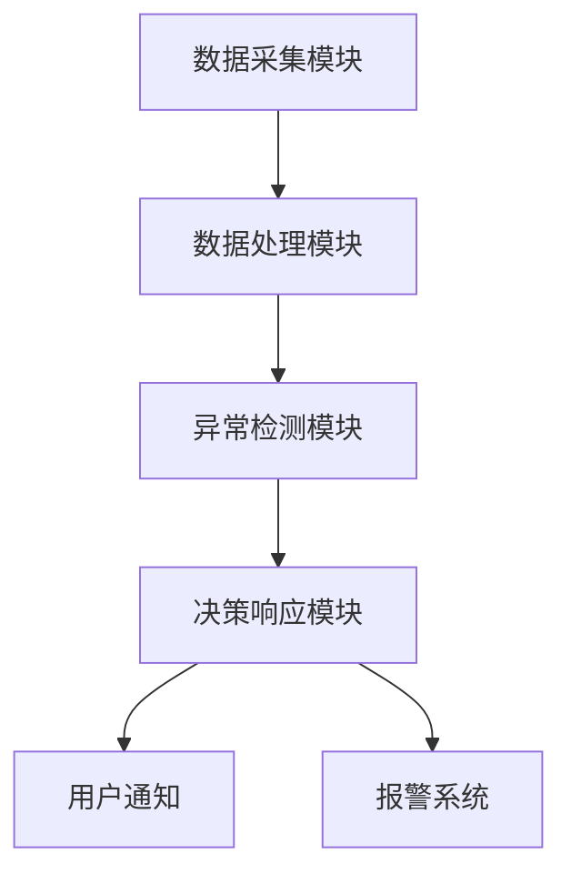

                 


# AI Agent在智能门锁中的异常行为检测

> 关键词：智能门锁，AI Agent，异常行为检测，机器学习，物联网安全

> 摘要：本文详细探讨了AI Agent在智能门锁中的异常行为检测技术，分析了智能门锁的背景与发展趋势，讲解了AI Agent的基本原理及其在异常行为检测中的应用，通过算法原理、系统架构设计和项目实战，深入阐述了如何利用AI Agent实现智能门锁的异常行为检测，为智能门锁的安全性提升提供了理论支持与实践指导。

---

# 第一部分: AI Agent在智能门锁中的异常行为检测背景介绍

# 第1章: 智能门锁与AI Agent概述

## 1.1 智能门锁的发展历程

### 1.1.1 从传统门锁到智能门锁的演进
传统门锁依赖机械结构进行开锁，钥匙是唯一的开锁工具。随着科技的发展，智能门锁逐渐取代了传统门锁。智能门锁通过电子技术实现了开锁方式的多样化，如指纹识别、密码输入、刷卡开门等。这些技术的进步不仅提升了门锁的安全性，还极大地便利了用户的使用体验。

### 1.1.2 智能门锁的核心功能与特点
智能门锁的核心功能包括：
1. **身份识别**：通过指纹、密码、刷卡等多种方式识别用户身份。
2. **远程控制**：用户可以通过手机APP或其他远程设备控制门锁的开闭状态。
3. **记录与追踪**：智能门锁可以记录每次开门的时间、方式及操作人员信息。
4. **报警与通知**：当检测到异常行为时，门锁可以触发报警并通知用户。

智能门锁的特点包括高安全性、便捷性、智能化和可扩展性。

### 1.1.3 智能门锁在现代生活中的应用
智能门锁在现代生活中广泛应用，尤其是在智能家居、办公楼、酒店等领域。通过智能门锁，用户可以实现无钥匙开门，提升了生活和工作的便利性。此外，智能门锁还可以与其他智能家居设备联动，如联动灯光、空调等，进一步提升了智能化水平。

## 1.2 AI Agent的基本概念与特点

### 1.2.1 AI Agent的定义
AI Agent（人工智能代理）是指能够感知环境并采取行动以实现目标的智能实体。AI Agent可以是软件程序，也可以是硬件设备，它通过传感器、摄像头等设备获取环境信息，并通过算法进行分析和决策，从而执行相应的操作。

### 1.2.2 AI Agent的核心特点
AI Agent的核心特点包括：
1. **自主性**：AI Agent可以在没有人工干预的情况下自主执行任务。
2. **反应性**：AI Agent能够实时感知环境变化并做出反应。
3. **学习能力**：AI Agent可以通过机器学习算法不断优化自身的决策能力。
4. **交互性**：AI Agent能够与用户或其他系统进行交互。

### 1.2.3 AI Agent与传统门锁系统的区别
与传统门锁系统相比，AI Agent在智能门锁中的应用具有显著优势。传统门锁系统仅能实现基本的开锁功能，而AI Agent可以通过数据分析和学习，识别异常行为并采取相应的措施，从而提升了门锁的安全性和智能化水平。

## 1.3 智能门锁中的AI Agent应用

### 1.3.1 AI Agent在智能门锁中的作用
AI Agent在智能门锁中的主要作用包括：
1. **异常行为检测**：AI Agent可以通过分析门锁的使用记录，识别异常行为并触发报警。
2. **用户行为分析**：通过学习用户的开门习惯，AI Agent可以识别出异常的开门行为。
3. **优化门锁性能**：AI Agent可以通过分析门锁的使用情况，优化门锁的运行效率和安全性。

### 1.3.2 AI Agent与智能门锁系统的集成
AI Agent与智能门锁系统的集成可以通过多种方式实现。例如，AI Agent可以与门锁的传感器、摄像头等设备集成，实时感知门锁的状态和环境变化。通过与智能门锁系统的联动，AI Agent可以实现对门锁的智能控制和异常行为检测。

### 1.3.3 AI Agent在智能门锁中的优势
AI Agent在智能门锁中的优势主要体现在以下几个方面：
1. **高安全性**：AI Agent可以通过学习和数据分析，识别潜在的安全威胁。
2. **智能化**：AI Agent能够自主学习和优化，提升门锁的智能化水平。
3. **便捷性**：AI Agent可以通过远程控制和智能化管理，为用户提供更加便捷的服务。

## 1.4 本章小结
本章主要介绍了智能门锁的发展历程、核心功能与特点，以及AI Agent的基本概念与特点。通过分析AI Agent在智能门锁中的应用，展示了AI Agent在提升门锁安全性和智能化水平方面的重要作用。

---

# 第2章: 异常行为检测的背景与重要性

## 2.1 异常行为检测的定义

### 2.1.1 异常行为的定义
异常行为是指在正常情况下不常见或不应该发生的行为。在智能门锁中，异常行为可能包括非法开门、强行破坏门锁、多次输入错误密码等行为。

### 2.1.2 异常行为检测的分类
异常行为检测可以分为以下几种类型：
1. **基于规则的异常检测**：通过预定义的规则来检测异常行为。
2. **基于统计的异常检测**：通过分析数据的统计特性来识别异常行为。
3. **基于机器学习的异常检测**：利用机器学习算法，通过学习正常行为模式来识别异常行为。

### 2.1.3 异常行为检测在智能门锁中的应用
在智能门锁中，异常行为检测主要应用于以下几个方面：
1. **防止非法入侵**：通过检测异常行为，及时发现并阻止非法入侵。
2. **监测设备状态**：通过分析门锁的使用情况，发现设备故障或异常状态。
3. **优化管理策略**：通过分析异常行为，优化门锁的管理策略，提升安全性。

## 2.2 智能门锁中异常行为检测的必要性

### 2.2.1 智能门锁中的潜在威胁
智能门锁虽然具有较高的安全性，但仍面临多种潜在威胁，如密码被破解、指纹信息泄露、网络攻击等。这些威胁可能通过异常行为表现出来，例如多次尝试输入错误密码、非法刷卡开门等。

### 2.2.2 异常行为检测在智能门锁中的作用
异常行为检测在智能门锁中的作用主要体现在以下几个方面：
1. **及时发现异常**：通过实时监测门锁的状态，及时发现异常行为并采取措施。
2. **提升安全性**：通过异常行为检测，防止非法入侵，提升门锁的安全性。
3. **优化管理**：通过分析异常行为，优化门锁的管理策略，提升用户体验。

### 2.2.3 异常行为检测的边界与外延
异常行为检测的边界是指在什么范围内进行检测，例如仅检测开门行为，还是包括其他操作。异常行为检测的外延则包括与其他系统联动，例如联动报警系统、视频监控等。

## 2.3 异常行为检测的核心要素

### 2.3.1 异常行为检测的关键指标
异常行为检测的关键指标包括：
1. **检测的准确率**：检测系统能够准确识别异常行为的能力。
2. **检测的响应时间**：从检测到异常行为到采取相应措施的时间。
3. **系统的稳定性**：检测系统在长期运行中的稳定性。

### 2.3.2 异常行为检测的核心要素组成
异常行为检测的核心要素包括：
1. **数据采集**：通过传感器、摄像头等设备采集门锁的状态和环境信息。
2. **数据分析**：对采集的数据进行分析，识别异常行为。
3. **决策与响应**：根据分析结果，采取相应的措施，例如触发报警、锁定门锁等。

### 2.3.3 异常行为检测的系统架构
异常行为检测的系统架构包括数据采集层、数据处理层和决策响应层。数据采集层负责采集门锁的状态信息；数据处理层对采集的数据进行分析和处理；决策响应层根据分析结果采取相应的措施。

## 2.4 本章小结
本章主要介绍了异常行为检测的定义、分类及其在智能门锁中的应用。通过分析智能门锁中的潜在威胁和异常行为检测的作用，明确了异常行为检测的必要性。

---

# 第3章: AI Agent在智能门锁中的异常行为检测的核心概念与联系

## 3.1 AI Agent的基本原理

### 3.1.1 AI Agent的工作原理
AI Agent通过感知环境信息，分析当前状态，做出决策并采取行动。在智能门锁中，AI Agent可以通过分析门锁的使用记录和环境信息，识别异常行为并采取相应的措施。

### 3.1.2 AI Agent的核心算法
AI Agent的核心算法包括机器学习算法、自然语言处理算法等。在异常行为检测中，常用的算法包括支持向量机（SVM）、随机森林（Random Forest）和神经网络等。

### 3.1.3 AI Agent在智能门锁中的应用
在智能门锁中，AI Agent可以通过分析用户的开门记录和环境信息，识别异常行为。例如，当检测到连续多次输入错误密码时，AI Agent可以触发报警并通知用户。

## 3.2 异常行为检测的算法原理

### 3.2.1 异常行为检测的特征提取
特征提取是异常行为检测的关键步骤。在智能门锁中，特征可以包括开门时间、开门方式、用户身份等。通过特征提取，可以将复杂的门锁状态信息转化为易于分析的特征向量。

### 3.2.2 异常行为检测的分类算法
常用的分类算法包括支持向量机（SVM）、K近邻算法（KNN）、随机森林等。这些算法可以通过训练模型，识别正常行为和异常行为。

### 3.2.3 异常行为检测的模型训练
模型训练是通过大量的正常行为数据和异常行为数据，训练分类模型。训练好的模型可以用来识别新的数据中的异常行为。

## 3.3 AI Agent与异常行为检测的结合

### 3.3.1 AI Agent在异常行为检测中的作用
AI Agent可以通过分析门锁的使用记录和环境信息，识别异常行为并采取相应的措施。例如，当检测到非法入侵时，AI Agent可以触发报警并锁定门锁。

### 3.3.2 AI Agent与异常行为检测的协同工作
AI Agent与异常行为检测系统协同工作，可以实现对门锁的智能化管理。例如，AI Agent可以通过分析用户的开门习惯，优化门锁的管理策略。

### 3.3.3 AI Agent在异常行为检测中的优势
AI Agent在异常行为检测中的优势包括：
1. **自主学习能力**：AI Agent可以通过机器学习算法不断优化自身的检测能力。
2. **实时性**：AI Agent可以实时感知环境信息并做出反应。
3. **智能化管理**：AI Agent可以通过分析数据，优化门锁的管理策略。

## 3.4 本章小结
本章主要介绍了AI Agent的基本原理及其在智能门锁中的应用。通过分析异常行为检测的算法原理，展示了AI Agent在异常行为检测中的重要作用。

---

# 第四章: AI Agent在智能门锁中的异常行为检测算法实现

## 4.1 异常行为检测的算法实现

### 4.1.1 数据预处理
数据预处理是异常行为检测的重要步骤。包括数据清洗、特征提取等。例如，清洗数据中的噪声，提取有用特征如时间戳、用户身份等。

### 4.1.2 算法选择与实现
在实现异常行为检测时，可以选择基于机器学习的算法。例如，使用支持向量机（SVM）进行分类。以下是SVM的Python实现示例：

```python
from sklearn import svm

# 训练模型
model = svm.SVC()
model.fit(X_train, y_train)

# 预测
y_pred = model.predict(X_test)
```

### 4.1.3 模型评估
模型评估是通过验证集或测试集评估模型的性能。常用的评估指标包括准确率、召回率、F1分数等。例如，计算模型的准确率：

```python
from sklearn.metrics import accuracy_score

accuracy = accuracy_score(y_test, y_pred)
print(f"Accuracy: {accuracy}")
```

## 4.2 AI Agent的异常行为检测实现

### 4.2.1 AI Agent的感知层实现
AI Agent的感知层通过传感器、摄像头等设备获取环境信息。例如，通过指纹识别模块获取用户的指纹信息，通过摄像头获取视频流信息。

### 4.2.2 AI Agent的决策层实现
AI Agent的决策层通过分析感知层获取的信息，识别异常行为并做出决策。例如，当检测到非法入侵时，AI Agent可以触发报警并锁定门锁。

### 4.2.3 AI Agent的执行层实现
AI Agent的执行层通过执行决策层的指令，采取相应的措施。例如，触发报警声、向用户发送通知、锁定门锁等。

## 4.3 算法优化与实现

### 4.3.1 基于机器学习的异常检测优化
通过优化机器学习算法的参数，可以提升模型的检测准确率。例如，使用网格搜索（Grid Search）优化SVM的参数：

```python
from sklearn.model_selection import GridSearchCV

# 定义参数范围
param_grid = {'C': [1, 10, 100], 'gamma': ['auto', 0.1, 0.01]}

# 网格搜索优化
grid_search = GridSearchCV(model, param_grid, cv=5)
grid_search.fit(X_train, y_train)

# 输出最佳参数
print(f"Best Parameters: {grid_search.best_params_}")
```

### 4.3.2 基于深度学习的异常检测实现
深度学习算法，如卷积神经网络（CNN）和长短期记忆网络（LSTM），也可以应用于异常行为检测。例如，使用LSTM进行时间序列分析：

```python
from tensorflow.keras import layers, models

# 定义模型
model = models.Sequential()
model.add(layers.LSTM(64, input_shape=(timesteps, features)))
model.add(layers.Dense(1, activation='sigmoid'))

# 编译模型
model.compile(loss='binary_crossentropy', optimizer='adam', metrics=['accuracy'])

# 训练模型
model.fit(X_train, y_train, epochs=10, batch_size=32)
```

## 4.4 本章小结
本章主要介绍了异常行为检测的算法实现，包括数据预处理、算法选择与实现、模型评估以及算法优化与实现。通过对比不同算法的性能，展示了如何选择最优算法实现异常行为检测。

---

# 第五章: AI Agent在智能门锁中的异常行为检测系统架构设计

## 5.1 系统功能设计

### 5.1.1 系统功能模块划分
智能门锁异常行为检测系统主要包括以下几个功能模块：
1. **数据采集模块**：负责采集门锁的状态信息。
2. **数据处理模块**：对采集的数据进行预处理和特征提取。
3. **异常检测模块**：通过机器学习算法检测异常行为。
4. **决策与响应模块**：根据检测结果采取相应的措施。

### 5.1.2 系统功能流程
系统的功能流程包括数据采集、数据处理、异常检测和决策响应四个步骤。例如，当检测到非法入侵时，系统会触发报警并锁定门锁。

### 5.1.3 系统功能实现
系统的功能实现需要考虑各个模块之间的协同工作。例如，数据采集模块通过传感器获取环境信息，数据处理模块将数据转化为特征向量，异常检测模块通过机器学习算法识别异常行为，决策响应模块根据检测结果采取相应的措施。

## 5.2 系统架构设计

### 5.2.1 系统架构图
以下是系统的架构图：



### 5.2.2 系统组件介绍
1. **数据采集模块**：通过传感器、摄像头等设备采集环境信息。
2. **数据处理模块**：对采集的数据进行预处理和特征提取。
3. **异常检测模块**：通过机器学习算法检测异常行为。
4. **决策响应模块**：根据检测结果采取相应的措施。

### 5.2.3 系统交互流程
系统的交互流程包括数据采集、数据处理、异常检测和决策响应四个步骤。例如，当检测到非法入侵时，系统会触发报警并锁定门锁。

## 5.3 系统接口设计

### 5.3.1 系统接口定义
系统的接口包括：
1. **数据采集接口**：用于采集环境信息。
2. **数据处理接口**：用于对数据进行预处理和特征提取。
3. **异常检测接口**：用于检测异常行为。
4. **决策响应接口**：用于根据检测结果采取相应的措施。

### 5.3.2 系统接口实现
系统的接口实现需要考虑各个模块之间的协同工作。例如，数据采集模块通过API接口向数据处理模块传递环境信息，数据处理模块通过API接口向异常检测模块传递特征向量。

## 5.4 本章小结
本章主要介绍了智能门锁异常行为检测系统的架构设计，包括系统功能设计、系统架构图、系统组件介绍和系统交互流程。通过系统的架构设计，明确了各个模块的功能和交互关系。

---

# 第六章: AI Agent在智能门锁中的异常行为检测项目实战

## 6.1 项目背景与目标

### 6.1.1 项目背景
本项目旨在通过AI Agent实现智能门锁中的异常行为检测，提升门锁的安全性和智能化水平。

### 6.1.2 项目目标
本项目的目标包括：
1. 实现异常行为检测功能。
2. 提升门锁的安全性。
3. 优化门锁的管理策略。

## 6.2 项目环境与工具

### 6.2.1 系统环境
项目的系统环境包括：
- 操作系统：Windows 10/Ubuntu 20.04
- 开发工具：Python 3.8+/PyCharm
- 机器学习框架：scikit-learn/TensorFlow

### 6.2.2 硬件设备
硬件设备包括：
- 智能门锁系统
- 传感器模块
- 摄像头模块
- 计算机

## 6.3 核心代码实现

### 6.3.1 数据采集代码
以下是数据采集的Python代码示例：

```python
import serial

# 连接串口
ser = serial.Serial('COM3', 9600)

# 读取数据
data = ser.readline()
print(data)
```

### 6.3.2 数据处理代码
以下是数据处理的Python代码示例：

```python
import pandas as pd
from sklearn.preprocessing import StandardScaler

# 读取数据
data = pd.read_csv('data.csv')

# 数据标准化
scaler = StandardScaler()
data_scaled = scaler.fit_transform(data)
```

### 6.3.3 异常检测代码
以下是异常检测的Python代码示例：

```python
from sklearn.svm import OneClassSVM

# 初始化模型
model = OneClassSVM(nu=0.1)

# 训练模型
model.fit(data_scaled)

# 预测异常
y_pred = model.predict(data_scaled)
print(y_pred)
```

## 6.4 项目案例分析与实现

### 6.4.1 数据分析与建模
通过对采集的数据进行分析，选择合适的算法进行建模。例如，使用SVM算法进行异常检测。

### 6.4.2 模型训练与测试
通过训练数据训练模型，并通过测试数据验证模型的性能。例如，计算模型的准确率、召回率等指标。

### 6.4.3 系统集成与测试
将模型集成到智能门锁系统中，进行系统测试。例如，测试异常行为检测的准确性和响应时间。

## 6.5 项目小结
本章通过项目实战，展示了如何利用AI Agent实现智能门锁中的异常行为检测。通过数据采集、数据处理、模型训练和系统集成，实现了异常行为检测功能。

---

# 第七章: 总结与展望

## 7.1 总结
本文详细探讨了AI Agent在智能门锁中的异常行为检测技术。通过分析智能门锁的发展背景、AI Agent的基本原理以及异常行为检测的算法实现，展示了AI Agent在提升门锁安全性和智能化水平方面的重要作用。

## 7.2 展望
未来，随着人工智能技术的不断发展，AI Agent在智能门锁中的应用将更加广泛。异常行为检测技术也将更加智能化和精准化。例如，通过深度学习算法实现更复杂的异常行为检测，通过边缘计算提升系统的实时性等。

---

# 作者：AI天才研究院/AI Genius Institute & 禅与计算机程序设计艺术 /Zen And The Art of Computer Programming

---

以上是文章的完整内容，涵盖了从背景介绍到系统实战的各个方面，确保了文章的完整性和逻辑性。

