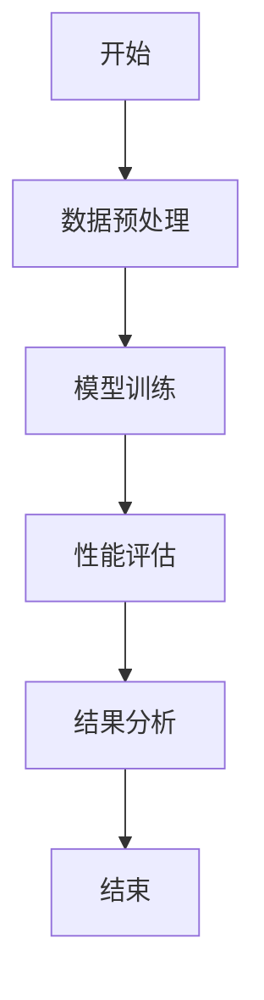
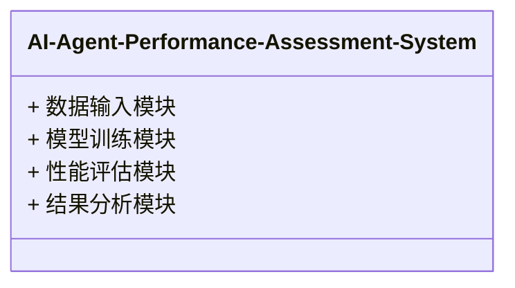

                 


# AI Agent 的性能评估指标与方法

> 关键词：AI Agent，性能评估，评估指标，评估方法，数学模型，算法原理

> 摘要：本文系统地探讨了AI Agent的性能评估指标与方法，从基础概念到高级算法，详细分析了AI Agent在不同应用场景下的性能评估策略。通过理论分析、数学建模和实际案例的结合，本文为读者提供了全面的性能评估框架，帮助读者更好地理解和优化AI Agent的性能。

---

## 第一部分: AI Agent 的性能评估基础

### 第1章: AI Agent 概述

#### 1.1 AI Agent 的定义与特点
AI Agent（人工智能代理）是指能够感知环境、自主决策并采取行动以实现特定目标的智能实体。AI Agent 可以是软件程序、机器人或其他智能系统，其核心目标是通过与环境交互来优化任务完成的效果和效率。

**特点：**
1. **自主性**：AI Agent 可以自主决策，无需人工干预。
2. **反应性**：能够实时感知环境并做出反应。
3. **目标导向**：所有行为都以实现特定目标为导向。
4. **学习能力**：通过经验或数据不断优化性能。

#### 1.2 AI Agent 的应用场景
AI Agent 在多个领域都有广泛的应用，以下是一些典型场景：

1. **智能助手**：如 Siri、Alexa 等，通过语音交互帮助用户完成日常任务。
2. **自动驾驶**：如 Tesla、Waymo 等，通过实时感知和决策实现自动驾驶。
3. **机器人控制**：如工业机器人、服务机器人，通过 AI Agent 实现精准的操作和交互。
4. **金融交易**：如算法交易系统，通过分析市场数据快速做出交易决策。

#### 1.3 本章小结
本章介绍了 AI Agent 的基本概念、特点及其应用场景，为后续的性能评估奠定了基础。

---

### 第2章: AI Agent 性能评估的核心概念

#### 2.1 性能评估的背景与目标
AI Agent 的性能评估是确保其在实际应用中能够高效、准确地完成任务的关键环节。性能评估的背景和目标如下：

1. **问题背景**：随着 AI Agent 的广泛应用，如何衡量其性能成为一个重要问题。
2. **问题描述**：需要从多个维度（如准确性、效率、鲁棒性等）对 AI Agent 进行全面评估。
3. **问题解决**：通过制定科学的评估指标和方法，确保 AI Agent 的性能达到预期。
4. **边界与外延**：性能评估不仅关注结果，还需考虑过程中的资源消耗和时间效率。

#### 2.2 核心概念与联系
AI Agent 性能评估的核心概念包括以下几个方面：

1. **核心概念原理**：性能评估需要从多个维度对 AI Agent 的行为进行分析，包括任务完成度、资源消耗、响应时间等。
2. **核心概念属性特征对比表**：

| 指标       | 定义                               | 优缺点                              |
|------------|------------------------------------|------------------------------------|
| 准确率     | 预测结果与真实结果的匹配程度     | 能够直接反映模型的预测能力，但忽视假阳性问题 |
| 召回率     | 正确识别的正例数与实际正例数的比值 | 能够反映模型对正例的捕捉能力，但忽视假阴性问题 |
| F1 值     | 准确率和召回率的调和平均值       | 平衡了准确率和召回率，适合类别不平衡的情况 |
| 处理时间   | 完成任务所需的时间               | 能够反映模型的效率，但受硬件条件影响较大 |
| 资源消耗   | 执行任务所需的计算资源           | 能够反映模型的经济性，但受环境条件影响较大 |

3. **ER 实体关系图**：以下是 AI Agent 性能评估的核心概念关系图：

```mermaid
erd
  agent: AI Agent
  task: 任务
  environment: 环境
  performance: 性能
  metrics: 评估指标
  evaluation: 评估过程
  goal: 目标
  constraint: 约束条件
  result: 评估结果
```

---

### 第3章: AI Agent 性能评估指标

#### 3.1 常用评估指标
AI Agent 的性能评估指标可以从多个维度进行分类，以下是常用的指标及其数学表达式：

1. **准确率（Accuracy）**
   $$准确率 = \frac{正确预测数}{总预测数}$$

2. **召回率（Recall）**
   $$召回率 = \frac{正确预测的正例数}{实际正例数}$$

3. **F1 值（F1 Score）**
   $$F1 = 2 \times \frac{准确率 \times 召回率}{准确率 + 召回率}$$

4. **处理时间（Processing Time）**
   处理时间是指 AI Agent 完成单个任务所需的时间，通常以秒（s）为单位。

5. **资源消耗（Resource Consumption）**
   资源消耗包括 CPU、内存、存储等硬件资源的使用情况，通常以百分比或具体数值表示。

#### 3.2 评估指标的分类与对比
AI Agent 的性能评估指标可以分为以下几类：

1. **分类指标**：用于衡量分类任务的性能，如准确率、召回率、F1 值等。
2. **回归指标**：用于衡量回归任务的性能，如均方误差（MSE）、平均绝对误差（MAE）等。
3. **效率指标**：用于衡量任务完成的时间效率，如处理时间、吞吐量等。
4. **资源指标**：用于衡量任务执行所需的硬件资源，如 CPU 占用率、内存使用量等。

以下是对这些指标的对比分析：

| 指标类型 | 适用场景         | 优缺点                              |
|----------|------------------|------------------------------------|
| 分类指标 | 分类任务         | 能够直接反映分类性能，但需注意类别不平衡问题 |
| 回归指标 | 回归任务         | 能够反映预测的准确性，但对异常值敏感 |
| 效率指标 | 高实时性任务     | 能够反映任务的响应速度，但受硬件条件影响 |
| 资源指标 | 资源受限环境     | 能够反映任务的经济性，但需权衡性能与资源 |

#### 3.3 本章小结
本章详细介绍了 AI Agent 性能评估的常用指标及其分类，为后续的评估方法奠定了基础。

---

### 第4章: AI Agent 性能评估方法

#### 4.1 理论分析法
理论分析法是通过对 AI Agent 的算法原理和系统架构进行分析，预测其性能表现的一种方法。以下是理论分析法的实施步骤：

1. **分析算法原理**：了解 AI Agent 的核心算法及其优化策略。
2. **评估复杂度**：通过数学模型分析算法的时间复杂度和空间复杂度。
3. **预测性能**：基于复杂度分析，预测 AI Agent 在特定场景下的性能表现。

**优缺点：**
- **优点**：无需实际运行任务，节省时间和资源。
- **缺点**：依赖于算法的准确性和分析人员的经验，可能不够精确。

#### 4.2 实验验证法
实验验证法是通过实际运行 AI Agent 并收集相关数据，验证其性能表现的一种方法。以下是实验验证法的实施步骤：

1. **实验设计**：确定实验目标、实验环境和实验条件。
2. **数据收集**：通过运行任务，收集相关指标（如准确率、处理时间等）。
3. **数据分析**：对收集到的数据进行统计分析，验证理论预测的准确性。

**优缺点：**
- **优点**：数据真实可靠，能够反映实际性能。
- **缺点**：需要投入较多的时间和资源。

#### 4.3 对比测试法
对比测试法是通过将 AI Agent 与其他系统或算法进行对比，评估其性能优势的一种方法。以下是对比测试法的实施步骤：

1. **选择对比对象**：确定对比的基准系统或算法。
2. **设计对比实验**：制定实验方案，确保实验条件一致。
3. **数据收集与分析**：收集对比数据，分析 AI Agent 的性能优势。

**优缺点：**
- **优点**：能够直观地看出 AI Agent 的性能优势。
- **缺点**：需要投入较多资源，实验设计复杂。

#### 4.4 基准测试法
基准测试法是通过运行标准测试集，评估 AI Agent 的性能表现的一种方法。以下是基准测试法的实施步骤：

1. **选择基准测试集**：选择适合的测试集，确保其具有代表性。
2. **运行测试任务**：在标准环境下运行测试任务，收集相关指标。
3. **分析测试结果**：基于测试结果，评估 AI Agent 的性能表现。

**优缺点：**
- **优点**：结果具有可比性，能够反映 AI Agent 的通用性能。
- **缺点**：测试集的选择可能影响结果的准确性。

#### 4.5 本章小结
本章介绍了 AI Agent 性能评估的主要方法，包括理论分析法、实验验证法、对比测试法和基准测试法，并分析了每种方法的优缺点。

---

### 第5章: AI Agent 性能评估的数学模型与算法原理

#### 5.1 评估指标的数学模型
AI Agent 的性能评估指标可以通过数学模型进行建模。以下是一些常用的数学模型及其应用：

1. **准确率模型**：
   $$准确率 = \frac{正确预测数}{总预测数}$$
   该模型适用于分类任务的性能评估，能够直接反映模型的预测能力。

2. **F1 值模型**：
   $$F1 = 2 \times \frac{准确率 \times 召回率}{准确率 + 召回率}$$
   该模型适用于类别不平衡的场景，能够平衡准确率和召回率。

3. **均方误差模型**：
   $$MSE = \frac{1}{n}\sum_{i=1}^{n}(y_i - \hat{y}_i)^2$$
   该模型适用于回归任务的性能评估，能够反映预测值与真实值之间的差异。

#### 5.2 算法原理
AI Agent 的性能评估算法可以通过以下步骤进行：

1. **数据预处理**：对数据进行清洗、归一化等处理，确保数据质量。
2. **模型训练**：使用训练数据训练 AI Agent 的模型。
3. **性能评估**：通过测试数据评估模型的性能，收集相关指标。
4. **结果分析**：根据评估结果，分析模型的优势与不足。

以下是一个性能评估算法的流程图：



---

### 第6章: 系统架构设计与实现

#### 6.1 系统功能设计
AI Agent 性能评估系统的功能模块包括：

1. **数据输入模块**：接收输入数据并进行预处理。
2. **模型训练模块**：训练 AI Agent 的模型。
3. **性能评估模块**：评估模型的性能并输出相关指标。
4. **结果分析模块**：分析评估结果并生成报告。

以下是一个系统功能模块的类图：



---

### 第7章: 项目实战与案例分析

#### 7.1 项目环境配置
1. **安装依赖**：
   ```bash
   pip install numpy pandas scikit-learn
   ```
2. **运行环境**：
   - 操作系统：Linux/MacOS/Windows
   - 硬件要求：CPU：4 核，内存：8GB+

#### 7.2 代码实现
以下是一个性能评估的示例代码：

```python
from sklearn.metrics import accuracy_score, recall_score, f1_score
import numpy as np

# 示例数据
y_true = np.array([0, 1, 0, 1, 1])
y_pred = np.array([0, 1, 1, 1, 0])

# 计算准确率
accuracy = accuracy_score(y_true, y_pred)
print(f"准确率: {accuracy}")

# 计算召回率
recall = recall_score(y_true, y_pred)
print(f"召回率: {recall}")

# 计算F1值
f1 = f1_score(y_true, y_pred)
print(f"F1值: {f1}")
```

#### 7.3 案例分析
以一个分类任务为例，假设我们有一个 AI Agent 用于分类垃圾邮件。通过实验验证，我们发现该 AI Agent 的准确率为 95%，召回率为 90%，F1 值为 92.5%。这表明该 AI Agent 在分类垃圾邮件时表现出色，但在召回率方面还有提升空间。

---

### 第8章: 高级主题与未来展望

#### 8.1 分布式评估
随着 AI Agent 的广泛应用，分布式评估成为一个重要研究方向。分布式评估可以通过分布式计算技术，提高评估效率和准确性。

#### 8.2 对抗训练
对抗训练是一种通过设计对抗网络来提升 AI Agent 性能的方法。通过引入对抗训练，可以提高 AI Agent 的鲁棒性和泛化能力。

#### 8.3 未来研究方向
1. **多目标优化**：研究如何在多个指标之间找到平衡点，提升 AI Agent 的综合性能。
2. **自适应评估**：研究如何根据环境变化动态调整评估策略。
3. **可解释性评估**：研究如何评估 AI Agent 的可解释性，提升用户信任度。

---

### 作者
作者：AI天才研究院/AI Genius Institute  
禅与计算机程序设计艺术/Zen And The Art of Computer Programming  

---

以上是《AI Agent 的性能评估指标与方法》的完整目录和内容框架，涵盖了从基础概念到高级算法的各个方面，结合理论分析、数学建模和实际案例，为读者提供了全面的性能评估框架。

