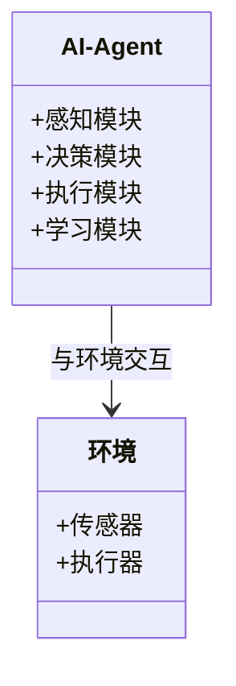
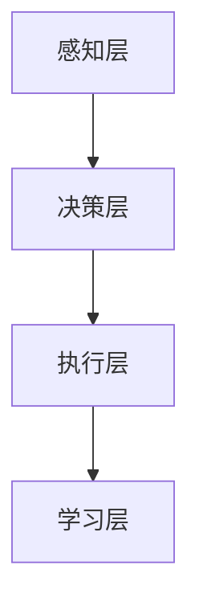
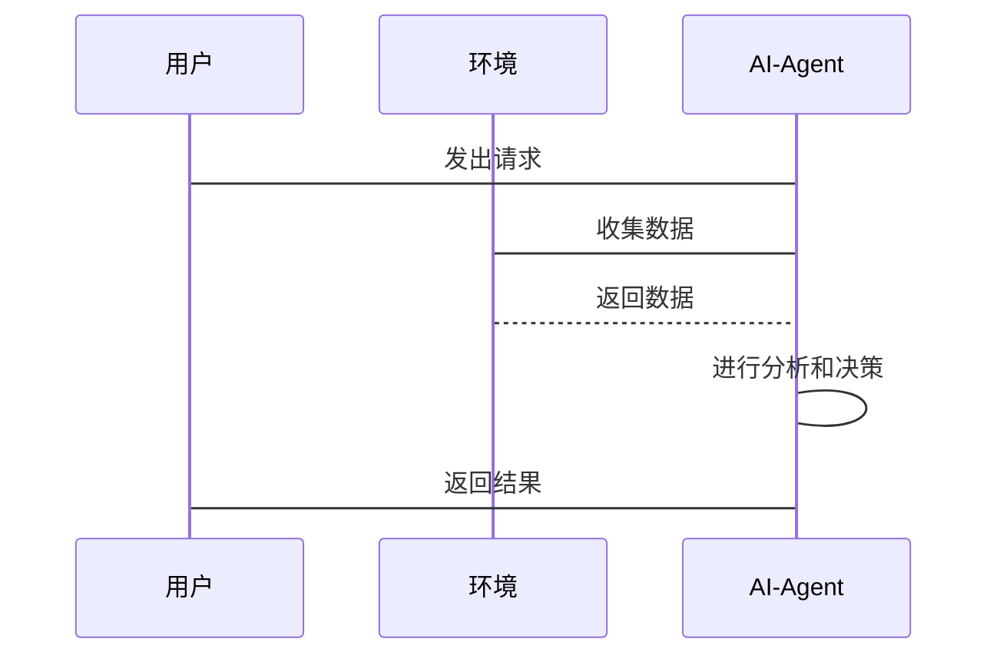

                 


# 《企业AI Agent的DevOps实践》

## 关键词：企业AI Agent，DevOps，自动化运维，智能系统开发，AI驱动运维

## 摘要：本文深入探讨了企业AI Agent与DevOps的结合，分析了AI Agent的核心概念与原理，详细讲解了基于强化学习的AI Agent算法，并通过系统架构设计与项目实战展示了如何在企业中高效开发与运维AI Agent。文章还总结了DevOps在AI Agent开发中的最佳实践，为读者提供了全面的技术指导。

---

# 第1章: 企业AI Agent的概述

## 1.1 AI Agent的基本概念

### 1.1.1 AI Agent的定义与特点
AI Agent（人工智能代理）是一种能够感知环境、自主决策并执行任务的智能实体。它通过传感器获取信息，利用算法进行分析和推理，从而做出最优决策并执行操作。AI Agent的特点包括智能性、自主性、反应性和社会性。

### 1.1.2 AI Agent的核心组成部分
AI Agent的核心组成部分包括：
1. **感知层**：负责获取环境中的数据，如传感器输入。
2. **决策层**：利用算法对数据进行分析和推理，生成决策。
3. **执行层**：根据决策结果执行具体操作，如发送指令或触发动作。
4. **学习层**：通过机器学习算法不断优化决策模型。

### 1.1.3 AI Agent在企业中的应用场景
AI Agent在企业中的应用场景包括：
- **自动化运维**：监控系统状态，自动修复问题。
- **智能客服**：通过自然语言处理与用户交互，提供智能支持。
- **供应链优化**：预测需求，优化库存管理。

## 1.2 DevOps的基本概念

### 1.2.1 DevOps的定义与特点
DevOps是一种结合开发（Development）与运维（Operations）的实践方法论，旨在通过自动化工具和流程提高软件开发和运维效率。其特点包括：
1. **自动化**：通过工具链实现CI/CD流程。
2. **协作性**：强调开发与运维团队的紧密合作。
3. **持续改进**：通过反馈循环不断优化系统。

### 1.2.2 DevOps的核心理念与实践
DevOps的核心理念包括：
- **文化**：强调团队协作、自动化和持续交付。
- **流程**：实现从代码提交到部署的自动化流程。
- **工具**：使用工具链如Jenkins、Docker等提高效率。

### 1.2.3 DevOps在企业中的应用价值
DevOps在企业中的应用价值包括：
- **提高效率**：缩短从代码提交到生产的周期。
- **提升质量**：通过自动化测试确保代码质量。
- **降低成本**：减少手动操作，降低运维成本。

## 1.3 企业AI Agent与DevOps的结合

### 1.3.1 AI Agent在企业中的需求
企业在数字化转型中需要AI Agent来实现自动化运维、智能决策和高效协作。

### 1.3.2 DevOps在AI Agent开发中的作用
DevOps通过自动化流程和协作模式，加速AI Agent的开发和部署。

### 1.3.3 企业AI Agent与DevOps的融合趋势
随着AI技术的快速发展，企业AI Agent与DevOps的结合将成为智能化运维的重要趋势。

## 1.4 本章小结
本章介绍了AI Agent和DevOps的基本概念，分析了它们在企业中的应用场景，并探讨了两者结合的重要性。

---

# 第2章: 企业AI Agent的背景与挑战

## 2.1 企业AI Agent的发展背景

### 2.1.1 AI技术的快速发展
AI技术的快速发展为企业AI Agent的应用提供了技术基础。

### 2.1.2 企业数字化转型的需求
企业数字化转型需要智能化的解决方案来提升效率和竞争力。

### 2.1.3 AI Agent在企业中的应用趋势
随着AI技术的成熟，AI Agent在企业中的应用将越来越广泛。

## 2.2 企业AI Agent开发的挑战

### 2.2.1 技术复杂性
AI Agent的开发涉及多个技术领域，技术复杂性较高。

### 2.2.2 数据隐私与安全问题
AI Agent需要处理大量数据，数据隐私和安全问题不容忽视。

### 2.2.3 与现有系统的集成难度
AI Agent需要与企业现有的系统无缝集成，面临技术兼容性和流程整合的挑战。

## 2.3 DevOps在AI Agent开发中的优势

### 2.3.1 提高开发效率
DevOps通过自动化流程提高开发效率，缩短开发周期。

### 2.3.2 保障代码质量
通过自动化测试和代码审查，DevOps能够保障代码质量。

### 2.3.3 促进团队协作
DevOps强调团队协作，促进开发与运维团队的紧密合作。

## 2.4 本章小结
本章分析了企业AI Agent的发展背景和开发挑战，探讨了DevOps在AI Agent开发中的优势。

---

# 第3章: 企业AI Agent的核心概念与原理

## 3.1 AI Agent的核心概念

### 3.1.1 AI Agent的智能决策机制
AI Agent通过感知环境、分析数据并做出决策，实现智能操作。

### 3.1.2 AI Agent的学习与自适应能力
AI Agent通过机器学习算法不断优化自身的决策模型。

### 3.1.3 AI Agent的通信与协作能力
AI Agent能够与其他系统和人员进行有效通信和协作。

## 3.2 DevOps的核心概念

### 3.2.1 CI/CD流程
CI/CD流程包括代码提交、构建、测试、部署等环节，确保代码的快速迭代和高质量交付。

### 3.2.2 微服务架构
微服务架构将系统分解为多个小型服务，每个服务独立开发和部署，提高系统的灵活性和可扩展性。

### 3.2.3 自动化运维
自动化运维通过工具链实现系统的监控、维护和优化，确保系统的稳定运行。

## 3.3 企业AI Agent与DevOps的融合

### 3.3.1 AI Agent的开发流程
AI Agent的开发流程包括需求分析、数据收集、模型训练、代码实现和测试部署。

### 3.3.2 DevOps在AI Agent开发中的应用
DevOps通过自动化流程和协作模式，加速AI Agent的开发和部署。

### 3.3.3 企业AI Agent与DevOps的协同作用
企业AI Agent与DevOps的结合能够实现智能化的运维和高效的开发流程。

## 3.4 本章小结
本章详细讲解了企业AI Agent和DevOps的核心概念，并分析了它们的协同作用。

---

# 第4章: 基于强化学习的AI Agent算法原理

## 4.1 强化学习的基本概念

### 4.1.1 强化学习的定义与特点
强化学习是一种通过试错学习的算法，通过与环境的交互获得奖励，优化决策策略。

### 4.1.2 强化学习的核心要素
强化学习的核心要素包括环境、动作、状态和奖励。

### 4.1.3 强化学习的应用场景
强化学习适用于需要复杂决策和策略优化的应用场景。

## 4.2 基于强化学习的AI Agent算法

### 4.2.1 Q-Learning算法
Q-Learning算法是一种经典的强化学习算法，通过维护Q表记录状态-动作对的期望奖励值。

- **算法流程**：
  1. 初始化Q表为零。
  2. 在每一步选择动作，计算新的状态。
  3. 更新Q表中的值，使其趋近于最大值。

- **数学公式**：
  $$ Q(s, a) = Q(s, a) + \alpha \times [r + \gamma \times \max Q(s', a') - Q(s, a)] $$
  其中，$\alpha$是学习率，$\gamma$是折扣因子。

### 4.2.2 算法实现
以下是一个简单的Q-Learning算法的Python实现示例：

```python
import numpy as np

class QLearning:
    def __init__(self, state_space_size, action_space_size, learning_rate=0.1, gamma=0.9):
        self.state_space_size = state_space_size
        self.action_space_size = action_space_size
        self.lr = learning_rate
        self.gamma = gamma
        self.Q = np.zeros((state_space_size, action_space_size))

    def choose_action(self, state, epsilon=0.1):
        if np.random.random() < epsilon:
            return np.random.randint(self.action_space_size)
        else:
            return np.argmax(self.Q[state])

    def update_Q(self, state, action, reward, next_state):
        target = reward + self.gamma * np.max(self.Q[next_state])
        self.Q[state][action] = self.Q[state][action] + self.lr * (target - self.Q[state][action])
```

## 4.3 算法优化与应用

### 4.3.1 算法优化
- **经验回放**：通过存储历史经验，减少样本偏差，提高算法的泛化能力。
- **网络结构**：使用深度神经网络替代传统的Q表，提高算法的表达能力。

### 4.3.2 算法应用
强化学习算法可以应用于游戏AI、机器人控制、资源分配等领域。

## 4.4 本章小结
本章详细讲解了基于强化学习的AI Agent算法，包括Q-Learning算法的实现和优化。

---

# 第5章: 企业AI Agent的系统分析与架构设计

## 5.1 系统功能设计

### 5.1.1 领域模型设计
领域模型描述了AI Agent的核心功能和数据流，包括数据采集、模型训练、决策执行等模块。



### 5.1.2 系统架构设计
系统架构设计采用分层架构，包括感知层、决策层、执行层和学习层。



### 5.1.3 系统交互设计
系统交互设计描述了AI Agent与外部系统和用户之间的交互流程。



## 5.2 系统架构实现

### 5.2.1 微服务架构设计
系统采用微服务架构，将AI Agent的功能模块化设计，每个模块独立部署和扩展。

### 5.2.2 DevOps工具链集成
通过Jenkins、Docker、Kubernetes等工具实现CI/CD流程，确保系统的高效开发和稳定运行。

### 5.2.3 监控与日志管理
通过Prometheus和Grafana实现系统监控，通过ELK实现日志管理，确保系统的可观察性和可维护性。

## 5.3 本章小结
本章详细讲解了企业AI Agent的系统分析与架构设计，包括功能设计、架构设计和系统交互设计。

---

# 第6章: 企业AI Agent的项目实战

## 6.1 项目环境安装

### 6.1.1 系统要求
- 操作系统：Linux/Windows/MacOS
- Python版本：3.6+
- 开发工具：Jupyter Notebook、PyCharm等
- 依赖库：numpy、pandas、scikit-learn、tensorflow等

### 6.1.2 安装步骤
1. 安装Python和pip。
2. 安装依赖库：`pip install numpy pandas scikit-learn tensorflow`.
3. 安装Jupyter Notebook：`pip install jupyter`.

## 6.2 核心代码实现

### 6.2.1 数据预处理
```python
import pandas as pd

# 加载数据集
data = pd.read_csv('dataset.csv')

# 数据清洗
data = data.dropna()
data = (data - data.mean()) / data.std()
```

### 6.2.2 模型训练
```python
from sklearn.model import LinearModel

# 创建模型
model = LinearModel()

# 训练模型
model.fit(X_train, y_train)

# 预测
y_pred = model.predict(X_test)
```

### 6.2.3 系统集成
```python
from flask import Flask
from flask_restful import Resource, Api

app = Flask(__name__)
api = Api(app)

class AIEndpoint(Resource):
    def get(self):
        # 获取输入
        input = request.args.get('input')
        # 调用AI模型
        result = model.predict(input)
        return {'result': result}

api.add_resource(AIEndpoint, '/ai')

if __name__ == '__main__':
    app.run(debug=True)
```

## 6.3 代码解读与分析

### 6.3.1 数据预处理代码解读
数据预处理代码实现了数据清洗和标准化，确保数据适合模型训练。

### 6.3.2 模型训练代码解读
模型训练代码使用了机器学习算法，实现了模型的训练和预测功能。

### 6.3.3 系统集成代码解读
系统集成代码实现了AI Agent的API接口，通过Flask框架提供RESTful服务。

## 6.4 案例分析与详细讲解

### 6.4.1 案例分析
以一个简单的智能客服系统为例，展示AI Agent在实际中的应用。

### 6.4.2 详细讲解
详细讲解了从数据预处理、模型训练到系统集成的整个过程，展示了如何通过DevOps方法实现AI Agent的高效开发和部署。

## 6.5 本章小结
本章通过项目实战展示了企业AI Agent的开发和部署过程，帮助读者掌握实际操作技能。

---

# 第7章: DevOps在企业AI Agent开发中的最佳实践

## 7.1 最佳实践

### 7.1.1 代码管理
- 使用版本控制工具如Git管理代码。
- 采用分支策略，确保代码的安全性和可追溯性。

### 7.1.2 自动化测试
- 编写单元测试和集成测试，确保代码质量。
- 使用测试框架如pytest自动化执行测试。

### 7.1.3 持续集成与交付
- 使用Jenkins、GitHub Actions等工具实现CI/CD流程。
- 通过自动化构建和部署确保代码的快速交付。

### 7.1.4 监控与日志管理
- 使用Prometheus和Grafana实现系统监控。
- 使用ELK实现日志管理，便于故障排查和性能优化。

## 7.2 小结

## 7.3 注意事项

## 7.4 拓展阅读

## 7.5 本章小结
本章总结了DevOps在企业AI Agent开发中的最佳实践，提供了实际应用中的注意事项和拓展阅读资料。

---

# 作者：AI天才研究院/AI Genius Institute & 禅与计算机程序设计艺术 /Zen And The Art of Computer Programming

---

以上是《企业AI Agent的DevOps实践》的技术博客文章的完整目录大纲和部分正文内容。希望对您有所帮助！

