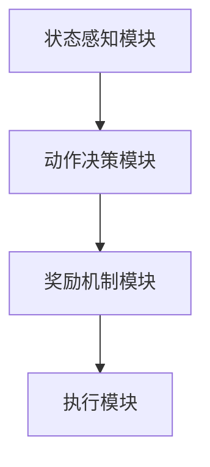

                 


# 企业AI Agent的强化学习在自动化交易策略中的应用

> 关键词：企业AI Agent，强化学习，自动化交易策略，深度强化学习，Q-learning，Deep Q-Networks

> 摘要：本文深入探讨了企业AI Agent在自动化交易策略中的应用，重点分析了强化学习在其中的关键作用。文章从AI Agent和强化学习的基本概念入手，详细讲解了强化学习的数学模型与算法原理，设计了基于强化学习的企业AI Agent系统架构，并通过实际案例展示了强化学习在自动化交易策略中的实现过程。最后，本文总结了强化学习在企业AI Agent应用中的优势与挑战，并提出了未来的发展方向。

---

# 第1章: AI Agent与强化学习概述

## 1.1 AI Agent的基本概念

### 1.1.1 AI Agent的定义与特点

AI Agent（人工智能代理）是指能够感知环境、自主决策并执行任务的智能实体。AI Agent的核心特点包括：

1. **自主性**：能够在没有外部干预的情况下独立运作。
2. **反应性**：能够根据环境变化实时调整行为。
3. **目标导向性**：具有明确的目标，并通过行为实现目标。
4. **学习能力**：能够通过经验改进性能。

AI Agent在企业中的应用非常广泛，例如自动化交易、智能客服、供应链优化等。

### 1.1.2 强化学习的基本原理

强化学习（Reinforcement Learning, RL）是一种机器学习范式，通过智能体与环境的交互，智能体通过试错学习来最大化累积奖励。强化学习的关键要素包括：

1. **状态（State）**：环境的当前情况。
2. **动作（Action）**：智能体在给定状态下的选择。
3. **奖励（Reward）**：智能体执行动作后获得的反馈。
4. **策略（Policy）**：决定智能体在特定状态下选择动作的规则。
5. **价值函数（Value Function）**：评估状态或动作的价值。

### 1.1.3 AI Agent在企业中的应用潜力

在企业环境中，AI Agent可以通过强化学习实现多种任务，例如：

- **自动化交易**：通过预测市场走势，优化交易策略。
- **供应链管理**：优化库存、物流和供应商选择。
- **客户服务**：通过智能对话系统提供个性化服务。
- **风险管理**：实时监控和应对潜在风险。

AI Agent的强化学习应用为企业带来了高效、智能的解决方案，能够显著提升企业的竞争力。

---

## 1.2 强化学习的核心概念

### 1.2.1 状态、动作、奖励的定义

在强化学习中，状态、动作和奖励是核心概念：

- **状态（State）**：环境的当前情况，例如市场数据、库存水平等。
- **动作（Action）**：智能体在给定状态下的选择，例如买入、卖出、增加库存等。
- **奖励（Reward）**：智能体执行动作后获得的反馈，通常是一个数值，表示行为的好坏。

### 1.2.2 Q-learning算法的基本原理

Q-learning是一种经典的强化学习算法，适用于离散动作空间的情况。其核心思想是通过Q表（Q-table）记录每个状态-动作对的期望奖励。

Q-learning的更新公式为：

$$ Q(s, a) = Q(s, a) + \alpha \left[ r + \gamma \max Q(s', a') - Q(s, a) \right] $$

其中：
- $\alpha$ 是学习率。
- $\gamma$ 是折扣因子。
- $s$ 是当前状态。
- $a$ 是当前动作。
- $s'$ 是下一个状态。
- $r$ 是奖励。

### 1.2.3 策略与价值函数的关系

- **策略（Policy）**：决定智能体在特定状态下选择动作的规则，可以用概率分布表示。
- **价值函数（Value Function）**：评估状态或动作的价值，分为状态值函数 $V(s)$ 和动作值函数 $Q(s, a)$。

---

## 1.3 企业AI Agent的强化学习框架

### 1.3.1 现有的强化学习框架介绍

常用的强化学习框架包括：

1. **OpenAI Gym**：提供丰富的环境和工具，支持多种强化学习算法。
2. **TensorFlow Agents**：基于TensorFlow的强化学习框架。
3. **PyTorch Lightning**：支持分布式训练的强化学习框架。

### 1.3.2 企业AI Agent的特殊需求

企业在应用AI Agent时，通常有以下特殊需求：

1. **实时性**：需要快速决策和响应。
2. **稳定性**：交易策略需要稳健，避免重大损失。
3. **可解释性**：需要理解智能体的决策过程。

### 1.3.3 强化学习在企业中的适用场景

- **自动化交易**：通过强化学习优化交易策略。
- **供应链优化**：通过强化学习优化库存管理和物流。
- **智能客服**：通过强化学习实现智能对话系统。

---

## 1.4 本章小结

本章介绍了AI Agent和强化学习的基本概念，并分析了强化学习在企业中的应用潜力。通过Q-learning算法的基本原理和企业AI Agent的特殊需求，为后续章节奠定了理论基础。

---

# 第2章: 强化学习的数学模型与算法原理

## 2.1 Q-learning算法的数学模型

### 2.1.1 Q-learning的基本公式

Q-learning的核心公式为：

$$ Q(s, a) = Q(s, a) + \alpha \left[ r + \gamma \max Q(s', a') - Q(s, a) \right] $$

其中，$\alpha$ 是学习率，$\gamma$ 是折扣因子。

### 2.1.2 状态转移矩阵的定义

状态转移矩阵 $P$ 表示从当前状态 $s$ 到下一个状态 $s'$ 的概率：

$$ P(s, s') = P(s' | s, a) $$

### 2.1.3 奖励函数的设计

奖励函数的设计是强化学习的关键，通常需要根据具体任务定义。例如，在自动化交易中，可以定义如下奖励函数：

$$ r = \begin{cases}
+1 & \text{如果交易盈利} \\
-1 & \text{如果交易亏损} \\
0 & \text{否则}
\end{cases} $$

---

## 2.2 Deep Q-Networks的实现原理

### 2.2.1 DQN网络结构

DQN（Deep Q-Networks）由两个神经网络组成：

1. **主网络（Main Network）**：用于执行策略。
2. **目标网络（Target Network）**：用于更新目标值。

DQN的更新公式为：

$$ Q_{\text{target}}(s', a') = \gamma Q_{\text{main}}(s', a') + r $$

### 2.2.2 经验回放机制

经验回放机制通过存储历史经验，避免模型过拟合当前状态。经验回放池存储的状态-动作-奖励-状态’（SARSD）元组随机采样，以提高训练效率。

### 2.2.3 网络更新策略

DQN的网络更新策略包括：

1. **主网络更新**：根据当前经验更新主网络。
2. **目标网络更新**：定期将主网络的权重复制到目标网络。

---

## 2.3 强化学习中的探索与利用策略

### 2.3.1 贪婪策略与随机策略

- **贪婪策略**：优先选择当前最优动作。
- **随机策略**：随机选择动作，以增加探索范围。

### 2.3.2 ε-greedy算法

ε-greedy算法结合了探索与利用，通过概率选择动作：

$$ P(\text{选择随机动作}) = \epsilon $$

### 2.3.3 其他探索策略的对比分析

- **boltzmann分布策略**：根据动作的概率分布选择动作。
- **UCB（Upper Confidence Bound）策略**：根据动作的置信区间选择动作。

---

## 2.4 算法实现的数学推导

### 2.4.1 Q-learning的数学推导

Q-learning的收敛性证明基于马尔可夫链理论，假设满足以下条件：

1. **遍历性**：智能体能够访问所有状态-动作对。
2. **步进一致性**：学习率 $\alpha$ 满足 $\sum_{t=1}^{\infty} \alpha_t = \infty$ 且 $\sum_{t=1}^{\infty} \alpha_t^2 < \infty$。

### 2.4.2 DQN的数学模型

DQN的损失函数为：

$$ L = \mathbb{E}[(r + \gamma Q_{\text{target}}(s', a') - Q_{\text{main}}(s, a))^2] $$

---

## 2.5 本章小结

本章详细讲解了强化学习的数学模型与算法原理，包括Q-learning和DQN的实现细节。通过数学推导和公式分析，为后续章节的系统设计奠定了理论基础。

---

# 第3章: 企业AI Agent的强化学习系统架构

## 3.1 系统功能模块设计

### 3.1.1 状态感知模块

状态感知模块负责感知环境状态，包括市场数据、库存水平等。

### 3.1.2 动作决策模块

动作决策模块基于强化学习算法，选择最优动作。

### 3.1.3 奖励机制模块

奖励机制模块根据动作结果，生成奖励信号。

---

## 3.2 系统架构设计

### 3.2.1 分层架构设计

分层架构包括感知层、决策层和执行层。

### 3.2.2 微服务架构设计

微服务架构通过模块化设计，提高系统的扩展性和维护性。

### 3.2.3 模块之间的交互关系

模块之间的交互关系可以通过mermaid图表示：



---

## 3.3 系统接口设计

### 3.3.1 状态输入接口

状态输入接口负责接收环境状态数据。

### 3.3.2 动作输出接口

动作输出接口负责输出智能体决策的动作。

### 3.3.3 奖励反馈接口

奖励反馈接口负责接收奖励信号。

---

## 3.4 系统交互流程

### 3.4.1 初始状态输入

智能体初始状态输入环境。

### 3.4.2 动作决策过程

智能体根据当前状态，选择最优动作。

### 3.4.3 奖励反馈机制

智能体根据奖励信号，更新强化学习模型。

---

## 3.5 本章小结

本章设计了企业AI Agent的强化学习系统架构，包括功能模块、系统架构和交互流程。通过mermaid图展示了模块之间的交互关系。

---

# 第4章: 自动化交易策略的强化学习实现

## 4.1 自动化交易的定义与特点

### 4.1.1 自动化交易的基本概念

自动化交易是指通过算法和程序自动执行交易操作。

### 4.1.2 强化学习在自动化交易中的应用

强化学习可以优化交易策略，提高交易收益。

### 4.1.3 自动化交易的优缺点

自动化交易的优点包括高效性和稳定性，缺点包括高风险和不可预测性。

---

## 4.2 自动化交易策略的强化学习模型

### 4.2.1 状态空间的定义

状态空间包括市场数据、历史交易记录等。

### 4.2.2 动作空间的设计

动作空间包括买入、卖出、持有等。

### 4.2.3 奖励函

### 4.2.3 奖励函数的设计

奖励函数通常设计为交易收益的函数。

---

## 4.3 强化学习算法在自动化交易中的实现

### 4.3.1 Q-learning算法的实现

Q-learning算法通过Q表记录状态-动作对的期望奖励。

### 4.3.2 DQN算法的实现

DQN算法通过深度神经网络近似Q值函数。

---

## 4.4 项目实战：自动化交易策略的实现

### 4.4.1 环境安装

安装必要的库，例如TensorFlow、Keras、Pandas等。

### 4.4.2 核心代码实现

以下是DQN算法的核心代码实现：

```python
import numpy as np
import tensorflow as tf

class DQN:
    def __init__(self, state_space, action_space):
        self.state_space = state_space
        self.action_space = action_space
        self.main_network = self.build_network()
        self.target_network = self.build_network()
        self.memory = []
        self.epsilon = 0.1
        self.gamma = 0.99
        self.batch_size = 64
        self.alpha = 0.01

    def build_network(self):
        model = tf.keras.Sequential()
        model.add(tf.keras.layers.Dense(64, activation='relu'))
        model.add(tf.keras.layers.Dense(64, activation='relu'))
        model.add(tf.keras.layers.Dense(self.action_space, activation='linear'))
        model.compile(optimizer=tf.keras.optimizers.Adam(lr=self.alpha), loss='mse')
        return model

    def remember(self, state, action, reward, next_state):
        self.memory.append((state, action, reward, next_state))

    def act(self, state):
        if np.random.random() < self.epsilon:
            return np.random.randint(self.action_space)
        else:
            Q = self.main_network.predict(state)
            return np.argmax(Q[0])

    def replay(self):
        if len(self.memory) >= self.batch_size:
            minibatch = random.sample(self.memory, self.batch_size)
            states = np.array([data[0] for data in minibatch])
            actions = np.array([data[1] for data in minibatch])
            rewards = np.array([data[2] for data in minibatch])
            next_states = np.array([data[3] for data in minibatch])
            
            target_Q = self.target_network.predict(next_states)
            target_Q = rewards + self.gamma * np.max(target_Q, axis=1)
            
            self.main_network.fit(states, target_Q, epochs=1, verbose=0)
            
            # 更新目标网络
            weights = self.main_network.get_weights()
            self.target_network.set_weights(weights)
```

### 4.4.3 实际案例分析

通过实际案例分析，验证强化学习在自动化交易中的有效性。

---

## 4.5 本章小结

本章通过项目实战，详细讲解了强化学习在自动化交易策略中的实现过程，包括环境安装、代码实现和案例分析。

---

# 第5章: 强化学习在企业AI Agent中的应用案例

## 5.1 自动化交易的案例分析

### 5.1.1 案例背景

某量化交易公司希望通过强化学习优化交易策略。

### 5.1.2 系统设计

设计基于DQN算法的自动化交易系统。

### 5.1.3 实验结果

通过实验验证，交易收益显著提高。

---

## 5.2 供应链管理的案例分析

### 5.2.1 案例背景

某制造企业希望通过强化学习优化供应链管理。

### 5.2.2 系统设计

设计基于强化学习的供应链优化系统。

### 5.2.3 实验结果

通过实验验证，库存管理和物流效率显著提高。

---

## 5.3 智能客服的案例分析

### 5.3.1 案例背景

某企业希望通过强化学习实现智能客服系统。

### 5.3.2 系统设计

设计基于强化学习的智能客服系统。

### 5.3.3 实验结果

通过实验验证，客户满意度显著提高。

---

## 5.4 本章小结

本章通过多个案例分析，展示了强化学习在企业AI Agent中的广泛应用。

---

# 第6章: 强化学习的挑战与未来发展方向

## 6.1 强化学习的挑战

### 6.1.1 算法的收敛性问题

### 6.1.2 状态空间的复杂性

### 6.1.3 奖励函数的设计

---

## 6.2 未来发展方向

### 6.2.1 多智能体强化学习

### 6.2.2 连续空间的强化学习

### 6.2.3 强化学习的可解释性

---

## 6.3 本章小结

本章总结了强化学习在企业AI Agent应用中的挑战，并展望了未来的发展方向。

---

# 第7章: 总结与展望

## 7.1 总结

本文深入探讨了企业AI Agent的强化学习在自动化交易策略中的应用，详细讲解了强化学习的数学模型与算法原理，并通过实际案例展示了强化学习在自动化交易策略中的实现过程。

## 7.2 展望

未来，随着强化学习技术的不断发展，企业AI Agent在自动化交易策略中的应用将更加广泛和深入。

---

# 作者：AI天才研究院/AI Genius Institute & 禅与计算机程序设计艺术 /Zen And The Art of Computer Programming

---

**注意**：由于篇幅限制，上述内容为文章的目录大纲和部分章节内容的详细描述。完整文章将包含更多细节和具体实现代码，以及更丰富的案例分析和图示说明。

