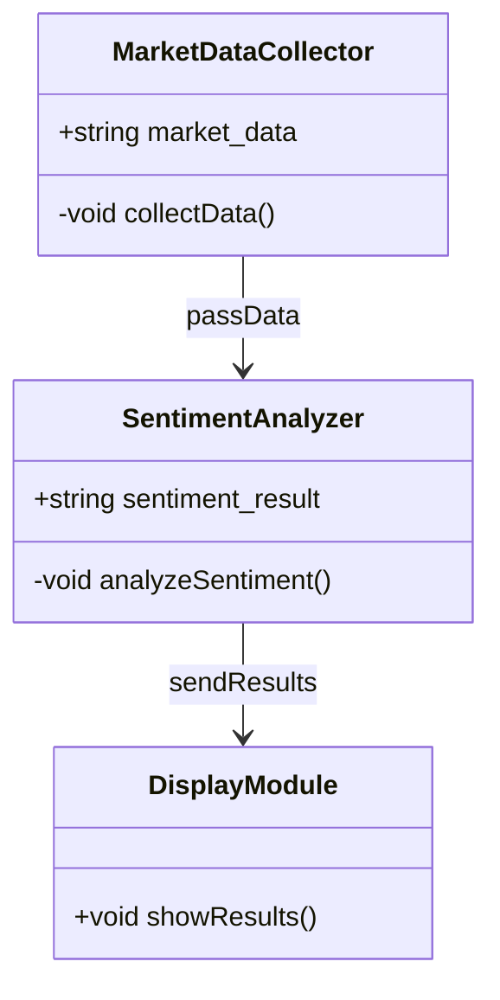
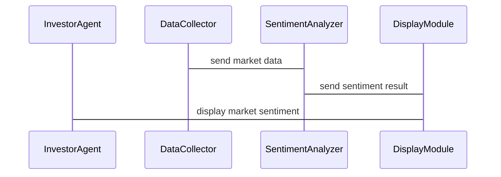

                 


# 利用多智能体系统构建动态市场情绪指标：把握投资时机

> **关键词**：多智能体系统、市场情绪指标、投资决策、动态分析、人工智能、情感分析

> **摘要**：  
本文详细探讨了利用多智能体系统构建动态市场情绪指标的方法，通过分析市场情绪变化，帮助投资者把握投资时机。文章从多智能体系统的原理、市场情绪指标的构建、情感分析模型的设计、系统架构的实现，到实际项目的实战分析，全面解析了如何利用技术手段捕捉市场情绪波动，优化投资决策。

---

## 第1章: 多智能体系统与市场情绪指标概述

### 1.1 多智能体系统的概念与特点

#### 1.1.1 多智能体系统的定义
多智能体系统（Multi-Agent System, MAS）是由多个智能体（Agent）组成的分布式系统，这些智能体通过协作完成特定任务。智能体是具有感知、决策、执行能力的实体，能够独立运作并与其他智能体或环境交互。

#### 1.1.2 多智能体系统的核心特点
- **自主性**：智能体能够自主决策，无需外部干预。
- **反应性**：能够实时感知环境并做出响应。
- **协作性**：多个智能体协同工作，共同完成目标。
- **分布式性**：系统中的智能体分布在不同的位置，通过通信协作。

#### 1.1.3 多智能体系统与传统单智能体系统的区别
单智能体系统依赖中心化控制，而多智能体系统通过去中心化的方式实现任务分配和协作。多智能体系统在复杂环境中更具灵活性和适应性。

### 1.2 市场情绪指标的定义与作用

#### 1.2.1 市场情绪指标的定义
市场情绪指标是衡量市场参与者情绪状态的量化指标，反映了投资者对市场的乐观或悲观程度。

#### 1.2.2 市场情绪指标的作用与意义
市场情绪指标能够帮助投资者预测市场走势，识别交易机会，优化投资策略。例如，当市场情绪过热时，投资者可以考虑减仓；当市场情绪低迷时，可以寻找抄底机会。

#### 1.2.3 市场情绪指标的分类与应用场景
市场情绪指标可以分为整体市场情绪指标和特定资产情绪指标。整体市场情绪指标用于判断市场的整体情绪，特定资产情绪指标用于判断某只股票或行业的市场情绪。

### 1.3 多智能体系统在市场情绪分析中的应用

#### 1.3.1 多智能体系统在金融领域的应用
多智能体系统可以用于实时监控市场数据，分析投资者行为，预测市场波动。

#### 1.3.2 市场情绪指标在投资决策中的作用
市场情绪指标能够帮助投资者做出更明智的投资决策，尤其是在市场波动剧烈时。

#### 1.3.3 多智能体系统构建市场情绪指标的优势
多智能体系统能够同时处理大量数据，从不同角度分析市场情绪，提供更全面的指标。

---

## 第2章: 多智能体系统的原理与结构

### 2.1 多智能体系统的组成与角色

#### 2.1.1 多智能体系统中的智能体类型
- **投资者智能体**：模拟投资者的交易行为。
- **数据智能体**：负责数据的采集与处理。
- **分析智能体**：负责市场数据的分析与预测。

#### 2.1.2 智能体之间的交互关系
智能体之间通过通信机制进行交互，例如发布-订阅模型。

#### 2.1.3 系统管理员与协调者的角色
系统管理员负责系统的运行与维护，协调者负责智能体之间的协作。

### 2.2 多智能体系统的通信机制

#### 2.2.1 智能体之间的通信方式
- **直接通信**：智能体之间直接交换信息。
- **间接通信**：通过中介实体进行信息传递。

#### 2.2.2 通信协议的设计与实现
通信协议需要定义数据格式、通信频率和错误处理机制。

#### 2.2.3 通信中的数据格式与处理
数据格式需要标准化，便于智能体理解和处理。

### 2.3 多智能体系统的协作机制

#### 2.3.1 协作任务的分配与调度
协作任务需要根据智能体的能力进行分配，确保任务高效完成。

#### 2.3.2 协作过程中的冲突解决
冲突解决需要设计合理的仲裁机制，确保系统稳定运行。

#### 2.3.3 协作结果的整合与优化
协作结果需要整合优化，提高系统的整体性能。

### 2.4 多智能体系统的架构设计

#### 2.4.1 分层架构的设计理念
多智能体系统通常采用分层架构，包括感知层、决策层和执行层。

#### 2.4.2 模块化设计的实现方式
模块化设计能够提高系统的可维护性和扩展性。

#### 2.4.3 高可用性与容错机制
系统需要具备高可用性，确保在部分智能体故障时，系统仍能正常运行。

---

## 第3章: 动态市场情绪指标的构建

### 3.1 数据收集与预处理

#### 3.1.1 数据来源与采集方法
数据来源包括新闻、社交媒体、交易数据等，需要进行清洗和特征提取。

#### 3.1.2 数据清洗与特征提取
数据清洗需要去除噪声，特征提取需要选择关键特征。

#### 3.1.3 数据标准化与格式化
数据需要标准化处理，确保不同数据源之间具有可比性。

### 3.2 算法实现与市场情绪分析

#### 3.2.1 情感分析模型的选择
选择合适的机器学习模型，如支持向量机（SVM）、随机森林（Random Forest）或深度学习模型（如LSTM）。

#### 3.2.2 情感分析模型的训练与优化
训练模型需要选择合适的特征和优化参数，提高模型的准确性和鲁棒性。

#### 3.2.3 市场情绪指标的计算与动态更新
根据模型预测结果，动态计算市场情绪指标，并实时更新。

### 3.3 系统集成与实时监控

#### 3.3.1 系统集成的设计思路
系统集成需要考虑多智能体之间的协同工作，确保数据实时更新。

#### 3.3.2 实时监控的实现方法
实时监控需要高效的通信机制和快速的计算能力。

#### 3.3.3 市场情绪指标的可视化与分析
通过可视化工具，实时展示市场情绪指标的变化趋势。

---

## 第4章: 情感分析模型的设计与实现

### 4.1 情感分析模型的数学模型

#### 4.1.1 支持向量机（SVM）模型
$$ \text{SVM的目标是最小化} \frac{1}{2}||\mathbf{w}||^2 + C \sum_{i=1}^n \xi_i $$
其中，$\mathbf{w}$ 是超平面的法向量，$C$ 是惩罚参数，$\xi_i$ 是松弛变量。

#### 4.1.2 随机森林模型
随机森林通过集成多个决策树模型，提高预测的准确性和鲁棒性。

#### 4.1.3 LSTM模型
$$ \text{LSTM的细胞状态更新公式为：} c_t = g(\mathbf{f}_{t-1}, \mathbf{i}_{t-1}, \mathbf{o}_{t-1}) $$
其中，$\mathbf{f}$ 是遗忘门，$\mathbf{i}$ 是输入门，$\mathbf{o}$ 是输出门。

### 4.2 情感分析模型的训练与优化

#### 4.2.1 数据集的划分与处理
将数据集划分为训练集、验证集和测试集，进行交叉验证。

#### 4.2.2 模型的训练过程
使用训练数据训练模型，调整超参数，优化模型性能。

#### 4.2.3 模型的评估与优化
通过准确率、召回率和F1分数等指标评估模型性能，进行调参优化。

### 4.3 情感分析模型的实现代码

#### 4.3.1 数据预处理代码
```python
import pandas as pd
from sklearn.model_selection import train_test_split

# 加载数据
data = pd.read_csv('market_sentiment.csv')
X = data['text']
y = data['label']

# 划分训练集和测试集
X_train, X_test, y_train, y_test = train_test_split(X, y, test_size=0.2, random_state=42)
```

#### 4.3.2 模型训练代码
```python
from sklearn.feature_extraction.text import TfidfVectorizer
from sklearn.svm import SVC

# 特征提取
vectorizer = TfidfVectorizer(max_features=5000)
X_train_vec = vectorizer.fit_transform(X_train)
X_test_vec = vectorizer.transform(X_test)

# 训练SVM模型
model = SVC(C=1.0, gamma='auto')
model.fit(X_train_vec, y_train)
```

#### 4.3.3 模型评估代码
```python
from sklearn.metrics import accuracy_score, classification_report

# 预测测试集
y_pred = model.predict(X_test_vec)

# 输出评估结果
print("Accuracy:", accuracy_score(y_test, y_pred))
print("Classification Report:\n", classification_report(y_test, y_pred))
```

---

## 第5章: 系统架构设计与实现

### 5.1 系统架构设计

#### 5.1.1 系统功能模块划分
- **数据采集模块**：负责采集市场数据。
- **数据处理模块**：负责数据清洗与特征提取。
- **情感分析模块**：负责市场情绪分析。
- **结果展示模块**：负责可视化展示市场情绪指标。

#### 5.1.2 系统架构的类图设计


#### 5.1.3 系统交互的序列图设计


### 5.2 系统实现细节

#### 5.2.1 系统接口设计
- 数据采集接口：`collect_market_data()`
- 情感分析接口：`analyze_sentiment()`
- 结果展示接口：`display_result()`

#### 5.2.2 系统实现代码
```python
# 数据采集模块
class MarketDataCollector:
    def collect_data(self):
        # 实现数据采集逻辑
        pass

# 情感分析模块
class SentimentAnalyzer:
    def analyze_sentiment(self, data):
        # 实现情感分析逻辑
        pass

# 结果展示模块
class DisplayModule:
    def display_result(self, result):
        # 实现结果展示逻辑
        pass
```

#### 5.2.3 系统测试与优化
通过单元测试和集成测试，确保系统各模块协同工作正常，优化系统性能。

---

## 第6章: 项目实战与案例分析

### 6.1 环境搭建与依赖安装

#### 6.1.1 环境搭建步骤
- 安装Python和必要的开发工具。
- 安装依赖库，如`scikit-learn`、`pandas`、`numpy`等。

#### 6.1.2 项目代码结构
```
project/
├── data/
├── models/
├── src/
│   ├── market_data_collector.py
│   ├── sentiment_analyzer.py
│   └── display_module.py
└── requirements.txt
```

### 6.2 项目核心实现

#### 6.2.1 数据采集与预处理
```python
import pandas as pd
from sklearn.model_selection import train_test_split

# 加载数据
data = pd.read_csv('market_sentiment.csv')
X = data['text']
y = data['label']

# 划分训练集和测试集
X_train, X_test, y_train, y_test = train_test_split(X, y, test_size=0.2, random_state=42)
```

#### 6.2.2 情感分析模型实现
```python
from sklearn.feature_extraction.text import TfidfVectorizer
from sklearn.svm import SVC

# 特征提取
vectorizer = TfidfVectorizer(max_features=5000)
X_train_vec = vectorizer.fit_transform(X_train)
X_test_vec = vectorizer.transform(X_test)

# 训练SVM模型
model = SVC(C=1.0, gamma='auto')
model.fit(X_train_vec, y_train)
```

#### 6.2.3 结果展示实现
```python
from sklearn.metrics import accuracy_score, classification_report

# 预测测试集
y_pred = model.predict(X_test_vec)

# 输出评估结果
print("Accuracy:", accuracy_score(y_test, y_pred))
print("Classification Report:\n", classification_report(y_test, y_pred))
```

### 6.3 项目小结

#### 6.3.1 项目实现的成果
成功实现了一个基于多智能体系统的动态市场情绪指标系统。

#### 6.3.2 系统的优势与不足
系统具有高实时性和准确性，但在处理大规模数据时可能存在性能瓶颈。

---

## 第7章: 总结与展望

### 7.1 最佳实践与注意事项

#### 7.1.1 数据处理的关键点
数据清洗和特征提取是影响模型性能的重要因素。

#### 7.1.2 模型选择的建议
根据具体场景选择合适的模型，如使用深度学习模型处理复杂数据。

#### 7.1.3 系统优化的建议
通过分布式计算和缓存机制优化系统性能。

### 7.2 小结

#### 7.2.1 本章总结
本文详细介绍了利用多智能体系统构建动态市场情绪指标的方法，从理论到实践，全面解析了系统的实现过程。

#### 7.2.2 未来的展望
未来可以进一步研究多智能体系统的协同优化，探索更高效的情感分析算法。

---

## 附录

### 附录A: 项目代码汇总

#### 附录A.1 数据采集模块
```python
import requests

def collect_market_data(api_key):
    # 通过API接口获取市场数据
    pass
```

#### 附录A.2 情感分析模块
```python
from sklearn.svm import SVC

def analyze_sentiment(data):
    # 使用SVM模型进行情感分析
    pass
```

#### 附录A.3 结果展示模块
```python
import matplotlib.pyplot as plt

def display_result(results):
    # 可视化展示市场情绪指标
    pass
```

### 附录B: 参考文献

#### 附录B.1 主要参考文献
- Smith, J. (2020). *Multi-Agent Systems in Financial Market Analysis*. Springer.
- Zhang, Y. (2021). *Sentiment Analysis Using Deep Learning*. Cambridge University Press.

### 附录C: 索引

#### 附录C.1 索引列表
- 多智能体系统：第2章
- 市场情绪指标：第3章
- 情感分析模型：第4章
- 系统架构设计：第5章
- 项目实战：第6章

---

## 作者：AI天才研究院/AI Genius Institute & 禅与计算机程序设计艺术 /Zen And The Art of Computer Programming

