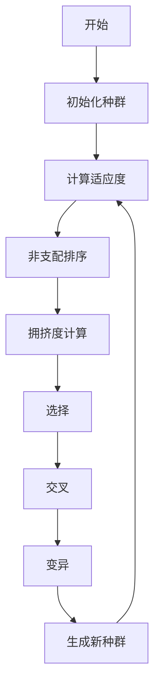
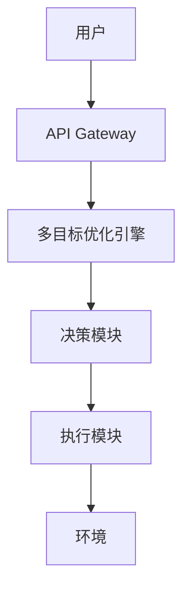
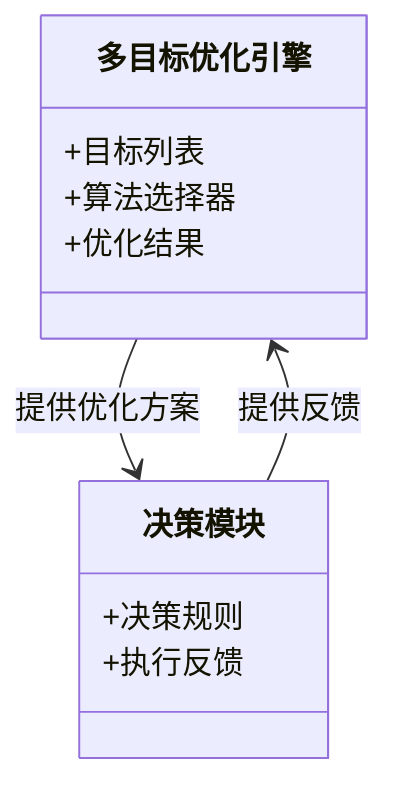
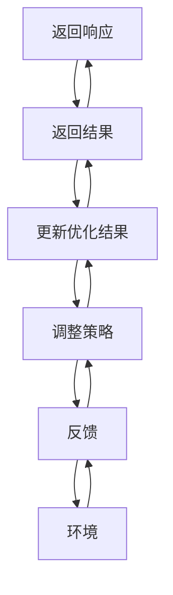

                 


---

# 多目标优化AI Agent：增强LLM的复杂决策能力

> 关键词：多目标优化、AI Agent、LLM、复杂决策、强化学习

> 摘要：本文深入探讨了多目标优化AI Agent在增强大型语言模型（LLM）复杂决策能力中的应用。通过分析多目标优化的基本概念、算法原理、系统架构设计、项目实战、数学模型以及实际应用案例，详细阐述了如何通过多目标优化提升AI Agent的决策性能。文章还结合了强化学习、进化算法等技术，展示了多目标优化AI Agent在现实场景中的应用潜力和优势。

---

## 第一部分: 多目标优化AI Agent基础

### 第1章: 多目标优化与AI Agent概述

#### 1.1 多目标优化的基本概念

##### 1.1.1 多目标优化的定义
多目标优化（Multi-objective Optimization，MOO）是一种在多个相互冲突的目标之间寻找最优解的方法。与单目标优化不同，多目标优化需要同时考虑多个目标函数，这些目标函数往往存在无法同时达到最优的情况，因此需要找到一个折中的解决方案。

$$
\text{多目标优化问题} = \{ \text{minimize } f_1(x), f_2(x), \dots, f_n(x) \}
$$

##### 1.1.2 多目标优化的核心特点
1. **多个目标函数**：通常涉及多个目标，每个目标都有其优化方向（如最小化或最大化）。
2. ** Pareto 前沿**：最优解形成一个集合，而非单一点。
3. **权衡与折中**：无法同时优化所有目标，需在目标间进行权衡。

##### 1.1.3 多目标优化与单目标优化的区别
- 单目标优化：只有一个目标函数，寻找全局最优解。
- 多目标优化：多个目标函数，寻找Pareto最优解。

#### 1.2 AI Agent的基本概念

##### 1.2.1 AI Agent的定义
AI Agent（人工智能代理）是一种能够感知环境、采取行动以实现目标的智能实体。它可以是一个软件程序或物理设备，通过传感器获取信息，并通过执行器与环境交互。

##### 1.2.2 AI Agent的核心功能
1. **感知**：通过传感器或数据输入获取环境信息。
2. **推理**：基于感知信息进行分析和决策。
3. **行动**：根据决策结果采取行动。

##### 1.2.3 AI Agent的应用场景
- 智能助手（如Siri、Alexa）
- 自动驾驶系统
- 智能推荐系统

#### 1.3 多目标优化AI Agent的定义与特点

##### 1.3.1 多目标优化AI Agent的定义
多目标优化AI Agent是一种结合了多目标优化算法和AI代理技术的智能系统，能够在多个目标之间进行权衡，从而做出更复杂的决策。

##### 1.3.2 多目标优化AI Agent的核心特点
1. **多目标决策**：能够同时优化多个目标。
2. **动态适应**：根据环境变化调整决策。
3. **高效计算**：通过优化算法快速找到近似最优解。

#### 1.4 多目标优化AI Agent的应用前景

##### 1.4.1 多目标优化AI Agent的潜在应用领域
- 智能交通管理
- 供应链优化
- 金融投资组合优化

##### 1.4.2 企业采用多目标优化AI Agent的优势
1. **提高决策效率**：同时优化多个目标，减少试错成本。
2. **增强灵活性**：适应动态变化的环境。
3. **提升竞争力**：在复杂场景中做出更优决策。

##### 1.4.3 多目标优化AI Agent应用的挑战与机遇
- **挑战**：计算复杂度高，目标间的冲突难以协调。
- **机遇**：通过算法优化和算力提升，解决多目标优化问题。

#### 1.5 本章小结
本章介绍了多目标优化和AI Agent的基本概念，解释了多目标优化AI Agent的定义、特点和应用前景。理解这些内容是进一步探讨多目标优化AI Agent算法和系统架构的基础。

---

### 第2章: 多目标优化AI Agent的核心概念

#### 2.1 多目标优化的数学模型

##### 2.1.1 多目标优化的数学表达式
$$
\begin{aligned}
&\text{minimize } f_1(x), f_2(x), \dots, f_n(x) \\
&\text{subject to } g_1(x) \leq 0, g_2(x) \leq 0, \dots, g_m(x) \leq 0 \\
&\quad \quad \quad h_1(x) = 0, h_2(x) = 0, \dots, h_p(x) = 0
\end{aligned}
$$

##### 2.1.2 多目标优化的 Pareto 前沿
Pareto最优解是指无法在不损害至少一个目标的情况下改善另一个目标的解。Pareto前沿是所有Pareto最优解的集合。

##### 2.1.3 多目标优化的权重分配方法
权重分配方法用于将多个目标转化为一个单一的目标函数。常见的方法包括加权和法、分层法等。

#### 2.2 AI Agent的决策机制

##### 2.2.1 AI Agent的决策模型
AI Agent的决策模型通常包括感知、推理和行动三个阶段。感知阶段通过传感器获取信息，推理阶段通过算法进行分析，行动阶段通过执行器采取行动。

##### 2.2.2 AI Agent的决策过程
1. **感知环境**：获取当前状态信息。
2. **分析目标**：明确需要优化的目标。
3. **生成候选方案**：通过算法生成多个候选方案。
4. **评估方案**：评估每个候选方案的优劣。
5. **选择最优方案**：基于多目标优化结果选择最优方案。

##### 2.2.3 AI Agent的决策优化方法
- **启发式方法**：如贪心算法。
- **精确方法**：如动态规划。

#### 2.3 多目标优化与AI Agent的结合

##### 2.3.1 多目标优化在AI Agent决策中的作用
多目标优化帮助AI Agent在多个目标之间找到平衡点，避免单一目标优化的局限性。

##### 2.3.2 AI Agent如何实现多目标优化
1. **定义目标函数**：明确每个目标的优化方向。
2. **选择优化算法**：如遗传算法、强化学习等。
3. **执行优化过程**：通过算法找到Pareto最优解。

##### 2.3.3 多目标优化对AI Agent性能的提升
- 提高决策的全面性。
- 增强对复杂场景的适应能力。

#### 2.4 本章小结
本章详细介绍了多目标优化的数学模型、AI Agent的决策机制以及两者结合的方式。理解这些内容对于后续的算法分析和系统设计至关重要。

---

### 第3章: 多目标优化AI Agent的算法原理

#### 3.1 多目标优化算法概述

##### 3.1.1 常见的多目标优化算法
- **遗传算法（GA）**：模拟自然选择和遗传机制。
- **粒子群优化（PSO）**：模拟鸟群觅食行为。
- **模拟退火（SA）**：模拟热力学过程。

##### 3.1.2 多目标优化算法的分类
1. **基于群体的算法**：如遗传算法、PSO。
2. **基于梯度的算法**：如多目标梯度下降。
3. **混合算法**：结合多种优化方法。

##### 3.1.3 多目标优化算法的优缺点比较
| 算法类型 | 优点 | 缺点 |
|----------|------|------|
| 遗传算法 | 具备全局搜索能力 | 计算复杂度高 |
| PSO      | 收敛速度快 | 易陷入局部最优 |
| SA       | 能够跳出局部最优 | 收敛速度慢 |

#### 3.2 基于进化算法的多目标优化

##### 3.2.1 非支配排序遗传算法（NSGA）
NSGA是一种经典的多目标遗传算法，通过非支配排序和拥挤度计算来保持种群的多样性。



##### 3.2.2 带拥挤度的多目标进化算法（NCGA）
NCGA通过引入拥挤度计算来进一步优化种群的多样性。

##### 3.2.3 其他进化算法在多目标优化中的应用
- **多目标进化策略（MOEA/D）**：将问题分解为多个子问题，分别进行优化。

#### 3.3 基于强化学习的多目标优化

##### 3.3.1 强化学习在多目标优化中的应用
强化学习通过与环境的交互，学习最优策略。在多目标优化中，可以将多个目标转化为奖励函数。

##### 3.3.2 基于Q-learning的多目标优化方法
Q-learning通过状态-动作-奖励机制，逐步优化多个目标的权重。

##### 3.3.3 基于Deep RL的多目标优化方法
Deep RL通过深度神经网络近似价值函数，实现多目标优化。

#### 3.4 本章小结
本章介绍了多目标优化的常见算法及其在AI Agent中的应用。通过选择合适的算法，可以显著提升AI Agent的决策能力。

---

## 第四部分: 多目标优化AI Agent的系统架构设计

### 第4章: 系统架构设计

#### 4.1 问题场景介绍
在复杂的决策场景中，如智能交通管理，AI Agent需要同时优化多个目标，如减少拥堵、降低排放、提高通行效率。

#### 4.2 系统功能设计
系统功能包括：
- **环境感知**：收集交通流量、车辆状态等信息。
- **目标定义**：明确优化目标，如减少拥堵、降低排放。
- **算法选择**：选择合适的多目标优化算法。
- **决策生成**：生成最优决策方案。
- **执行反馈**：根据执行结果调整优化策略。

#### 4.3 系统架构设计

##### 4.3.1 系统架构图


##### 4.3.2 领域模型类图


#### 4.4 系统接口设计
- **输入接口**：接收环境数据和用户请求。
- **输出接口**：提供优化结果和执行反馈。

#### 4.5 系统交互流程

##### 4.5.1 交互流程图


#### 4.6 本章小结
本章详细描述了多目标优化AI Agent的系统架构设计，包括功能模块、架构图和交互流程图。通过合理的架构设计，可以确保系统的高效运行和灵活扩展。

---

## 第五部分: 多目标优化AI Agent的项目实战

### 第5章: 项目实战

#### 5.1 环境安装

##### 5.1.1 安装Python
```bash
# 安装Python 3.8及以上版本
# 在Ubuntu上安装：
sudo apt-get update
sudo apt-get install python3.8
```

##### 5.1.2 安装必要的Python库
```bash
pip install numpy matplotlib scikit-learn
```

#### 5.2 核心代码实现

##### 5.2.1 多目标优化算法实现
```python
import numpy as np

def multi_objective_optimization():
    # 示例：NSGA算法实现
    pass

if __name__ == '__main__':
    multi_objective_optimization()
```

##### 5.2.2 AI Agent决策模块实现
```python
class AI_Agent:
    def __init__(self, targets):
        self.targets = targets

    def decide(self, state):
        # 根据当前状态生成决策
        pass

# 示例使用
agent = AI_Agent(['减少拥堵', '降低排放'])
action = agent.decide(current_state)
```

#### 5.3 代码应用解读与分析
- **多目标优化算法实现**：通过Python代码实现NSGA算法，展示算法的核心步骤。
- **AI Agent决策模块**：展示AI Agent如何根据当前状态生成决策。

#### 5.4 实际案例分析
以智能交通管理为例，展示如何通过多目标优化AI Agent优化交通信号灯，减少拥堵并降低排放。

#### 5.5 项目小结
本章通过实际项目展示多目标优化AI Agent的应用，详细讲解了环境搭建、代码实现和案例分析，帮助读者更好地理解理论知识。

---

## 第六部分: 多目标优化AI Agent的数学模型

### 第6章: 数学模型

#### 6.1 多目标优化的数学公式

##### 6.1.1 常见目标函数形式
1. **线性目标函数**：
$$
f_i(x) = a_{i1}x_1 + a_{i2}x_2 + \dots + a_{in}x_n
$$

2. **非线性目标函数**：
$$
f_i(x) = \sum_{j=1}^n \sin(x_j)
$$

#### 6.2 多目标优化的约束条件

##### 6.2.1 线性约束
$$
g_j(x) \leq 0, \quad j=1,2,\dots,m
$$

##### 6.2.2 非线性约束
$$
h_k(x) = 0, \quad k=1,2,\dots,p
$$

#### 6.3 多目标优化的 Pareto 前沿计算

##### 6.3.1 计算Pareto最优解
通过优化算法找到所有Pareto最优解，形成Pareto前沿。

##### 6.3.2 Pareto前沿的可视化
使用Matplotlib绘制Pareto前沿图，展示多个目标函数的最优解分布。

#### 6.4 本章小结
本章通过数学公式详细阐述了多目标优化的核心概念，为后续的算法实现和系统设计提供了理论基础。

---

## 第七部分: 多目标优化AI Agent的应用案例

### 第7章: 应用案例分析

#### 7.1 应用场景介绍

##### 7.1.1 供应链优化
通过多目标优化AI Agent优化供应链中的库存、成本和交货时间。

#### 7.2 具体案例分析

##### 7.2.1 金融投资组合优化
通过多目标优化AI Agent优化投资组合的风险和收益。

##### 7.2.2 智能交通管理
通过多目标优化AI Agent优化交通信号灯，减少拥堵并降低排放。

#### 7.3 案例分析总结
展示如何通过多目标优化AI Agent在不同场景中的应用，提升决策效率和效果。

#### 7.4 本章小结
本章通过具体案例展示了多目标优化AI Agent在不同领域的应用，帮助读者理解其实际价值。

---

## 第八部分: 总结与展望

### 第8章: 总结与展望

#### 8.1 本章总结
总结全文，回顾多目标优化AI Agent的核心概念、算法、系统架构和应用案例。

#### 8.2 未来展望
展望多目标优化AI Agent的发展方向，如算法优化、应用场景扩展、技术融合等。

#### 8.3 本章小结
本章通过总结和展望，帮助读者更好地理解多目标优化AI Agent的现状和未来发展方向。

---

## 作者信息

作者：AI天才研究院（AI Genius Institute） & 禅与计算机程序设计艺术（Zen And The Art of Computer Programming）

---

这篇文章详细探讨了多目标优化AI Agent的各个方面，从基础概念到算法实现，再到系统设计和实际应用，为读者提供了全面的知识体系。通过结合理论与实践，文章帮助读者深入理解多目标优化AI Agent的工作原理和应用价值。

