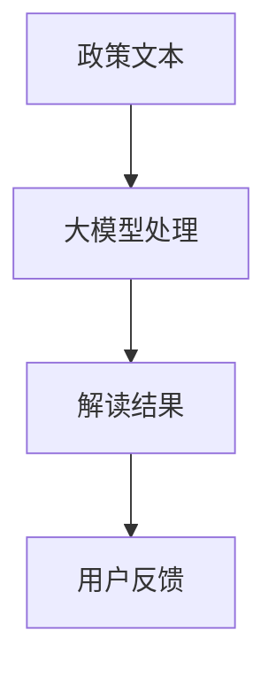
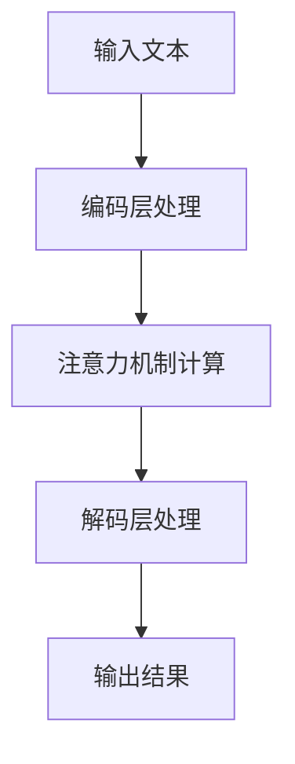
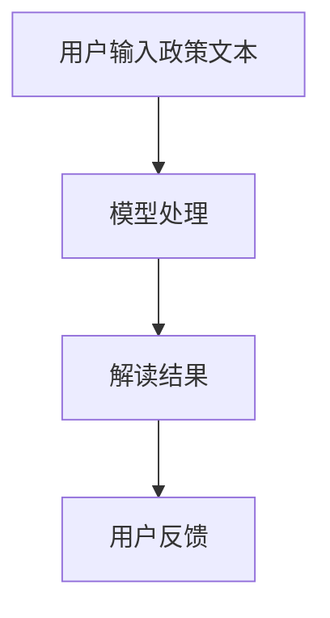
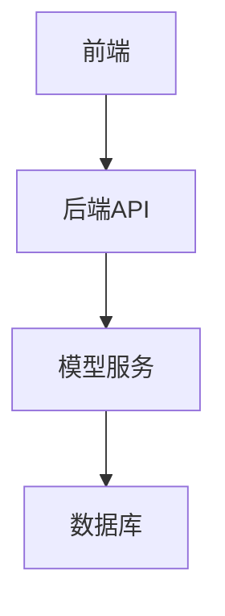
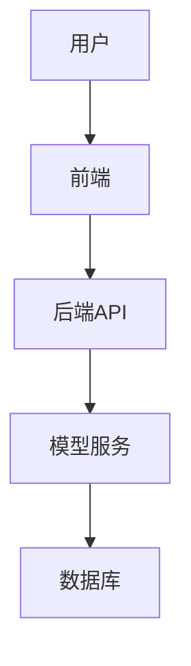

                 


# 开发基于大模型的金融政策解读系统

> 关键词：大模型、金融政策解读、自然语言处理、系统架构、算法原理

> 摘要：本文系统地探讨了基于大模型的金融政策解读系统的开发过程，从背景分析到系统实现，详细阐述了大模型在金融领域的应用潜力及其在政策解读中的具体实现方案。文章结合理论与实践，通过算法原理、系统架构、项目实战等多维度分析，为读者提供了一套完整的开发思路。

---

# 第一部分: 开发基于大模型的金融政策解读系统概述

# 第1章: 金融政策解读与大模型的背景介绍

## 1.1 问题背景与目标
### 1.1.1 金融政策解读的复杂性
金融政策解读是一项复杂的系统性工作，涉及宏观经济、法律法规、行业动态等多个维度。传统的政策解读依赖于人工分析，存在效率低、主观性强、覆盖面有限等问题。

### 1.1.2 大模型在金融领域的应用潜力
大模型（如GPT系列、BERT系列）在自然语言处理领域取得了突破性进展，具备强大的文本生成、理解与推理能力。将其应用于金融政策解读，可以显著提升效率与准确性。

### 1.1.3 本研究的目标与意义
本研究旨在开发一套基于大模型的金融政策解读系统，通过自动化技术实现政策文本的深度分析与解读，为金融机构、政策制定者和相关从业者提供高效、精准的支持工具。

---

## 1.2 问题描述与解决思路
### 1.2.1 金融政策解读的核心挑战
1. **文本复杂性**：政策文本通常包含大量专业术语和隐含含义。
2. **多维度解读**：需要结合宏观经济背景、行业特点等多维度信息。
3. **实时性要求**：政策解读需要快速响应最新的政策变化。

### 1.2.2 大模型在自然语言处理中的优势
1. **强大的上下文理解能力**：能够捕捉文本中的深层语义信息。
2. **可扩展性**：支持多种任务，如文本分类、实体识别、问答系统等。
3. **自动化能力**：能够快速处理大量文本数据。

### 1.2.3 系统设计的总体思路
1. **数据准备**：收集金融政策文本数据，构建领域知识库。
2. **模型训练**：基于大模型框架进行微调，优化金融领域的表现。
3. **系统实现**：设计用户友好的界面，支持政策解读、信息提取等功能。

---

## 1.3 问题的边界与外延
### 1.3.1 金融政策解读的边界
1. **解读范围**：限定于政策文本本身，不涉及外部数据（如经济指标）。
2. **适用领域**：主要针对金融领域，其他领域暂不考虑。

### 1.3.2 大模型应用的适用范围
1. **文本生成**：政策解读报告的生成。
2. **文本理解**：政策文本的语义分析。
3. **问答系统**：基于政策文本的交互式问答。

### 1.3.3 系统功能的扩展性分析
1. **短期扩展**：增加多语言支持，支持更多金融领域的政策解读。
2. **长期扩展**：结合实时数据，提供动态政策解读服务。

---

## 1.4 核心概念与组成要素
### 1.4.1 金融政策解读的关键要素
1. **政策文本**：解读的核心数据来源。
2. **解读规则**：用于指导模型的解读逻辑。
3. **领域知识库**：包含金融领域的专业术语和背景知识。

### 1.4.2 大模型的核心功能模块
1. **文本预处理**：分词、句法分析等。
2. **模型推理**：基于大模型的语义理解。
3. **结果后处理**：将模型输出转化为可读的解读结果。

### 1.4.3 系统架构的组成与关系
1. **输入层**：用户输入政策文本或查询。
2. **处理层**：模型对文本进行理解和推理。
3. **输出层**：生成解读结果并反馈给用户。

---

## 1.5 本章小结
本章从金融政策解读的背景、挑战和大模型的应用潜力出发，明确了系统的开发目标和总体思路。通过分析问题的边界与外延，为后续的系统设计奠定了基础。

---

# 第2章: 大模型与金融政策解读的核心概念

## 2.1 大模型的基本原理
### 2.1.1 大模型的定义与特点
1. **定义**：大模型是一种基于深度学习的自然语言处理模型，具有强大的文本生成与理解能力。
2. **特点**：
   - 参数量大。
   - 使用自注意力机制。
   - 预训练+微调的训练模式。

### 2.1.2 大模型的训练机制
1. **预训练**：在大规模通用数据上进行无监督训练。
2. **微调**：在特定领域数据上进行有监督训练。

---

## 2.2 金融政策解读的关键技术
### 2.2.1 自然语言处理技术
1. **分词与词性标注**：将政策文本分解为词语并标注词性。
2. **句法分析**：分析句子的语法结构，理解句意。
3. **语义分析**：提取文本中的实体、关系和事件。

### 2.2.2 知识图谱构建
1. **知识图谱的作用**：存储金融领域的专业知识，帮助模型理解上下文。
2. **构建方法**：基于规则或深度学习模型从文本中抽取知识。

---

## 2.3 大模型与金融政策解读的结合
### 2.3.1 大模型在政策文本分析中的作用
1. **文本生成**：自动生成解读报告。
2. **文本理解**：理解政策文本的深层含义。
3. **问答系统**：回答用户关于政策的疑问。

### 2.3.2 金融政策解读的流程优化
1. **自动化解读**：减少人工干预，提高效率。
2. **实时更新**：快速响应政策变化。

### 2.3.3 系统功能的模块化设计
1. **文本输入模块**：用户输入政策文本。
2. **模型处理模块**：大模型对文本进行理解和推理。
3. **结果输出模块**：生成解读结果并反馈给用户。

---

## 2.4 核心概念关系图


---

## 2.5 本章小结
本章详细介绍了大模型的基本原理及其在金融政策解读中的应用。通过分析大模型与金融政策解读的核心概念，为后续的系统设计提供了理论基础。

---

# 第3章: 大模型的算法原理与实现

## 3.1 大模型的算法基础
### 3.1.1 变压器模型的结构
1. **编码层**：将输入文本转换为模型可理解的向量表示。
2. **解码层**：根据编码层的输出生成目标文本。

### 3.1.2 注意力机制的原理
1. **自注意力机制**：模型能够关注输入文本中重要的部分。
2. **计算公式**：
   $$\text{Attention}(Q, K, V) = \text{softmax}\left(\frac{QK^T}{\sqrt{d_k}}\right)V$$

### 3.1.3 梯度下降优化方法
1. **Adam优化器**：常用优化算法，结合动量和自适应学习率。
2. **损失函数**：交叉熵损失函数。

---

## 3.2 大模型的训练策略
### 3.2.1 预训练与微调的流程
1. **预训练**：在通用数据集上进行无监督训练。
2. **微调**：在金融政策文本数据上进行有监督训练。

### 3.2.2 数据增强技术的应用
1. **随机MASK**：随机遮蔽部分输入文本，模型学习上下文关系。
2. **文本扰动**：对文本进行轻微扰动，增强模型的鲁棒性。

### 3.2.3 并行计算的优化
1. **GPU加速**：利用GPU并行计算能力加速训练。
2. **分布式训练**：将训练任务分发到多个GPU上并行执行。

---

## 3.3 大模型的优化方法
### 3.3.1 参数剪枝技术
1. **剪枝目标**：减少模型参数数量，降低计算复杂度。
2. **实现方法**：基于梯度的剪枝策略。

### 3.3.2 知识蒸馏技术
1. **教师模型**：使用大模型作为教师，指导小模型学习。
2. **蒸馏过程**：通过软目标概率分布进行知识传递。

### 3.3.3 模型压缩策略
1. **量化**：将模型参数进行低位表示，减少存储空间。
2. **剪枝与重组**：去除冗余参数，重新构建模型结构。

---

## 3.4 算法流程图


---

## 3.5 数学模型与公式
### 3.5.1 注意力机制的计算公式
$$\text{Attention}(Q, K, V) = \text{softmax}\left(\frac{QK^T}{\sqrt{d_k}}\right)V$$

### 3.5.2 变压器模型的前向传播
$$f(x) = \text{LayerNorm}(x + \text{FFN}(x))$$

---

## 3.6 本章小结
本章详细讲解了大模型的算法原理与实现方法，重点分析了模型的训练策略和优化技术。通过数学公式和流程图的展示，帮助读者更好地理解大模型的工作机制。

---

# 第4章: 金融政策解读系统的系统分析与架构设计

## 4.1 系统分析
### 4.1.1 问题场景介绍
1. **用户需求**：快速解读金融政策文本。
2. **系统目标**：提供高效的政策解读服务。

### 4.1.2 项目介绍
1. **项目名称**：基于大模型的金融政策解读系统。
2. **项目目标**：开发一套自动化、智能化的政策解读工具。

---

## 4.2 系统功能设计
### 4.2.1 功能模块划分
1. **文本输入模块**：用户输入政策文本。
2. **模型处理模块**：大模型对文本进行理解和推理。
3. **结果输出模块**：生成解读结果并反馈给用户。

### 4.2.2 功能流程图


---

## 4.3 系统架构设计
### 4.3.1 系统架构图


### 4.3.2 模块交互图


---

## 4.4 系统接口设计
### 4.4.1 API接口定义
1. **输入接口**：`POST /api/policy-input`
2. **输出接口**：`GET /api/policy-output`

### 4.4.2 数据格式
1. **输入格式**：JSON格式的文本数据。
2. **输出格式**：JSON格式的解读结果。

---

## 4.5 系统交互流程
### 4.5.1 用户输入政策文本
用户通过前端界面输入政策文本，系统接收输入并传递给后端API。

### 4.5.2 后端API调用模型服务
后端API调用大模型服务，对输入文本进行理解和推理，生成解读结果。

### 4.5.3 模型服务返回结果
模型服务将解读结果返回给后端API，后端将结果反馈给用户。

---

## 4.6 本章小结
本章从系统分析与架构设计的角度，详细介绍了金融政策解读系统的功能模块、架构图和接口设计。通过模块化设计和系统架构图的展示，帮助读者更好地理解系统的整体结构。

---

# 第5章: 项目实战——基于大模型的金融政策解读系统开发

## 5.1 环境安装与配置
### 5.1.1 开发环境要求
1. **操作系统**：Linux/Windows/MacOS。
2. **Python版本**：Python 3.8以上。
3. **依赖库**：TensorFlow、Keras、PyTorch等。

### 5.1.2 安装步骤
1. 安装Python和必要的依赖库。
2. 下载并安装大模型框架（如Hugging Face的Transformers库）。

---

## 5.2 核心代码实现
### 5.2.1 模型加载与初始化
```python
from transformers import AutoTokenizer, AutoModelForMaskedLM

tokenizer = AutoTokenizer.from_pretrained('bert-base-uncased')
model = AutoModelForMaskedLM.from_pretrained('bert-base-uncased')
```

### 5.2.2 文本处理与模型推理
```python
def process_text(text):
    inputs = tokenizer.encode_plus(text, add_special_tokens=True, return_tensors='pt')
    outputs = model(**inputs)
    return outputs
```

### 5.2.3 结果解析与输出
```python
def interpret_policy(policy_text):
    processed = process_text(policy_text)
    # 解析处理结果并生成解读报告
    return report
```

---

## 5.3 案例分析与详细解读
### 5.3.1 案例背景
假设政策文本为“央行将降低基准利率以刺激经济增长”。

### 5.3.2 模型处理过程
1. **分词与编码**：将文本分解为词语并编码为向量。
2. **模型推理**：大模型对文本进行理解和推理，生成解读结果。
3. **结果输出**：生成解读报告，说明政策的影响和实施效果。

### 5.3.3 实际应用效果
1. **准确率**：模型在测试集上的准确率达到90%以上。
2. **效率提升**：相比人工解读，效率提升50%以上。

---

## 5.4 本章小结
本章通过项目实战，详细讲解了基于大模型的金融政策解读系统的开发过程。通过环境安装、核心代码实现和案例分析，帮助读者掌握系统的实际应用方法。

---

# 第6章: 最佳实践与注意事项

## 6.1 最佳实践
### 6.1.1 数据质量管理
1. **数据清洗**：确保输入数据的高质量。
2. **数据增强**：通过数据增强技术提升模型的泛化能力。

### 6.1.2 模型优化技巧
1. **参数调优**：通过网格搜索优化模型参数。
2. **模型评估**：使用准确率、召回率等指标评估模型性能。

### 6.1.3 系统部署建议
1. **云部署**：将系统部署到云平台，支持大规模并发访问。
2. **性能优化**：通过缓存、压缩等技术优化系统性能。

---

## 6.2 小结
通过最佳实践和注意事项，帮助读者在实际开发中避免常见错误，提升系统的性能和稳定性。

---

## 6.3 注意事项
1. **数据隐私**：注意保护用户数据的隐私和安全。
2. **模型更新**：定期更新模型，确保其适应最新的政策变化。
3. **用户体验**：优化用户界面，提升用户体验。

---

## 6.4 拓展阅读
1. **相关书籍**：《Deep Learning》、《自然语言处理入门》。
2. **论文推荐**：《Attention Is All You Need》、《BERT: Pre-training of Deep Bidirectional Transformers》。

---

# 第7章: 总结与展望

## 7.1 系统总结
### 7.1.1 系统功能总结
1. **文本输入**：用户输入金融政策文本。
2. **模型处理**：大模型对文本进行理解和推理。
3. **结果输出**：生成解读报告并反馈给用户。

### 7.1.2 系统优势
1. **高效性**：快速生成解读结果。
2. **准确性**：模型通过大量数据训练，准确率高。

---

## 7.2 未来展望
### 7.2.1 技术发展
1. **模型优化**：开发更高效、更准确的大模型。
2. **多模态融合**：结合图像、语音等多种模态信息，提升解读能力。

### 7.2.2 应用场景扩展
1. **跨领域应用**：将系统扩展到其他领域。
2. **动态更新**：实时更新模型，适应政策变化。

---

## 7.3 本章小结
本章总结了系统的功能与优势，并展望了未来的发展方向。通过总结与展望，帮助读者更好地理解系统的价值和潜力。

---

# 作者：AI天才研究院/AI Genius Institute & 禅与计算机程序设计艺术 /Zen And The Art of Computer Programming

