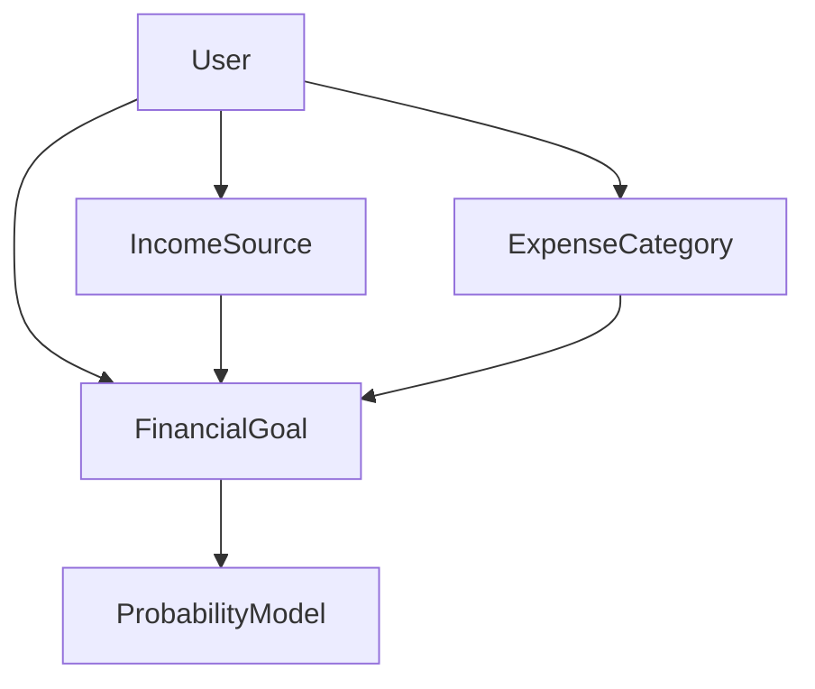
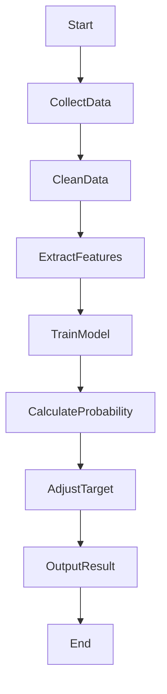
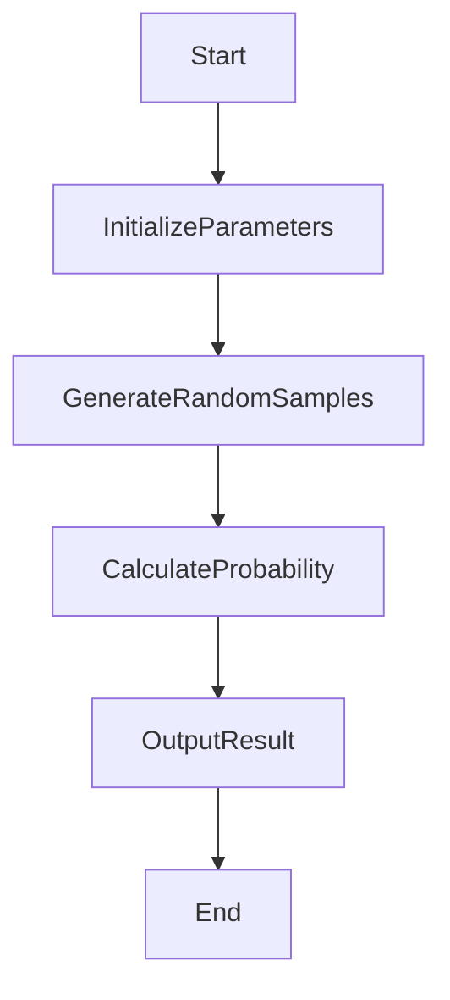
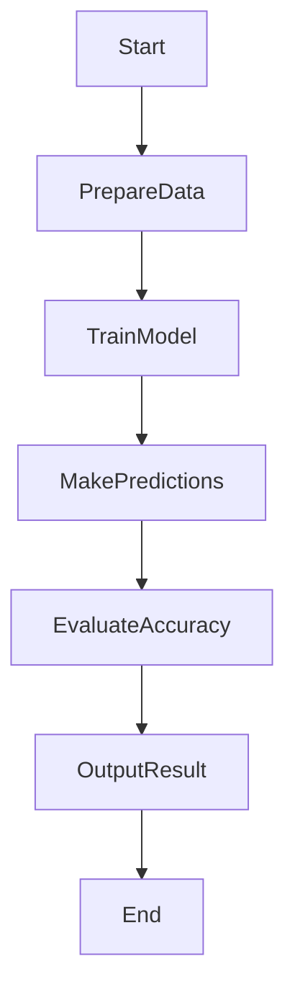
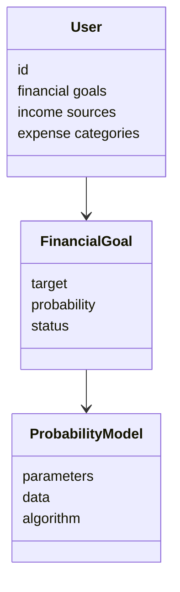
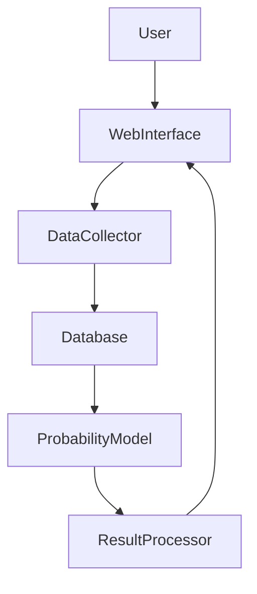
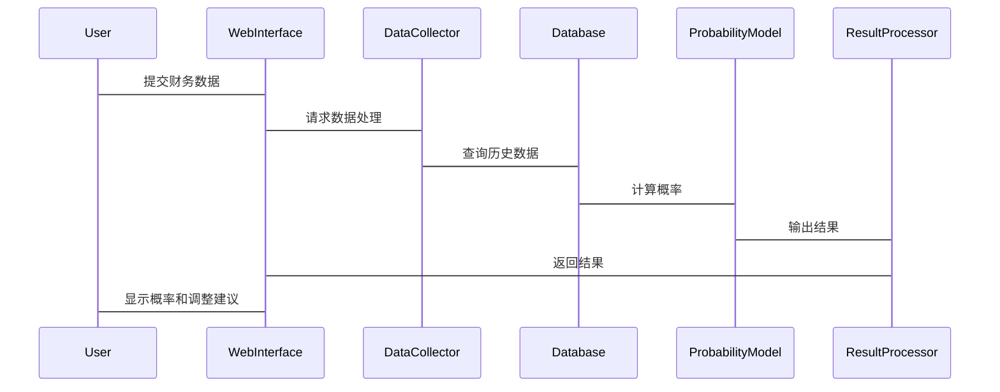

                 


# 智能个人财务目标达成概率计算与调整

> 关键词：智能财务，目标概率，动态调整，人工智能，个人理财

> 摘要：本文探讨如何利用人工智能技术计算个人财务目标的达成概率，并根据实际情况进行动态调整。通过分析传统财务管理的局限性，提出基于数据驱动的智能财务管理方法，构建概率计算模型，并结合实际案例展示系统的实现与应用。

---

## 目录

### 第一部分：背景与基础

#### 第1章：智能个人财务目标达成概率计算的背景与问题描述

##### 1.1 个人财务管理的传统挑战

###### 1.1.1 传统财务管理的局限性
- 数据采集困难
- 目标设定缺乏科学性
- 缺乏动态调整能力

###### 1.1.2 个人财务目标设定的常见误区
- 过度乐观或悲观
- 忽视风险因素
- 缺乏长期规划

###### 1.1.3 传统财务管理工具的不足
- 功能单一
- 缺乏智能分析能力
- 用户体验不佳

##### 1.2 智能化财务管理的必要性

###### 1.2.1 数据驱动决策的优势
- 提高准确性
- 增强预见性
- 优化资源配置

###### 1.2.2 人工智能在财务管理中的应用前景
- 智能数据处理
- 自动化决策支持
- 实时监控与反馈

###### 1.2.3 个人财务目标达成概率计算的现实意义
- 提供科学决策依据
- 帮助用户合理规划
- 提高财务管理效率

##### 1.3 问题背景与目标

###### 1.3.1 财务目标达成概率计算的核心问题
- 数据采集与处理
- 概率模型构建
- 动态调整策略

###### 1.3.2 问题解决的必要性与可行性
- 必要性：提升财务管理的科学性和精确性
- 可行性：基于AI技术的发展

###### 1.3.3 边界与外延
- 限定范围：个人财务目标
- 外延：扩展至家庭或企业财务管理

#### 第2章：核心概念与联系

##### 2.1 核心概念原理

###### 2.1.1 财务目标设定的要素
- 收入目标
- 支出目标
- 资产配置目标

###### 2.1.2 数据采集与处理的关键步骤
- 数据来源
- 数据清洗
- 数据特征提取

###### 2.1.3 概率计算模型的构建逻辑
- 数据分析
- 模型选择
- 概率计算与验证

##### 2.2 核心概念对比分析

###### 2.2.1 传统财务目标设定与智能目标设定的对比
| 特性       | 传统方法             | 智能方法             |
|------------|----------------------|----------------------|
| 数据来源   | 线下数据             | 结构化数据+实时数据   |
| 决策依据   | 经验+规则            | 数据驱动+算法驱动    |
| 调整能力   | 低                   | 高                   |

###### 2.2.2 不同概率计算方法的优缺点对比
| 方法         | 优点                     | 缺点                     |
|--------------|--------------------------|--------------------------|
| 蒙特卡洛模拟 | 高度灵活性               | 计算量大                 |
| 朴素贝叶斯   | 计算简单                 | 对特征独立性假设敏感     |
| 支持向量机    | 高精度                   | 对非线性问题处理较好       |

###### 2.2.3 数据驱动与规则驱动的财务管理方式对比
| 特性       | 数据驱动             | 规则驱动             |
|------------|----------------------|----------------------|
| 决策依据   | 数据分析             | 预定义规则           |
| 适应性     | 高                   | 低                   |
| 可解释性   | 低                   | 高                   |

##### 2.3 ER实体关系图与流程图

###### 2.3.1 实体关系图（ER图）展示


###### 2.3.2 数据流与处理流程图


### 第二部分：算法原理讲解

#### 第3章：概率计算算法原理

##### 3.1 基于蒙特卡洛模拟的概率计算方法

###### 3.1.1 算法步骤


###### 3.1.2 Python实现示例
```python
import numpy as np

def monte_carlo_simulation(iterations, low, high):
    np.random.seed(42)
    samples = np.random.uniform(low, high, iterations)
    return samples.mean()

result = monte_carlo_simulation(1000, 0, 1)
print(f"Average probability: {result}")
```

##### 3.2 基于机器学习的概率计算方法

###### 3.2.1 算法步骤


###### 3.2.2 Python实现示例
```python
from sklearn.svm import SVC
from sklearn.model_selection import train_test_split

# 示例数据
X = np.random.rand(100, 2)
y = np.random.randint(0, 2, 100)

X_train, X_test, y_train, y_test = train_test_split(X, y, test_size=0.2)

model = SVC()
model.fit(X_train, y_train)
accuracy = model.score(X_test, y_test)
print(f"Accuracy: {accuracy}")
```

##### 3.3 数学模型与公式

###### 3.3.1 蒙特卡洛模拟的概率公式
$$ P = \frac{\text{满足条件的样本数}}{\text{总样本数}} $$

###### 3.3.2 朴素贝叶斯分类的概率公式
$$ P(y|X) = \frac{P(X|y)P(y)}{P(X)} $$

### 第三部分：系统分析与架构设计方案

#### 第4章：系统分析与架构设计

##### 4.1 问题场景介绍

###### 4.1.1 用户需求分析
- 实时监控财务状况
- 动态调整财务目标
- 获取概率计算结果

###### 4.1.2 功能需求分析
- 数据采集与处理
- 概率计算与预测
- 目标调整与优化

##### 4.2 系统功能设计

###### 4.2.1 领域模型设计


###### 4.2.2 系统架构设计


##### 4.3 接口设计与交互流程

###### 4.3.1 系统接口设计
- 数据接口：REST API
- 模型接口：WebService

###### 4.3.2 交互流程图


### 第四部分：项目实战

#### 第5章：项目实战与案例分析

##### 5.1 环境安装与配置

###### 5.1.1 安装Python与相关库
```bash
pip install numpy pandas scikit-learn matplotlib
```

##### 5.2 系统核心实现

###### 5.2.1 数据采集与处理代码
```python
import pandas as pd
import numpy as np

# 示例数据
data = pd.DataFrame({
    'income': np.random.normal(5000, 1000, 100),
    'expenses': np.random.normal(4000, 800, 100)
})

# 数据清洗与特征提取
data['net_income'] = data['income'] - data['expenses']
data.head()
```

###### 5.2.2 概率计算代码
```python
from sklearn.svm import SVC
from sklearn.model_selection import train_test_split

X = data[['income', 'expenses']]
y = data['net_income'] > 0

X_train, X_test, y_train, y_test = train_test_split(X, y, test_size=0.2)

model = SVC()
model.fit(X_train, y_train)
accuracy = model.score(X_test, y_test)
print(f"Accuracy: {accuracy}")
```

##### 5.3 案例分析与优化

###### 5.3.1 实际案例分析
- 数据分析结果
- 概率计算结果
- 目标调整建议

###### 5.3.2 系统优化方向
- 提升模型精度
- 优化数据采集
- 改善用户体验

### 第五部分：最佳实践与小结

#### 第6章：最佳实践与小结

##### 6.1 小结

###### 6.1.1 核心内容回顾
- 数据采集与处理
- 概率计算方法
- 系统设计与实现

##### 6.2 注意事项

###### 6.2.1 数据质量的重要性
- 数据完整性
- 数据准确性
- 数据及时性

###### 6.2.2 模型选择的注意事项
- 模型适用性
- 计算效率
- 可解释性

##### 6.3 拓展阅读

###### 6.3.1 推荐书籍与资源
- 《机器学习实战》
- 《数据驱动的决策管理》

###### 6.3.2 研究前沿与发展趋势
- 大数据分析
- 智能决策支持系统
- 自动化财务管理工具

### 作者：AI天才研究院/AI Genius Institute & 禅与计算机程序设计艺术 /Zen And The Art of Computer Programming

