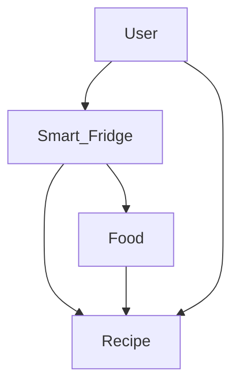
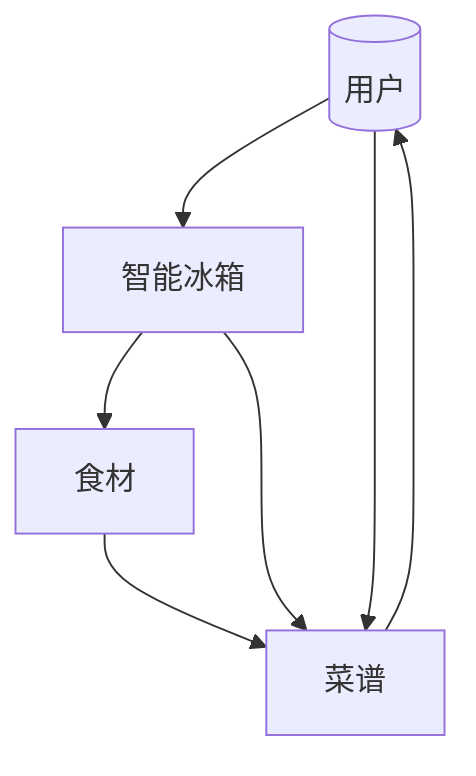
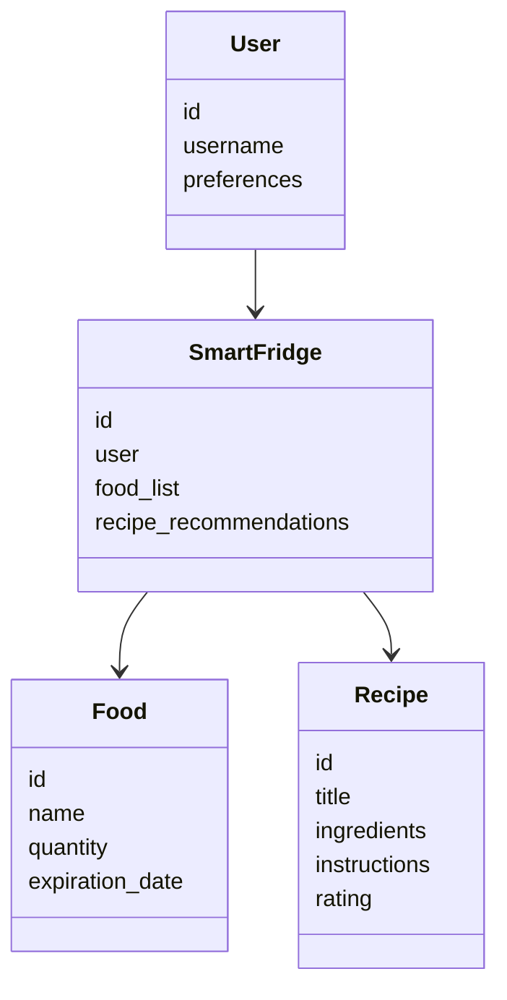
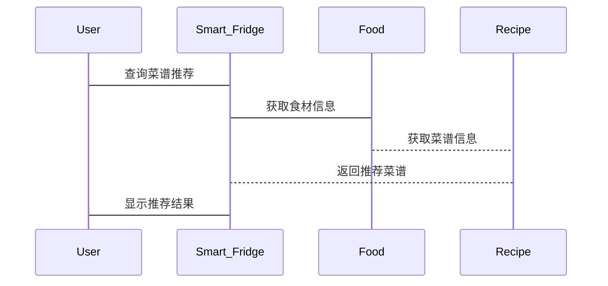

                 


# 第二部分: AI Agent的核心概念与联系

## 第3章: AI Agent与智能冰箱的实体关系

### 3.1 实体关系分析
#### 3.1.1 用户与智能冰箱的关系
用户与智能冰箱之间存在互动，用户通过智能冰箱进行食材管理、菜谱查询和系统设置。智能冰箱通过传感器和AI算法，主动为用户提供食材管理建议和菜谱推荐。

#### 3.1.2 食材与智能冰箱的关系
食材是智能冰箱管理的核心对象，智能冰箱通过RFID、重量传感器等技术实时监控食材的状态（如保质期、剩余量）。食材的状态数据会被AI Agent用于菜谱推荐和采购计划生成。

#### 3.1.3 菜谱与智能冰箱的关系
菜谱是食材管理和烹饪建议的结合体，智能冰箱通过AI Agent分析用户饮食习惯、食材库存情况，推荐适合的菜谱。菜谱的推荐不仅考虑食材的可用性，还结合用户的口味偏好和营养需求。

### 3.2 Mermaid实体关系图


## 第4章: 食材管理与菜谱推荐的关系

### 4.1 食材管理的核心要素
#### 4.1.1 食材分类与存储
智能冰箱通过分类管理食材，如将食材分为蔬菜、水果、乳制品等类别，方便用户查找和管理。AI Agent可以根据食材种类、保质期等因素，推荐最佳存储位置和方式。

#### 4.1.2 食材保质期管理
智能冰箱能够实时监控食材的保质期，通过颜色编码或提醒通知用户及时使用即将过期的食材。AI Agent可以根据保质期信息，优先推荐即将过期的食材，避免浪费。

#### 4.1.3 食材库存与采购计划
智能冰箱可以根据食材的使用情况和保质期，生成采购计划。当某种食材库存不足时，AI Agent会建议用户购买新的食材，并提供附近的购物清单。

### 4.2 菜谱推荐的核心要素
#### 4.2.1 用户饮食习惯分析
AI Agent通过分析用户的饮食记录、偏好和健康状况，了解用户的饮食习惯。例如，用户可能偏好低脂饮食或素食，AI Agent会根据这些偏好推荐菜谱。

#### 4.2.2 食材库存匹配
菜谱推荐的核心是基于用户当前的食材库存。AI Agent会优先推荐使用现有食材的菜谱，减少食材浪费。如果某些食材存量不足，AI Agent会建议用户采购补充。

#### 4.2.3 营养均衡与健康建议
智能冰箱的AI Agent可以根据用户的健康数据（如体重、血压、血糖等），推荐营养均衡的菜谱。例如，对于高血压患者，AI Agent会推荐低钠饮食方案。

### 4.3 Mermaid菜谱推荐流程图


# 第三部分: 算法原理讲解

## 第5章: 推荐算法的核心原理

### 5.1 协同过滤算法
#### 5.1.1 协同过滤的基本原理
协同过滤是一种基于用户行为的推荐算法，通过分析用户的历史行为（如购买记录、浏览记录、评分等），找到与当前用户行为相似的其他用户，推荐这些用户喜欢的物品。

#### 5.1.2 优缺点分析
- 优点：简单易实现，推荐结果与用户兴趣高度相关。
- 缺点：无法处理冷启动问题，难以推荐新的或冷门的菜谱。

#### 5.1.3 实现步骤
1. 收集用户行为数据，如用户的饮食记录、偏好等。
2. 构建用户-菜谱的评分矩阵。
3. 计算用户之间的相似度，如使用余弦相似度。
4. 根据相似用户的评分，计算目标用户的推荐菜谱。

### 5.2 基于内容的推荐算法
#### 5.2.1 基于内容的推荐原理
基于内容的推荐算法通过分析菜谱的属性（如食材种类、烹饪方式、营养成分等），找到与目标用户当前兴趣相匹配的菜谱。

#### 5.2.2 优缺点分析
- 优点：能够处理冷启动问题，推荐结果具有解释性。
- 缺点：依赖于高质量的菜谱描述，实现较为复杂。

#### 5.2.3 实现步骤
1. 对菜谱进行特征提取，如提取主要食材、烹饪方式等。
2. 使用文本挖掘或机器学习算法，计算菜谱之间的相似度。
3. 根据用户当前的食材库存和偏好，推荐相似的菜谱。

### 5.3 深度学习推荐算法
#### 5.3.1 基于神经网络的推荐原理
深度学习推荐算法通过构建神经网络模型，自动提取菜谱和用户的深层特征，实现更精准的推荐。

#### 5.3.2 优缺点分析
- 优点：能够处理复杂的非线性关系，推荐结果更精准。
- 缺点：实现复杂，需要大量的数据和计算资源。

#### 5.3.3 实现步骤
1. 收集大量的用户行为数据和菜谱属性数据。
2. 构建神经网络模型，如DNN、CNN等。
3. 训练模型，提取特征并进行推荐。

## 第6章: 推荐算法的数学模型

### 6.1 协同过滤的相似度计算
#### 6.1.1 余弦相似度公式
$$ \text{相似度}(u_1, u_2) = \frac{\sum_{i} u_1(i) \cdot u_2(i)}{\sqrt{\sum_{i} u_1(i)^2} \cdot \sqrt{\sum_{i} u_2(i)^2}} $$

#### 6.1.2 欧氏距离公式
$$ \text{距离}(u_1, u_2) = \sqrt{\sum_{i} (u_1(i) - u_2(i))^2} $$

### 6.2 基于内容的相似度计算
#### 6.2.1 TF-IDF计算
$$ \text{TF}(t) = \frac{\text{词频}}{\text{文档长度}} $$
$$ \text{IDF}(t) = \log\left(\frac{\text{文档总数}}{\text{包含词t的文档数}}\right) $$
$$ \text{TF-IDF}(t) = \text{TF}(t) \times \text{IDF}(t) $$

#### 6.2.2 余弦相似度应用于菜谱推荐
$$ \text{相似度}(r_1, r_2) = \frac{\sum_{i} w_1(i) \cdot w_2(i)}{\sqrt{\sum_{i} w_1(i)^2} \cdot \sqrt{\sum_{i} w_2(i)^2}} $$
其中，$w_i$表示菜谱i的TF-IDF值。

### 6.3 深度学习模型的损失函数
#### 6.3.1 二分类任务的损失函数
$$ \mathcal{L} = -\frac{1}{N} \sum_{i=1}^{N} [\log(y_i) + \log(1 - y_i')] $$
其中，$y_i$是标签，$y_i'$是模型预测值。

#### 6.3.2 回归任务的损失函数
$$ \mathcal{L} = \frac{1}{N} \sum_{i=1}^{N} (y_i - y_i')^2 $$

## 第7章: 推荐算法的实现与优化

### 7.1 协同过滤算法的实现
#### 7.1.1 用户-菜谱评分矩阵
使用Python的pandas库构建评分矩阵：
```python
import pandas as pd

# 创建用户-菜谱评分矩阵
users = ['User1', 'User2', 'User3']
recipes = ['Recipe1', 'Recipe2', 'Recipe3']

# 示例评分数据
data = {'User': users,
        'Recipe': recipes,
        'Rating': [5, 3, 4,
                  4, 5, 2,
                  3, 4, 5]}
df = pd.DataFrame(data)
print(df)
```

#### 7.1.2 计算用户相似度
使用scipy库计算余弦相似度：
```python
from scipy.spatial.distance import cosine

# 示例用户向量
user1 = [5, 3, 4]
user2 = [4, 5, 2]

similarity = cosine(user1, user2)
print(f"余弦相似度为：{similarity}")
```

### 7.2 基于内容的推荐实现
#### 7.2.1 TF-IDF特征提取
使用nltk库进行文本处理：
```python
from nltk.corpus import stopwords
from sklearn.feature_extraction.text import TfidfVectorizer

# 示例菜谱描述
corpus = [
    "Tomato sauce spaghetti pasta Italian dish",
    "Sushi roll Japanese cuisine raw fish",
    "Chicken stir-fry Chinese dish vegetables"
]

# 创建TF-IDF向量器
vectorizer = TfidfVectorizer(stop_words='english')
tfidf = vectorizer.fit_transform(corpus)

# 查看TF-IDF矩阵
print(tfidf)
```

#### 7.2.2 计算菜谱相似度
使用余弦相似度计算菜谱之间的相似度：
```python
from sklearn.metrics.pairwise import cosine_similarity

similarity_matrix = cosine_similarity(tfidf)
print(similarity_matrix)
```

### 7.3 深度学习推荐模型
#### 7.3.1 数据预处理
将菜谱和用户数据进行特征工程处理，如归一化、特征选择等。

#### 7.3.2 构建神经网络模型
使用Keras框架构建深度学习模型：
```python
from tensorflow.keras.models import Sequential
from tensorflow.keras.layers import Dense

# 示例模型
model = Sequential()
model.add(Dense(64, activation='relu', input_dim=10))
model.add(Dense(1, activation='sigmoid'))
model.compile(optimizer='adam', loss='binary_crossentropy', metrics=['accuracy'])
model.summary()
```

#### 7.3.3 模型训练与评估
使用训练数据训练模型，并在验证集上评估模型性能：
```python
model.fit(X_train, y_train, epochs=10, batch_size=32, validation_data=(X_val, y_val))
```

### 7.4 算法优化策略
#### 7.4.1 处理数据稀疏性
使用矩阵分解技术，如奇异值分解(SVD)来降低数据稀疏性。

#### 7.4.2 处理冷启动问题
结合规则推荐或基于内容的推荐，解决新用户的推荐问题。

#### 7.4.3 提升推荐实时性
优化算法复杂度，采用分布式计算和缓存技术，提高推荐系统的响应速度。

# 第四部分: 系统分析与架构设计

## 第8章: 系统功能设计

### 8.1 系统功能模块划分
#### 8.1.1 食材管理模块
- 食材录入与管理
- 食材保质期提醒
- 食材库存监控

#### 8.1.2 菜谱推荐模块
- 菜谱搜索与筛选
- 菜谱推荐列表
- 菜谱详情展示

#### 8.1.3 用户交互模块
- 用户资料管理
- 推荐结果反馈
- 系统设置

### 8.2 领域模型设计
使用Mermaid绘制类图，展示系统中的主要实体及其关系：


## 第9章: 系统架构设计

### 9.1 分层架构设计
将系统划分为数据层、业务逻辑层和用户界面层：
- 数据层：负责数据的存储和管理
- 业务逻辑层：实现核心业务逻辑
- 用户界面层：提供用户交互界面

### 9.2 微服务架构设计
采用微服务架构，将系统划分为多个独立的服务：
- 食材管理服务
- 菜谱推荐服务
- 用户服务
- 系统设置服务

### 9.3 接口设计
定义系统内部和外部的接口，使用RESTful API进行通信：
- API GET /api/users
- API POST /api/foods
- API PUT /api/recipes

### 9.4 交互流程设计
使用Mermaid绘制系统交互流程图，展示用户与系统之间的交互过程：


## 第10章: 系统实现与优化

### 10.1 环境搭建
#### 10.1.1 开发工具安装
- 安装Python、Jupyter Notebook、Git
- 安装依赖库：numpy、pandas、scikit-learn、tensorflow、mermaid、flask

#### 10.1.2 数据库选择
- 使用MongoDB存储食材和菜谱数据
- 使用MySQL存储用户数据和推荐记录

### 10.2 核心代码实现
#### 10.2.1 食材管理模块实现
```python
from flask import Flask, jsonify
from pymongo import MongoClient

app = Flask(__name__)
client = MongoClient('mongodb://localhost:27017/')
db = client['SmartFridgeDB']
foods_collection = db['foods']

@app.route('/api/foods', methods=['GET'])
def get_foods():
    foods = list(foods_collection.find())
    return jsonify(foods)

if __name__ == '__main__':
    app.run(debug=True)
```

#### 10.2.2 菜谱推荐模块实现
```python
from flask_restful import Resource, Api
from sklearn.neighbors import NearestNeighbors

class RecipeRecommendation(Resource):
    def get(self):
        # 加载菜谱数据
        recipes = pd.read_csv('recipes.csv')
        # 特征提取
        features = recipes[['calories', 'protein', 'fat', 'sodium']]
        # 训练模型
        model = NearestNeighbors(n_neighbors=5).fit(features)
        # 获取推荐结果
        recommendations = model.kneighbors(features)[1][0]
        # 返回推荐菜谱ID
        return {'recommendations': recommendations.tolist()}

api = Api(flask_app)
api.add_resource(RecipeRecommendation, '/api/recommendations')
```

### 10.3 系统优化与部署
#### 10.3.1 系统性能优化
- 使用缓存技术，减少数据库访问次数
- 优化算法复杂度，提高推荐速度
- 并行化处理，利用多线程或分布式计算

#### 10.3.2 系统安全优化
- 数据加密存储
- 用户身份验证
- 接口权限控制

#### 10.3.3 系统部署与维护
- 使用Docker进行容器化部署
- 利用云服务进行弹性扩展
- 定期备份和监控系统状态

# 第五部分: 项目实战

## 第11章: 环境安装与配置

### 11.1 安装开发环境
- Python 3.8以上版本
- 安装必要的Python包：
  ```bash
  pip install numpy pandas scikit-learn tensorflow flask pymongo flask_restful
  ```

### 11.2 数据集准备
- 下载食材数据库和菜谱数据集
- 数据清洗和预处理
- 数据格式转换为CSV或JSON

## 第12章: 核心代码实现

### 12.1 食材管理模块代码
```python
import pymongo

# 连接到MongoDB数据库
client = pymongo.MongoClient("mongodb://localhost:27017/")
db = client["SmartFridgeDB"]
foods = db["foods"]

# 插入食材数据
food_data = {
    "name": "牛奶",
    "quantity": 2,
    "expiration_date": "2023-12-31"
}
foods.insert_one(food_data)
```

### 12.2 菜谱推荐模块代码
```python
from sklearn.metrics.pairwise import cosine_similarity
from sklearn.feature_extraction.text import TfidfVectorizer

# 初始化TF-IDF向量器
vectorizer = TfidfVectorizer()

# 示例菜谱描述
corpus = [
    "牛奶、面包、鸡蛋制作的早餐三明治",
    "牛肉、胡萝卜、洋葱制作的健康沙拉",
    "鸡肉、青菜制作的低脂晚餐"
]

# 训练TF-IDF模型
tfidf_matrix = vectorizer.fit_transform(corpus)

# 计算相似度矩阵
similarity_matrix = cosine_similarity(tfidf_matrix)
```

### 12.3 系统交互代码
```python
from flask import Flask, request, jsonify

app = Flask(__name__)

@app.route('/api/recommend', methods=['POST'])
def recommend_recipe():
    # 获取用户输入
    user_input = request.json['preference']
    # 推荐逻辑
    recommendation = get_recommendation(user_input)
    return jsonify({'recommendation': recommendation})

def get_recommendation(preference):
    # 示例推荐逻辑
    return "根据您的偏好的推荐菜谱..."

if __name__ == '__main__':
    app.run()
```

## 第13章: 实际案例分析

### 13.1 案例背景
用户张三喜欢低脂饮食，有牛奶、面包、鸡蛋等食材。系统需要根据这些食材和用户的饮食偏好推荐早餐菜谱。

### 13.2 数据分析
分析用户现有的食材，如牛奶、面包、鸡蛋，结合用户的饮食习惯，生成推荐列表。

### 13.3 系统推荐
系统推荐使用牛奶、面包和鸡蛋制作早餐三明治，并提供详细的制作步骤和营养信息。

### 13.4 优化建议
根据用户反馈，进一步优化推荐算法，提高推荐的准确性和用户满意度。

## 第14章: 项目小结

### 14.1 项目总结
通过本项目，我们成功实现了智能冰箱中的AI Agent食材管理和菜谱推荐系统。系统能够实时监控食材状态，根据用户偏好推荐菜谱，优化了用户的饮食体验。

### 14.2 项目成果
- 实现了食材管理模块，能够实时更新食材库存和保质期。
- 实现了菜谱推荐模块，基于协同过滤和内容推荐算法，为用户提供个性化推荐。
- 构建了完整的系统架构，具备良好的扩展性和维护性。

### 14.3 项目不足
- 系统目前主要依赖本地数据，未来可以考虑接入云服务，实现数据的实时同步和共享。
- 推荐算法的实时性还有提升空间，可以通过优化算法和增加缓存机制来提高响应速度。
- 用户界面目前较为基础，未来可以考虑加入更多交互设计，提升用户体验。

# 第六部分: 总结与展望

## 第15章: 最佳实践与小结

### 15.1 最佳实践
- 数据预处理是推荐系统成功的关键，确保数据的准确性和完整性。
- 选择合适的推荐算法，根据实际场景和数据特点进行调整和优化。
- 注重系统的可扩展性和可维护性，采用模块化设计和微服务架构。

### 15.2 小结
通过本项目的实施，我们深入理解了AI Agent在智能冰箱中的应用，掌握了食材管理和菜谱推荐的核心技术。系统不仅具备基本的食材管理功能，还能够根据用户需求推荐个性化菜谱，大大提升了用户的使用体验。

## 第16章: 注意事项与拓展阅读

### 16.1 注意事项
- 在实际应用中，要注意数据隐私保护，确保用户数据的安全性。
- 系统上线前，要进行全面的测试，确保各个模块的协同工作和系统的稳定性。
- 定期更新推荐算法和系统功能，保持系统的先进性和用户体验的持续优化。

### 16.2 拓展阅读
- 《推荐系统实践》：深入探讨推荐系统的实现与优化。
- 《AI Agent与智能家电》：了解AI Agent在家电领域的广泛应用。
- 《Python机器学习》：掌握机器学习的核心技术，为推荐系统提供理论支持。

# 结语

智能冰箱作为智能家居的重要组成部分，通过AI Agent技术实现了食材管理和菜谱推荐的智能化。未来，随着AI和物联网技术的不断发展，智能冰箱的功能将更加丰富，用户体验也将不断提升。希望本书能够为读者提供有价值的技术参考，激发更多创新灵感。

作者：AI天才研究院/AI Genius Institute & 禅与计算机程序设计艺术/Zen And The Art of Computer Programming

