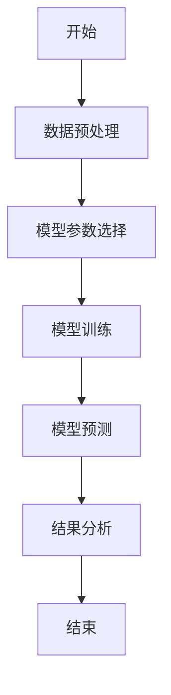
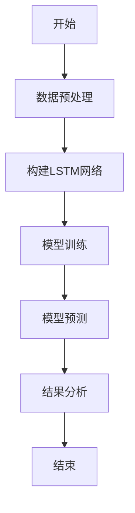
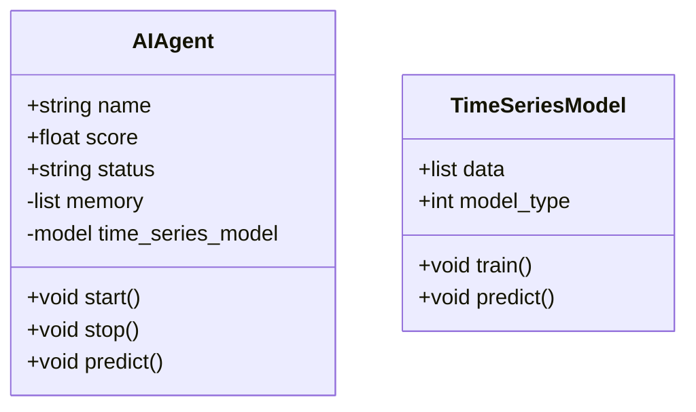
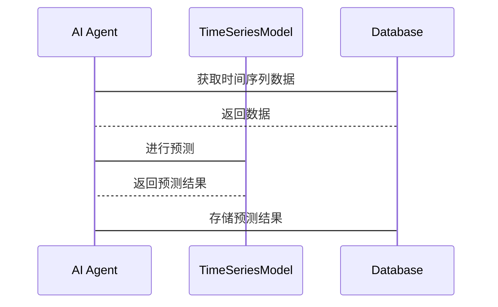

                 


# 构建具有时间序列分析能力的AI Agent

## 关键词：AI Agent, 时间序列分析, LSTM, ARIMA, Proph

## 摘要：本文详细介绍了如何构建具有时间序列分析能力的AI Agent。首先，我们从时间序列分析的基本概念和AI Agent的定义入手，探讨了时间序列分析在AI Agent中的应用。接着，我们深入分析了时间序列分析的核心概念与算法原理，包括ARIMA、LSTM和Prophet模型。随后，我们详细讲解了时间序列分析的算法实现，并通过系统架构设计展示了如何将时间序列分析集成到AI Agent中。最后，我们通过一个实际项目案例，展示了如何构建一个具备时间序列分析能力的AI Agent，并总结了相关的经验和最佳实践。

---

# 第一部分：时间序列分析与AI Agent概述

## 第1章：时间序列分析与AI Agent概述

### 1.1 时间序列分析的基本概念

#### 1.1.1 时间序列的定义与特点

时间序列是指按照时间顺序排列的一组数据，通常用于描述某一指标在不同时间点的观测值。时间序列分析是通过对这些数据进行建模和分析，以揭示隐藏在数据中的模式、趋势和周期性变化。

时间序列分析具有以下特点：
- **时间依赖性**：数据点之间存在依赖关系，后续的观测值可能受到前期观测值的影响。
- **趋势性**：数据可能表现出长期的上升或下降趋势。
- **周期性**：数据可能受到季节性或其他周期性因素的影响。
- **随机性**：数据中可能包含不可预测的随机波动。

#### 1.1.2 时间序列分析的常见应用场景

时间序列分析在许多领域都有广泛应用，以下是几个典型的应用场景：
- **经济预测**：预测股票价格、GDP增长等经济指标。
- **销售预测**：预测产品销量，帮助企业进行库存管理和销售计划制定。
- **天气预测**：预测气温、降雨量等气象数据，为农业、交通等领域提供支持。
- **设备维护**：通过对设备运行数据的分析，预测设备故障时间，提前进行维护。

#### 1.1.3 时间序列分析与AI Agent的结合

AI Agent是一种能够感知环境、自主决策并执行任务的智能体。将时间序列分析能力集成到AI Agent中，可以使其具备处理时间相关数据的能力，从而更好地完成预测、监控和决策任务。

### 1.2 AI Agent的基本概念

#### 1.2.1 AI Agent的定义与分类

AI Agent是指具有智能性的实体，能够感知环境、自主决策并执行任务。根据智能体的智能水平和应用场景，可以将AI Agent分为以下几类：
- **反应式AI Agent**：基于当前感知做出反应，不具备记忆能力。
- **认知式AI Agent**：具备记忆、推理和学习能力，能够进行复杂决策。
- **学习式AI Agent**：通过学习算法不断优化自身行为。

#### 1.2.2 时间序列分析在AI Agent中的作用

时间序列分析是AI Agent处理时间相关数据的核心能力之一。通过时间序列分析，AI Agent可以：
- **预测未来趋势**：基于历史数据预测未来的行为或结果。
- **实时监控**：对动态数据进行实时分析，及时发现异常情况。
- **优化决策**：根据时间依赖性数据，优化任务执行策略。

#### 1.2.3 本章小结

本章主要介绍了时间序列分析的基本概念和AI Agent的定义与分类，重点探讨了时间序列分析在AI Agent中的作用。通过本章的学习，读者可以理解时间序列分析与AI Agent之间的关系，为后续章节的学习奠定基础。

---

## 第2章：时间序列分析的核心概念与原理

### 2.1 时间序列分析的数学基础

#### 2.1.1 时间序列的平稳性与分解

平稳性是指时间序列的统计性质在时间上保持不变。非平稳的时间序列需要通过差分等方法将其转化为平稳序列，以便进行建模和分析。

时间序列的分解主要包括以下几个部分：
- **趋势**：长期单调上升或下降的趋势。
- **季节性**：周期性变化，如月度数据的季节性波动。
- **随机性**：不可预测的随机波动。

#### 2.1.2 时间序列的自相关性与偏自相关性

自相关性是指时间序列中某一个观测值与另一个观测值之间的相关性。偏自相关性是指在控制其他变量影响的情况下，某两个观测值之间的相关性。

#### 2.1.3 时间序列的预测模型

时间序列预测模型的目标是根据历史数据，预测未来的观测值。常见的预测模型包括ARIMA、LSTM和Prophet等。

### 2.2 时间序列分析的常用方法

#### 2.2.1 ARIMA模型

ARIMA（自回归积分移动平均模型）是一种经典的线性时序模型，适用于平稳时间序列的预测。

##### ARIMA模型的流程图（mermaid）



##### ARIMA模型的数学模型

$$ARIMA(p, d, q) = 0$$

##### ARIMA模型的Python实现代码

```python
from statsmodels.tsa.arima_model import ARIMA
import pandas as pd

# 数据加载与预处理
data = pd.read_csv('time_series.csv')
data = data['target'].values

# 模型训练
model = ARIMA(data, order=(5,1,0))
model_fit = model.fit()

# 模型预测
forecast = model_fit.forecast(steps=10)
```

#### 2.2.2 LSTM模型

LSTM（长短期记忆网络）是一种基于循环神经网络的时间序列模型，能够处理时间序列中的长期依赖关系。

##### LSTM模型的流程图（mermaid）



##### LSTM模型的数学模型

$$f(t) = \sigma(w_{xt}x_t + w_{ht-1}h_{t-1})$$

##### LSTM模型的Python实现代码

```python
import keras
from keras.layers import LSTM, Dense
from keras.models import Sequential

# 数据加载与预处理
data = pd.read_csv('time_series.csv')
data = data['target'].values

# 数据转换为训练数据
X = []
y = []
for i in range(len(data) - 1):
    X.append(data[i])
    y.append(data[i+1])

# 模型训练
model = Sequential()
model.add(LSTM(5, input_shape=(1,1)))
model.add(Dense(1))
model.compile(loss='mean_squared_error', optimizer='adam')
model.fit(X, y, epochs=10, batch_size=1)

# 模型预测
test_input = data[-1].reshape(1,1,1)
forecast = model.predict(test_input)
```

#### 2.2.3 Prophet模型

Prophet是一种基于时间序列分解和回归模型的预测方法，适用于非平稳时间序列的预测。

##### Prophet模型的流程图（mermaid）


##### Prophet模型的数学模型

$$ Prophet(t) = g(t) + h(t) + s(t) $$

##### Prophet模型的Python实现代码

```python
import prophet

# 数据加载与预处理
data = pd.read_csv('time_series.csv')
data = data[['ds', 'target']]

# 模型训练
model = prophet.Prophet()
model.fit(data)

# 模型预测
future = model.make_future_dataframe(periods=10)
forecast = model.predict(future)
```

### 2.3 时间序列分析的优缺点对比

#### 2.3.1 不同时间序列分析方法的对比表格

| 方法 | 优点 | 缺点 |
|------|------|------|
| ARIMA | 适用于平稳时间序列，模型简单 | 不适用于非平稳时间序列，对异常值敏感 |
| LSTM | 能够处理长期依赖关系，模型灵活 | 训练时间较长，需要大量数据 |
| Prophet | 易用性强，适合非平稳时间序列 | 对异常值敏感，模型解释性较差 |

#### 2.3.2 时间序列分析的ER实体关系图

```mermaid
erd
actor AI Agent
actor 具体实现
participant 时间序列数据
participant 时间序列模型
participant 预测结果
```

---

## 第3章：时间序列分析的算法原理与实现

### 3.1 ARIMA算法原理

#### 3.1.1 ARIMA算法的流程图（mermaid）


#### 3.1.2 ARIMA算法的数学模型

$$ARIMA(p, d, q) = 0$$

#### 3.1.3 ARIMA算法的Python实现代码

```python
from statsmodels.tsa.arima_model import ARIMA
import pandas as pd

# 数据加载与预处理
data = pd.read_csv('time_series.csv')
data = data['target'].values

# 模型训练
model = ARIMA(data, order=(5,1,0))
model_fit = model.fit()

# 模型预测
forecast = model_fit.forecast(steps=10)
```

### 3.2 LSTM算法原理

#### 3.2.1 LSTM算法的流程图（mermaid）


#### 3.2.2 LSTM算法的数学模型

$$f(t) = \sigma(w_{xt}x_t + w_{ht-1}h_{t-1})$$

#### 3.2.3 LSTM算法的Python实现代码

```python
import keras
from keras.layers import LSTM, Dense
from keras.models import Sequential

# 数据加载与预处理
data = pd.read_csv('time_series.csv')
data = data['target'].values

# 数据转换为训练数据
X = []
y = []
for i in range(len(data) - 1):
    X.append(data[i])
    y.append(data[i+1])

# 模型训练
model = Sequential()
model.add(LSTM(5, input_shape=(1,1)))
model.add(Dense(1))
model.compile(loss='mean_squared_error', optimizer='adam')
model.fit(X, y, epochs=10, batch_size=1)

# 模型预测
test_input = data[-1].reshape(1,1,1)
forecast = model.predict(test_input)
```

### 3.3 Prophet算法原理

#### 3.3.1 Prophet算法的流程图（mermaid）


#### 3.3.2 Prophet算法的数学模型

$$ Prophet(t) = g(t) + h(t) + s(t) $$

#### 3.3.3 Prophet算法的Python实现代码

```python
import prophet

# 数据加载与预处理
data = pd.read_csv('time_series.csv')
data = data[['ds', 'target']]

# 模型训练
model = prophet.Prophet()
model.fit(data)

# 模型预测
future = model.make_future_dataframe(periods=10)
forecast = model.predict(future)
```

---

## 第4章：时间序列分析的系统分析与架构设计

### 4.1 系统分析

#### 4.1.1 问题场景介绍

在构建具备时间序列分析能力的AI Agent时，我们需要考虑以下几个关键问题：
- **数据来源**：数据是来自传感器、数据库还是其他外部源？
- **数据预处理**：数据是否需要清洗、归一化或特征提取？
- **模型选择**：选择哪种时间序列分析模型（ARIMA、LSTM、Prophet等）？
- **模型部署**：如何将模型集成到AI Agent中，并实现实时预测？

#### 4.1.2 项目介绍

本项目旨在构建一个能够处理时间序列数据的AI Agent，使其具备预测未来趋势、实时监控和异常检测的能力。

### 4.2 系统功能设计

#### 4.2.1 领域模型（mermaid类图）



#### 4.2.2 系统架构设计（mermaid架构图）

```mermaid
docker
backend --> database
frontend --> backend
frontend --> database
```

#### 4.2.3 系统接口设计

AI Agent需要与外部系统进行交互，常见的接口包括：
- **数据接口**：从数据库或外部源获取时间序列数据。
- **模型接口**：调用时间序列分析模型进行预测。
- **用户接口**：向用户展示预测结果或发出警报。

#### 4.2.4 系统交互设计（mermaid序列图）



---

## 第5章：时间序列分析的项目实战

### 5.1 环境安装

在开始项目之前，需要确保安装好所需的开发环境和依赖库。以下是主要的依赖库：

#### 5.1.1 Python环境

```bash
pip install numpy
pip install pandas
pip install statsmodels
pip install keras
pip install prophet
```

### 5.2 系统核心实现源代码

#### 5.2.1 数据预处理代码

```python
import pandas as pd
import numpy as np

# 数据加载
data = pd.read_csv('time_series.csv')

# 数据清洗
data.dropna(inplace=True)

# 数据归一化
data['target'] = (data['target'] - data['target'].mean()) / data['target'].std()
```

#### 5.2.2 模型训练代码

```python
from statsmodels.tsa.arima_model import ARIMA
import pandas as pd

# 数据加载与预处理
data = pd.read_csv('time_series.csv')
data = data['target'].values

# 模型训练
model = ARIMA(data, order=(5,1,0))
model_fit = model.fit()

# 模型预测
forecast = model_fit.forecast(steps=10)
```

#### 5.2.3 模型部署代码

```python
import pickle

# 模型保存
with open('time_series_model.pkl', 'wb') as f:
    pickle.dump(model_fit, f)

# 模型加载
with open('time_series_model.pkl', 'rb') as f:
    loaded_model = pickle.load(f)
```

### 5.3 代码应用解读与分析

通过上述代码，我们可以完成时间序列数据的预处理、模型训练和预测。数据预处理包括数据清洗和归一化，模型训练使用ARIMA算法，模型预测生成未来10步的预测结果。

### 5.4 实际案例分析

以股票价格预测为例，我们可以使用ARIMA模型对股票价格进行预测。数据加载后，进行数据清洗和归一化，然后训练模型并生成预测结果。

### 5.5 项目小结

通过本章的学习，读者可以掌握时间序列分析的基本实现方法，并能够将这些方法应用到实际项目中。

---

## 第6章：时间序列分析的总结与展望

### 6.1 总结

本文详细介绍了如何构建具有时间序列分析能力的AI Agent，包括时间序列分析的核心概念、算法原理、系统架构设计和项目实战等内容。通过本文的学习，读者可以掌握时间序列分析的基本理论和实际应用方法。

### 6.2 展望

随着人工智能技术的不断发展，时间序列分析在AI Agent中的应用将更加广泛和深入。未来的研究方向包括：
- **更复杂的时间序列模型**：如Transformer、集成模型等。
- **多模态时间序列分析**：结合文本、图像等多种数据源进行时间序列分析。
- **实时性优化**：提高模型的实时预测能力，减少预测延迟。

### 6.3 最佳实践 Tips

- **数据预处理**：数据清洗和归一化是时间序列分析的关键步骤，务必认真处理。
- **模型选择**：根据具体场景选择合适的模型，不要盲目追求复杂性。
- **结果验证**：通过回测和交叉验证评估模型的性能，确保预测结果的准确性。

### 6.4 小结

时间序列分析是AI Agent的重要能力之一，通过本文的学习，读者可以掌握如何将时间序列分析集成到AI Agent中，并应用到实际项目中。

---

## 作者：AI天才研究院/AI Genius Institute & 禅与计算机程序设计艺术 /Zen And The Art of Computer Programming

