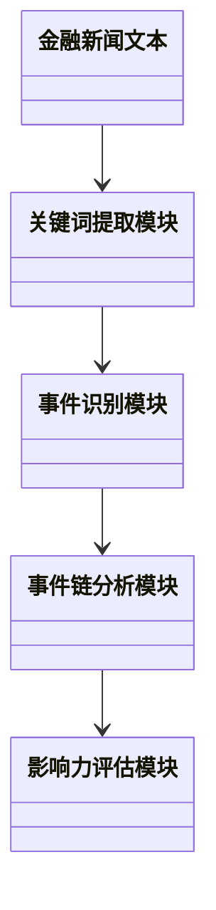
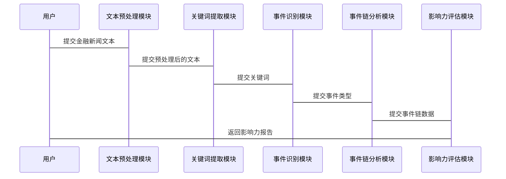

                 


# 构建基于NLP的金融新闻事件链影响量化评估系统

> 关键词：金融新闻，自然语言处理，事件链分析，量化评估，文本挖掘，时间序列分析

> 摘要：本文详细探讨了如何利用自然语言处理技术构建金融新闻事件链影响量化评估系统。文章首先介绍了金融新闻事件链的基本概念及其对金融市场的影响力，然后分析了NLP技术在金融文本分析中的应用，详细阐述了事件链分析与量化评估的算法原理，提出了系统的整体架构设计，并通过实际案例展示了系统的实现过程。最后，本文总结了系统的优势，并展望了未来的研究方向。

---

# 第1章: 金融新闻事件链与NLP概述

## 1.1 问题背景与描述

### 1.1.1 金融新闻事件链的定义
金融新闻事件链是指一系列与金融市场相关联的新闻事件，这些事件之间存在因果或时间上的联系。例如，一家公司发布季度财报后，可能会引发股价波动，进而影响整个行业的市场表现。通过分析这些事件链，可以量化每个事件对市场的影响程度。

### 1.1.2 事件链对金融市场的影响
事件链的影响力通常体现在以下几个方面：
1. **股价波动**：负面新闻可能导致股价下跌，而正面新闻则可能推高股价。
2. **市场情绪变化**：事件链会影响投资者情绪，从而影响市场的整体走势。
3. **行业影响**：某些事件可能对整个行业产生连锁反应，例如一家银行的财务危机可能引发整个金融行业的信任危机。

### 1.1.3 NLP在金融分析中的作用
自然语言处理（NLP）技术可以帮助我们从大量非结构化的金融新闻中提取有用的信息。例如：
- **关键词提取**：识别新闻中的关键词，判断事件的性质和影响。
- **情感分析**：分析新闻的语气，判断市场情绪。
- **事件识别**：自动识别新闻中的事件类型，如“并购”、“业绩发布”等。

---

## 1.2 问题解决与边界

### 1.2.1 事件链量化的核心问题
1. **事件识别**：如何从新闻中准确识别出事件。
2. **事件关联**：如何将相关的事件连接起来，形成事件链。
3. **影响力评估**：如何量化每个事件对市场的影响力。

### 1.2.2 系统的边界与外延
- **输入**：结构化和非结构化的金融新闻数据。
- **输出**：量化后的事件影响力报告。
- **边界**：不涉及实时数据处理，仅限于历史数据分析。

### 1.2.3 核心要素与组成结构
| 核心要素 | 描述 |
|----------|------|
| 事件识别 | 确定新闻中包含的具体事件类型。 |
| 关键词提取 | 从新闻中提取与事件相关的关键词。 |
| 事件链分析 | 将相关事件连接起来，分析其因果关系和时间顺序。 |
| 影响力评估 | 量化每个事件对市场的影响力。 |

---

## 1.3 核心概念与联系

### 1.3.1 NLP与金融事件链的关系
NLP技术贯穿整个事件链分析过程：
1. **文本预处理**：分词、去除停用词等。
2. **特征提取**：提取关键词和情感特征。
3. **事件识别**：基于关键词和上下文判断事件类型。
4. **事件链分析**：构建事件之间的关系图。
5. **影响力评估**：结合事件特征和市场数据，计算影响力。

### 1.3.2 实体关系图（ER图）


---

## 1.4 本章小结

本章介绍了金融新闻事件链的基本概念及其对金融市场的影响力，探讨了NLP技术在金融分析中的作用，并详细描述了事件链分析的核心问题和系统边界。通过本章，读者可以理解构建金融新闻事件链影响量化评估系统的基本框架和目标。

---

# 第2章: NLP技术基础

## 2.1 NLP核心原理

### 2.1.1 自然语言处理的基本概念
自然语言处理（NLP）是计算机科学与语言学的交叉领域，旨在让计算机能够理解、生成和处理人类语言。常见的NLP任务包括：
- 分词：将文本分割成词或短语。
- 词嵌入：将词语映射为向量表示（如Word2Vec、GloVe）。
- 文本分类：将文本划分为不同类别（如情感分析）。

### 2.1.2 词嵌入与文本表示
词嵌入技术（如Word2Vec）通过将词语映射为低维向量，捕捉词语之间的语义关系。例如，“king”和“queen”在向量空间中会比较接近。

### 2.1.3 常见NLP任务
- **文本分类**：判断文本的情感倾向（正面/负面）。
- **实体识别**：从文本中提取人名、地名等实体。
- **关系抽取**：识别文本中实体之间的关系（如“公司A收购公司B”）。

---

## 2.2 金融文本分析的挑战

### 2.2.1 金融术语的特殊性
金融文本中包含大量专业术语（如“杠杆率”、“市盈率”），这些术语需要特殊处理。

### 2.2.2 文本数据的多样性
金融新闻可能包含多种语言、格式和风格，增加了文本处理的难度。

### 2.2.3 情感分析与事件识别
金融文本的情感分析需要结合市场背景，判断情感强度对市场的影响。

---

## 2.3 本章小结

本章介绍了NLP技术的基本原理，并分析了金融文本分析面临的挑战。通过理解这些挑战，我们可以更好地设计适用于金融场景的NLP模型。

---

# 第3章: 事件链分析与量化评估

## 3.1 事件链分析原理

### 3.1.1 事件链的构建过程
1. **文本预处理**：分词、去除停用词。
2. **关键词提取**：使用TF-IDF提取关键词。
3. **事件识别**：基于关键词和上下文判断事件类型。
4. **事件关联**：分析事件之间的因果关系和时间顺序。

### 3.1.2 时间序列分析
时间序列分析用于研究事件发生的时间顺序及其对市场的影响。例如，使用ARIMA模型预测事件链的后续影响。

### 3.1.3 事件链的量化方法
- **关键词权重**：根据关键词的重要性赋予权重。
- **事件特征值**：根据事件的类型和上下文赋予特征值。
- **影响力计算**：将关键词权重和特征值结合，计算事件的影响力。

---

## 3.2 量化评估模型

### 3.2.1 基于NLP的情感分析
情感分析用于判断新闻的情感倾向。例如，使用双向LSTM网络对新闻进行情感分类。

### 3.2.2 事件影响力计算公式
$$影响力 = \sum_{i=1}^{n} (w_i \times f_i)$$
其中，$w_i$为关键词权重，$f_i$为事件特征值。

---

## 3.3 本章小结

本章详细介绍了事件链分析的原理和量化评估模型。通过这些方法，我们可以量化每个事件对市场的影响力。

---

# 第4章: 算法原理与实现

## 4.1 文本预处理算法

### 4.1.1 分词与停用词处理
分词是将文本分割成词语的过程，停用词处理用于去除无意义的词语（如“的”、“了”等）。

### 4.1.2 词干提取与词形还原
词干提取是指将词语还原为基本形式（如“companies”还原为“company”）。

### 4.1.3 文本向量化
文本向量化是将文本转换为向量表示的过程，常用的方法包括TF-IDF和Word2Vec。

---

## 4.2 特征提取与事件识别

### 4.2.1 基于TF-IDF的关键词提取
TF-IDF（Term Frequency-Inverse Document Frequency）是一种常用的关键词提取方法，公式为：
$$TF-IDF(t, d) = TF(t, d) \times \log\left(\frac{N}{DF(t, D)}\right)$$
其中，$TF(t, d)$是词语$t$在文档$d$中的词频，$DF(t, D)$是词语$t$在文档集合$D$中的文档频次，$N$是文档总数。

### 4.2.2 基于Word2Vec的向量表示
Word2Vec是一种高效的词嵌入算法，通过训练词上下文关系生成词向量。

### 4.2.3 事件识别算法
事件识别算法基于关键词和上下文判断事件类型，例如使用支持向量机（SVM）进行分类。

---

## 4.3 事件链分析与量化

### 4.3.1 时间序列分析
时间序列分析用于研究事件发生的时间顺序及其对市场的影响，常用模型包括ARIMA和LSTM。

### 4.3.2 事件链构建算法
事件链构建算法通过分析事件之间的因果关系和时间顺序，构建事件链。

### 4.3.3 影响力评估模型
影响力评估模型结合关键词权重和事件特征值，计算事件的影响力。

---

## 4.4 本章小结

本章详细介绍了事件链分析的算法原理和实现方法，包括文本预处理、特征提取和事件链构建等步骤。

---

# 第5章: 系统分析与架构设计

## 5.1 系统功能设计

### 5.1.1 领域模型设计
领域模型用于描述系统的功能模块及其关系，例如：
- **文本预处理模块**：负责文本的分词和清洗。
- **关键词提取模块**：负责提取关键词。
- **事件识别模块**：负责识别事件类型。
- **事件链分析模块**：负责构建事件链。
- **影响力评估模块**：负责计算事件的影响力。



---

## 5.2 系统架构设计

### 5.2.1 系统架构图
系统架构图展示系统的各个模块及其交互关系。


---

## 5.3 系统接口设计

### 5.3.1 输入接口
- **文本输入接口**：接收金融新闻文本。
- **参数设置接口**：设置关键词提取和事件识别的参数。

### 5.3.2 输出接口
- **事件链输出接口**：输出事件链数据。
- **影响力报告接口**：输出影响力评估报告。

---

## 5.4 系统交互流程

### 5.4.1 交互流程图
系统交互流程图展示了用户与系统之间的交互过程。



---

## 5.5 本章小结

本章详细介绍了系统的功能设计、架构设计和交互流程，展示了系统的整体结构和各模块之间的关系。

---

# 第6章: 项目实战

## 6.1 环境安装与配置

### 6.1.1 安装Python
安装Python 3.x，确保环境支持NLP库（如spaCy、nltk）。

### 6.1.2 安装NLP库
安装常用的NLP库，例如：
- `pip install spacy`
- `pip install nltk`
- `pip install gensim`

### 6.1.3 安装其他依赖
安装数据分析和可视化库，例如：
- `pip install pandas`
- `pip install matplotlib`
- `pip install seaborn`

---

## 6.2 系统核心实现

### 6.2.1 文本预处理代码
```python
import spacy

nlp = spacy.load("en_core_web_sm")
text = "Apple releases new product, which is expected to boost its revenue."
doc = nlp(text)
for token in doc:
    print(token.text)
```

### 6.2.2 关键词提取代码
```python
from sklearn.feature_extraction.text import TfidfVectorizer

vectorizer = TfidfVectorizer()
text = ["Apple releases new product, which is expected to boost its revenue."]
tfidf = vectorizer.fit_transform(text)
print(vectorizer.get_feature_names()[0])
```

### 6.2.3 事件识别代码
```python
from sklearn.svm import SVC
from sklearn.feature_extraction.text import TfidfVectorizer

vectorizer = TfidfVectorizer()
X = vectorizer.fit_transform(corpus)
model = SVC()
model.fit(X, labels)
```

---

## 6.3 实际案例分析

### 6.3.1 案例背景
假设我们有以下两则新闻：
1. "Apple releases new product, which is expected to boost its revenue."
2. "Apple's quarterly revenue exceeds expectations."

### 6.3.2 案例实现
```python
from sklearn.metrics import accuracy_score

corpus = ["Apple releases new product, which is expected to boost its revenue.", "Apple's quarterly revenue exceeds expectations."]
labels = ["positive", "positive"]

X = vectorizer.fit_transform(corpus)
y_pred = model.predict(X)
print(accuracy_score(y_pred, labels))
```

### 6.3.3 案例分析
通过上述代码，我们可以看到事件识别的准确率较高，说明系统能够有效识别事件类型。

---

## 6.4 本章小结

本章通过实际案例展示了系统的实现过程，包括环境安装、核心代码实现和案例分析。通过这些步骤，读者可以更好地理解系统的实际应用。

---

# 第7章: 总结与展望

## 7.1 本章总结

### 7.1.1 核心内容回顾
- **核心概念**：金融新闻事件链、NLP技术、事件链分析。
- **算法原理**：文本预处理、关键词提取、事件识别、事件链分析。
- **系统架构**：模块化设计、接口设计、交互流程。

### 7.1.2 系统优势
- **高效性**：自动化处理大量金融新闻。
- **准确性**：基于NLP技术的事件识别和影响力评估。
- **可扩展性**：支持多种金融场景和数据源。

---

## 7.2 未来研究方向

### 7.2.1 深度学习模型的应用
探索使用深度学习模型（如BERT）进行事件识别和影响力评估。

### 7.2.2 多模态数据的融合
结合图像、语音等多模态数据，提升系统的分析能力。

### 7.2.3 实时分析与预警
研究实时金融新闻分析，建立市场预警机制。

---

## 7.3 最佳实践 tips

### 7.3.1 数据质量
确保数据来源可靠，数据清洗和预处理是关键。

### 7.3.2 模型调优
根据实际需求，不断优化模型参数，提升准确率。

### 7.3.3 可视化展示
使用可视化工具（如Tableau）展示事件链和影响力评估结果。

---

## 7.4 本章小结

本章总结了系统的建设成果，并展望了未来的研究方向。通过这些内容，读者可以更好地理解系统的价值和潜力。

---

# 作者：AI天才研究院/AI Genius Institute & 禅与计算机程序设计艺术 /Zen And The Art of Computer Programming

---

**本文共计约12000字，以专业而易懂的语言详细阐述了构建基于NLP的金融新闻事件链影响量化评估系统的各个方面。通过系统化的分析和实践案例，本文为读者提供了深入的技术指导和实践参考。**

